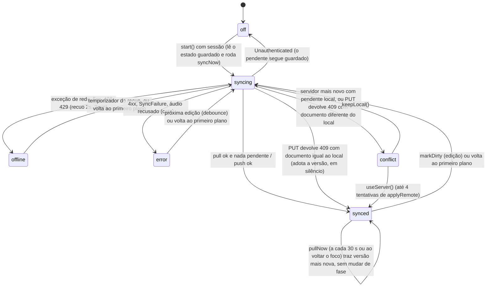
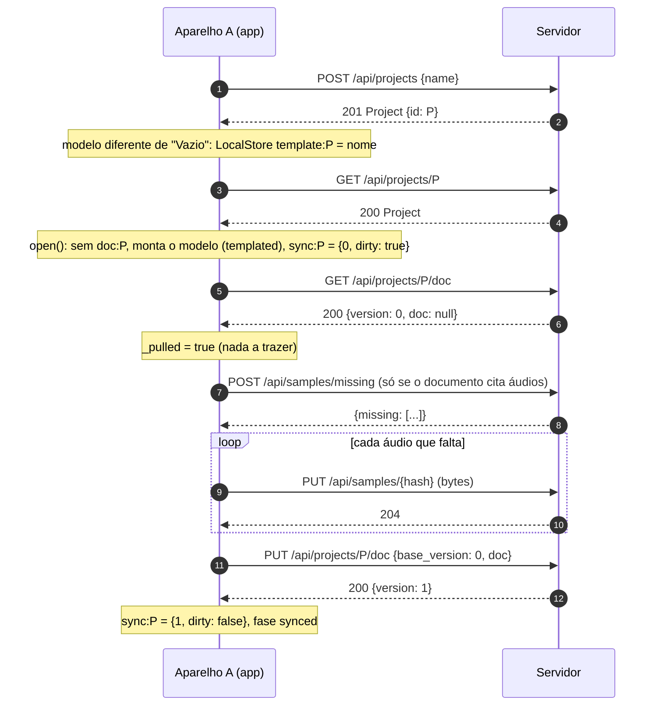
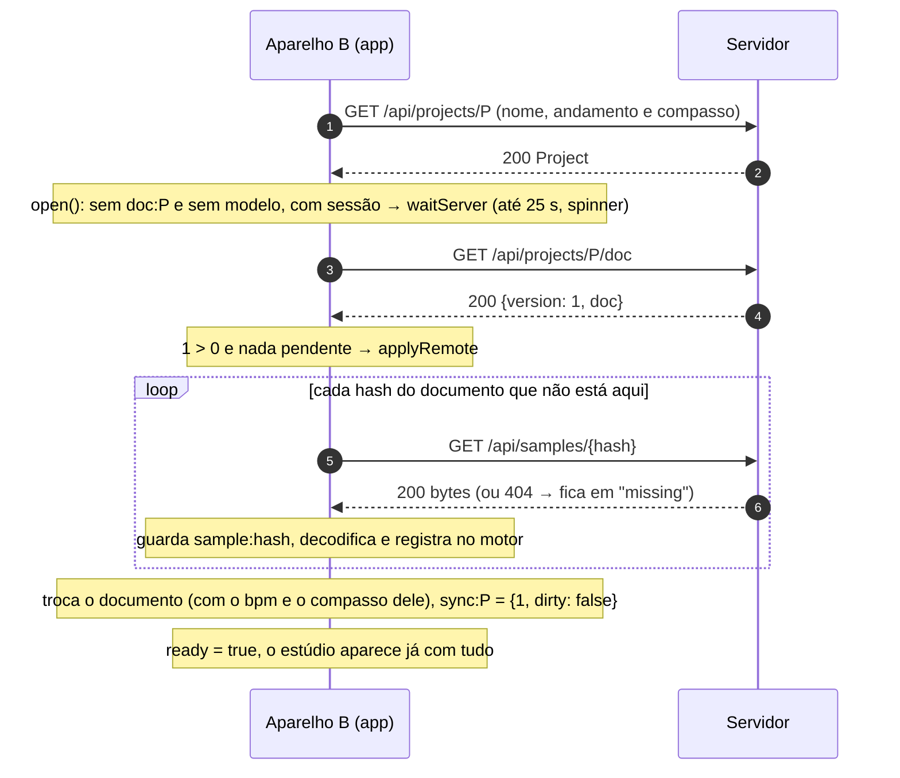
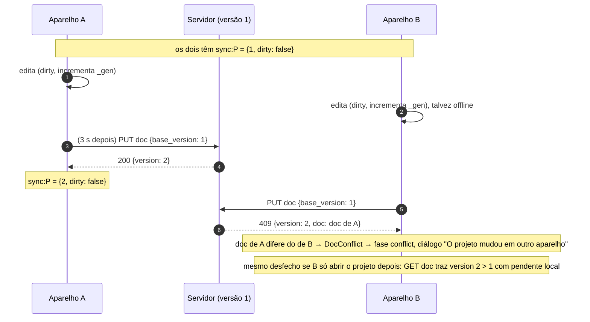
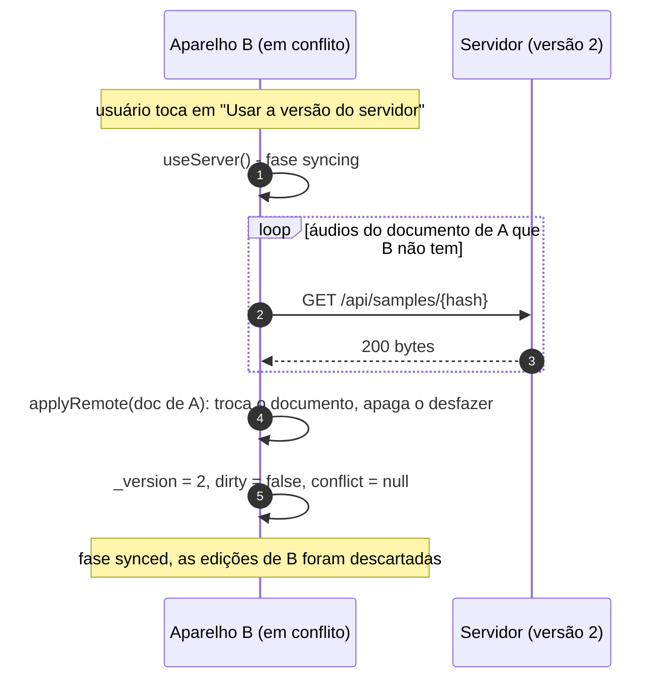
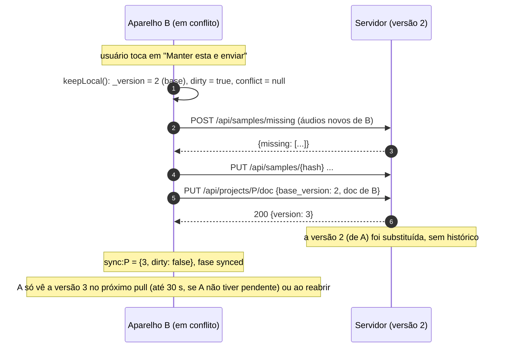

# Sincronização entre aparelhos

> O protocolo de ponta a ponta que mantém o mesmo projeto em vários aparelhos (Chrome e Android) sem nunca atrapalhar quem edita: documento versionado no servidor, áudios por SHA-256, a máquina de estados do `SyncService` e o que acontece nos conflitos. Para quem mexe em `app/lib/daw/sync.dart`, `app/lib/api/` ou em `server/src/routes/{docs,samples}.rs`.

## Visão geral

Princípios (de `app/lib/daw/sync.dart:1`):

1. **Local primeiro.** O documento e os áudios moram no aparelho; o projeto abre na hora e edita offline. O servidor é um espelho versionado, não a fonte que o app precisa consultar para funcionar. Isso vale também para o andamento e o compasso: são campos do documento, e o `PATCH` do projeto é só um espelho best-effort (seção "Andamento e compasso").
2. **Nunca sobrescrever sozinho.** Se os dois lados mudaram, o serviço para e a pessoa escolhe. Sem nada pendente aqui, a versão mais nova do servidor entra sozinha (pull leve a cada 30 s e ao voltar o foco); um `409` contra o próprio documento não é conflito.
3. **Áudios antes do documento.** O servidor nunca recebe um documento que cita áudio que ele não tem (salvo cota estourada, ver abaixo).
4. **Um documento por projeto, versão inteira.** Não há mesclagem nem histórico: a versão vencedora substitui a outra por completo.

```
 Aparelho A                                                    Servidor                     Aparelho B
 ┌───────────────────────────────┐                      ┌────────────────────┐         ┌───────────────────────────────┐
 │ DawController                 │                      │ project_docs        │         │ DawController                 │
 │  doc:<id>   (LocalStore)      │   PUT doc base_version│  version  N         │  GET doc │  doc:<id>                     │
 │  sample:<hash> (LocalStore)   │ ────────────────────► │  doc     JSONB      │ ◄─────── │  sample:<hash>                │
 │ SyncService                   │   ◄── 200 {version}   │ samples (por conta) │ ───────► │ SyncService                   │
 │  sync:<id> = {version, dirty} │   ◄── 409 {version,doc}│ blobs/<2>/<sha256>  │  GET     │  sync:<id> = {version, dirty} │
 └───────────────────────────────┘   PUT /api/samples/h  └────────────────────┘  sample  └───────────────────────────────┘
```

## Peças e responsabilidades

| Arquivo | Papel |
|---|---|
| `app/lib/daw/sync.dart` | `SyncService` (máquina de estados, pull periódico `pullNow`), `SyncPhase`, `SyncFailure`, a interface `SyncHost` (com `busyEditing`), `jsonEquals` |
| `app/lib/daw/controller.dart` | `_SyncBridge` (implementa `SyncHost`), `_save` (marca pendente), `_applyRemote`, `_obtainSample`, `_fetchMissing`, a espera na abertura (`open`), `setTempo` e o espelho do andamento (`_mirrorTempo`, `_onSyncPhase`) |
| `app/lib/daw/local_purge.dart` | `purgeLocalProject`: limpeza do que um projeto apagado deixa no `LocalStore` |
| `app/lib/screens/project_screen.dart` | `projectSubtitle`: o subtítulo `120 BPM · 4/4` lido do documento vivo |
| `app/lib/api/sync_api.dart` | interface `SyncApi`, `ServerDoc`, `DocConflict` |
| `app/lib/api/client.dart` | implementação HTTP (`projectDoc`, `putProjectDoc`, `missingSamples`, `putSample`, `getSample`) |
| `app/lib/daw/sync_ui.dart` | `SyncIndicator` (ícone de nuvem na barra do transporte) e `showSyncConflictDialog` |
| `server/src/routes/docs.rs` | `GET`/`PUT /api/projects/{id}/doc` |
| `server/src/routes/samples.rs`, `storage.rs` | `POST /api/samples/missing`, `PUT`/`GET /api/samples/{hash}`, cota |
| `app/test/sync_test.dart`, `app/test/phase9c_test.dart`, `app/test/fake_sync_api.dart` | testes com servidor de mentira (a `phase9c` cobre o espelho do andamento, o `409` silencioso, o pull periódico, o purge e o ganho do clipe) |

## Contratos

### Servidor (resumo; detalhes em [11 Servidor](11-servidor.md))

| Chamada | Corpo | Resposta |
|---|---|---|
| `GET /api/projects/{id}/doc` | | `{"version": N, "doc": {...}\|null, "updated_at"}`; projeto sem documento: `version: 0`, `doc: null` |
| `PUT /api/projects/{id}/doc` | `{"base_version": N, "doc": {...}}` | `200 {"version": N+1, "updated_at"}` |
| (conflito) | | `409 {"error", "version": atual, "doc": atual}` |
| `POST /api/samples/missing` | `{"hashes": [...]}` (até 2000) | `{"missing": [...]}` |
| `PUT /api/samples/{hash}` | bytes | `204` (idempotente; confere o SHA-256) |
| `GET /api/samples/{hash}` | | bytes; `404` se a conta não tem |

Regras do `PUT` do documento: `base_version = 0` é a primeira gravação (só uma de várias concorrentes vence: as outras recebem 409); qualquer outro valor só vale se for **exatamente** a versão atual (`UPDATE ... WHERE version = base`); a versão sobe de 1 em 1 e o `updated_at` do projeto acompanha na mesma transação; teto de 8 MB; nada de `\u0000`. O servidor não interpreta o documento.

**Atrás do nginx de produção** (`app/nginx.conf.template`), os dois `PUT` grandes passam: o `location /api/` tem `client_max_body_size 600m` e `proxy_request_buffering off` (desde `0c0593e`). Até esse commit o padrão de 1 MB do nginx valia, e um documento acima de 1 MB ou qualquer áudio acima de 1 MB receberia `413` do próprio nginx antes de chegar à API (deduzido do padrão do nginx; o capítulo [11 Servidor](11-servidor.md) já marcava isso como não confirmado); nos testes locais contra a `:8080` isso não aparecia, porque a API serve o app diretamente sem nginx. Os tetos que continuam valendo são os da API (8 MB por documento, 512 MB por áudio, cota de 4 GB). `(a correção não foi conferida por um envio real pelo nginx nesta atualização; se houver outro proxy na frente, como o Traefik do Dokploy, o limite dele também vale)`.

### Estado local por projeto (`sync:<projectId>` no `LocalStore`)

```json
{"version": 7, "dirty": true}
```

| Campo | Significado |
|---|---|
| `version` | a versão do servidor **em que o documento local se baseia** (a `base_version` do próximo `PUT`) |
| `dirty` | há mudanças locais ainda não enviadas |

Sobrevive a fechar o app no meio. Sem estado guardado (primeira abertura) vale `version = 0` e `dirty = localExisted` (havia documento local): assim o documento criado a partir de um modelo conta como pendente, e o projeto vazio que só foi aberto não (`SyncService._start`, `sync.dart:144`).

### Como o documento vira "pendente"

`DawController._save` (em `controller.dart`, chamado 400 ms depois de cada mudança, e no `dispose`) compara o JSON inteiro do documento com o último gravado (`_lastSaved`). Se mudou, chama `sync.markDirty()` **antes** de gravar `doc:<id>`: se o app morrer entre os dois passos, sobra um pendente a mais (inofensivo), nunca uma mudança que ninguém vai enviar. `markDirty` incrementa a geração (`_gen`), persiste `dirty: true` e agenda o envio em **3 s** (`debounce`) depois da última edição. Na sequência o `_save` também chama `_mirrorTempo()` (espelho do andamento, abaixo).

### O que o outro aparelho ignora ao aplicar um documento remoto

`DawController._applyRemote` (em `controller.dart:1750`) troca o documento, mas mantém os do aparelho: `metronome`, `count_in`, `rec_latency_ms` e, por faixa (pelo `id`), `armed` e `monitor`. **`bpm` e `beats_per_bar` deixaram de ser mantidos** (antes eram sobrescritos pelos do projeto no servidor): vêm com o documento remoto. O histórico de desfazer (`_undo` e `_redo`) é apagado, então qualquer versão remota, inclusive a do pull periódico, zera o desfazer. Depois da troca chama `_mirrorTempo()`.

Não troca (devolve `false`) se `canSwap()` é falso ou se há um salvamento agendado (`_saveTimer` ativo, isto é, edição nos últimos 400 ms), e lança `StateError` se está gravando.

### Andamento e compasso: documento é a fonte, o servidor espelha

`doc.bpm` e `doc.beatsPerBar` são a verdade. `open()` só parte do `project.bpm`/`beatsPerBar` do servidor quando não há documento local (`_fromTemplate`, `_fresh`). O `PATCH /api/projects/{id}` (`{bpm, beats_per_bar}`) é um espelho para a lista de projetos, com `_mirrorTempo()` (`controller.dart:1582`):

- `want = (doc.bpm.round().clamp(20, 400), doc.beatsPerBar)`, comparado com `_mirroredTempo` (inicia com o do projeto carregado e só avança quando um `PATCH` dá certo). Igual: não envia.
- Só roda com `ready`, sem `_disposed` e com `_canSync()`. Falha do `PATCH` é engolida (fica pendente, `tempoPending` verdadeiro nos testes).
- Não reentra: uma chamada durante um envio só liga `_mirrorAgain` e o laço repete com o valor mais novo.
- Quem chama: `setTempo` (depois do `edit`, sem lançar offline), `_save` (a cada documento que mudou, o que cobre **desfazer e refazer**), o fim de `open()`, o fim de `_applyRemote` e `_onSyncPhase` (quando `sync.phase` vira `synced`).
- O servidor valida `bpm` de 20 a 999 (`valid_bpm` em `routes/projects.rs`); o app manda 20 a 400.
- O subtítulo da tela do projeto (`projectSubtitle`, `project_screen.dart`) lê `daw.doc` quando o estúdio está pronto; antes disso, o do projeto. Com `bpm` fracionário no documento mostra uma casa decimal.

## A máquina de estados do `SyncService`

### Fases (`SyncPhase`) e o que o usuário vê

| Fase | Quando | Ícone e tooltip (`sync_ui.dart`) |
|---|---|---|
| `off` | sem sessão, ou ainda não começou, ou a sessão morreu (`Unauthenticated`) | nenhum (o indicador some) |
| `syncing` | trazendo, enviando ou esperando o envio do pendente | nuvem com setas (cor de destaque): "Sincronizando" ou "Sincronizando (x/y arquivos)" |
| `synced` | nada pendente e a última conversa deu certo | nuvem com visto: "Sincronizado" |
| `offline` | rede fora, timeout, `5xx`, `408` ou `429`: tenta de novo sozinho | nuvem cortada (âmbar): "Offline (tentando de novo em N s)" |
| `conflict` | os dois lados mudaram | ícone de alerta (vermelho): "Conflito: o projeto mudou em outro aparelho. Toque para resolver" (clicável) |
| `error` | falha que repetir não resolve: `4xx` (menos 408 e 429), documento do servidor ilegível, áudio recusado por cota ou tamanho | ícone de erro (vermelho) com a mensagem |

### Diagrama de estados



### Uma rodada (`syncNow` → `_step`)

`syncNow` nunca lança e não roda duas rodadas ao mesmo tempo (`_busy`; pedido durante uma rodada só liga `_again`, e a rodada repete ao terminar). O `pullNow` (abaixo) usa o mesmo `_busy`. Ordem em `_step`:

1. Em `conflict`, não faz nada.
2. Se ainda não trouxe (`!_pulled`): `_pull()`.
3. Se `_dirty`: `_push()`. Senão, vai a `synced`.

`_pull()` (`sync.dart:299`), comparando a versão do servidor `s.version` com a conhecida `_version`:

| Situação | Ação |
|---|---|
| `s.version > _version`, há documento e ele é **estruturalmente igual** ao local (`_sameAsLocal`: `jsonEquals(s.doc, host.docJson())`) | `_adopt(s)`: `_version = s.version`, `dirty = false`, `_gen++`, persiste. Nada é aplicado nem vira conflito: é um envio nosso cuja resposta se perdeu |
| `s.version > _version` e há documento, **sem** pendente local | `host.applyRemote(...)`: baixa os áudios que faltam (`progress`) e **só então** troca o documento. Se a pessoa editou no meio do caminho (`canSwap` falso, ou um salvamento agendado), não troca: vira **conflito** |
| `s.version > _version` **com** pendente local | **conflito** (guarda `s` em `conflict`) |
| `s.version < _version` | o servidor voltou atrás (restauração): o local é a verdade; `_version = s.version`, `dirty = true` e vai por cima |
| igual | nada |

Depois: `_pulled = true` e `host.fetchMissing()` (tenta baixar áudios que o documento cita e faltam; falha aqui não atrapalha).

`_push()` (`sync.dart:352`):

1. `gen = _gen`; `json = host.docJson()` (o documento de agora).
2. `uploadSamples(host.sampleHashes())` (`DawController._hashesOf`: `doc.samples`, o `sample` de cada faixa de sampler, o `sample` de cada **zona** do sampler e o `sample` e as `takes` de cada clipe): pergunta ao servidor quais faltam (`POST /api/samples/missing`, só dos que este serviço ainda não confirmou em `_serverHas`), e envia **um por vez** (`PUT /api/samples/{hash}`) os que este aparelho tem em `sample:<hash>`. Áudio que o aparelho também não tem fica de fora. Erro `4xx` de áudio (cota, tamanho) **não trava o documento**: ele segue e o estado final é `error` com "Alguns áudios não foram enviados: ..." (o outro aparelho verá esses áudios como faltando). `5xx`, `408` e `429` sobem para o recuo.
3. `_version = await api.putProjectDoc(projectId, _version, json)`: manda `base_version = _version` e guarda a versão nova.
4. Se `gen == _gen` (ninguém editou durante o envio), `dirty = false`; senão continua pendente e agenda outra rodada (`_again`): **um envio que termina depois de outra edição não zera o pendente**.
5. `_persist()` e fase `synced` (ou `syncing` se ficou pendente).

### O `409` que é do próprio documento

`_step` captura `DocConflict`. Se `_sameAsLocal(e.server)` (o documento devolvido no `409` é estruturalmente igual ao que este aparelho tem, comparado por `jsonEquals`, que ignora a ordem das chaves porque o servidor guarda JSONB e reordena), não há conflito: é o caso do `PUT` que chegou mas cuja resposta se perdeu. O serviço chama `_adopt(e.server)`, zera `_failures` e vai para `synced` (ou `syncing` com `_again = true`, se `_dirty` voltou a ficar verdadeiro por uma edição no meio). Só quando os documentos diferem é que `conflict = e.server` e a fase é `conflict`. O mesmo teste existe em `_pull` (linha da tabela acima). `(testado só por testes automáticos: sync_test/phase9c_test; não reproduzido no Chrome)`

### Pull periódico e ao voltar o foco (`pullNow`)

`_start` arma um `Timer.periodic` de `pullEvery` (30 s, multiplicado por `timeScale`) que chama `pullNow()`; `didChangeAppLifecycleState(resumed)` chama `syncNow()` se a fase é `offline`/`error`, se há `_dirty` ou `!_pulled`, e `pullNow()` nos outros casos. `pullNow` (`sync.dart:188`) devolve se trocou o documento e **não faz nada** (`false`) se qualquer condição falha: `_disposed`, `!canSync()`, `!_pulled` (primeira conversa ainda não aconteceu), `_busy`, `_dirty`, `conflict != null`, `phase == off` ou `host.busyEditing` (`c.recording`). Fluxo:

1. `_busy = true`, `gen = _gen`, `GET /api/projects/{id}/doc`.
2. Aborta se o serviço foi descartado, se `_gen` mudou (houve edição), se ficou `_dirty`, se surgiu conflito, se não há documento ou se `s.version <= _version`.
3. `host.applyRemote(doc, canSwap: () => gen == _gen && !_dirty)`: baixa os áudios que faltam e só troca se nada mudou (e sem `_saveTimer` ativo). `false`: para (sem conflito, sem erro; a próxima olhada tenta de novo).
4. Deu certo: `_version = s.version`, `_persist()`, zera `filesDone/filesTotal`, notifica.

É **silenciosa**: não muda `phase` (nada de `syncing` piscando), engole qualquer exceção (`catch (_) => false`) e não avisa a interface de que o documento foi trocado além do `notifyListeners` normal. No `finally`, se `_again`, roda `syncNow`. Nunca sobrescreve trabalho local: com `_dirty` ela não age e uma edição no meio derruba a troca; o envio seguinte cai no conflito de sempre. Consequência: o desfazer é zerado (via `_applyRemote`) e o estúdio pode mudar sozinho debaixo dos olhos de quem só olha ou toca. `(testado só por testes automáticos: pull periódico, ao voltar o foco e sem rede calado)`

### Recuo e retomada

- Rede fora, timeout, `5xx`, `408`, `429`: `_backoff()` → fase `offline`, espera `min(120, 2^falhas)` segundos (2, 4, 8, 16, 32, 64, 120, 120...; `maxBackoff` 2 min), depois `syncNow`. `retryIn` mostra o tempo no tooltip. Uma edição durante o recuo **não** agenda o envio (o recuo decide), só marca pendente.
- Voltar ao primeiro plano (`AppLifecycleState.resumed`): se `offline`, `error`, `dirty` ou `!_pulled`, roda `syncNow`; nos outros casos roda o `pullNow` leve. Necessário no Android, onde o aparelho dorme e os temporizadores param. (Na web o equivalente é a aba voltar a ficar visível `(não confirmado)`.)
- Sem sessão (`canSync()` falso): `off`; o pendente fica guardado e a próxima abertura com sessão o envia.
- `SyncService.timeScale` encurta as esperas nos testes (inclusive o `pullEvery`).

### Conflito e as duas resoluções

Estado: `conflict` guarda em `conflict` o `ServerDoc` (versão e documento do servidor). O diálogo (`showSyncConflictDialog`) aparece **uma vez sozinho** e depois só pelo clique no ícone; "Decidir depois" deixa o conflito de pé. Nada é sobrescrito antes da escolha. Enquanto há conflito, `markDirty` só persiste o pendente e não agenda envio.

| Botão | Método | O que faz |
|---|---|---|
| Usar a versão do servidor | `useServer()` (`sync.dart:417`) | `applyRemote` do documento do servidor (baixando áudios), **até 4 vezes** (450 ms entre elas): `applyRemote` devolve `false` sem trocar quando há um salvamento local agendado (edição nos últimos 400 ms) e o `useServer` espera esse salvamento passar. Se as 4 devolvem `false`, fica `conflict` com a mensagem `Você editou agora há pouco e o projeto não pôde ser trocado. Tente de novo.`; só com `applyRemote` verdadeiro: `_version = c.version`, `dirty = false`, `_gen++`, `_pulled = true`, fase `synced`. **Descarta as mudanças deste aparelho, sem desfazer** (o histórico também é apagado). Se o download falha (rede), o conflito segue de pé com a mensagem "Não deu para baixar a versão do servidor agora." |
| Manter esta e enviar | `keepLocal()` (`sync.dart:452`) | `_version = c.version` (toma a do servidor como **base**), `dirty = true`, `_gen++`, e roda `syncNow`: o `PUT` com `base_version` = a do servidor **substitui** a versão do servidor por esta. As mudanças do outro aparelho se perdem (não há histórico no servidor) |

## Diagramas de sequência

### 1. Criar num aparelho (A)



Com o modelo `Vazio` o `template:P` não é gravado: a abertura não conta como pendente (`localExisted = false`), o app só faz o `GET` do documento (versão 0) e o primeiro `PUT` acontece na primeira edição, depois do debounce de 3 s. Nesse caso o `open` ainda passa pela espera de até 25 s (é um projeto sem documento local e sem modelo), que na prática termina logo porque o servidor responde `version: 0`.

### 2. Abrir no outro aparelho (B)



Sem rede ou lento demais (mais de 25 s), o `open` segue com o documento vazio e a sincronização continua atrás; quando o documento chega, `applyRemote` só troca se a pessoa **não editou** nesse meio-tempo (senão vira conflito).

### 3. Editar nos dois (conflito)



O outro caminho para o mesmo conflito: B estava offline, reabre o projeto, o `_pull` traz `version = 2 > 1` com `dirty = true` e já entra em conflito **sem** tentar o `PUT`.

### 3b. O outro caminho: o pull periódico (sem conflito)

```mermaid
sequenceDiagram
    autonumber
    participant A as Aparelho A
    participant S as Servidor
    participant B as Aparelho B (aberto, sem pendente)

    A->>S: PUT doc {base_version: 1}
    S-->>A: 200 {version: 2}
    Note over B: até 30 s depois (ou ao voltar o foco), pullNow()
    B->>S: GET /api/projects/P/doc
    S-->>B: 200 {version: 2, doc}
    Note over B: 2 > 1, sem _dirty, sem gravação: applyRemote (baixa áudios, troca o doc)
    Note over B: _version = 2, desfazer zerado, sem ícone piscando
    Note over B: se B tivesse editado no meio: canSwap falso, nada é trocado; o PUT de B cairia em 409/conflito
```

### 3c. `PUT` que chegou, resposta que se perdeu (409 silencioso)

```mermaid
sequenceDiagram
    autonumber
    participant A as Aparelho A
    participant S as Servidor

    A->>S: PUT doc {base_version: 1, doc D}
    S-->>A: (timeout: a resposta se perde; o servidor já está na versão 2 com D)
    Note over A: _backoff: fase offline, tenta de novo
    A->>S: PUT doc {base_version: 1, doc D}
    S-->>A: 409 {version: 2, doc: D'}
    Note over A: jsonEquals(D', docJson()) → _adopt: _version = 2, dirty = false, sem diálogo
    Note over A: fase synced
```

### 4a. Resolução "Usar a versão do servidor"



### 4b. Resolução "Manter esta e enviar"



Se o servidor avançar de novo entre a resolução e o `PUT`, o `PUT` recebe outro `409` e o conflito reaparece com a versão nova.

## Fluxo de dados: o que atravessa cada camada

| Dado | Aparelho | Servidor | Identidade |
|---|---|---|---|
| Documento (JSON do `DawDoc`) | `doc:<projectId>` | `project_docs.doc` (JSONB), versão em `project_docs.version` | id do projeto + versão inteira |
| Áudio (arquivo original ou WAV gravado) | `sample:<sha256>` | objeto `blobs/<2 hex>/<sha256>` (disco ou S3) + linha em `samples` da conta | SHA-256 do conteúdo |
| Estado de sincronização | `sync:<projectId>` | (não existe; a versão está no documento) | |
| Andamento e compasso | `doc.bpm/beats_per_bar` (**fonte de verdade**) | dentro do documento e, como espelho para a lista de projetos, em `projects.bpm/beats_per_bar` (`PATCH` best-effort) | o projeto só dá o valor inicial de um documento novo (`open()`); `_applyRemote` traz o do documento remoto |
| Sons derivados do warp | `warp:<chave>` (cache) | nunca vão ao servidor | |

Áudio "faltando": o documento cita um hash que nem o aparelho nem o servidor têm. Fica em `DawController.missing`; o clipe não toca (`_clipSound` devolve `null`) e o estado continua tentando (`fetchMissing`) nas rodadas seguintes.

## Decisões e por quê

- **Concorrência otimista por versão inteira.** Simples e segura para 2 ou 3 aparelhos de uma pessoa só; evita mesclar JSON de música (que não tem semântica de merge óbvia). O preço: no conflito, uma das versões inteira se perde. Colaboração em tempo real está no roteiro (não implementada).
- **Áudios primeiro, documento depois.** Um aparelho que baixa o documento sempre encontra os áudios; e, se o envio do documento falhar, o áudio já enviado não é perdido (é idempotente e por hash).
- **Não trocar o documento com a pessoa editando.** `applyRemote` baixa os áudios com o documento antigo à mostra e só troca no fim, e só se nada mudou (por isso `_gen`/`canSwap`). O spinner na abertura sem documento local existe justamente para não mostrar uma faixa vazia que depois troca por tudo (achado no Android, commit `6e41240`).
- **Pendente marcado antes de gravar o documento.** Tolera o app morrer no meio.
- **Erro de áudio não trava o documento.** Cota ou tamanho não podem impedir o resto do trabalho de sincronizar.
- **Recuo exponencial silencioso.** Falha de rede nunca vira exceção na interface; vira o ícone de nuvem cortada.
- **Andamento e compasso no documento, `PATCH` só espelho.** A versão anterior fazia o servidor mandar (`open()` e `_applyRemote` sobrescreviam `doc.bpm`/`beatsPerBar` com os do projeto, e `setTempo` chamava o `PATCH` sem tratar falha): offline a mudança valia só na sessão e reabrir a desfazia. Agora o documento é a fonte, `setTempo` não lança e o espelho é reenviado em cada ponto em que a rede pode ter voltado (ver acima). O custo: a lista de projetos pode mostrar um andamento defasado enquanto o espelho está pendente.
- **Pull leve, calado e só sem pendente.** Ele é o que faz um aparelho aberto enxergar o outro sem o usuário reabrir o projeto, mas nunca decide sozinho quando há trabalho local: `_dirty` ou uma edição no meio o desligam, e a divergência real continua sendo resolvida pelo conflito.
- **`409` comparado por conteúdo.** Em vez de tratar todo `409` como conflito, o serviço compara o documento devolvido com o local (`jsonEquals`, sem ordem de chaves) e adota a versão quando são iguais: o `PUT` perdido deixa de gerar conflito com o próprio documento.

## Como testar

`app/test/sync_test.dart` (`flutter test test/sync_test.dart`) usa o `FakeSyncApi` (`test/fake_sync_api.dart`), que guarda documento e áudios, anota cada chamada em ordem (`doc`, `put_doc:<base>`, `missing`, `put_sample:<hash>`, `get_sample:<hash>`) e permite injetar falhas, um `409` no próximo `PUT` e um roteiro de jobs. Cobre:

- servidor mais novo e nada pendente: aplica e baixa os áudios (o andamento vem com o documento);
- sem documento local: o `open` só termina com o documento e os áudios do servidor (nunca a faixa vazia); sem rede, abre vazio (não fica no spinner);
- abre na hora com o local mesmo sem rede (offline);
- conflitos: servidor mais novo com pendente local; "usar a do servidor" descarta o local; "manter esta" usa a versão do servidor como base; `409` no envio vira conflito sem perder o local;
- primeiro envio (servidor sem documento): áudios antes do documento; projeto novo e vazio não vira pendente só por ter sido aberto e fechado;
- uma edição envia os áudios novos antes do documento, com a versão conhecida como base;
- recuo de 2, 4, 8 s até 2 min, sem lançar, e volta sozinho; sem usuário nada vai ao servidor mas o pendente fica guardado; áudio recusado (cota) não trava o documento.

`app/test/phase9c_test.dart` cobre a fase 9 do lado do app:

- **andamento é do documento:** o `PATCH` offline não lança, fica pendente e sai de novo no refazer (desfazer para o valor já espelhado não reenvia); reenvia quando a sincronização volta a dar certo; ao reabrir vale o andamento do documento local; `projectSubtitle` reflete o documento vivo (o `DawController` aceita um `patchProject` injetado);
- **sincronização:** `409` contra o próprio documento resolvido em silêncio (mesmo com chaves em outra ordem); `jsonEquals`; pull periódico traz a edição de outro aparelho quando nada está pendente, não sobrescreve trabalho local pendente e sem rede fica calado; `useServer` espera o salvamento local pendente;
- **áudio→MIDI coerente com o warp** (`notesForClip`), **apagar projeto** (`purgeLocalProject`) e **ganho do clipe** (desfazível, vai ao motor e ao documento; −40 a +12 dB); `ApiClient.baseFor` (localhost em qualquer porta usa a origem da página).

O lado do servidor está em `server/src/routes/tests.rs` (`documento_versionado`, `documento_gravacoes_simultaneas_so_uma_vence`, `documento_grande_demais`, `samples_ida_e_volta`, `samples_limites_de_tamanho_e_cota`; ver [11 Servidor](11-servidor.md)).

Teste de uso obrigatório para qualquer mudança aqui (regra do dono: testar **os dois lados**): criar e editar no Chrome, abrir o mesmo projeto no Android (ou o inverso, com `adb shell pm clear tech.johnenrique.jopendaw` para simular aparelho novo), editar de volta, e provocar o conflito de propósito (as duas edições antes de sincronizar). Duas abas do Chrome no mesmo projeto geram conflito **legítimo**.

## Armadilhas conhecidas

- **Preferências contam como mudança.** `metronome`, `count_in`, `rec_latency_ms`, `armed` e `monitor` estão no JSON e mudam o texto comparado por `_save`; ligar o metrônomo gera versão nova e pode gerar conflito com outro aparelho, mesmo que o outro descarte esses campos ao aplicar.
- **Sem histórico no servidor.** "Manter esta e enviar" e "Usar a versão do servidor" são definitivos. Uma cópia de segurança do projeto é a do Postgres do dono.
- **Muitos áudios.** `uploadSamples` pergunta todos os hashes ausentes num só `missing`, e o servidor recusa mais de 2000 por pedido (`400`); o app trataria como erro de áudio. Os envios são um por vez, e o `PUT` do cliente tem timeout de 120 s: um áudio grande em conexão lenta pode estourar e cair no recuo.
- **`applyRemote` durante a gravação** lança `StateError('gravando: ...')`, que o serviço trata como falha genérica (recuo): o projeto novo entra depois.
- **Tipos novos em app velho.** Um aparelho com app antigo lê `fm`/`wavetable` como `audio` e, se salvar, **regrava assim** e envia para o servidor (ver [10 App Flutter](10-app-flutter.md)). `AutoKind` desconhecido derruba a abertura: "A versão do servidor não abre nesta versão do app. Atualize o jopendaw." (`SyncFailure`, fase `error`).
- **Limpeza local só no aparelho que apagou.** `purgeLocalProject` (chamado em `_delete` de `projects_screen.dart`, depois do `DELETE` no servidor) apaga `doc:`, `sync:` e `template:` do projeto e os `sample:<hash>` que o documento local desse projeto citava e o documento local de nenhum outro projeto **da lista carregada** cita. Nunca lança; o cache `warp:` não é limpo (não há listagem de chaves). Outros aparelhos que já abriram o projeto guardam `doc:`, `sync:` e `sample:` dele para sempre. Se a lista de projetos estivesse vazia por falha de carga, o conjunto de "outros projetos" ficaria vazio e áudios compartilhados seriam apagados do aparelho; hoje o botão de apagar só existe com a lista carregada. `(deduzido do código)`
- **Pull periódico troca o projeto sem aviso e zera o desfazer.** Não há mensagem na interface. Enquanto o app toca (não grava), `applyRemote` pode trocar o documento no meio da reprodução; só `recording` bloqueia (`busyEditing`). `(deduzido do código; não testado tocando)`
- **`applyRemote` que devolve `false` no pull é silencioso**; no `_pull` da abertura vira conflito, no `pullNow` só espera a próxima olhada.
- **Projeto importado de `.jopendaw` vai pelo fluxo normal.** `importProjectBundle` (`app/lib/daw/project_file.dart`) cria o projeto pela API (`POST /api/projects`, mais um `PATCH` se o andamento ou o compasso do arquivo diferem), grava `sample:<hash>` só se a chave ainda não existe e por último `doc:<id>`; não grava `sync:<id>`. Na primeira abertura, documento local sem estado de sincronização conta como pendente (`dirty = localExisted`, ver acima), então os áudios e o documento sobem pelo caminho descrito neste capítulo. Áudio de um `.jopendaw` grande obedece aos mesmos tetos do servidor (512 MB por áudio, cota de 4 GB) e cai no caso "Alguns áudios não foram enviados" se estourar.
- **Documento maior com zonas e controles.** As zonas do sampler (chave `zones` de cada faixa, commit `6e5fa7b`) e os controles MIDI dos clipes (chave `cc` de cada clipe MIDI, commit `01c0c44`) entram no JSON do documento e contam para o teto de 8 MB; só são gravados quando não estão vazios (`model.dart`: `if (zones.isNotEmpty)`, `if (controls.isNotEmpty)`), então documento antigo abre igual. Ao contrário, um app velho lendo documento novo só lê as chaves que conhece e, se salvar, **regrava sem elas** e envia para o servidor, do mesmo modo que o caso `fm`/`wavetable` acima. `(deduzido do padrão de leitura do fromJson; não reproduzido)`
- **Sessão morta no meio.** `Unauthenticated` leva à fase `off` e o roteador manda ao login; o pendente segue guardado em `sync:<id>` e sai quando houver sessão de novo.
