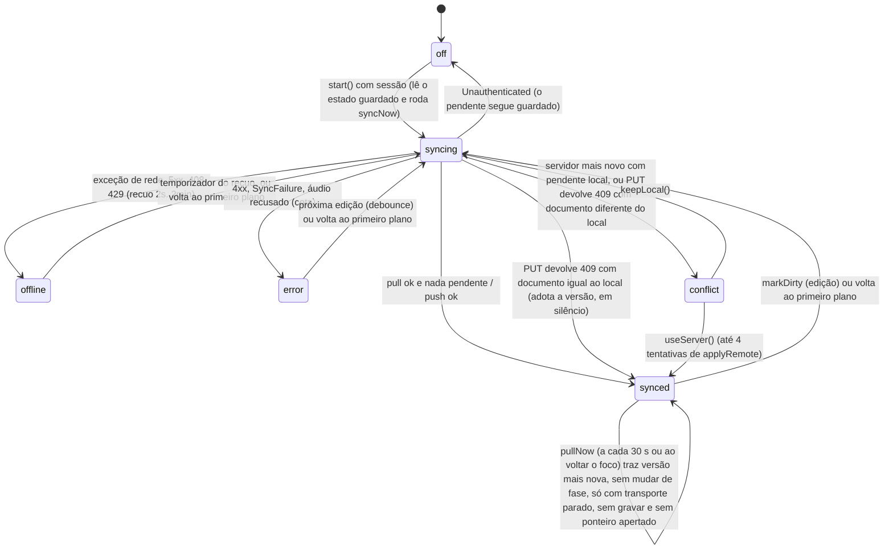
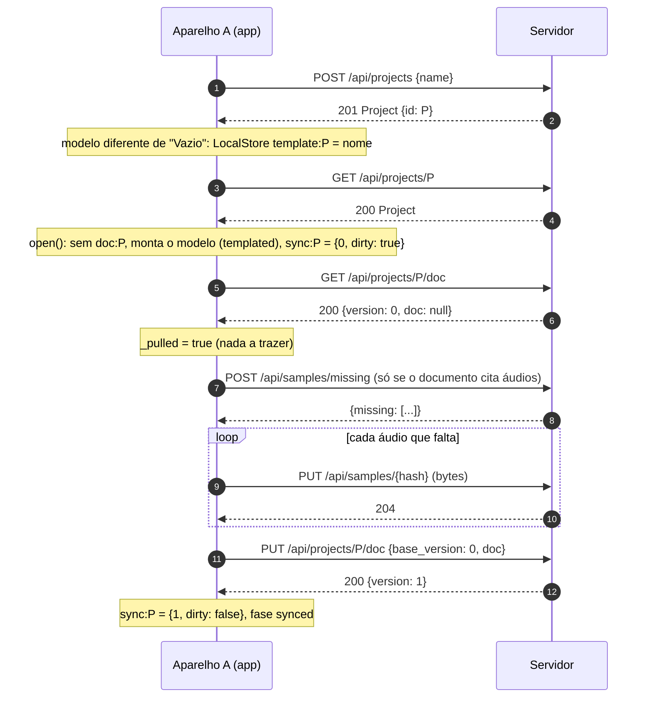
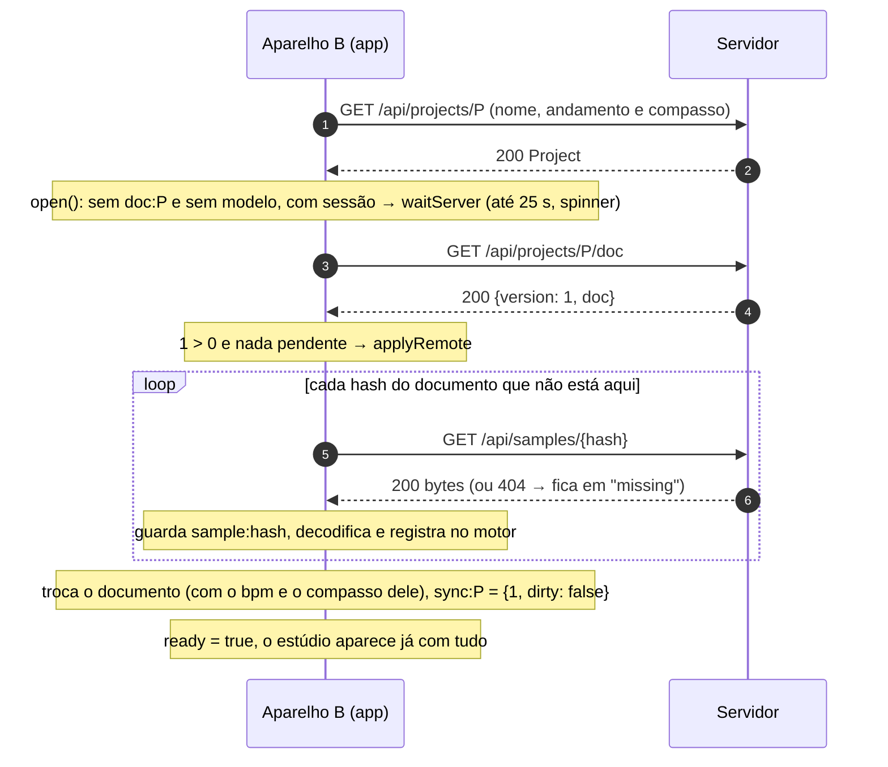
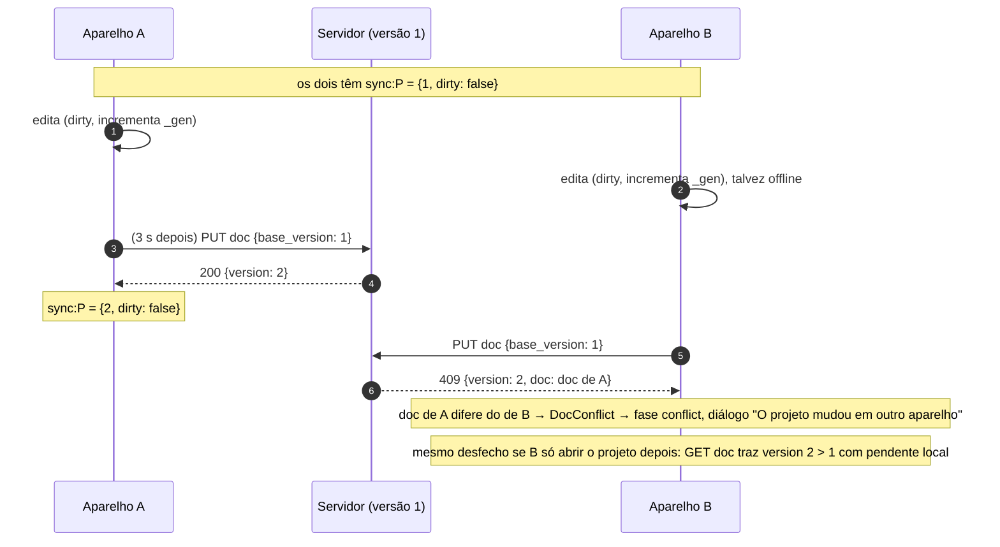
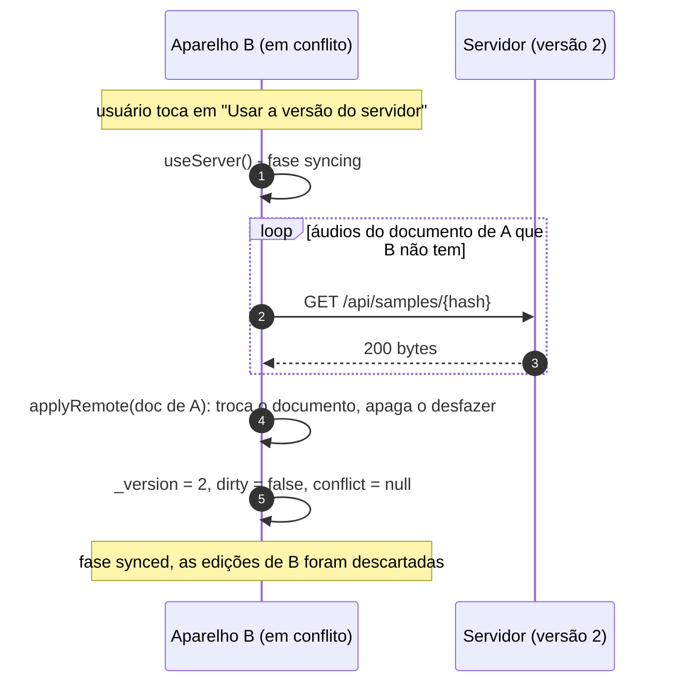
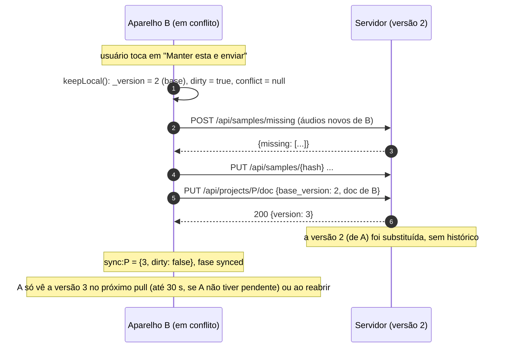

# Sincronização entre aparelhos

> O protocolo de ponta a ponta que mantém o mesmo projeto em vários aparelhos (Chrome e Android) sem nunca atrapalhar quem edita: documento versionado no servidor, áudios por SHA-256, a máquina de estados do `SyncService` e o que acontece nos conflitos. Para quem mexe em `app/lib/daw/sync.dart`, `app/lib/api/` ou em `server/src/routes/{docs,samples}.rs`.

## Visão geral

Princípios (de `app/lib/daw/sync.dart:1`):

1. **Local primeiro.** O documento e os áudios moram no aparelho; o projeto abre na hora e edita offline. O servidor é um espelho versionado, não a fonte que o app precisa consultar para funcionar. Isso vale também para o andamento e o compasso: são campos do documento, e o `PATCH` do projeto é só um espelho best-effort (seção "Andamento e compasso").
2. **Nunca sobrescrever sozinho.** Se os dois lados mudaram, o serviço para e a pessoa escolhe. Sem nada pendente aqui, a versão mais nova do servidor entra sozinha (pull leve a cada 30 s e ao voltar o foco, com o transporte parado e sem gesto em andamento, avisando na tela quando troca de fato); um `409` contra o próprio documento não é conflito.
3. **Áudios antes do documento.** O servidor nunca recebe um documento que cita áudio que ele não tem (salvo cota estourada, ver abaixo; e, se um apagar concorrente tira o áudio no instante do envio, o servidor recusa o documento com `422` e o app reenvia o áudio).
4. **Um documento por projeto, versão inteira.** Não há mesclagem nem histórico: a versão vencedora substitui a outra por completo.

```
 Aparelho A                                                    Servidor                     Aparelho B
 ┌───────────────────────────────┐                      ┌────────────────────┐         ┌───────────────────────────────┐
 │ DawController                 │                      │ project_docs        │         │ DawController                 │
 │  doc:<id>   (LocalStore)      │   PUT doc base_version│  version  N         │  GET doc │  doc:<id>                     │
 │  sample:<hash> (LocalStore)   │ ────────────────────► │  doc     JSONB      │ ◄─────── │  sample:<hash>                │
 │ SyncService                   │   ◄── 200 {version}   │ samples (por conta) │ ───────► │ SyncService                   │
 │  sync:<id> = {version, dirty} │   ◄── 409 {version,doc}│ blobs/<2>/<sha256>  │  GET     │  sync:<id> = {version, dirty} │
 └───────────────────────────────┘   PUT /api/samples/h  └────────────────────┘  sample  └───────────────────────────────┘
```

## Peças e responsabilidades

| Arquivo | Papel |
|---|---|
| `app/lib/daw/sync.dart` | `SyncService` (máquina de estados, pull periódico `pullNow`), `SyncPhase`, `SyncFailure`, a interface `SyncHost` (com `busyEditing`), `jsonEquals` |
| `app/lib/daw/controller.dart` | `_SyncBridge` (implementa `SyncHost`), `_save` (marca pendente), `_applyRemote`, `_obtainSample`, `_fetchMissing`, a espera na abertura (`open`, que passa `holdFirstPull` ao `sync.start`), o rastreio do ponteiro (`_onPointer`, `_mouseHeld`, `_gestureInProgress`), `setTempo` e o espelho do andamento e do compasso (`_mirrorTempo`, `_wantedTempo`, `_onSyncPhase`) |
| `app/lib/daw/local_purge.dart` | `purgeLocalProject`: limpeza do que um projeto apagado deixa no `LocalStore` (usa `LocalStore.keys('doc:')` para conferir todos os documentos guardados e `LocalStore.keys('warp:')` para levar os derivados do warp dos áudios apagados) |
| `app/lib/audio/engine_io.dart` (`FileStore.keys`, `keyOfFileName`), `app/lib/audio/engine_web.dart` e `app/web/engine/host.js` (`idbKeys`) | `keys(prefix)` do guardado local: no Android lista os arquivos do diretório e desfaz o `%XX` do nome; na web, `getAllKeys` do IndexedDB filtrado pelo prefixo |
| `app/lib/screens/project_screen.dart` | `projectSubtitle`: o subtítulo `120 BPM · 4/4` lido do documento vivo |
| `app/lib/api/sync_api.dart` | interface `SyncApi`, `ServerDoc`, `DocConflict` (`409`) e `DocSamplesMissing` (`422`, com os hashes de `missing`) |
| `app/lib/api/client.dart` | implementação HTTP (`projectDoc`, `putProjectDoc`, que lança `DocConflict` no `409` e `DocSamplesMissing` no `422` com `missing`, `missingSamples`, `putSample`, `getSample`) |
| `app/lib/daw/sync_ui.dart` | `SyncIndicator` (ícone de nuvem no cabeçalho do projeto, montado por `project_screen.dart` em `actions` do `PageScaffold` quando `daw != null && daw.ready`) e `showSyncConflictDialog` |
| `server/src/routes/docs.rs` | `GET`/`PUT /api/projects/{id}/doc` |
| `server/src/routes/samples.rs`, `storage.rs` | `POST /api/samples/missing`, `PUT`/`GET /api/samples/{hash}`, cota |
| `app/test/sync_test.dart`, `app/test/phase9c_test.dart`, `app/test/fase13b_test.dart`, `app/test/fase15a_test.dart`, `app/test/fake_sync_api.dart` | testes com servidor de mentira (a `fase15a` cobre o mouse com o botão segurado parado, a abertura ocupada que espera o primeiro pull, o `422` que para quando falta o áudio aqui e o espelho com `beat_unit`; a `phase9c` cobre o espelho do andamento, o `409` silencioso, o pull periódico, o purge e o ganho do clipe; a `fase13b` cobre o `422` com reenvio e limite, o pull da abertura ocupado, o ponteiro sem `PointerUp`, o aviso condicional, o purge dos derivados do warp e o texto da limpeza do servidor) |

## Contratos

### Servidor (resumo; detalhes em [11 Servidor](11-servidor.md))

| Chamada | Corpo | Resposta |
|---|---|---|
| `GET /api/projects/{id}/doc` | | `{"version": N, "doc": {...}\|null, "updated_at"}`; projeto sem documento: `version: 0`, `doc: null` |
| `PUT /api/projects/{id}/doc` | `{"base_version": N, "doc": {...}}` | `200 {"version": N+1, "updated_at"}` |
| (conflito) | | `409 {"error", "version": atual, "doc": atual}` |
| (áudio citado sumiu) | | `422 {"error", "missing": [hash, …]}`: o documento passa a citar um áudio da conta que foi apagado neste instante; nada é gravado. O app reenvia os de `missing` e repete o `PUT` |
| `POST /api/samples/missing` | `{"hashes": [...]}` (até 2000) | `{"missing": [...]}` |
| `PUT /api/samples/{hash}` | bytes | `204` (idempotente; confere o SHA-256) |
| `GET /api/samples/{hash}` | | bytes; `404` se a conta não tem |

Regras do `PUT` do documento: `base_version = 0` é a primeira gravação (só uma de várias concorrentes vence: as outras recebem 409); qualquer outro valor só vale se for **exatamente** a versão atual (`UPDATE ... WHERE version = base`); a versão sobe de 1 em 1 e o `updated_at` do projeto acompanha na mesma transação; teto de 8 MB; nada de `\u0000`. O servidor não interpreta o documento (só lê os hashes que ele cita, para conferir os áudios). A versão velha vem primeiro: um `PUT` de base velha recebe `409` mesmo que cite um áudio sumido, e o `422` só aparece com a versão certa (resolvido em `1180152`; antes o `422` vinha na frente).

**Atrás do nginx de produção** (`app/nginx.conf.template`), os dois `PUT` grandes passam: o `location /api/` tem `client_max_body_size 600m` e `proxy_request_buffering off` (desde `0c0593e`). Até esse commit o padrão de 1 MB do nginx valia, e um documento acima de 1 MB ou qualquer áudio acima de 1 MB receberia `413` do próprio nginx antes de chegar à API (deduzido do padrão do nginx; o capítulo [11 Servidor](11-servidor.md) já marcava isso como não confirmado); nos testes locais contra a `:8080` isso não aparecia, porque a API serve o app diretamente sem nginx. Os tetos que continuam valendo são os da API (8 MB por documento, 512 MB por áudio, cota de 4 GB). `(a correção não foi conferida por um envio real pelo nginx nesta atualização; se houver outro proxy na frente, como o Traefik do Dokploy, o limite dele também vale)`.

### Estado local por projeto (`sync:<projectId>` no `LocalStore`)

```json
{"version": 7, "dirty": true}
```

| Campo | Significado |
|---|---|
| `version` | a versão do servidor **em que o documento local se baseia** (a `base_version` do próximo `PUT`) |
| `dirty` | há mudanças locais ainda não enviadas |

Sobrevive a fechar o app no meio. Sem estado guardado (primeira abertura) vale `version = 0` e `dirty = localExisted` (havia documento local): assim o documento criado a partir de um modelo conta como pendente, e o projeto vazio que só foi aberto não (`SyncService._start`, `sync.dart:144`).

### Como o documento vira "pendente"

`DawController._save` (em `controller.dart`, chamado 400 ms depois de cada mudança, e no `dispose`) compara o JSON inteiro do documento com o último gravado (`_lastSaved`). Se mudou, chama `sync.markDirty()` **antes** de gravar `doc:<id>`: se o app morrer entre os dois passos, sobra um pendente a mais (inofensivo), nunca uma mudança que ninguém vai enviar. `markDirty` incrementa a geração (`_gen`), persiste `dirty: true` e agenda o envio em **3 s** (`debounce`) depois da última edição. Na sequência o `_save` também chama `_mirrorTempo()` (espelho do andamento, abaixo).

### O que o outro aparelho ignora ao aplicar um documento remoto

`DawController._applyRemote` (em `controller.dart:1983`) troca o documento, mas mantém os do aparelho: `metronome`, `count_in`, `rec_latency_ms` e, por faixa (pelo `id`), `armed` e `monitor`. **`bpm` e `beats_per_bar` deixaram de ser mantidos** (antes eram sobrescritos pelos do projeto no servidor): vêm com o documento remoto. Ordem: parseia o JSON (`SyncFailure` se não abre), baixa os áudios que faltam (`_obtainSample`, com `progress`), e só então decide:

1. `!canSwap() || _saveTimer?.isActive == true` → devolve `false` (nada muda);
2. gravando → lança `StateError('gravando: o projeto novo entra depois')`;
3. copia as preferências do aparelho para o documento novo;
4. **igual ao local** (`jsonEquals` do `toJson()` do novo, já com as preferências copiadas, contra o do atual; ignora a ordem das chaves) → devolve `true` **sem trocar nada**: não mexe no documento, **não apaga `_undo`/`_redo`** e não põe aviso (a versão sobe, o conteúdo é o mesmo: por exemplo, o outro aparelho só mudou uma preferência);
5. diferente → `doc = next`, apaga `_undo` e `_redo`, põe `remoteNotice = 'Projeto atualizado de outro aparelho. Desfazer não disponível para o que veio de lá.'` **exceto** quando o documento que sai é o vazio de um projeto aberto sem cópia local (`wasBlank`, ver abaixo), esquece seleção, clipe do editor e faixa do rack que não existem mais (`_prune`), reenvia tudo ao motor (`_sync`), grava `doc:<id>` e chama `_mirrorTempo()`.

`remoteNotice` é mostrado por `DawStudio` (`project_screen.dart`) como `InlineNotice(error: false, onClose: clearRemoteNotice)`: neutro, com o `x` de tooltip `Dispensar`; nada o limpa sozinho. Como o `_applyRemote` serve os três caminhos que trazem versão remota (`pullNow`, `_pull` da abertura, `useServer`), o aviso aparece nos três caminhos, **menos** quando o documento que sai é o vazio de um projeto aberto num aparelho novo (resolvido em `1180152`; antes o aviso saía também aí, e dizia "atualizado de outro aparelho" sobre um projeto que a pessoa nunca tinha visto). O controlador guarda esse documento vazio em `_blankJson` (o `open` o grava só quando não há documento local, não há modelo e há sessão, os mesmos casos em que espera o servidor por até 25 s, e o compara com o documento atual quando o `_applyRemote` chega ao ponto de trocar). Se a pessoa editou o projeto vazio no meio do caminho, o documento atual já difere do vazio e o aviso sai; o mesmo vale para um projeto com documento local (inclusive o criado de um modelo). `(testado só por testes automáticos: aparelho novo sem aviso e, depois, o pull periódico com aviso; o caso de editar o vazio antes da troca não tem teste)`.

### Andamento e compasso: documento é a fonte, o servidor espelha

`doc.bpm` e `doc.beatsPerBar` são a verdade. `open()` só parte do `project.bpm`/`beatsPerBar` do servidor quando não há documento local (`_fromTemplate`, `_fresh`). O `PATCH /api/projects/{id}` (`{bpm, beats_per_bar, beat_unit}`) é um espelho para a lista de projetos, com `_mirrorTempo()`:

- `want = _wantedTempo` = `(doc.bpm.round().clamp(20, 999), numerador, figura)`, onde numerador e figura vêm do **compasso 1 do mapa** (`doc.meter.changeAt(1)`: numerador limitado a 1–32; figura se estiver em `{1, 2, 4, 8, 16, 32}`, senão `4`), e não de `doc.beatsPerBar` (que conta semínimas: um 6/8 guarda 3 lá). Comparado com `_mirroredTempo` (uma tripla, iniciada com `(bpm, beatsPerBar, beatUnit)` do projeto carregado, que só avança quando um `PATCH` dá certo). Igual: não envia. O corpo leva `bpm` e `beats_per_bar` sempre e `beat_unit` **só quando a figura mudou** em relação ao espelhado. Resolvido na fase 15 (`1d90812`): antes a tripla era um par sem a figura e um 6/8 aparecia `3/4` na lista e no subtítulo pré-abertura.
- Só roda com `ready`, sem `_disposed` e com `_canSync()`. Falha do `PATCH` é engolida (fica pendente, `tempoPending` verdadeiro nos testes).
- Não reentra: uma chamada durante um envio só liga `_mirrorAgain` e o laço repete com o valor mais novo.
- Quem chama: `setTempo` (depois do `edit`, sem lançar offline), `_save` (a cada documento que mudou, o que cobre **desfazer e refazer**), o fim de `open()`, o fim de `_applyRemote` e `_onSyncPhase` (quando `sync.phase` vira `synced`).
- O servidor valida `bpm` de 20 a 999 (`valid_bpm` em `routes/projects.rs`) e a fórmula de compasso (`valid_meter`: tempos de 1 a 32 e figura `1`, `2`, `4`, `8`, `16` ou `32`; senão `400` `fórmula de compasso inválida`); o app manda o BPM arredondado ao inteiro dentro de 20 a 999 (`minBpmInt`..`maxBpmInt`); os decimais ficam só no documento.
- O subtítulo da tela do projeto (`projectSubtitle`, `project_screen.dart`) lê `daw.doc` quando o estúdio está pronto; antes disso, o do projeto. Usa `formatBpm` (definido em `tempo_format.dart`; `warp_dialog.dart` só o reexporta), a mesma função do botão de andamento da barra (`transport_bar.dart`): inteiro sem casas, senão uma casa com vírgula (`120,5 BPM · 4/4`); barra e subtítulo mostram o mesmo texto (antes o subtítulo usava ponto e a barra arredondava). Com o estúdio pronto o compasso do subtítulo é `formatDocMeter(doc)` (o compasso 1 real do documento); antes disso é `formatMeter(p.beatsPerBar, p.beatUnit)` do cadastro do projeto, que agora concorda com o documento porque o espelho leva o numerador e a figura reais. A barra usa `formatMeter` do compasso vigente no cursor.

## A máquina de estados do `SyncService`

### Fases (`SyncPhase`) e o que o usuário vê

| Fase | Quando | Ícone e tooltip (`sync_ui.dart`) |
|---|---|---|
| `off` | sem sessão, ou ainda não começou, ou a sessão morreu (`Unauthenticated`) | nenhum (o indicador some) |
| `syncing` | trazendo, enviando ou esperando o envio do pendente | nuvem com setas (cor de destaque): "Sincronizando" ou "Sincronizando (x/y arquivos)" |
| `synced` | nada pendente e a última conversa deu certo | nuvem com visto: "Sincronizado" |
| `offline` | rede fora, timeout, `5xx`, `408` ou `429`: tenta de novo sozinho | nuvem cortada (âmbar): "Offline (tentando de novo em N s)" |
| `conflict` | os dois lados mudaram | ícone de alerta (vermelho): "Conflito: o projeto mudou em outro aparelho. Toque para resolver" (clicável) |
| `error` | falha que repetir não resolve: `4xx` (menos 408 e 429), documento do servidor ilegível, áudio recusado por cota ou tamanho | ícone de erro (vermelho) com a mensagem |

### Diagrama de estados



### Uma rodada (`syncNow` → `_step`)

`syncNow` nunca lança e não roda duas rodadas ao mesmo tempo (`_busy`; pedido durante uma rodada só liga `_again`, e a rodada repete ao terminar). O `pullNow` (abaixo) usa o mesmo `_busy`. Ordem em `_step`:

1. Em `conflict`, não faz nada.
2. Se ainda não trouxe (`!_pulled`): `_pull()`.
3. Se `_dirty`: `_push()`. Senão, vai a `synced`.

`_pull()` (`sync.dart:300`), comparando a versão do servidor `s.version` com a conhecida `_version`:

| Situação | Ação |
|---|---|
| `s.version > _version`, há documento e ele é **estruturalmente igual** ao local (`_sameAsLocal`: `jsonEquals(s.doc, host.docJson())`) | `_adopt(s)`: `_version = s.version`, `dirty = false`, `_gen++`, persiste. Nada é aplicado nem vira conflito: é um envio nosso cuja resposta se perdeu |
| `s.version > _version` e há documento, **sem** pendente local | `host.applyRemote(...)`: baixa os áudios que faltam (`progress`) e **só então** troca o documento. O `canSwap` é `gen == _gen && !host.busyEditing` (resolvido em `1180152`: antes era só `gen == _gen`, e este caminho, ao contrário do `pullNow`, trocava o documento com a música tocando ou um gesto em andamento). Se o `applyRemote` devolve `false` e nada mudou aqui (`gen == _gen` e `!_dirty`: gravando, tocando, gesto em andamento ou um salvamento agendado nos últimos 0,4 s), **não é conflito**: a rodada não marca `_pulled` e tenta de novo daqui a `busyRetry` (2 s, multiplicado por `timeScale`); a fase fica `syncing` até lá. Há dois jeitos de esperar, conforme `_holdPull` (o `holdFirstPull` de `start`, que o `open` liga quando o projeto só existe no servidor e ele vai mostrar o spinner esperando a primeira conversa): sem ele, o `_pull` agenda outro `syncNow` (`_timer`) e sai, e o `start` termina; com ele, o `_pull` só liga `_pullWasBusy` e volta, e o laço de `_step` espera `busyRetry` e chama o `_pull` de novo (enquanto `_pullWasBusy && !_pulled && conflict == null && !_disposed && canSync()`), então o `start` **não termina** e o estúdio não abre vazio para ser trocado depois. O `open` só espera 25 s por esse `start` (`timeout`); passado o prazo o estúdio abre e o laço segue por dentro (fase 15, `1d90812`). Se a pessoa editou no meio do caminho (`_gen` mudou ou surgiu `_dirty`), aí sim vira **conflito**. O `_step` também sai sem chamar o `_push` quando o `_pull` não trouxe (`!_pulled`), para não enviar por cima de um documento do servidor que ainda não veio. O `_applyRemote` ainda pode devolver `true` sem trocar (documento igual depois de preservar as preferências do aparelho) e `_version` avança do mesmo jeito |
| `s.version > _version` **com** pendente local | **conflito** (guarda `s` em `conflict`) |
| `s.version < _version` | o servidor voltou atrás (restauração): o local é a verdade; `_version = s.version`, `dirty = true` e vai por cima |
| igual | nada |

O `_pull` zera `_failures` e `_pullWasBusy` assim que o servidor responde (as falhas de rede de antes acabaram, mesmo que a rodada saia sem trocar o documento).

Depois: `_pulled = true` e `host.fetchMissing()` (tenta baixar áudios que o documento cita e faltam; falha aqui não atrapalha).

`_push()` (`sync.dart:353`):

1. `gen = _gen`; `json = host.docJson()` (o documento de agora).
2. `uploadSamples(host.sampleHashes())` (`DawController._hashesOf`: `doc.samples`, o `sample` de cada faixa de sampler, o `sample` de cada **zona** do sampler e o `sample` e as `takes` de cada clipe): pergunta ao servidor quais faltam (`POST /api/samples/missing`, só dos que este serviço ainda não confirmou em `_serverHas`), e envia **um por vez** (`PUT /api/samples/{hash}`) os que este aparelho tem em `sample:<hash>`. Áudio que o aparelho também não tem fica de fora. Erro `4xx` de áudio (cota, tamanho) **não trava o documento**: ele segue e o estado final é `error` com "Alguns áudios não foram enviados: ..." (o outro aparelho verá esses áudios como faltando). `5xx`, `408` e `429` sobem para o recuo. Isso está em `_uploadForPush`, que devolve o texto do aviso (ou `null`) e é usado também no reenvio do passo 3.
3. `_version = await api.putProjectDoc(projectId, _version, json)`: manda `base_version = _version` e guarda a versão nova. Se o servidor responde `422` (`DocSamplesMissing`: o documento cita um áudio que foi apagado no servidor no instante do envio), o laço tira os hashes de `missing` de `_serverHas` (a lista do que o servidor "já tinha" vale menos que a resposta dele), reenvia só esses áudios (`_uploadForPush`, que confere de novo com `POST /api/samples/missing`) e repete o `PUT` com a mesma `base_version`, até `maxMissingRetries` (3) vezes depois do primeiro, isto é, no máximo 4 `PUT`, com uma espera de `missingBackoff` (250 ms) × (tentativa + 1) antes de cada repetição (0,25, 0,5 e 0,75 s, multiplicados por `min(1, timeScale)`). Antes de repetir, confere se este aparelho tem cada `sample:<hash>` de `missing` (`store.get`): se algum falta aqui, lança logo `SyncFailure('<error do servidor>. Faltam áudios neste aparelho: abra o projeto onde eles estão e tente de novo.')`, sem repetir (fase 15, `1d90812`; antes o `PUT` se repetia até o limite à toa). Esgotadas as repetições com o áudio à mão, lança `SyncFailure('<error do servidor>. Não consegui reenviar o áudio; abra o projeto no aparelho que o tem e tente de novo.')`: fase `error`, pendente mantido. Um `409` no meio dessas repetições segue o caminho de sempre (`_step`).
4. Se `gen == _gen` (ninguém editou durante o envio), `dirty = false`; senão continua pendente e agenda outra rodada (`_again`): **um envio que termina depois de outra edição não zera o pendente**.
5. `_persist()` e fase `synced` (ou `syncing` se ficou pendente).

### O `409` que é do próprio documento

`_step` captura `DocConflict`. Se `_sameAsLocal(e.server)` (o documento devolvido no `409` é estruturalmente igual ao que este aparelho tem, comparado por `jsonEquals`, que ignora a ordem das chaves porque o servidor guarda JSONB e reordena), não há conflito: é o caso do `PUT` que chegou mas cuja resposta se perdeu. O serviço chama `_adopt(e.server)`, zera `_failures` e vai para `synced` (ou `syncing` com `_again = true`, se `_dirty` voltou a ficar verdadeiro por uma edição no meio). Só quando os documentos diferem é que `conflict = e.server` e a fase é `conflict`. O mesmo teste existe em `_pull` (linha da tabela acima). `(testado só por testes automáticos: sync_test/phase9c_test; não reproduzido no Chrome)`

### Pull periódico e ao voltar o foco (`pullNow`)

`_start` arma um `Timer.periodic` de `pullEvery` (30 s, multiplicado por `timeScale`) que chama `pullNow()`; `didChangeAppLifecycleState(resumed)` chama `syncNow()` se a fase é `offline`/`error`, se há `_dirty` ou `!_pulled`, e `pullNow()` nos outros casos. `pullNow` (`sync.dart:189`) devolve se trocou o documento e **não faz nada** (`false`) se qualquer condição falha: `_disposed`, `!canSync()`, `!_pulled` (primeira conversa ainda não aconteceu), `_busy`, `_dirty`, `conflict != null`, `phase == off` ou `host.busyEditing`. No `_SyncBridge` (`controller.dart:475`), `busyEditing` é `c.recording || c.playing.value || c._gestureInProgress`:

- `playing` é o `ValueNotifier` do transporte (ligado por `_onEngineState`): com a música tocando a troca espera, em vez de trocar o documento debaixo do som;
- `_pointersDown` conta os ponteiros apertados no app inteiro: `open()` registra `_onPointer` como rota global do `GestureBinding.instance.pointerRouter` (`addGlobalRoute`; `PointerDownEvent` põe o id num conjunto, `PointerUpEvent`/`PointerCancelEvent` tiram; o `dispose` remove a rota). Um arraste de clipe, nota ou ponto, ou um dedo apoiado, segura a troca até acabar. Sem `GestureBinding` (teste de unidade) o registro é engolido e o contador fica em 0. Um ponteiro que nunca recebe `PointerUp` (perda de foco no meio do gesto) não segura o pull para sempre (resolvido em `1180152`; antes o contador ficava acima de 0 e o `pullNow` esperava até o app ser reaberto): `busyEditing` usa `_gestureInProgress`, que ignora e zera o conjunto depois de `pointerStaleAfter` (30 s) sem `PointerDown`/`PointerMove`, e `_onAppLeave`/`_onAppReturn` também o zeram. Com o mouse a regra é outra (fase 15, `1d90812`; antes um botão apertado e parado por mais de 30 s deixava de contar e o pull podia trocar o documento debaixo do gesto): um botão parado não emite evento, então `_onPointer` guarda em `_mouseHeld` os ids de mouse cujo último `PointerDown`/`PointerMove` tinha o botão principal apertado (`buttons & kPrimaryButton`), e `_gestureInProgress` devolve `true` enquanto algum deles está em `_pointerIds`, sem o limite de 30 s. Se o `PointerUp` se perder, o primeiro `PointerMove` ou `PointerHover` do mouse sem o botão remove todos os ids de `_mouseHeld` (o passeio seguinte do mesmo mouse tem outro id de ponteiro, por isso vale para todos). `_dropPointers` (perda e volta do foco) também zera `_mouseHeld`. O limite de 30 s continua para dedo e caneta `(testado só por testes automáticos)`.

O `canSwap` do `pullNow` (`gen == _gen && !_dirty && !host.busyEditing`) repete a checagem **depois** do download dos áudios, no último instante antes da troca. Fluxo:

1. `_busy = true`, `gen = _gen`, `GET /api/projects/{id}/doc`.
2. Aborta se o serviço foi descartado, se `_gen` mudou (houve edição), se ficou `_dirty`, se surgiu conflito, se não há documento ou se `s.version <= _version`.
3. `host.applyRemote(doc, canSwap: ...)`: baixa os áudios que faltam e só troca se nada mudou, se o transporte não tocou nem houve gesto nesse meio-tempo e sem `_saveTimer` ativo. `false`: para (sem conflito, sem erro; a próxima olhada tenta de novo). `true` pode significar "trocou" ou "documento igual, só adotou" (ver `_applyRemote` acima).
4. Deu certo: `_version = s.version`, `_persist()`, zera `filesDone/filesTotal`, notifica.

Não muda `phase` (nada de `syncing` piscando) e engole qualquer exceção (`catch (_) => false`), mas **avisa a interface** quando de fato troca: o `_applyRemote` põe `remoteNotice` (ver acima) e zera o desfazer; com o documento do servidor igual ao local, só adota a versão, sem aviso e sem zerar. No `finally`, se `_again`, roda `syncNow`. Nunca sobrescreve trabalho local: com `_dirty` ela não age e uma edição no meio derruba a troca; o envio seguinte cai no conflito de sempre. `(testado só por testes automáticos: pull periódico, ao voltar o foco, sem rede calado, a espera do transporte tocando, o aviso e o documento igual; da fase 13, em `fase13b_test.dart`, o pull da abertura que espera um gesto em andamento (ponteiro simulado por `debugPointer`) e o ponteiro sem `PointerUp` que deixa de segurar depois de `pointerStaleAfter`; o caminho do `pullNow` com ponteiro apertado continua sem teste próprio, e nenhum deles foi visto em uso real no Chrome ou no Android `(não confirmado)`)`

### Recuo e retomada

- Rede fora, timeout, `5xx`, `408`, `429`: `_backoff()` → fase `offline`, espera `min(120, 2^falhas)` segundos (2, 4, 8, 16, 32, 64, 120, 120...; `maxBackoff` 2 min), depois `syncNow`. `retryIn` mostra o tempo no tooltip. Uma edição durante o recuo **não** agenda o envio (o recuo decide), só marca pendente.
- Voltar ao primeiro plano (`AppLifecycleState.resumed`): se `offline`, `error`, `dirty` ou `!_pulled`, roda `syncNow`; nos outros casos roda o `pullNow` leve. Necessário no Android, onde o aparelho dorme e os temporizadores param. (Na web o equivalente é a aba voltar a ficar visível `(não confirmado)`.)
- Sem sessão (`canSync()` falso): `off`; o pendente fica guardado e a próxima abertura com sessão o envia.
- `SyncService.timeScale` encurta as esperas nos testes (inclusive o `pullEvery`).

### Conflito e as duas resoluções

Estado: `conflict` guarda em `conflict` o `ServerDoc` (versão e documento do servidor). O diálogo (`showSyncConflictDialog`) aparece **uma vez sozinho** e depois só pelo clique no ícone; "Decidir depois" deixa o conflito de pé. Nada é sobrescrito antes da escolha. Enquanto há conflito, `markDirty` só persiste o pendente e não agenda envio.

| Botão | Método | O que faz |
|---|---|---|
| Usar a versão do servidor | `useServer()` (`sync.dart:418`) | `applyRemote` do documento do servidor (baixando áudios), **até 4 vezes** (450 ms entre elas): `applyRemote` devolve `false` sem trocar quando há um salvamento local agendado (edição nos últimos 400 ms) e o `useServer` espera esse salvamento passar; devolve `false` também quando `host.busyEditing` (gravando, tocando ou gesto em andamento: o `canSwap` do `useServer` é `!host.busyEditing`, resolvido em `1180152`; antes valia `() => true`). Se as 4 devolvem `false`, fica `conflict` com a mensagem `Você editou agora há pouco e o projeto não pôde ser trocado. Tente de novo.`, ou, se `busyEditing` é verdadeiro nesse instante, `Há uma gravação, a reprodução ou um gesto em andamento e o projeto não pôde ser trocado. Termine e tente de novo.`; só com `applyRemote` verdadeiro: `_version = c.version`, `dirty = false`, `_gen++`, `_pulled = true`, fase `synced`. **Descarta as mudanças deste aparelho, sem desfazer** (o histórico também é apagado). Se o download falha (rede), o conflito segue de pé com a mensagem "Não deu para baixar a versão do servidor agora." |
| Manter esta e enviar | `keepLocal()` (`sync.dart:453`) | `_version = c.version` (toma a do servidor como **base**), `dirty = true`, `_gen++`, e roda `syncNow`: o `PUT` com `base_version` = a do servidor **substitui** a versão do servidor por esta. As mudanças do outro aparelho se perdem (não há histórico no servidor) |

## Diagramas de sequência

### 1. Criar num aparelho (A)



Com o modelo `Vazio` o `template:P` não é gravado: a abertura não conta como pendente (`localExisted = false`), o app só faz o `GET` do documento (versão 0) e o primeiro `PUT` acontece na primeira edição, depois do debounce de 3 s. Nesse caso o `open` ainda passa pela espera de até 25 s (é um projeto sem documento local e sem modelo), que na prática termina logo porque o servidor responde `version: 0`.

### 2. Abrir no outro aparelho (B)



Sem rede ou lento demais (mais de 25 s), o `open` segue com o documento vazio e a sincronização continua atrás; quando o documento chega, `applyRemote` só troca se a pessoa **não editou** nesse meio-tempo (senão vira conflito) e se o projeto não está gravando, tocando nem com um gesto em andamento (`busyEditing`): nesse caso o `_pull` não marca `_pulled`, a fase fica `syncing` e uma nova tentativa sai 2 s depois (`busyRetry`), sem conflito. O documento vazio que sai nessa troca não leva o aviso `Projeto atualizado de outro aparelho…` (`_blankJson`).

### 3. Editar nos dois (conflito)



O outro caminho para o mesmo conflito: B estava offline, reabre o projeto, o `_pull` traz `version = 2 > 1` com `dirty = true` e já entra em conflito **sem** tentar o `PUT`.

### 3b. O outro caminho: o pull periódico (sem conflito)

```mermaid
sequenceDiagram
    autonumber
    participant A as Aparelho A
    participant S as Servidor
    participant B as Aparelho B (aberto, sem pendente)

    A->>S: PUT doc {base_version: 1}
    S-->>A: 200 {version: 2}
    Note over B: até 30 s depois (ou ao voltar o foco), pullNow()
    B->>S: GET /api/projects/P/doc
    S-->>B: 200 {version: 2, doc}
    Note over B: 2 > 1, sem _dirty, sem gravar, sem tocar, sem ponteiro apertado: applyRemote (baixa áudios)
    Note over B: doc diferente do local: troca, desfazer zerado, remoteNotice ("Projeto atualizado de outro aparelho...")
    Note over B: doc igual ao local: só _version = 2, sem aviso, desfazer intacto
    Note over B: sem ícone piscando nos dois casos
    Note over B: se B tocasse, arrastasse ou editasse no meio: canSwap falso, nada é trocado (tenta de novo 30 s depois); se editou, o PUT de B cairia em 409/conflito
```

### 3c. `PUT` que chegou, resposta que se perdeu (409 silencioso)

```mermaid
sequenceDiagram
    autonumber
    participant A as Aparelho A
    participant S as Servidor

    A->>S: PUT doc {base_version: 1, doc D}
    S-->>A: (timeout: a resposta se perde; o servidor já está na versão 2 com D)
    Note over A: _backoff: fase offline, tenta de novo
    A->>S: PUT doc {base_version: 1, doc D}
    S-->>A: 409 {version: 2, doc: D'}
    Note over A: jsonEquals(D', docJson()) → _adopt: _version = 2, dirty = false, sem diálogo
    Note over A: fase synced
```

### 4a. Resolução "Usar a versão do servidor"



### 4b. Resolução "Manter esta e enviar"



Se o servidor avançar de novo entre a resolução e o `PUT`, o `PUT` recebe outro `409` e o conflito reaparece com a versão nova.

## Fluxo de dados: o que atravessa cada camada

| Dado | Aparelho | Servidor | Identidade |
|---|---|---|---|
| Documento (JSON do `DawDoc`) | `doc:<projectId>` | `project_docs.doc` (JSONB), versão em `project_docs.version` | id do projeto + versão inteira |
| Áudio (arquivo original ou WAV gravado) | `sample:<sha256>` | objeto `blobs/<2 hex>/<sha256>` (disco ou S3) + linha em `samples` da conta | SHA-256 do conteúdo |
| Estado de sincronização | `sync:<projectId>` | (não existe; a versão está no documento) | |
| Andamento e compasso | `doc.bpm/beats_per_bar` (**fonte de verdade**) | dentro do documento e, como espelho para a lista de projetos, em `projects.bpm/beats_per_bar` (`PATCH` best-effort) | o projeto só dá o valor inicial de um documento novo (`open()`); `_applyRemote` traz o do documento remoto |
| Sons derivados do warp | `warp:<hash da origem>\|<parâmetros>` (cache) | nunca vão ao servidor | saem do aparelho junto com os áudios de origem quando o projeto é apagado (`purgeLocalProject`) |

Áudio "faltando": o documento cita um hash que nem o aparelho nem o servidor têm. Fica em `DawController.missing`; o clipe não toca (`_clipSound` devolve `null`) e o estado continua tentando (`fetchMissing`) nas rodadas seguintes.

## Decisões e por quê

- **Concorrência otimista por versão inteira.** Simples e segura para 2 ou 3 aparelhos de uma pessoa só; evita mesclar JSON de música (que não tem semântica de merge óbvia). O preço: no conflito, uma das versões inteira se perde. Colaboração em tempo real está no roteiro (não implementada).
- **Áudios primeiro, documento depois.** Um aparelho que baixa o documento sempre encontra os áudios; e, se o envio do documento falhar, o áudio já enviado não é perdido (é idempotente e por hash).
- **Não trocar o documento com a pessoa editando.** `applyRemote` baixa os áudios com o documento antigo à mostra e só troca no fim, e só se nada mudou (por isso `_gen`/`canSwap`). O spinner na abertura sem documento local existe justamente para não mostrar uma faixa vazia que depois troca por tudo (achado no Android, commit `6e41240`).
- **Pendente marcado antes de gravar o documento.** Tolera o app morrer no meio.
- **Erro de áudio não trava o documento.** Cota ou tamanho não podem impedir o resto do trabalho de sincronizar.
- **Recuo exponencial silencioso.** Falha de rede nunca vira exceção na interface; vira o ícone de nuvem cortada.
- **Andamento e compasso no documento, `PATCH` só espelho.** A versão anterior fazia o servidor mandar (`open()` e `_applyRemote` sobrescreviam `doc.bpm`/`beatsPerBar` com os do projeto, e `setTempo` chamava o `PATCH` sem tratar falha): offline a mudança valia só na sessão e reabrir a desfazia. Agora o documento é a fonte, `setTempo` não lança e o espelho é reenviado em cada ponto em que a rede pode ter voltado (ver acima). O custo: a lista de projetos pode mostrar um andamento defasado enquanto o espelho está pendente.
- **Pull leve, sem pendente, sem tocar e sem gesto, com aviso.** Ele é o que faz um aparelho aberto enxergar o outro sem o usuário reabrir o projeto, mas nunca decide sozinho quando há trabalho local: `_dirty` ou uma edição no meio o desligam, e a divergência real continua sendo resolvida pelo conflito. Trocar o documento com o transporte tocando ou com um arraste em andamento (`busyEditing`) mudaria o projeto debaixo do som e do gesto, então ele espera. Trocar sem dizer nada deixava a pessoa sem saber por que o `Ctrl+Z` parou de funcionar: o `remoteNotice` diz. E quando o documento novo é igual ao atual (o outro aparelho só mexeu numa preferência) a versão é só adotada, para não zerar o desfazer nem avisar à toa.
- **`purgeLocalProject` olha todos os `doc:*` do guardado, não só a lista.** A lista de projetos pode estar velha, ser de outra conta ou faltar um projeto que só existe neste aparelho; um áudio citado por esse documento seria apagado por engano. O guardado ganhou `keys(prefix)` só para isso.
- **Ocupado não é conflito (`1180152`).** Quando o servidor tem versão nova e nada foi editado aqui, mas o projeto está gravando, tocando ou com um gesto em andamento, o `_pull` da abertura espera 2 s e tenta de novo (por dentro da rodada, com `holdFirstPull`, quando o spinner está à espera; ver acima) em vez de declarar conflito: a pessoa não fez nada que divergisse, só não dá para trocar o documento agora. Conflito fica para quando há edição de verdade (`_gen` mudou ou `_dirty`).
- **Reenviar o áudio e repetir o `PUT` no `422`, com limite (`1180152`).** O `422` só acontece numa corrida (um apagar concorrente tirou o áudio do servidor no instante do envio) e o remédio é conhecido: reenviar. O limite de 3 repetições evita um laço se o servidor seguir recusando; com recuo crescente (250 ms × tentativa) para o apagar concorrente terminar; e se este aparelho também não tem o áudio a repetição nem começa (fase 15, `1d90812`: `Faltam áudios neste aparelho: ...`). Esgotado, a pessoa vê o motivo e o pendente continua guardado.
- **`409` comparado por conteúdo.** Em vez de tratar todo `409` como conflito, o serviço compara o documento devolvido com o local (`jsonEquals`, sem ordem de chaves) e adota a versão quando são iguais: o `PUT` perdido deixa de gerar conflito com o próprio documento.

## Como testar

`app/test/sync_test.dart` (`flutter test test/sync_test.dart`) usa o `FakeSyncApi` (`test/fake_sync_api.dart`), que guarda documento e áudios, anota cada chamada em ordem (`doc`, `put_doc:<base>`, `missing`, `put_sample:<hash>`, `get_sample:<hash>`) e permite injetar falhas, um `409` no próximo `PUT` e um roteiro de jobs. Cobre:

- servidor mais novo e nada pendente: aplica e baixa os áudios (o andamento vem com o documento);
- sem documento local: o `open` só termina com o documento e os áudios do servidor (nunca a faixa vazia); sem rede, abre vazio (não fica no spinner);
- abre na hora com o local mesmo sem rede (offline);
- conflitos: servidor mais novo com pendente local; "usar a do servidor" descarta o local; "manter esta" usa a versão do servidor como base; `409` no envio vira conflito sem perder o local;
- primeiro envio (servidor sem documento): áudios antes do documento; projeto novo e vazio não vira pendente só por ter sido aberto e fechado;
- uma edição envia os áudios novos antes do documento, com a versão conhecida como base;
- recuo de 2, 4, 8 s até 2 min, sem lançar, e volta sozinho; sem usuário nada vai ao servidor mas o pendente fica guardado; áudio recusado (cota) não trava o documento.

`app/test/phase9c_test.dart` cobre a fase 9 do lado do app:

- **andamento é do documento:** o `PATCH` offline não lança, fica pendente e sai de novo no refazer (desfazer para o valor já espelhado não reenvia); reenvia quando a sincronização volta a dar certo; ao reabrir vale o andamento do documento local; `projectSubtitle` reflete o documento vivo (o `DawController` aceita um `patchProject` injetado);
- **sincronização:** `409` contra o próprio documento resolvido em silêncio (mesmo com chaves em outra ordem); `jsonEquals`; pull periódico traz a edição de outro aparelho quando nada está pendente, não sobrescreve trabalho local pendente e sem rede fica calado; `useServer` espera o salvamento local pendente; o pull com o transporte tocando devolve `false` e não troca, e ao parar troca, põe `remoteNotice` com o texto do aviso e zera o desfazer; o pull de documento igual ao local adota a versão (`knownVersion` sobe) sem aviso e com o desfazer intacto;
- **áudio→MIDI coerente com o warp** (`notesForClip`), **apagar projeto** (`purgeLocalProject`, inclusive o caso de um documento `doc:c` que só existe no aparelho, fora da lista, cujos áudios ficam; `local_store_test.dart` cobre `FileStore.keys` e `keyOfFileName`, a volta do nome de arquivo à chave, que perde só as chaves longas viradas hash) e **ganho do clipe** (desfazível, vai ao motor e ao documento; −40 a +12 dB); `ApiClient.baseFor` (localhost em qualquer porta usa a origem da página).

`app/test/fase13b_test.dart` cobre a fase 13 (B) do lado do app, com o `FakeSyncApi` (que ganhou `missingNext`, para simular um `422`):

- **`422` do `PUT`:** reenvia os áudios de `missing` e repete (chamadas em ordem `doc`, `missing`, `put_sample`, `put_doc:0`, `missing`, `put_sample`, `put_doc:0`, fase `synced`); com um servidor que sempre responde `422`, para depois de `1 + maxMissingRetries` `PUT` em `error`, com a mensagem citando `apagado` e o pendente mantido;
- **pull da abertura:** com um ponteiro apertado (`debugPointer`) o documento não é trocado e não vira conflito, e depois do `PointerUp` troca; um ponteiro que nunca recebe `PointerUp` deixa de segurar depois de `pointerStaleAfter` (encurtado no teste para 5 ms); só avisa `outro aparelho` quando havia documento local (o aparelho novo, sem documento local, não avisa, e uma atualização que chega depois, sim);
- **limpeza local:** `purgeLocalProject` leva os `warp:<hash>|…` dos áudios apagados e deixa os do áudio que outro projeto usa;
- **limpeza no servidor:** `CleanupResult.fromJson` lê `skipped_in_use` e `skipped_job` (zero num servidor antigo) e `cleanupSummary` os conta.

`app/test/fase15a_test.dart` cobre a fase 15 (A) (grupos `sincronização` e `compasso e andamento`), com o `FakeSyncApi`:

- **mouse segurado:** um `PointerDownEvent` de mouse com `buttons` primário e nenhum evento depois, com o tempo de `pointerStaleAfter` esgotado, ainda segura o pull (o documento não troca); soltar (ou o passeio seguinte sem o botão) libera;
- **abertura ocupada:** projeto só no servidor, com um ponteiro apertado quando o `open` começa: o `open` não termina em 150 ms (sem estúdio vazio), e depois do `PointerUp` termina já com a faixa `Servidor`;
- **`422` sem o áudio aqui:** com `missingNext` citando um hash que o `MemoryStore` não tem, só 1 `put_doc`, fase `error` e mensagem com `Faltam áudios neste aparelho`;
- **espelho:** um compasso 6/8 (com `beatsPerBar` 3 no documento) manda `beats_per_bar` 6 e `beat_unit` 8 e deixa o espelho em dia (`tempoPending` falso); o título do teste cita também o 4/4 sem a figura, mas só o caso do 6/8 é afirmado.

O lado do servidor está em `server/src/routes/tests.rs` (`documento_versionado`, `documento_gravacoes_simultaneas_so_uma_vence`, `documento_grande_demais`, `samples_ida_e_volta`, `samples_limites_de_tamanho_e_cota`; da fase 13, `put_com_versao_velha_e_audio_sumido_recebe_409_e_nao_422` e `muitas_chamadas_simultaneas_com_a_trava_nao_esgotam_o_pool`; ver [11 Servidor](11-servidor.md)). Um `422` real (um apagar concorrente no meio do envio) só foi provocado no servidor por testes de rota; o reenvio do app foi visto só contra o `FakeSyncApi` `(testado só por testes automáticos; não reproduzido com dois aparelhos)`.

Teste de uso obrigatório para qualquer mudança aqui (regra do dono: testar **os dois lados**): criar e editar no Chrome, abrir o mesmo projeto no Android (ou o inverso, com `adb shell pm clear tech.johnenrique.jopendaw` para simular aparelho novo), editar de volta, e provocar o conflito de propósito (as duas edições antes de sincronizar). Duas abas do Chrome no mesmo projeto geram conflito **legítimo**.

## Armadilhas conhecidas

- **Preferências contam como mudança.** `metronome`, `count_in`, `rec_latency_ms`, `armed` e `monitor` estão no JSON e mudam o texto comparado por `_save`; ligar o metrônomo gera versão nova e pode gerar conflito com outro aparelho, mesmo que o outro descarte esses campos ao aplicar.
- **Sem histórico no servidor.** "Manter esta e enviar" e "Usar a versão do servidor" são definitivos. Uma cópia de segurança do projeto é a do Postgres do dono.
- **Muitos áudios.** `uploadSamples` pergunta todos os hashes ausentes num só `missing`, e o servidor recusa mais de 2000 por pedido (`400`); o app trataria como erro de áudio. Os envios são um por vez, e o `PUT` do cliente tem timeout de 120 s: um áudio grande em conexão lenta pode estourar e cair no recuo.
- **`applyRemote` durante a gravação** lança `StateError('gravando: ...')`, que o serviço trata como falha genérica (recuo): o projeto novo entra depois. Desde `1180152` os três caminhos passam `canSwap` com `!host.busyEditing`, que inclui `c.recording`, e o `_applyRemote` confere o `canSwap` antes desse `StateError`: gravando, ele devolve `false` (o `_pull` espera 2 s, o `useServer` mostra a mensagem de gravação em andamento e o `pullNow` espera a próxima olhada). O `StateError` só sobra como rede de segurança, e não há teste que o provoque `(deduzido do código)`.
- **Tipos novos em app velho.** Um aparelho com app antigo lê `fm`/`wavetable` como `audio` e, se salvar, **regrava assim** e envia para o servidor (ver [10 App Flutter](10-app-flutter.md)). `AutoKind` desconhecido derruba a abertura: "A versão do servidor não abre nesta versão do app. Atualize o jopendaw." (`SyncFailure`, fase `error`).
- **Limpeza local só no aparelho que apagou.** `purgeLocalProject` (chamado em `_delete` de `projects_screen.dart`, depois do `DELETE` no servidor) apaga `doc:`, `sync:` e `template:` do projeto e os `sample:<hash>` que o documento local desse projeto citava e o documento local de nenhum outro projeto cita, onde "outro projeto" é a união dos ids da lista carregada com **todo `doc:*` que `LocalStore.keys('doc:')` devolve** (**resolvido em `8b07070`**: antes só valia a lista, e uma lista vazia ou velha faria apagar áudio compartilhado com um projeto que só existia no aparelho; agora a lista é só um complemento e uma falha em `keys` cai de volta nela). Nunca lança. **Resolvido em `1180152`: os derivados do warp saem junto.** Antes o cache `warp:` ficava sem limpeza (o comentário de `local_purge.dart` dizia que "o guardado não lista chaves", o que já não era verdade desde o `keys`); agora, se algum áudio saiu, a limpeza lista as chaves `warp:` (`LocalStore.keys('warp:')`) e apaga as que começam pelo hash de um áudio apagado (`warp:<hash>|r…|p…|fwd`, ver `WarpSpec.key`; o hash é o trecho entre `warp:` e o primeiro `|`). Os derivados de um áudio que outro projeto ainda usa ficam, e o retorno de `purgeLocalProject` continua contando só os `sample:` apagados. Os `doc:` de chave longa demais (que viram hash e não voltam à chave) ficariam de fora da conferência, mas chave de documento é curta. Outros aparelhos que já abriram o projeto guardam `doc:`, `sync:` e `sample:` dele para sempre. `(testado só por testes automáticos)`
- **Pull periódico trocava o projeto sem aviso, tocando e no meio de um arraste** (histórico; **resolvido em `8b07070`**). Agora `busyEditing` inclui o transporte tocando e qualquer ponteiro apertado, e a troca põe `remoteNotice`. **Resolvido em `1180152`:** o `_pull` da abertura e o `useServer` também consultam `busyEditing` (o `_pull` ocupado não vira conflito: não marca `_pulled` e tenta de novo em 2 s; o `useServer` diz que há gravação, reprodução ou gesto em andamento); o aviso `remoteNotice` só aparece quando havia documento local que mudou (abrir num aparelho novo, sobre o documento vazio, é silencioso); e o ponteiro que nunca recebe `PointerUp` deixa de segurar (ver acima). Antes disso o `_pull` da abertura e o `useServer` trocavam o documento com a música tocando ou no meio de um arraste, e o aviso saía também ao abrir num aparelho novo. `(testado só por testes automáticos)`
- **`applyRemote` que devolve `false` no pull é silencioso**; no `_pull` da abertura só vira conflito se a pessoa editou (`_gen` mudou ou `_dirty`), senão é "ocupado" e ele tenta de novo em 2 s; no `pullNow` só espera a próxima olhada. E `true` não quer dizer "trocou": com o documento igual ao local (depois de copiar as preferências do aparelho) o `_applyRemote` devolve `true` sem trocar nada, e `SyncService` avança `_version` como se tivesse trocado.
- **Projeto importado de `.jopendaw` vai pelo fluxo normal.** `importProjectBundle` (`app/lib/daw/project_file.dart`) cria o projeto pela API (`POST /api/projects`, mais um `PATCH` `{bpm, beats_per_bar, beat_unit}` se o andamento, o numerador ou a figura do compasso 1 do arquivo diferem do projeto criado; o numerador é o do compasso 1 do mapa, não o `beatsPerBar` do documento, e a figura só vai se estiver em `{1, 2, 4, 8, 16, 32}` e mudou), grava `sample:<hash>` só se a chave ainda não existe e por último `doc:<id>`; não grava `sync:<id>`. Na primeira abertura, documento local sem estado de sincronização conta como pendente (`dirty = localExisted`, ver acima), então os áudios e o documento sobem pelo caminho descrito neste capítulo. Áudio de um `.jopendaw` grande obedece aos mesmos tetos do servidor (512 MB por áudio, cota de 4 GB) e cai no caso "Alguns áudios não foram enviados" se estourar.
- **Documento maior com zonas e controles.** As zonas do sampler (chave `zones` de cada faixa, commit `6e5fa7b`) e os controles MIDI dos clipes (chave `cc` de cada clipe MIDI, commit `01c0c44`) entram no JSON do documento e contam para o teto de 8 MB; só são gravados quando não estão vazios (`model.dart`: `if (zones.isNotEmpty)`, `if (controls.isNotEmpty)`), então documento antigo abre igual. Ao contrário, um app velho lendo documento novo só lê as chaves que conhece e, se salvar, **regrava sem elas** e envia para o servidor, do mesmo modo que o caso `fm`/`wavetable` acima. `(deduzido do padrão de leitura do fromJson; não reproduzido)`
- **A exportação em FLAC e MP3 usa os mesmos áudios da conta, fora do `SyncService`.** `CompressedExport` (`app/lib/daw/export_compressed.dart`) chama `POST /api/samples/missing`, `PUT` e `DELETE /api/samples/{hash}?force=true` e `POST /api/jobs` direto pelo `ApiClient`, sem passar pelo estado de sincronização do projeto: subir e apagar o WAV temporário não muda `sync:<id>` nem aparece no ícone de nuvem, e o áudio nunca é citado por documento, então nasce `sem uso`. Enquanto existe, o WAV e o arquivo convertido contam na cota de 4 GB, e uma sincronização que subir áudios do projeto nessa hora pode receber `cota de armazenamento de 4 GB excedida...` por causa deles. Ver [App Flutter](10-app-flutter.md#exportação-em-flac-e-mp3-export_compresseddart) e [11 Servidor](11-servidor.md). `(lido do código; não reproduzido)`
- **Sessão morta no meio.** `Unauthenticated` leva à fase `off` e o roteador manda ao login; o pendente segue guardado em `sync:<id>` e sai quando houver sessão de novo.
