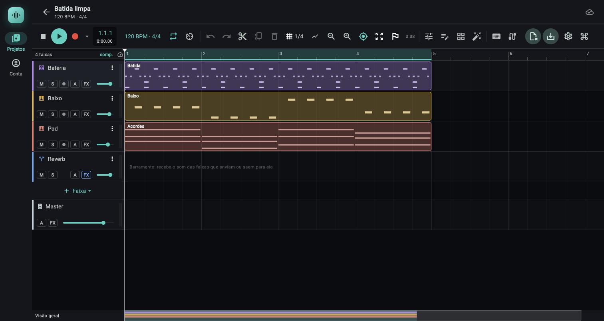

# Visão geral do jopendaw

> O que é o jopendaw, como a tela se divide, o que muda entre computador e celular, os conceitos que o resto do manual assume e um glossário. Leia primeiro; os demais capítulos aprofundam cada peça.

*Tela do projeto com o modelo Batida eletrônica: barra de transporte, faixas com clipes, barramento Reverb, faixa Master e minimapa "Visão geral".*

O jopendaw é um estúdio de música completo (DAW) que roda no navegador e no Android. É o mesmo app Flutter nos dois, com o mesmo motor de áudio escrito em Rust: no navegador o motor roda compilado para WebAssembly dentro de um AudioWorklet; no Android roda como biblioteca nativa, tocando pela saída de áudio do sistema (AAudio). O som é produzido no seu aparelho. O servidor só guarda a conta, a lista de projetos, o documento de cada projeto (para levar de um aparelho a outro) e os arquivos de áudio que você importa ou grava.

## Onde fica

- **Navegador:** abra o endereço do jopendaw, entre na conta ([capítulo 01](01-projetos-modelos-conta.md)) e escolha um projeto. Para gravar, o app pede "um navegador atual" com o site aberto em `https`; para o MIDI, a mensagem do app recomenda o Chrome ou o Edge.
- **Android:** o app `tech.johnenrique.jopendaw` ([capítulo 09](09-configuracoes-atalhos-android.md)). É o mesmo código, com o motor nativo.
- **Estrutura de telas:** `Entrar` (fora do app, sem sessão) → `Projetos` (lista) → o projeto aberto (o estúdio). `Conta` fica ao lado de `Projetos`.

## Controles

### Navegação entre telas

Aparece em `Projetos`, `Conta` e também ao redor do projeto aberto.

| Controle (rótulo exato) | O que faz | Valores / padrão | Dica |
|---|---|---|---|
| `Projetos` | Vai para a lista de projetos | Ícone de biblioteca de música | Está selecionado também dentro de um projeto |
| `Conta` | Vai para a tela da conta | Ícone de pessoa | |
| Marca (quadrado ciano com uma forma de onda) | Só identifica o app; no rail lateral fica acima dos destinos | Não é botão | |
| Seta de voltar (`BackButton`) | Só na página do projeto: volta à lista | | Ao sair do projeto o estúdio é fechado e o estado é salvo no aparelho |
| `Novo projeto` | Cria um projeto (botão na barra da página no computador; botão flutuante no celular) | Só na tela `Projetos` | Veja o [capítulo 01](01-projetos-modelos-conta.md) |

### Cabeçalho da página do projeto

Faixa fina no topo: seta de voltar, o nome do projeto e, embaixo do nome, `120 BPM · 4/4` (andamento e fórmula de compasso guardados no servidor). O nome só se muda na lista de projetos (menu `Renomear` do card), não aqui.

### Barra de transporte

É a faixa de botões do estúdio. No computador fica no topo do projeto; no celular, embaixo, perto do polegar. Se não couber na largura, rola na horizontal. Cada grupo é separado por um traço fino. Rótulos abaixo são os tooltips do app (passe o mouse ou segure o dedo). O [capítulo 02](02-transporte.md) detalha cada um.

**Grupo 1: transporte**

| Controle | O que faz | Valores / padrão | Dica |
|---|---|---|---|
| Parar e voltar (`Enter`) | Para e leva o cursor ao começo (ou ao início do loop). Gravando, encerra a gravação primeiro (tooltip: `Parar a gravação e voltar (Enter)`) | | Também `Home` |
| `Tocar (espaço)` / `Pausar (espaço)` | Toca a partir do cursor ou pausa. Gravando, o tooltip vira `Parar a gravação (espaço)` e o clique encerra a gravação e pausa | Botão cheio, ciano | |
| Gravar (círculo vermelho, `R`) | Liga e desliga a gravação nas faixas armadas. Na contagem pisca no andamento do projeto; gravando fica cheio | Tooltip diz quantas faixas estão armadas | Sem faixa armada o tooltip avisa `nenhuma faixa armada; arme no mixer (●)` |
| Seta ao lado do gravar (`Opções de gravação`) | Menu com `Contagem de um compasso` (marcável) e `Configurações de gravação…` | | Abre a janela do [capítulo 09](09-configuracoes-atalhos-android.md) |
| Posição | Mostra `compasso.tempo.semicolcheia` (ex.: `1.1.1`) e, embaixo, `m:ss.cc` | Antes do zero (contagem) mostra `−N` em vermelho | |
| `120 BPM · 4/4` | Abre `Andamento e compasso` | BPM inteiro de 20 a 400; `Tempos por compasso` de `1/4` a `12/4`; botões `Cancelar` e `Salvar` | Desligado durante a gravação. O andamento é salvo no servidor: precisa de rede |
| `Loop (L) · arraste na régua para marcar` | Liga e desliga o loop | | |
| `Metrônomo (C)` | Liga e desliga o clique | | |

**Grupo 2: edição e visão**

| Controle | O que faz | Valores / padrão | Dica |
|---|---|---|---|
| `Desfazer (Ctrl+Z)` | Desfaz o último passo | Até 200 passos | Desligado gravando |
| `Refazer (Ctrl+Shift+Z)` | Refaz | | Desligado gravando |
| `Cortar no cursor (S)` | Divide os clipes no cursor | | |
| `Duplicar (Ctrl+D)` | Duplica o clipe selecionado | Desligado sem clipe selecionado | |
| `Apagar o clipe (Delete)` | Apaga o clipe selecionado | Desligado sem clipe selecionado | |
| `Grade de encaixe (Alt ao arrastar: livre)` | Menu da grade (snap) | `Livre`, `Compasso`, `1/4`, `1/8`, `1/16`; padrão `1/4` | Mostra o valor atual ao lado do ícone |
| `Afastar` / `Aproximar` | Zoom horizontal | Passo de 1,5x | Também `−` e `+` |
| `Seguir o cursor na reprodução` | A janela rola atrás do cursor tocando | Ligado por padrão | Também no menu `Visão` |
| Menu `Visão` (`Visão: enquadrar, altura das faixas, seguir o cursor`) | `Enquadrar tudo (Z)`, `Enquadrar a seleção (Shift+Z)`, `Faixas pequenas`, `Faixas médias`, `Faixas grandes`, `Seguir o cursor`, `Régua em minutos e segundos` | Altura padrão: média | |
| Menu de bandeira (`Seções e marcadores (M cria um no cursor)`) | Lista de marcadores (clicar leva o cursor), `Marcador no cursor (M)`, `Loop entre marcadores`, `Loop desta seção`, `Loop no clipe selecionado (Shift+L)` | `Nenhum marcador ainda` quando vazio | A bandeira fica ciano com marcadores |
| Duração (texto cinza) | Duração do projeto em minutos e segundos; tooltip `Duração do projeto: ... (N compassos)` | | Conta até o fim do último clipe |

**Grupo 3: painéis de baixo**

| Controle | O que faz | Valores / padrão | Dica |
|---|---|---|---|
| `Mixer (X)` | Abre/fecha o mixer | | |
| `Editor de notas (E)` | Abre/fecha o piano roll | Abre no clipe de notas selecionado | |
| `Instrumento da faixa (I)` | Abre/fecha o painel do instrumento | O ícone acompanha o tipo da faixa selecionada | |
| `Efeitos da faixa (F)` | Abre/fecha o rack de efeitos | Sem faixa selecionada abre o master | |

**Grupo 4: entradas de notas**

| Controle | O que faz | Valores / padrão | Dica |
|---|---|---|---|
| Teclado (`Tocar com o teclado do computador (Ctrl+K)`) | Transforma as letras em teclas de piano na faixa selecionada | Ligado, mostra a oitava e o aviso: `C4 · sem atalhos` (`C2 · sem atalhos` numa bateria); o tooltip vira `Teclado tocando: atalhos suspensos (C L S X Z E F K J e Shift+H/L). A a P tocam a partir do C4, Z/X mudam a oitava, C/V a intensidade (80%). Ctrl+K desliga` | As letras deixam de ser atalhos enquanto estiver ligado; a lista está na janela de atalhos ([capítulo 09](09-configuracoes-atalhos-android.md)) |
| Cabo (`Entrada MIDI: ligar teclado ou controlador`) | Liga o MIDI e mostra quantos aparelhos estão conectados | `0` quando ligado sem aparelho | Pede permissão no navegador |

**Grupo 5: arquivos, ajustes e nuvem**

| Controle | O que faz | Valores / padrão | Dica |
|---|---|---|---|
| `Importar áudio ou MIDI (Ctrl+I)` (rótulo `Importar` quando há largura) | Abre o seletor de arquivos de áudio ou MIDI | áudio: `wav`, `mp3`, `ogg`, `oga`, `flac`, `m4a`, `aac`, `opus`, `webm`, `aif`, `aiff`; MIDI: `mid`, `midi` | Desligado gravando ou com trabalho em andamento |
| `Exportar a música (e as faixas separadas) em WAV` (rótulo `Exportar`) | Abre a janela de exportação ([capítulo 08](08-exportacao.md)) | | Tooltip vira `Pare a gravação para exportar` gravando |
| `Configurações: entrada de áudio, latência e contagem` | Abre `Configurações` | | [Capítulo 09](09-configuracoes-atalhos-android.md) |
| `Atalhos do teclado (?)` | Abre `Atalhos do teclado` | | Também a tecla `?` |
| Nuvem | Indicador de sincronização | Estados no [capítulo 01b](01b-nuvem-e-sincronizacao.md) | Some se não houver sessão |
| Texto com roda girando | Trabalho em andamento (`Importando <nome>…`, `Exportando…`, `Salvando a gravação…`, `Processando o warp…`) | | |

O rótulo `Importar` / `Exportar` só aparece por extenso quando a barra tem 1540 px ou mais e o layout é o de computador; abaixo disso ficam só os ícones.

Nesta tabela os tooltips aparecem com `Ctrl`; no Mac e no iOS o app troca `Ctrl` por `⌘` nos tooltips de `Desfazer`, `Refazer`, `Duplicar`, `Importar áudio ou MIDI` e do teclado do computador (por exemplo `Desfazer (⌘+Z)`), e no atalho do item `Duplicar` do menu do clipe.

### Linha do tempo (o arranjo)

Ocupa o meio da tela. À esquerda, uma coluna de cabeçalhos de faixa; à direita, a régua e as raias com os clipes.

| Controle (rótulo exato) | O que faz | Valores / padrão | Dica |
|---|---|---|---|
| Canto da régua: `N faixas` e `comp.` / `mm:ss` | Mostra quantas faixas há; clicar alterna a régua entre compassos e minutos:segundos | Tooltip: `Régua em compassos: clique para alternar` | Mesmo efeito do item `Régua em minutos e segundos` |
| Régua | Escala de compassos (ou tempo); arrastar nela marca a região do loop; abriga os marcadores | | |
| Cabeçalho da faixa: nome | Nome da faixa; o menu `Opções da faixa` (três pontos) tem `Abrir o instrumento`, `Efeitos`, `Monitorar a entrada`, `Renomear`, `Duplicar a faixa`, `Congelar em áudio`, `Mover para cima`, `Mover para baixo`, `Trocar a cor`, `Apagar a faixa` | Alguns itens só existem conforme o tipo da faixa | Apagar uma faixa com conteúdo pede confirmação e dá para desfazer |
| `M` (`Mudo`) | Silencia a faixa | | |
| `S` (`Solo`) | Só as faixas em solo tocam | | |
| Bolinha `●` (armar) | Arma a faixa para gravar. Tooltips: `Armar para gravar a entrada de áudio`, `Armar para gravar as notas (teclado ou MIDI)`, `Desarmar` | Não existe em barramento | Bloqueada durante a gravação |
| `A` (`Automação`) | Menu dos parâmetros que dá para automatizar | Aceso com automação aberta | [Capítulo 07](07-automacao.md) |
| `FX` (`Efeitos`) | Abre o rack de efeitos da faixa; contornado quando há efeitos, tooltip `Efeitos (N)` | Só no layout de computador | No celular os efeitos ficam no menu e no ícone do barramento |
| Mini-fader | Volume da faixa direto no cabeçalho | Só no layout de computador | |
| Medidor fino | Nível da faixa | | |
| Ícone do tipo (à esquerda, ou junto de `M` e `S` no celular) | Abre o instrumento da faixa (ou os efeitos, no barramento) | Um ícone por tipo: `Áudio` (forma de onda), `Sintetizador` (piano), `Bateria` (grade), `Sampler` (nota musical), `Barramento` (bifurcação), `FM` (rede de nós, `hub`) e `Wavetable` (gráfico de linha, `ssid_chart`) | Os ícones de `FM` e `Wavetable` foram vistos no Chrome, na lista de faixas |
| `Faixa` com seta (tooltip `Nova faixa`) | Menu para criar faixa: `Áudio`, `Sintetizador`, `Bateria`, `Sampler`, `FM`, `Wavetable` e, depois de um traço, `Barramento` | | Fica no fim da lista de faixas |
| Linha `Master` | Volume, medidor, automação e efeitos do master | Fixa no fim da lista | |
| `Visão geral` (rodapé) | Faixa fina com o projeto inteiro: clipes, loop, marcadores, janela visível, cursor. Clicar ou arrastar leva a janela | | |

Os gestos sobre os clipes (arrastar, aparar, fades, duplo clique) estão no [capítulo 02b](02b-timeline-e-clipes.md).

### Painel inferior (abas Mixer / Editor / Instrumento / Efeitos)

Um painel só, com quatro abas; mostra um conteúdo por vez.

| Controle (rótulo exato) | O que faz | Valores / padrão | Dica |
|---|---|---|---|
| Aba `Mixer` (tooltip `Mixer (X)`) | Um canal por faixa e o master à direita: inserts, envios, pan, fader, armar/monitorar, mudo/solo, saída | | [Capítulo 06](06-mixer.md) |
| Aba `Editor` (tooltip `Editor de notas (E)`) | Piano roll do clipe de notas aberto | Vazio: `Nenhum clipe aberto` | [Capítulo 05](05-piano-roll.md) |
| Aba `Instrumento` (tooltip `Instrumento da faixa (I)`) | Presets e controles do instrumento da faixa | Em faixa de áudio ou barramento diz `sem instrumento` | [Capítulo 04](04-painel-de-instrumento.md) |
| Aba `Efeitos` (tooltip `Efeitos da faixa (F)`) | Cadeia de efeitos da faixa selecionada, ou do master | Subtítulo: `<faixa> · N efeitos` ou `Master · sem efeitos` | [Capítulo 06c](06c-painel-de-efeitos.md) |
| Assunto (texto ao lado das abas) | Diz de quem é o painel: o clipe no editor, a faixa no instrumento e nos efeitos | Com ponto na cor da faixa | |
| `Maximizar o painel` / `Restaurar a altura` | Alterna entre a altura escolhida e a máxima | Só no computador | Duplo clique na alça faz o mesmo |
| `Fechar o painel (Esc)` | Fecha o painel | | |
| Alça (fio fino de 6 px acima das abas; também a área vazia da barra de abas) | Arrastar muda a altura | Só no computador; mínimo 230 px; o arranjo nunca fica com menos de 150 px | A altura escolhida vale até fechar o app |

No computador o painel abre com a metade do espaço (mínimo 320 px). No celular ocupa 60% do espaço, sem alça e sem botão de maximizar; abaixo de 560 px de largura as abas mostram só o ícone.

### Aviso de falha do áudio (`Reiniciar o áudio`)

Se o motor de áudio para de funcionar com o projeto aberto, o som some e aparece, logo abaixo da barra de transporte no computador (no celular, no topo da tela do projeto, acima da barra de baixo), um aviso vermelho (ícone de erro, o texto e um botão à direita). O aviso fica até você reiniciar o áudio; ele não fecha sozinho e não tem botão de dispensar.

| Elemento (rótulo exato) | O que faz | Valores / padrão | Dica |
|---|---|---|---|
| Texto do aviso | Diz o que houve | `O motor de áudio parou de responder e o som ficou mudo. O projeto não foi perdido: reinicie o áudio para continuar.` | O projeto está no aparelho (e na nuvem, se sincronizado): nada é apagado |
| Linha `Detalhe: …` (segunda linha do texto) | O motivo técnico que o motor informou, útil para quem for reportar o problema | Até 240 caracteres (o que passa vira `…`); a linha some quando o motor não informou nada. Na web costuma ser `O motor de áudio parou de responder.`, `O processamento do áudio caiu (erro no motor).` ou `O motor de áudio caiu: <primeira linha do erro>`; no Android, `A thread de áudio do motor caiu.` | O mesmo texto vai também ao console de depuração. `(o texto de cada motivo foi lido no código; a linha nunca foi vista na tela, sem teste automático que a confira)` |
| Botão `Reiniciar o áudio` | Recria o motor de áudio, manda de novo os áudios e o documento e reabre a entrada de áudio se houver faixa de áudio armada ou monitorando | Vira `Reiniciando…` (desligado) enquanto trabalha | Na web o clique é o gesto que o navegador exige para liberar o áudio de novo |
| Texto depois de uma tentativa que falhou | Explica por que o reinício falhou | `Não deu para reiniciar o áudio: <motivo>` | O botão volta; tente de novo |

O que dispara o aviso:

- **Na web:** o navegador avisa que o processador de áudio caiu; ou o motor (WebAssembly) tropeça num erro fatal; ou o motor deixa de mandar sinal de vida por 4 segundos com o áudio rodando. Aba em segundo plano ou sem o gesto que libera o áudio, e a página travada por um instante, **não** contam como falha.
- **No Android:** o motor nativo informa que a thread de áudio caiu (o mesmo erro `ERR_PANIC` do motor).

Ao aparecer o aviso o transporte fica parado. O motor novo nasce parado no começo (o cursor da tela vem do estado do motor, então deve voltar ao início `(não confirmado em uso)`); o projeto, os clipes e a mixagem voltam inteiros. Aperte `Espaço` para tocar. `(testado só por testes automáticos)`: o aviso, o botão e o reinício foram cobertos por testes com motor simulado, e não foram vistos falhando no Chrome nem num aparelho.

## Computador e celular

O layout troca em **800 px de largura** (`kDesktopBreakpoint`). Celular deitado pode passar de 800 px, mas com pouca altura: aí o rail perde os rótulos.

| Aspecto | Computador (800 px ou mais) | Celular (abaixo de 800 px) |
|---|---|---|
| Navegação | Rail lateral à esquerda com a marca, `Projetos` e `Conta`, rótulos sempre visíveis | Barra inferior com os mesmos dois destinos; abaixo de 480 px só o destino selecionado mostra o rótulo |
| Rail em altura baixa (menos de 560 px) | Sem rótulos, rolável | Não se aplica |
| `Novo projeto` | Botão na barra da página | Botão flutuante estendido |
| Barra de transporte | No topo do projeto | Embaixo do projeto |
| Cabeçalho de faixa | 232 px, com o chip `FX` e o mini-fader | 132 px, sem `FX` nem mini-fader; o ícone do tipo entra junto de `M`/`S` |
| Altura da raia | 76 px (vezes 0,7 / 1 / 1,5 conforme `P`/`M`/`G`) | 64 px (mesmos fatores) |
| Painel inferior | Altura arrastável, botão de maximizar | 60% do espaço, fixo |
| Botões `Importar` e `Exportar` | Com texto se a barra tiver 1540 px ou mais | Só ícone |
| Efeitos (rack) | Cartões na horizontal, na ordem do sinal | Cartões um embaixo do outro |
| Menu de contexto do botão direito | No navegador, o app usa o botão direito para os menus dos clipes (o menu do navegador é desligado na tela do projeto) | Toque longo (não confirmado) |
| Atalhos de teclado | Todos | Só com teclado físico conectado (não confirmado) |

## Conceitos

**Projeto.** Uma música. Guarda o andamento, o compasso, as faixas, os clipes, a mixagem, os marcadores e a lista de áudios usados. Nome, andamento, compasso e taxa cadastrada (`48.0 kHz` nos projetos criados pelo app) ficam no servidor; o resto forma o documento do projeto.

**Faixa.** Uma linha do arranjo com o seu canal no mixer. Tipos: `Áudio` (recebe gravações e arquivos), `Sintetizador`, `Bateria`, `Sampler`, `FM`, `Wavetable` (tocam notas) e `Barramento` (não tem clipes: recebe o som de outras faixas por envio ou por saída, como um retorno de reverb). Cada faixa tem volume, pan, mudo, solo, cadeia de efeitos, envios e, opcionalmente, automação.

**Clipe.** Um trecho de conteúdo numa faixa: de áudio (aponta para um arquivo; pode ser cortado, ter fades, warp) ou de notas MIDI (as notas do piano roll). Posições em batidas, de modo que o clipe acompanha o andamento; o corte de um clipe de áudio é em segundos do arquivo original.

**Batida, compasso e posição.** A batida é a unidade de tempo da música. O compasso agrupa as batidas: `4/4` são quatro batidas por compasso (o app só oferece `1/4` a `12/4`). A posição é mostrada como `compasso.tempo.semicolcheia` (`1.1.1` é o começo). O andamento (BPM) diz quantas batidas por minuto; mudá-lo estica ou encolhe todo o arranjo.

**Snap (grade de encaixe).** Ao arrastar clipes, o app puxa a posição para a grade escolhida: `Compasso`, `1/4` (uma batida), `1/8` (meia batida), `1/16` (um quarto de batida) ou `Livre`. Segurar `Alt` ao arrastar ignora a grade naquele gesto.

**Loop.** Uma região que se repete. Liga com `L` e se marca arrastando na régua, com marcadores ou com o clipe selecionado.

**Local primeiro.** O projeto abre e edita no seu aparelho, sem esperar a rede: o documento e os áudios ficam guardados no aparelho (no navegador, no IndexedDB; no Android, em arquivos do app). A nuvem trabalha em segundo plano: traz a versão mais nova quando você não tem nada pendente e envia o que mudou depois de 3 segundos sem edição. Se dois aparelhos mudarem o mesmo projeto, o app pergunta qual vale. Tudo isso está no [capítulo 01b](01b-nuvem-e-sincronizacao.md).

**Desfazer.** Guarda até 200 passos; ligar o metrônomo ou o loop e a calibragem de latência não entram no histórico. O histórico é da sessão de edição: some ao fechar o projeto.

## Glossário

| Termo | Significado no jopendaw |
|---|---|
| Andamento / BPM | Batidas por minuto. Faixa de 20 a 400 no diálogo da barra. |
| Armar | Deixar uma faixa pronta para receber a gravação (áudio da entrada, ou notas do teclado/MIDI). |
| Automação | Curva que move um parâmetro (volume, pan, envio, instrumento, efeito) ao longo do tempo. |
| Barramento (bus) | Faixa sem clipes que soma o áudio mandado por outras faixas, para tratá-las juntas (ex.: um reverb comum). |
| Bounce / Congelar em áudio | Transforma uma faixa (com instrumento e efeitos) em áudio numa faixa nova; a original fica muda. |
| Clipe | Trecho de áudio ou de notas numa faixa. |
| Contagem | Um compasso de metrônomo antes de a gravação começar; opção `Contagem de um compasso`. |
| Cursor (playhead) | A linha que marca onde a reprodução está. |
| dB (decibel) | Unidade de volume do fader e dos envios; `0 dB` é o volume original. |
| Documento | O conteúdo musical do projeto (faixas, clipes, mixagem), enviado como um arquivo JSON versionado. |
| Efeito / insert | Processador na cadeia da faixa (reverb, delay, EQ etc.), na ordem do sinal. |
| Envio (send) | Cópia do som de uma faixa para um barramento, com nível próprio, antes (pré) ou depois (pós) do fader. |
| Fader | O controle deslizante de volume. |
| Grade | Ver Snap. |
| Hash (SHA-256) | A "impressão digital" de um arquivo de áudio; identifica o áudio no aparelho e na nuvem. Arquivos iguais têm o mesmo hash e não se repetem. |
| Latência | Atraso entre o som acontecer e ele ser ouvido ou gravado. A `Compensação de latência` ajusta a gravação; a latência de efeitos como o `Limitador` o motor compensa sozinho entre as faixas ([06e](06e-compensacao-de-latencia.md)). |
| Loop | Região repetida. |
| Marcador | Bandeirinha na régua que nomeia um ponto ou seção. |
| Master | O canal final onde tudo se soma antes da saída. |
| Metrônomo | O clique do andamento. |
| Monitorar | Ouvir a entrada (o microfone) ao vivo pela cadeia da faixa. |
| Motor | O programa em Rust que sintetiza, mistura e toca. |
| MIDI | Notas e controles (não é som). Entra por teclado ou controlador, ou vem do piano roll. |
| Mudo (`M`) / Solo (`S`) | Silenciar uma faixa / deixar tocar só as faixas em solo. |
| Nuvem | O servidor do jopendaw, onde o documento e os áudios ficam para outros aparelhos. |
| Pan | Posição da faixa entre a esquerda e a direita. |
| Piano roll | O editor de notas (aba `Editor`). |
| Preset | Ajuste pronto de instrumento ou efeito. |
| Quantizar | Puxar as notas para a grade (`Q` no piano roll). |
| Sampler | Instrumento que toca um áudio seu como notas. |
| Semitom (`st`) | O menor passo entre notas do piano; unidade de afinação e transposição. |
| Snap | Encaixe na grade ao arrastar. |
| Stem | Cada faixa exportada separadamente (`Exportar a música (e as faixas separadas) em WAV`). |
| Tomada (take) | Cada gravação feita sobre a mesma região de uma faixa de áudio; fica no clipe (menu `Tomadas`). |
| Velocidade (velocity) | Quão forte uma nota é tocada, de 0 a 1 (mostrada em %). |
| Warp | Esticar o áudio para seguir o andamento do projeto, e transpor sem mudar a duração. |

## Passo a passo

1. **Primeira música pronta em um minuto.** Entre, toque em `Novo projeto`, dê um nome, deixe `Batida eletrônica` marcado e toque em `Criar`. Espere o estúdio abrir e aperte a barra de espaço (ou o botão de tocar). Ver o que o modelo cria: [capítulo 01](01-projetos-modelos-conta.md).
2. **Trazer um áudio ou um MIDI.** No estúdio, aperte `Importar áudio ou MIDI (Ctrl+I)`, escolha um arquivo: o áudio cai numa faixa a partir do cursor e um `.mid` vira faixas de instrumento com clipes de notas.
3. **Abrir um painel.** Tecle `X`, `E`, `I` ou `F` (ou toque nos botões do grupo de painéis) para abrir mixer, editor, instrumento ou efeitos; `Esc` fecha.
4. **Ver todas as teclas.** Tecle `?`: a janela `Atalhos do teclado` lista tudo ([capítulo 09](09-configuracoes-atalhos-android.md)).
5. **Levar para outro aparelho.** Entre com a mesma conta lá e abra o projeto; espere o ícone de nuvem ficar `Sincronizado` ([capítulo 01b](01b-nuvem-e-sincronizacao.md)).

## Combina com

- [01 Projetos, modelos e conta](01-projetos-modelos-conta.md): entrar e criar o primeiro projeto.
- [01b Nuvem e sincronização](01b-nuvem-e-sincronizacao.md): vários aparelhos, conflitos e cotas.
- [02 Transporte](02-transporte.md) e [02b Timeline e clipes](02b-timeline-e-clipes.md): as duas áreas que você mais usa.
- [06 Mixer](06-mixer.md) e [08 Exportação](08-exportacao.md): fechar a mixagem e tirar o WAV.
- [09 Configurações, atalhos e Android](09-configuracoes-atalhos-android.md): teclas e diferenças de plataforma.
- Receitas prontas: pasta `../guias/`.

## Limites e pegadinhas

- O andamento e o compasso moram no servidor: mudar o `120 BPM · 4/4` da barra chama a API. Sem rede o app mostra o novo andamento nesta sessão, mas o servidor guarda o antigo, e ao reabrir o projeto vale o do servidor (lido do código; o aviso de erro na tela ao falhar não foi confirmado).
- O botão da barra sempre escreve `/4` (`120 BPM · 4/4`), mesmo que o cadastro do projeto no servidor tenha outra figura de tempo; o card da lista mostra a fórmula do cadastro.
- Os tooltips, o item `Duplicar` do menu do clipe e a janela `Atalhos do teclado` mostram `⌘` no Mac e no iOS e `Ctrl` nos outros sistemas (`Desfazer (⌘+Z)` no Mac). Nesta tabela do capítulo eles aparecem como `Ctrl`.
- No menu `Visão`, `Faixas pequenas`, `Faixas médias` e `Faixas grandes` não têm atalho de teclado (antes da fase 9 o menu mostrava siglas `(P)`, `(M)` e `(G)` que pareciam atalhos; `M` cria marcador).
- Só há motor de áudio no navegador e no Android. Em outro sistema (um build de computador nativo) a tela do projeto avisa (`O motor de áudio não roda neste sistema: use o jopendaw no navegador ou no Android.`) e não toca.
- Se o som some de repente e aparece o aviso vermelho com o botão `Reiniciar o áudio`, o motor caiu; veja "Aviso de falha do áudio" acima. O projeto não é perdido.
- Ligado o teclado do computador, letras como `S`, `L`, `C`, `X`, `Z`, `E`, `F` viram notas e deixam de ser atalho; o botão do teclado mostra `· sem atalhos` para lembrar.
- Ao sair do projeto o estúdio é fechado: notas soando e gravação em andamento são interrompidas. No Android, sair do app (outro app na frente, tela desligada) e desplugar o fone também param o transporte, e a tela fica acesa enquanto toca ou grava ([capítulo 09](09-configuracoes-atalhos-android.md)).
- Sem sessão, o app não abre projetos: qualquer rota fora de `/login`, `/entrar` e `/authorize/callback` manda para o login.

## Atalhos

Os atalhos mais usados (a lista completa e o significado de cada um estão no [capítulo 09](09-configuracoes-atalhos-android.md)):

| Tecla | Ação |
|---|---|
| `Espaço` | Tocar / pausar |
| `Enter` | Parar e voltar |
| `R` | Gravar |
| `L` | Loop liga/desliga |
| `C` | Metrônomo |
| `X` / `E` / `I` / `F` | Mixer / editor de notas / instrumento / efeitos |
| `Esc` | Fechar o painel |
| `Z` | Enquadrar o projeto |
| `Ctrl+Z` (`⌘Z` no Mac) | Desfazer |
| `?` | Abrir a janela de atalhos |
