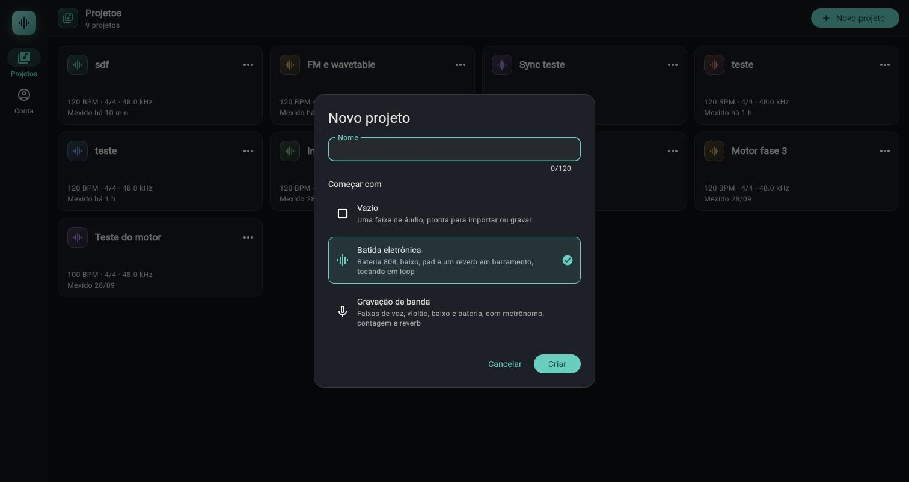
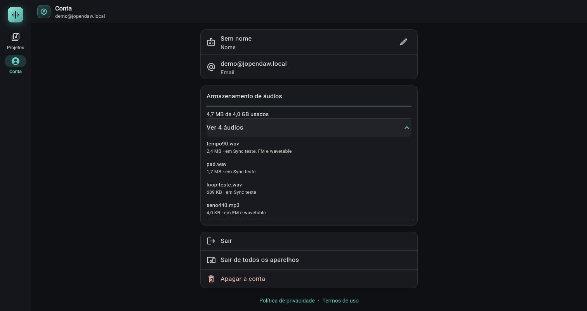

# Projetos, modelos e conta

> Como entrar no jopendaw, criar, renomear e apagar projetos, o que cada um dos três modelos monta de saída, e o que a tela `Conta` faz. É o primeiro capítulo prático: em dois minutos você tem um projeto tocando.

*Diálogo Novo projeto, com o nome e os três pontos de partida (Vazio, Batida eletrônica, Gravação de banda).*

## Onde fica

- **Entrar:** é a primeira tela quando não há sessão (`/login`). Qualquer endereço do app sem sessão cai aqui e, depois de entrar, você volta para onde ia.
- **Projetos:** botão `Projetos` do rail lateral (computador, 800 px ou mais) ou da barra inferior (celular). É a tela inicial depois de entrar.
- **Conta:** botão `Conta` do mesmo rail ou barra.
- **Novo projeto:** botão `Novo projeto` na barra da página (computador) ou botão flutuante (celular). Quando a lista está vazia há também `Criar o primeiro`.
- **Projeto em arquivo (`.jopendaw`):** `Importar projeto` na barra da página `Projetos` (texto no computador; só o ícone de seta para cima, com o tooltip `Importar projeto`, no celular; na lista vazia, também ao lado de `Criar o primeiro`). `Exportar projeto…` no menu `Mais` do card. Dentro do projeto, `Exportar` na barra de transporte e, na janela `Exportar áudio`, o botão `Projeto inteiro (.jopendaw)…`. Detalhes na seção [Projeto em arquivo (.jopendaw)](#projeto-em-arquivo-jopendaw).

## Controles

### Tela `Entrar`

O cabeçalho mostra a marca, `jopendaw` e a frase `Grave, arranje e mixe, no navegador ou no celular.`. Não há senha: a conta é criada na primeira entrada.

| Controle (rótulo exato) | O que faz | Valores / padrão | Dica |
|---|---|---|---|
| `Continuar com o Google` | Entra com a conta do Google | Só aparece se o servidor tiver o Google ligado | O texto acima muda para `Sem senha: com a sua conta do Google ou do Discord, ou com um link no seu email.` conforme os provedores ligados |
| `Continuar com o Discord` | Entra com a conta do Discord | Só aparece se o servidor tiver o Discord ligado | No Android, com o app do Discord instalado, autoriza dentro dele; sem o app, abre uma aba do Chrome |
| `ou pelo email` | Divisor entre os provedores e o campo de email | Só aparece com algum provedor ligado | |
| Campo `Email` | O email que vai receber o link | Precisa ter `@` | `Enter` envia. Em telas com menos de 600 px o campo não pega o foco sozinho (o teclado cobriria os botões) |
| `Receber link de entrada` | Manda o link de entrada para o email | O link vale por 15 minutos e só funciona uma vez | Gira o ícone de envio enquanto manda |
| `Tenho um código de acesso` | Abre o diálogo `Código de acesso` | Serve à conta de demonstração da revisão da Play Store | Sem a conta de demonstração ligada no servidor, o código sempre é recusado |
| `Política de privacidade` e `Termos de uso` | Abrem as páginas fora do app | | Também na tela `Conta` |

Diálogo `Código de acesso`:

| Controle | O que faz | Valores / padrão | Dica |
|---|---|---|---|
| Campo `Email` | O email da conta de demonstração | | |
| Campo `Código` | O código de acesso | Texto oculto | `Enter` confirma |
| `Cancelar` | Fecha sem entrar | | |
| `Entrar` | Entra (ignora se um dos dois campos está vazio) | | Erro: `Email ou código de acesso não conferem.` |

Depois de pedir o link, a tela vira `Confira o seu email`:

| Controle | O que faz | Valores / padrão | Dica |
|---|---|---|---|
| Texto `Mandamos um link de entrada para <email>. Ele vale por 15 minutos e só funciona uma vez.` | Confirma o envio | | Se já abriu o link em outra aba, esta tela entra junto (confere a cada 2 segundos) |
| `Mandar de novo` | Pede outro link para o mesmo email | Limite de 5 pedidos por email e 30 por IP por hora | Estourou: `Muitas tentativas; aguarde.` |
| `Usar outro email` | Volta ao formulário | | |

O link do email abre `/entrar?token=…`. Essa tela mostra `Entrando…` e leva para `Projetos`. Se o link não serve:

| Mensagem | Quando | Botão |
|---|---|---|
| `Esse link está incompleto. Copie o endereço inteiro do email.` | O endereço veio sem o token | `Pedir um link novo` |
| `Esse link já foi usado ou venceu. Peça outro.` | Já usado ou passou de 15 minutos | `Pedir um link novo` (ou `Ir para os projetos` se já há sessão) |
| `Não deu para abrir o link: <motivo>.` | O servidor recusou | idem |
| `Sem conexão com o servidor. Tente de novo.` | Sem rede | idem |

Mensagens de erro do login com Google/Discord:

| Mensagem | Quando |
|---|---|
| `Não deu para abrir a entrada pelo <provedor>. Tente de novo ou entre pelo link do email.` | A aba do provedor não abriu |
| `A entrada pelo <provedor> demorou demais e venceu. Tente de novo.` | A volta chegou tarde |
| `A sua conta do <provedor> não tem um email verificado. Verifique o email lá, ou entre pelo link do email aqui.` | O provedor não deu um email verificado |
| `A entrada começou em outro navegador. Tente de novo por aqui.` | Na web, a volta caiu num navegador que não iniciou a entrada |
| `Não deu para entrar pelo <provedor> agora. Tente de novo ou entre pelo link do email.` | Qualquer outra falha |
| `Não deu para mandar o email agora. Tente de novo em instantes.` | Falha do servidor ao mandar o link |
| `Digite o seu email.` | O campo não tem `@` |

### Tela `Projetos`

O título é `Projetos`; embaixo, o total (`1 projeto`, `3 projetos`). Os cards ficam numa grade que se adapta à largura (colunas de até 360 px; uma coluna no celular), do mais recentemente mexido para o mais antigo. Puxar a lista para baixo recarrega.

| Controle (rótulo exato) | O que faz | Valores / padrão | Dica |
|---|---|---|---|
| `Novo projeto` | Abre o diálogo `Novo projeto` | Fica desligado enquanto uma ação roda | |
| `Criar o primeiro` | Mesmo diálogo, na lista vazia | Aparece com o título `Nenhum projeto ainda` e o texto `Um projeto guarda as faixas, os clipes e a mixagem de uma música.` | |
| `Importar projeto` | Escolhe um arquivo `.jopendaw` e cria um projeto novo com ele ([seção abaixo](#projeto-em-arquivo-jopendaw)) | Fica desligado enquanto uma ação roda. No celular é só o ícone, com o tooltip `Importar projeto` | Nunca sobrescreve um projeto existente |
| Card do projeto | Clicar abre o projeto (estúdio) | Mostra o nome, `120 BPM · 4/4 · 48.0 kHz` e `Mexido agora` / `Mexido há N min` / `Mexido há N h` / `Mexido dd/mm` | O `kHz` é o cadastrado no servidor (48.0 nos projetos criados pelo app) |
| Menu `Mais` (três pontos do card) | `Renomear`, `Exportar projeto…` e `Apagar` | | `Exportar projeto…` gera o arquivo `.jopendaw` ([seção abaixo](#projeto-em-arquivo-jopendaw)) |
| `Renomear` | Abre `Renomear projeto` (campo `Nome`, botão `Salvar`) | Até 120 caracteres | Só salva se o nome mudou e não ficou vazio |
| `Apagar` | Pede confirmação: `Apagar "<nome>"?` / `O projeto some para sempre, com tudo o que estiver nele.` | Botões `Cancelar` e `Apagar` (vermelho) | Depois: `Projeto apagado.`. Os **áudios do projeto não são apagados do servidor**: passam a constar como "sem uso" na tela `Conta` (ver [Armazenamento de áudios](#armazenamento-de-áudios-na-tela-conta)) |
| `Tentar de novo` | Recarrega a lista quando deu erro | Erro na tela: `Não deu para carregar` | Sem rede: `Sem conexão com o servidor. Tente de novo.` |

Diálogo `Novo projeto`:

| Controle | O que faz | Valores / padrão | Dica |
|---|---|---|---|
| Campo `Nome` | O nome do projeto | Até 120 caracteres; vazio dá `Dê um nome ao projeto.` | `Enter` cria |
| `Começar com` (três blocos) | Escolhe o modelo | `Vazio`, `Batida eletrônica`, `Gravação de banda`; o padrão marcado é `Batida eletrônica` | O bloco marcado leva um contorno ciano e um visto |
| `Cancelar` | Fecha | | |
| `Criar` | Cria e abre o projeto | | Precisa de rede: o cadastro do projeto é no servidor |

Todo projeto nasce com **120 BPM, compasso 4/4 e 48.0 kHz**; o app não pergunta nada disso ao criar. O andamento e o compasso se mudam depois, na barra do estúdio ([capítulo 02](02-transporte.md)).

### Os três modelos

O modelo só monta o documento na **primeira abertura** do projeto, no aparelho onde ele foi criado. As posições são em batidas, então valem em qualquer andamento. Os timbres são presets do próprio app.

#### `Vazio`

Descrição na tela: `Uma faixa de áudio, pronta para importar ou gravar`.

| Item | O que vem |
|---|---|
| Faixas | Uma: `Áudio 1` (áudio, cor ciano), sem clipes, sem efeitos |
| Loop | Região de 0 a 4 compassos (16 batidas em 4/4) definida, mas **desligado** |
| Metrônomo | Desligado |
| Contagem | Ligada (é o padrão de todo documento) |
| Andamento | 120 BPM |

Os dois outros modelos também deixam a contagem ligada.

#### `Batida eletrônica`

Descrição na tela: `Bateria 808, baixo, pad e um reverb em barramento, tocando em loop`.

Loop **ligado**, de 0 a 4 compassos (16 batidas em 4/4); metrônomo desligado. Quatro faixas, nesta ordem:

| Faixa | Tipo e cor | Timbre | Volume | Envio para `Reverb` | Clipe (4 compassos) |
|---|---|---|---|---|---|
| `Bateria` | `Bateria`, lilás | Kit `808` | 0 dB (padrão) | 0,12 (cerca de −18,4 dB) | `Batida`: 88 notas |
| `Baixo` | `Sintetizador`, amarelo | Preset `Baixo sub` | 0,8 (cerca de −1,9 dB) | nenhum | `Baixo`: 16 notas |
| `Pad` | `Sintetizador`, salmão | Preset `Pad quente` | 0,55 (cerca de −5,2 dB) | 0,45 (cerca de −6,9 dB) | `Acordes`: 12 notas |
| `Reverb` | `Barramento`, azul | Um efeito `Reverb`, preset `Sala` | 0 dB | | Sem clipes |

O que toca:

- **Bateria:** bumbo (nota 36) em todas as batidas; `Palmas` (39) na 2ª e na 4ª batida do compasso; chimbal aberto (46) no contratempo de cada batida; chimbal fechado (42) na 1ª, 2ª e 4ª semicolcheia de cada batida, com a primeira mais forte.
- **Baixo:** uma nota por batida, no contratempo (colcheia), na raiz do acorde: `A2`, `F2`, `C3`, `G2` (um compasso cada).
- **Pad:** acordes de um compasso inteiro: `Am` (A3 C4 E4), `F` (F3 A3 C4), `C` (G3 C4 E4) e `G` (G3 B3 D4). A progressão é lá menor, fá, dó, sol.
- **Reverb:** o efeito com `Mistura` em 100% (o som seco vem das faixas, pelos envios) e os valores do preset `Sala`: `Pré-atraso` 0,015 s, `Tamanho` 50%, `Decaimento` 1,4 s, `Abafar` 7500 Hz, `Cortar graves` 120 Hz, `Largura` 90%, `Modulação` 30%, `Primeiras reflexões` 55%.

#### `Gravação de banda`

Descrição na tela: `Faixas de voz, violão, baixo e bateria, com metrônomo, contagem e reverb`.

Metrônomo **ligado**, contagem ligada, loop desligado (região de 0 a 4 compassos já marcada). Cinco faixas, sem nenhum clipe e **nenhuma armada**:

| Faixa | Tipo e cor | Envio para `Reverb` |
|---|---|---|
| `Voz` | `Áudio`, ciano | 0,3 (cerca de −10,5 dB) |
| `Violão` | `Áudio`, amarelo | 0,2 (cerca de −14,0 dB) |
| `Baixo` | `Áudio`, verde | Sem envio: o baixo vai só para o master, seco (o reverb empastaria os graves); para reverb nele, crie o envio no mixer |
| `Bateria` | `Bateria`, lilás, kit `Acústico eletrônico` | 0,1 (−20 dB) |
| `Reverb` | `Barramento`, azul, efeito `Reverb` com preset `Placa` | |

O `Reverb` daqui tem `Mistura` em 100% e os valores do preset `Placa`: `Pré-atraso` 0,01 s, `Tamanho` 55%, `Decaimento` 1,8 s, `Abafar` 12000 Hz, `Cortar graves` 200 Hz, `Largura` 100%, `Modulação` 45%, `Primeiras reflexões` 15%. A `Bateria` vem sem notas: escreva no piano roll ou grave por MIDI.

### Tela `Conta`

O título é `Conta` e o subtítulo, o seu email.

| Controle (rótulo exato) | O que faz | Valores / padrão | Dica |
|---|---|---|---|
| Linha com o nome (`Sem nome` se ainda não há) e a legenda `Nome` | Clicar abre `Seu nome` (campo `Nome`, `Cancelar`, `Salvar`) | Até 80 caracteres, sem quebra de linha | Depois: `Nome salvo.` |
| Linha `Email` | Mostra o email da conta | Só leitura | Não dá para trocar o email aqui |
| `Sair` | Encerra a sessão neste aparelho | Sem confirmação | Volta ao login |
| `Sair de todos os aparelhos` | Encerra todas as sessões da conta, inclusive esta | Pede `Sair de todos os aparelhos?` / `Todas as sessões desta conta são encerradas, inclusive esta.`; botões `Cancelar` e `Sair de todos` | Use se perdeu um aparelho |
| `Apagar a conta` (vermelho) | Apaga a conta e tudo o que há nela | Pede `Apagar a conta?` / `A conta e todos os projetos dela somem para sempre. Não tem volta.`; botões `Cancelar` e `Apagar a conta` | Leva junto os projetos, os áudios e as tarefas no servidor |
| `Política de privacidade` · `Termos de uso` | Abrem as páginas fora do app | | |

A sessão dura até 30 dias sem uso e, no máximo, 90 dias de qualquer forma; o acesso é renovado sozinho a cada 15 minutos, sem você ver.

#### Armazenamento de áudios (na tela `Conta`)

Um cartão entre o cartão de nome e email e o cartão com `Sair`. Ele mostra o que os seus áudios ocupam **no servidor** (a cota de 4 GB por conta, [capítulo 01b](01b-nuvem-e-sincronizacao.md#cotas-e-limites)) e deixa apagar o que nenhum projeto usa mais. Os números são carregados ao abrir a tela e depois de cada ação. Se o servidor não responder, o cartão simplesmente **não aparece** (sem mensagem de erro; o resto da tela segue valendo).

*Tela Conta com o cartão Armazenamento de áudios aberto: uso da cota e a lista dos áudios com tamanho e os projetos que os usam.*

| Controle (rótulo exato) | O que faz | Valores / padrão | Dica |
|---|---|---|---|
| Título `Armazenamento de áudios` | Identifica o cartão | | |
| Barra de uso | Fração da cota gasta | 0 a 100% de 4 GB; fica **vermelha a partir de 90%** | |
| Texto `X de Y usados` | Bytes usados e cota | Tamanhos em B, KB, MB, GB (base 1024, vírgula decimal): por exemplo `4,7 MB de 4,0 GB usados` | O uso soma os áudios diferentes da conta; o mesmo arquivo em vários projetos conta uma vez |
| Texto `N áudios sem uso em nenhum projeto (X).` | Quantos áudios e quantos bytes nenhum projeto seu cita | Só aparece se N for maior que zero | "Em uso" é qualquer áudio que apareça em algum documento de projeto da conta (clipes, sampler, zonas do sampler) |
| `Limpar áudios sem uso` (ícone de vassoura) | Apaga do servidor todos os áudios sem uso | Só aparece com N maior que zero; fica desligado enquanto uma ação roda | Pede confirmação (abaixo) |
| Confirmação `Apagar áudios sem uso?` | `N áudios (X) que nenhum projeto usa serão apagados do servidor. Os arquivos guardados neste aparelho não mudam. Não tem volta.` | Botões `Cancelar` e `Apagar` (vermelho) | Depois aparece o aviso `Liberei X (N áudios apagados).` (no singular, `Liberei X (1 áudio apagado).`), ou `Nada para apagar.` se nada saiu |
| Aviso extra `N áudios enviados na última hora ficaram de fora.` | Acrescentado ao aviso quando a limpeza poupou áudios recentes; no singular, `1 áudio enviado na última hora ficou de fora.`. Se a limpeza só poupou recentes e não apagou nada, o aviso é `Nada para apagar. N áudios enviados na última hora ficaram de fora.` | | Áudio enviado há **menos de 1 hora** nunca sai na limpeza em massa: o app sobe o áudio antes do documento que o cita, e nesse intervalo ele pareceria sem uso. Tente de novo depois. A concordância (plural e verbo) foi corrigida na fase 11 (`(testado só por testes automáticos)`: o texto sai de uma função testada, `cleanupSummary`) |
| `Ver N áudios` (item expansível) | Abre a lista dos áudios da conta, do maior para o menor | Só aparece se há ao menos um áudio | |
| Linha de cada áudio | Título: o nome do arquivo (`Áudio sem nome` se nenhum documento o guarda). Legenda: `X · sem uso`, `X · sem uso · recém-enviado` (sem uso **e** enviado há menos de 1 hora) ou `X · em <projeto>, <projeto>` | | Os nomes vêm do mapa de áudios do documento do projeto. `recém-enviado` só aparece nos áudios sem uso: um áudio recente que já está em algum projeto mostra só o `em <projeto>` |
| `Apagar` (ícone de lixeira, tooltip) | Apaga aquele áudio | **Só aparece nos áudios sem uso** (inclusive os `recém-enviado`); desligado enquanto uma ação roda | Áudio em uso não tem botão: tire-o do projeto antes |
| Confirmação `Apagar este áudio?` | `<nome> (X) some do servidor. Não tem volta.` | Botões `Cancelar` e `Apagar` (vermelho) | Depois: `Liberei X.`. Para um áudio **recém-enviado** a confirmação já abre com o título `Áudio enviado há pouco` (veja a linha seguinte) |
| Confirmação `Áudio enviado há pouco` | `<nome> (X) foi enviado na última hora e o projeto que o usa pode ainda não ter sincronizado. Se ele estiver em uso, o projeto perde o som. Apagar mesmo assim? Não tem volta.` (`Este áudio` no lugar do nome quando ele não tem nome) | Botões `Cancelar` e `Apagar mesmo assim` (vermelho) | Confirmando, o app apaga insistindo (`force`): passa por cima **só** da proteção de 1 hora. Depois: `Liberei X.` |

O que apagar um áudio faz e não faz:
- Tira o áudio da **cota** e do servidor. A cópia guardada no **aparelho** não é tocada (ela some ao apagar o projeto pelo app, ver abaixo).
- O servidor recusa se, no instante do pedido, algum projeto seu passou a citar o áudio (por exemplo, editado em outro aparelho): o app mostra o erro `Este áudio ainda é usado em projetos; tire-o de lá antes de apagar.` (ou, se há uma conversão em andamento com ele, `Há uma tarefa em andamento com este áudio; tente de novo quando ela terminar.`) `(testado só por testes automáticos)`. Desde a fase 11 essa conferência acontece **no mesmo instante** da remoção, sob uma trava por conteúdo que também vale para salvar o projeto: não sobra mais a janela em que o projeto passava a citar o áudio no meio do apagar e ficava com um áudio que sumiu. O `Apagar mesmo assim` **não** passa por cima dessa recusa: só a de "enviado há pouco".
- **Áudio enviado há menos de 1 hora.** O servidor também recusa apagar (por item ou em massa) o que subiu na última hora, porque o projeto que o usa pode ainda não ter sincronizado. Na limpeza em massa esses áudios só ficam de fora (aviso acima). No apagar por item, o app já abre a confirmação `Áudio enviado há pouco` com o botão `Apagar mesmo assim`. Se a lista na tela estava velha (o áudio não aparecia como `recém-enviado`) e o servidor recusa por ser recente, o app não mostra erro: abre a mesma confirmação `Áudio enviado há pouco` na hora, e só apaga se você confirmar. Se você cancelar, nada é apagado. `(testado só por testes automáticos; a tela não foi exercitada no Chrome)`
- **Ação que deu certo, tela que não atualizou.** Depois de apagar um áudio ou limpar, o app recarrega o nome e o uso da conta. Se só essa atualização falhar (rede caiu bem nesse instante), a ação **não** é mostrada como erro: o aviso normal (`Liberei X.` ou o da limpeza) ganha no fim `Não deu para atualizar a tela; recarregue a página para ver o estado atual.` e a lista fica como estava até você recarregar. `(deduzido do código; não reproduzido no Chrome)`
- Se outra conta tiver enviado exatamente o mesmo arquivo, o arquivo em si fica no servidor para ela; para você a cota volta do mesmo jeito.
- **Apagar um projeto não apaga os áudios dele no servidor.** Eles continuam na cota e passam a aparecer como `sem uso`; a decisão de apagar fica com você, aqui. Isso vale também para clipes e faixas apagados dentro de um projeto: o áudio só fica `sem uso` depois que o documento **sincronizado** deixa de citá-lo.
- Um áudio que só existia em um documento **ainda não sincronizado** parece `sem uso` para o servidor. Por isso, espere o `Sincronizado` ([capítulo 01b](01b-nuvem-e-sincronizacao.md)) antes de limpar, e prefira a limpeza em massa só depois do projeto sincronizado.

Visto rodando no Chrome: o cartão com `4,7 MB de 4,0 GB usados` e o item `Ver 3 áudios` com nome, tamanho e `em <projetos>`. Limpar e apagar por item, as confirmações e os avisos foram conferidos só pelos testes automáticos do app `(testado só por testes automáticos)`; da fase 11, os textos da limpeza (plural e verbo) e a leitura do campo `recent` têm teste do app, e a proteção de 1 hora, o `force` e a trava por conteúdo têm teste de rota do servidor. Os diálogos `Áudio enviado há pouco` / `Apagar mesmo assim` e o aviso `Não deu para atualizar a tela; …` foram lidos do código e não aparecem em teste de widget nem foram vistos no Chrome `(não confirmado)`.

## Passo a passo

**Entrar pela primeira vez (link no email)**

1. Digite o email no campo `Email` e toque em `Receber link de entrada`.
2. Abra o email e toque no link. Ele abre no navegador (ou, no Android, no app) e a tela `Entrando…` leva a `Projetos`.
3. Se abriu o link em outra aba, a aba do login entra junto sozinha.

**Entrar com Google ou Discord**

1. Toque em `Continuar com o Google` ou `Continuar com o Discord`.
2. Autorize na tela do provedor. No navegador a página sai e volta; no Android a autorização abre por cima do app e fecha sozinha.
3. Se desistir, você volta ao login sem mensagem de erro.

**Criar um projeto a partir de um modelo**

1. Em `Projetos`, toque em `Novo projeto`.
2. Digite o `Nome` e escolha o modelo em `Começar com`.
3. Toque em `Criar`. O estúdio abre com o modelo montado.
4. Ajuste o andamento em `120 BPM · 4/4` na barra do estúdio, se precisar.

**Renomear ou apagar**

1. No card, abra o menu `Mais`.
2. `Renomear` pede o novo nome; `Apagar` pede confirmação.
3. Depois de apagar, aparece `Projeto apagado.` e a lista recarrega.

**Sair de todos os aparelhos**

1. Abra `Conta` e toque em `Sair de todos os aparelhos`.
2. Confirme em `Sair de todos`. Você cai no login; nos outros aparelhos a sessão acaba na próxima chamada.

## Projeto em arquivo (.jopendaw)

> Um único arquivo com o projeto inteiro (faixas, clipes, mixagem e os áudios) para guardar como backup, levar a outro aparelho ou conta e enviar a outra pessoa, sem depender da sincronização pela nuvem.

O arquivo `.jopendaw` é um pacote zip com o documento do projeto e os áudios dentro. O nome sai do nome do projeto (`Minha música` vira `Minha música.jopendaw`). Ele serve para três coisas: **backup** (uma cópia congelada que nenhuma edição altera), **levar** o projeto para outro aparelho ou outra conta e **enviar** o projeto a um colaborador. Passo a passo de cada uso: [guia Backup e levar o projeto para outro aparelho](../guias/backup-e-levar-projeto-para-outro-aparelho.md).

### Onde ficam os botões

| Onde | Rótulo exato | O que faz | Quando fica desligado |
|---|---|---|---|
| Barra de transporte do projeto aberto: `Exportar` > janela `Exportar áudio` | `Projeto inteiro (.jopendaw)…` (botão de texto no rodapé da janela, à esquerda de `Cancelar`) | Fecha a janela `Exportar áudio` e abre a janela `Exportar projeto` com o projeto **como está agora na tela** | O `Exportar` da barra fica desligado durante a gravação (tooltip `Pare a gravação para exportar`) e enquanto há outro trabalho em andamento (o texto com a roda girando na barra); sem ele a janela nem abre |
| Tela `Projetos`, menu `Mais` do card | `Exportar projeto…` | Abre a mesma janela, para um projeto que não está aberto | Não fica desligado |
| Tela `Projetos`, barra da página (computador) | `Importar projeto` (ícone de seta para cima) | Escolhe um arquivo e cria um projeto novo | Enquanto uma ação da tela roda |
| Tela `Projetos`, barra da página (celular) | Só o ícone, tooltip `Importar projeto` | O mesmo | O mesmo |
| Tela `Projetos` vazia (`Nenhum projeto ainda`) | `Importar projeto` (botão contornado ao lado de `Criar o primeiro`) | O mesmo | O mesmo |

A barra de transporte não tem mais um botão só para o projeto: ele fica dentro da janela `Exportar áudio`, que abre no botão `Exportar` (ícone de disquete, tooltip `Exportar a música (e as faixas separadas) em WAV`). O `Exportar` em si é outra coisa: gera **som** (WAV), não o projeto editável ([capítulo 08](08-exportacao.md)). Escolher `Projeto inteiro (.jopendaw)…` não guarda as opções do WAV nem começa a exportar áudio: a janela de opções fecha e só a do arquivo do projeto continua.

### Janela `Exportar projeto`

A janela não fecha clicando fora dela. Ela roda sozinha assim que abre:

| Momento | O que aparece |
|---|---|
| Começo | `Preparando…` e uma barra de progresso |
| Juntando os áudios | `Reunindo os áudios: 3 de 12` (a barra avança) |
| Sem nenhum áudio no projeto | `Montando o arquivo…` |
| Entregando o arquivo | `Salvando…` |
| Terminou | `Pronto: Minha música.jopendaw (12 áudios).` e a nota `Guarda as faixas, os clipes, a mixagem e os áudios do projeto.`; botão `Fechar` |
| Faltou áudio | Aviso em cima da nota: `1 áudio não está neste aparelho nem no servidor e ficou de fora do arquivo: o projeto abre, mas esse som fica em silêncio.` (ou `N áudios não estão…`) |
| Erro | O motivo na janela (ex.: `Não deu para exportar o projeto: …`) e o botão `Tentar de novo`, além de `Cancelar` |

Enquanto roda, o botão `Cancelar` fica desligado: não dá para interromper a montagem, só esperar.

### Passo a passo

**Exportar o projeto que está aberto**

1. Pare a gravação, se houver, e espere sumir o texto de trabalho em andamento na barra.
2. Toque em `Exportar` na barra e, na janela `Exportar áudio`, em `Projeto inteiro (.jopendaw)…` (ícone de caixa; fica no rodapé, à esquerda de `Cancelar`).
3. Espere a janela chegar a `Pronto: <nome>.jopendaw (N áudios).`.
4. Na web, o navegador baixa o arquivo para a pasta de downloads dele (a pergunta de "onde salvar" depende da configuração do navegador). No Android abre o seletor de "salvar como" do sistema, com o título `Salvar <nome>.jopendaw`; se o aparelho não tiver um, abre a folha de compartilhar, de onde dá para mandar o arquivo para o Drive, os Arquivos ou outro app.
5. Toque em `Fechar`.

**Exportar um projeto sem abri-lo**

1. Em `Projetos`, abra o menu `Mais` do card e escolha `Exportar projeto…`.
2. Siga a janela como acima. O documento vem da cópia guardada neste aparelho; se este aparelho nunca abriu o projeto, vem do servidor (precisa de rede). Se nem o servidor tem documento ainda, a janela diz `Este projeto ainda não tem nada para exportar: abra-o e adicione algo primeiro.`

**Importar um arquivo `.jopendaw`**

1. Em `Projetos`, toque em `Importar projeto` (no celular, no ícone de seta para cima na barra).
2. Escolha o arquivo no seletor (aceita `.jopendaw` e `.zip`). Cancelar o seletor não faz nada e não mostra mensagem.
3. A tela mostra o andamento: `Conferindo o arquivo…`, `Criando o projeto…` e `Guardando os áudios: 3 de 12`.
4. Terminando, o app abre o estúdio do projeto novo. O nome é o que estava no arquivo; se você já tem um projeto com esse nome (sem diferenciar maiúsculas), vira `<nome> (importado)`, depois `<nome> (importado 2)` e assim por diante. Arquivo sem nome vira `Projeto importado`. O nome é cortado em 120 caracteres.
5. Deixe o ícone de nuvem chegar a `Sincronizado` antes de fechar o app ([capítulo 01b](01b-nuvem-e-sincronizacao.md)).

### O que o arquivo contém

- **O documento inteiro do projeto:** faixas (áudio, sintetizador, bateria, sampler, FM, wavetable, barramento), clipes de áudio (com corte, fades, ganho, warp, transposição, inversão e as tomadas de cada clipe), clipes de notas, parâmetros dos instrumentos, efeitos e bypass, envios e saída de cada faixa, automações, marcadores, loop, ganho e pan do master e a cadeia de efeitos do master.
- **Os áudios usados:** os arquivos originais como foram importados ou gravados (mp3 continua mp3), incluindo os do sampler e as tomadas. Cada áudio entra uma única vez, mesmo usado em vários clipes ou projetos.
- **Configurações que moram no documento:** metrônomo ligado/desligado, contagem antes de gravar, compensação de latência de gravação e o estado de armar/monitorar de cada faixa. Elas viajam junto e valem no projeto importado.
- **Metadados:** nome do projeto, data e hora da exportação e a versão do app que exportou.

### O que o arquivo NÃO contém

- **Andamento e compasso do projeto como campos do servidor:** o arquivo guarda os do documento e, ao importar, eles são aplicados ao projeto novo (o andamento vira número inteiro entre 20 e 400; o compasso, entre 1 e 32). Um andamento com casas decimais é arredondado.
- **O histórico de desfazer:** o projeto importado abre com o desfazer vazio.
- **Os sons derivados do warp** (esticados, transpostos, invertidos): cada aparelho os refaz a partir do original, como na sincronização.
- **Preferências do aparelho:** zoom e rolagem, altura das faixas, seleção, entrada de áudio escolhida, teclado e MIDI ([capítulo 01b](01b-nuvem-e-sincronizacao.md)).
- **O vínculo com a nuvem:** id do projeto, versão no servidor e estado de sincronização. O projeto importado é um projeto novo, sem ligação com o original.
- **Áudios que o aparelho exportador não tinha:** ficam de fora e o arquivo avisa (veja a janela acima). O projeto abre, mas o clipe correspondente fica em silêncio (`áudio fora deste aparelho`).
- **Som já mixado:** não há WAV dentro. Para o som, use `Exportar` ([capítulo 08](08-exportacao.md)).

### O que acontece ao importar

- **Sempre um projeto novo.** Importar nunca sobrescreve nem mistura com um projeto existente. Importar o mesmo arquivo duas vezes cria dois projetos (o segundo com ` (importado)` no nome).
- **Precisa de sessão e de rede.** O projeto novo é cadastrado no servidor antes de qualquer outra coisa ([capítulo 01b](01b-nuvem-e-sincronizacao.md) explica o envio depois).
- **Tudo ou nada.** O arquivo é conferido inteiro antes de criar qualquer coisa. Se algo falha depois de criado o projeto (por exemplo, falta de espaço para gravar os áudios), o projeto criado é apagado; se nem isso for possível, sobra um projeto vazio na lista e você o apaga à mão.
- **Áudio que o aparelho já tem** (mesmo conteúdo) não é gravado de novo.
- **Ids das faixas, clipes, efeitos e marcadores** são mantidos quando são seguros e únicos dentro do projeto; os repetidos ou estranhos são refeitos, e envios, saídas e automações são reapontados juntos. Um envio para uma faixa que não existe é descartado, uma saída para faixa inexistente volta ao master e uma automação sem alvo some.

### Mensagens de erro da importação

Aparecem em vermelho na tela `Projetos` e nada é criado.

| Mensagem | Quando |
|---|---|
| `O arquivo está vazio.` | Arquivo de 0 byte |
| `Isto não parece um arquivo de projeto do jopendaw (ou ele está truncado ou corrompido).` | Não é um zip legível |
| `Isto não parece um arquivo de projeto do jopendaw: falta o project.json.` / `... falta o manifest.json.` | Zip qualquer (ou de outro programa) |
| `Este arquivo foi criado por uma versão mais nova do jopendaw (formato N; esta versão lê até o 1). Atualize o app para abri-lo.` | Arquivo de um app mais novo |
| `O documento do projeto é de uma versão mais nova do jopendaw (documento N; esta versão lê até o 1). Atualize o app.` | Idem, para o documento |
| `O arquivo está corrompido: ...` | `project.json` ou `manifest.json` ilegíveis, documento que não abre, entradas repetidas, áudio com tamanho ou sha-256 diferente do declarado |
| `O arquivo está truncado ou incompleto: falta o áudio 1a2b3c4d….` | O manifesto lista um áudio que não está no zip (download cortado, por exemplo) |
| `O arquivo tem nomes de caminho suspeitos e foi recusado por segurança.` / `... tem atalhos (links) dentro dele ...` | Zip montado à mão com caminhos como `../x` ou links |
| `O arquivo é grande demais para abrir aqui.` / `O arquivo tem entradas demais para ser um projeto.` / `O conteúdo do arquivo é grande demais para abrir (possível bomba de compressão).` / `Um áudio do projeto é grande demais para abrir.` | Passou de um dos limites: arquivo de 1 GB, 2 GB descomprimidos, 512 MB por áudio, 20 000 entradas |
| `Não deu para importar o projeto: <motivo>` | Falha de rede ou do servidor ao criar o projeto, ou ao gravar no aparelho |

## Combina com

- [00 Visão geral](00-visao-geral.md): o mapa do estúdio que abre depois de criar o projeto.
- [01b Nuvem e sincronização](01b-nuvem-e-sincronizacao.md): o que acontece com o projeto ao mudar de aparelho.
- [08 Exportação](08-exportacao.md): o `Exportar` em WAV gera som; o `.jopendaw` guarda o projeto editável. Um não substitui o outro.
- [Guia: backup e levar o projeto para outro aparelho](../guias/backup-e-levar-projeto-para-outro-aparelho.md): backup periódico, migrar entre aparelhos e enviar a um colaborador.
- [04 Painel de instrumento](04-painel-de-instrumento.md) e [04b Bateria](04b-bateria.md): para mexer nos timbres que o modelo `Batida eletrônica` monta.
- [06 Mixer](06-mixer.md): os envios e o barramento `Reverb` dos modelos.
- [03c Gravação](03c-gravacao.md): usar as faixas armáveis do modelo `Gravação de banda`.

## Limites e pegadinhas

- **Criar, renomear e apagar precisam de rede**: a lista de projetos vem do servidor. Sem rede a tela `Projetos` mostra o erro com `Tentar de novo`. Já dentro de um projeto aberto, a edição segue funcionando ([capítulo 01b](01b-nuvem-e-sincronizacao.md)).
- **O modelo é aplicado só uma vez, no aparelho que criou o projeto.** A escolha fica guardada no aparelho até a primeira abertura. Se você abrir o projeto recém-criado antes em outro aparelho, ele começa como o `Vazio` (uma faixa `Áudio 1`); o modelo só vira documento quando o aparelho que criou abrir o projeto. Evite editar no outro aparelho antes disso, senão os dois lados terão mudado e aparecerá o diálogo de conflito ([capítulo 01b](01b-nuvem-e-sincronizacao.md)).
- **Apagar o projeto apaga o cadastro e o documento no servidor, e limpa o aparelho, mas não os áudios do servidor.** No aparelho o app apaga o documento local, o estado de sincronização, o modelo pendente e os áudios guardados que só aquele projeto citava (um áudio que outro projeto do aparelho ainda cita fica). No servidor os áudios continuam contando na cota da conta e aparecem como `sem uso` na tela `Conta`, de onde você os apaga ([capítulo 01b](01b-nuvem-e-sincronizacao.md#cotas-e-limites)). Os sons derivados do warp guardados no aparelho não entram nessa limpeza.
- **`Mexido ...` no card** acompanha o servidor: só muda quando o documento é enviado (ou o nome, alterado). Uma edição que ainda não sincronizou não atualiza o card.
- O `Email` da conta não pode ser trocado na tela `Conta`.
- `Sair` encerra a sessão, mas não apaga do aparelho os projetos e áudios já guardados: eles continuam lá e voltam a valer quando a conta entrar de novo.
- Os nomes de projeto não precisam ser únicos.
- **O `.jopendaw` não é sincronização.** Importar cria uma cópia independente: mudanças feitas depois no original não chegam nela, nem o contrário. Para manter o mesmo projeto em dois aparelhos, use a conta e a nuvem ([capítulo 01b](01b-nuvem-e-sincronizacao.md)).
- **Importar precisa de conta e de rede**, mesmo com o arquivo já no aparelho: o app não abre projeto fora de uma sessão e cadastra o projeto novo no servidor. Já exportar a partir do projeto aberto funciona sem rede se os áudios estão no aparelho.
- **Cancelar o `salvar como` do Android** parece contar como sucesso: a janela `Exportar projeto` mostra `Pronto: ...` mesmo sem o arquivo ter sido gravado. Confira que ele apareceu na pasta escolhida. `(deduzido do código; não visto rodando)`

## Atalhos

Nestas telas só há o `Enter`:

| Tecla | Ação |
|---|---|
| `Enter` no campo `Email` | Receber link de entrada |
| `Enter` no campo `Código` | Entrar com o código de acesso |
| `Enter` no campo `Nome` (novo projeto, renomear, seu nome) | Confirmar |
