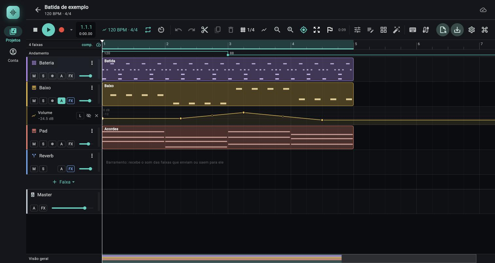

# Timeline e clipes

> A timeline é o arranjo da música: a régua no alto, uma linha por faixa com os clipes, o Master no fim e o minimapa embaixo. Use este capítulo para criar faixas, posicionar, cortar e reordenar clipes, marcar seções e mexer no painel de baixo.

## Onde fica

É a área central da tela do projeto (abra um projeto na lista). De cima para baixo:

1. A **barra do transporte** (ver [Transporte](02-transporte.md)); no celular ela fica embaixo.
2. A **régua** (30 px de altura), com o canto esquerdo mostrando a contagem de faixas (`1 faixa`, `2 faixas`...), `comp.` ou `mm:ss` e o botão de velocímetro que liga a faixa de andamento.
   Logo abaixo da régua, quando ligada, fica a faixa `Andamento` (22 px), que edita o mapa de andamento (ver [Faixa Andamento e mapa de compassos](#faixa-andamento-e-mapa-de-compassos)).
3. A **lista de faixas**: à esquerda os cabeçalhos (232 px no computador, 132 px no celular), à direita as raias com os clipes. As duas metades rolam juntas na vertical.
4. No fim da lista, a linha **Nova faixa** (44 px) e a linha do **Master**.
5. O **minimapa** `Visão geral` (28 px), fixo embaixo da lista.
6. O **painel de baixo** (dock), quando aberto: mixer, editor de notas, instrumento ou efeitos.

Um traço branco vertical com uma ponta triangular no alto marca o cursor de reprodução, sobre a régua e as raias.

## Controles

### Régua

| Controle | O que faz | Valores / padrão | Dica |
|---|---|---|---|
| Clique na régua | Posiciona o cursor naquele ponto, com encaixe na grade. | Encaixe da grade do transporte. | Alt não desliga o encaixe do clique; use a grade `Livre`. |
| Arrastar na régua | Desenha a região do loop (do ponto onde começou ao ponto onde soltou, com encaixe) e liga o loop. | Precisa de mais de 0,01 batida de largura; menor que isso não liga. Entra no desfazer como um passo. | Redesenhe para trocar a região; não há alças nas pontas dela. |
| Pontas vermelhas `IN` e `OUT` do punch (aparecem quando o projeto tem região de punch, ligada ou não; 14 px de largura por 18 px de altura, no alto da régua; tooltips `Punch in: arraste para mover` e `Punch out: arraste para mover`) | Arrastar na horizontal move a ponta, com o encaixe da grade (padrão `1/4`, uma batida) e sem passar do zero. A `IN` fica à direita do fio da região e a `OUT` à esquerda: as duas ficam dentro dela. O cursor do mouse vira setas para os lados | As pontas não se cruzam: a região tem no mínimo 0,05 batida. Ficam travadas gravando | A região é a do **punch** (gravar só um trecho, [03c](03c-gravacao.md#punch-inout)). Não tem relação com o loop: são duas regiões independentes, e o gesto de arrastar na régua fora das pontas continua desenhando o loop. Desligado, o punch continua marcado, esmaecido |
| Faixa vermelha do punch (na régua e sobre as raias) | Na régua: uma faixa translúcida com 3 px mais forte no alto, de ponta a ponta da região. Sobre as raias: um retângulo vermelho translúcido com um fio de 1 px em cada borda, que não pega cliques | Ligado: mais forte (10% de opacidade sobre as raias, 22% na régua, bordas a 80%); desligado: esmaecido (4%, 8% e 35%) | Serve para ver de relance o que uma gravação com punch vai guardar |
| Passar o mouse | Mostra um fio vertical e uma etiqueta com `compasso.tempo.dezesseis-avos · m:ss.d` do ponto sob o mouse. Com mapa de compassos e de andamento, a etiqueta usa as fórmulas de compasso e o tempo real de cada trecho. | | Só no computador. |
| Canto esquerdo (contagem de faixas, `1 faixa` ou `N faixas`, + `comp.` / `mm:ss`) | Clicar alterna a régua entre compassos e minutos:segundos. O tooltip é `Régua em compassos: clique para alternar` (ou `... minutos e segundos ...`). O texto em cor da marca é o modo atual. | Padrão: compassos. | O mesmo que **Régua em minutos e segundos** do menu Visão. |
| Botão de velocímetro (à direita do `comp.` / `mm:ss`, 28 px) | Mostra ou esconde a faixa `Andamento` sob a régua. Tooltips: `Mostrar a faixa de andamento` / `Esconder a faixa de andamento`. Aceso (na cor da marca) quando a faixa está à mostra. | Escondida num projeto sem mudanças de andamento; aparece sozinha ao abrir um projeto que já tem mapa (2 pontos ou mais). | Depois que você clica, a sua escolha manda até fechar o projeto; ela não é salva com o documento. |
| Números da régua | Em compassos: número do compasso (começa em 1); a régua pula números (a cada 2, 4, 8… compassos) quando o zoom diminui. Marcas de tempo aparecem a partir de 12 px por tempo do compasso. Onde o compasso muda (mapa de compassos), a fórmula (`3/4`, `6/8`…) aparece em cor da marca logo abaixo do número. Em mm:ss: rótulos a cada 0,5, 1, 2, 5, 10, 15, 30 s, 1, 2, 5, 10, 30 min ou 1 h, o menor passo que deixa 64 px entre rótulos (com mapa de andamento, o passo sai do andamento vigente à esquerda da janela e cada rótulo cai onde o segundo cai de fato). | | Em mm:ss, traços curtos embaixo continuam marcando os compassos. |
| Bandeirinhas de marcador | Ver a seção Marcadores e seções. | | |
| Selo **Contando…** | Aparece na régua, ao lado do cursor, durante a contagem antes de gravar. | | Com a contagem ligada e um pré-roll, ele dura até o ponto de gravar, incluindo o pré-roll (fase 17; a contagem fora do lugar, perto do início, faz exceção) |

Gravando (e na contagem), clicar e arrastar na régua não fazem nada: mexer no meio desalinharia a gravação. Isso inclui as pontas do punch.

A grade de fundo das raias mostra uma linha por compasso (mais forte) e, com 16 px ou mais por tempo do compasso, uma linha por tempo. Com mapa de compassos, as linhas seguem a fórmula de cada trecho (em 6/8 há uma linha por colcheia, a cada meia batida do projeto).

### Faixa Andamento e mapa de compassos

Até aqui o projeto tinha um andamento só. Agora o andamento pode mudar no meio da música (o **mapa de andamento**) e o compasso também (o **mapa de compassos**). Toda posição do projeto (clipes, notas, automação, marcadores, loop) continua contada em **batidas**; o mapa só decide quanto tempo real dura cada batida. Por isso notas, automação e clipes de notas acompanham as mudanças sozinhos. A batida do projeto é a semínima.

*Faixa Andamento sob a régua com dois pontos: 120 BPM no começo e 88 BPM a partir do compasso 3; o botão de andamento da barra mostra o BPM vigente no cursor com o ícone de tendência.*

**Onde fica.** A faixa `Andamento` (22 px) fica logo abaixo da régua, com o rótulo `Andamento` na coluna dos cabeçalhos. Ligue com o botão de velocímetro no canto esquerdo da régua (ver tabela da régua).

**O desenho.** Uma linha na cor da marca mostra o BPM ao longo da música, com um número (o BPM do ponto, `120`, `92,5`) ao lado de cada ponto e uma bolinha em cada ponto quando há mudanças. Trecho em **salto**: linha horizontal no BPM do ponto e degrau vertical no ponto seguinte. Trecho em **rampa**: reta diagonal do BPM de um ponto ao BPM do seguinte. A escala vertical vai do menor ao maior BPM dos pontos (no mínimo 20 BPM de faixa, centrada). Sem mudanças a linha fica apagada e aparece o texto `Duplo clique adiciona uma mudança de andamento`.

**Como os pontos funcionam.** Um ponto é uma batida e um BPM. O primeiro ponto fica sempre na batida 0 e é o **andamento inicial** (o mesmo `BPM` da janela **Andamento e compasso**); não sai do lugar nem pode ser apagado. Cada ponto diz como chega ao próximo: em **salto** (mantém o próprio BPM até a batida do próximo e ali muda de uma vez) ou em **rampa** (o BPM anda em reta, em função da batida, até o BPM do próximo). O último ponto vale até o fim da música; nele não há para onde rampar.

| Ação na faixa | O que faz | Valores / padrão | Dica |
|---|---|---|---|
| **Duplo clique** num lugar vazio | Cria um ponto na batida do clique, encaixada na grade (Alt apertado: livre), no BPM que já vale ali, em salto. Se já há ponto nessa batida, só iguala o BPM dele. `(testado só por testes automáticos; não exercitado no Chrome)` | Ponto até 10 px do clique conta como "sobre o ponto". | Depois mude o BPM do ponto. |
| **Duplo clique** sobre um ponto | Abre a janela `Andamento na batida N` (campo **BPM**, botão **Salvar**) para digitar o valor. `(testado só por testes automáticos; não exercitado no Chrome)` | 20 a 999, aceita vírgula ou ponto e decimais (`92,5`); vazio ou fora disso não faz nada. | O mesmo que **Digitar BPM…** do menu. |
| **Arrastar um ponto** na vertical | Muda o BPM do ponto: para cima sobe. | 0,5 BPM por pixel (2 px por BPM; 9 px valem 4 a 5 BPM), arredondado ao inteiro; **Alt** deixa 10 vezes mais fino e arredonda a 0,1. Limites 20 a 999. | O ponto só começa a mexer se o dedo ou o mouse tocou a menos de 10 px dele. |
| **Arrastar um ponto** na horizontal | Move o ponto no tempo, com encaixe na grade (**Alt**: livre). O ponto inicial não se move na horizontal. | Não passa dos vizinhos: fica a pelo menos 0,001 batida de cada um. | Um arraste inteiro (vertical e horizontal juntos) é **um** passo do desfazer. |
| **Botão direito** num ponto (no celular, toque longo) | Menu do ponto (tabela abaixo). | | |
| **Botão direito** num lugar vazio (toque longo) | Menu da faixa (tabela abaixo). A batida do ponto novo é a do clique, com encaixe na grade. | | |

Menu de um ponto:

| Item | O que faz | Habilitado |
|---|---|---|
| **Digitar BPM…** | Abre `Andamento na batida N` para digitar o BPM (20 a 999). | sempre |
| **Rampa até o próximo ponto** (vira **Salto até o próximo ponto** quando o trecho já é rampa) | Troca o trecho que sai deste ponto entre salto e rampa linear. | só se há ponto depois deste |
| **Apagar o ponto** | Remove o ponto; o trecho anterior passa a valer até o ponto que vinha depois. | só nos pontos depois do primeiro |

Menu de um lugar vazio da faixa:

| Item | O que faz | Habilitado |
|---|---|---|
| **Adicionar ponto aqui** | Cria um ponto na batida do clique (com encaixe), no BPM que já vale ali, em salto. | sempre |
| **Apagar todas as mudanças de andamento** | Remove todos os pontos menos o inicial; o andamento inicial fica. | só com mais de um ponto |

Todas essas edições entram no desfazer (como `Mudar andamento` e `Mudar compasso` no [histórico](02d-historico-e-versoes.md)). Gravando, a faixa não responde: mexer no andamento alteraria a gravação em andamento. Cada projeto guarda até 4096 pontos de andamento e 1024 mudanças de compasso (os mesmos limites do motor); o ponto ou a mudança que passaria disso não entra e o app avisa (`O mapa de andamento chegou ao limite de 4096 pontos.`; no de compassos, `O mapa de compassos chegou ao limite: o compasso inicial mais 1023 mudanças.`, que conta o compasso inicial como uma das 1024 entradas). O limite vale para o app, o motor, o espelho do servidor (o andamento inicial, de 20 a 999) e a importação de um `.jopendaw`. Uma importação de `.mid` também fica dentro desses limites: pontos que diferem menos de 0,05 BPM são fundidos (até 1024 pontos) e, quando o arquivo traz compassos além do limite, a importação avisa que cortou; o andamento entra com a fração (97,5 fica 97,5). Detalhes em [importar `.mid`](03-audio-e-clipes.md#importar-um-arquivo-midi-mid) `(testado só por testes automáticos)`.

**No botão de andamento da barra.** Com o cursor num trecho em rampa, o número do BPM ganha `↗` quando a rampa sobe (o ponto seguinte é mais rápido) e `↘` quando desce (o seguinte é mais lento); uma rampa entre dois pontos de mesmo BPM não mostra seta. Ver [Transporte](02-transporte.md).

**Rampa: o que acontece com o tempo.** O BPM muda em reta em função da batida, e o tempo real do trecho sai da conta exata (integral): `segundos = 60 × L ÷ (B − A) × ln(B ÷ A)` para `L` batidas indo de `A` a `B` BPM. Exemplo: 4 batidas indo de 60 a 120 BPM levam 4 × ln 2 ≈ 2,77 s (a 90 BPM constante levariam 2,67 s). `(testado só por testes automáticos)`

**Salto: o que acontece com o tempo.** Com 120 BPM até a batida 8 e 60 BPM depois, as 8 primeiras batidas levam 4,0 s (2 batidas por segundo) e dali em diante cada batida leva 1 s. Medido no motor da web pela sessão de código (relato). No Android, o mesmo projeto mostrou 60 BPM e `0:06,14` na batida 10 (relato da sessão de código; a conta exata dá 6,0 s na batida 10, então o cursor deve ter passado um pouco dela ao ser lido, `(não confirmado)`).

**Mapa de compassos.** Não tem faixa própria: edita-se pelo botão de texto do transporte, em **Mudar compasso a partir de um compasso…** (ver [Transporte](02-transporte.md#janela-mudar-compasso-a-partir-do-compasso-n)). Onde a fórmula muda, a régua mostra a nova fórmula em cor da marca, a numeração dos compassos continua de onde estava e a grade e o encaixe `Compasso` passam a seguir os novos compassos. `3/4` ocupa 3 batidas, `6/8` ocupa 3 (com um clique de metrônomo por colcheia), `7/8` ocupa 3,5, `5/4` ocupa 5.

**O que segue o mapa e o que não.**

| Recurso | Segue o mapa (de andamento ou de compassos)? |
|---|---|
| Notas e clipes de notas, automação, marcadores, loop, cursor, contador de posição, `Duração do projeto` | Sim (a posição é em batidas; o tempo real sai do mapa) |
| Metrônomo | Sim (intervalo pelo andamento; fórmula e tempo forte pelo mapa de compassos) |
| Clipes de áudio **sem warp** | Começam na batida deles e tocam em tempo real constante: a duração em segundos não muda, então a largura em batidas muda quando o mapa muda por baixo deles |
| Clipes de áudio **com warp** | Não: o áudio é esticado para o andamento **inicial** e toca a velocidade constante; se o clipe atravessa uma mudança, deixa de acompanhar a grade (o diálogo de warp avisa) |
| Delay, tremolo e filtro em modo `Andamento` | Não: usam só o andamento inicial |
| Gravação (áudio e notas), exportação, congelar faixa | Sim: a gravação usa o mapa que valia quando começou; exportar e congelar contam o tempo pelo mapa |
| Editor de notas (linhas e números de compasso da grade e da régua, `Shift`+← →, colar e duplicar), clipe de notas novo, gravação de notas (clipe que fecha em compasso), `Enquadrar`, escala do minimapa, encaixe `Compasso` e a conta de compassos do tooltip de `Duração do projeto` | Seguem o **mapa de compassos** (fase 12): compassos de 3 batidas em 3/4 e 6/8, de 3,5 em 7/8, mudanças no meio. O clipe já criado não muda de tamanho quando o mapa muda |

### Cabeçalho de faixa

O cabeçalho tem uma faixa de cor de 4 px na esquerda (a cor da faixa) e o medidor de pico de 6 px na direita. Tocar no cabeçalho seleciona a faixa (fundo mais claro). No computador:

| Controle (tooltip) | O que faz | Valores / padrão | Dica |
|---|---|---|---|
| Nome da faixa | Texto do nome. **Duplo toque** no cabeçalho (fora dos botões) abre a janela **Nome da faixa** (campo **Nome**, botão **Salvar**). | Até 60 caracteres; nome vazio é ignorado. | Novas faixas nascem `Áudio 1`, `Sintetizador 2`… com o próximo número livre do tipo. |
| Ícone do tipo (à esquerda do nome) | Nas faixas de instrumento, abre e fecha o painel do instrumento (tooltip `Sintetizador: abrir o instrumento (I)`, `Fechar o instrumento (I)`; o nome muda por tipo: Bateria, Sampler, FM, Wavetable). No barramento, abre os efeitos (`Barramento: abrir os efeitos` / `Fechar os efeitos`). Na faixa de áudio é só um ícone (tooltip `Faixa de áudio`). | Um ícone por tipo (tabela abaixo). | |
| **Opções da faixa** (três pontos) | Menu da faixa (tabela abaixo). | | |
| **M** (tooltip `Mudo`) | Silencia a faixa. Aceso em vermelho-salmão. | Desligado. | |
| **S** (tooltip `Solo`) | Toca só as faixas em solo. Aceso em amarelo. | Desligado. | |
| Bolinha de gravar (tooltips abaixo) | Arma a faixa para gravar. Contornada em vermelho quando armada; cheia enquanto grava de fato (depois da contagem). Barramento não tem o botão (fica um vão no lugar). | Desarmada. Não entra no desfazer. | Bloqueada durante a gravação (`Pare a gravação para armar esta faixa`). |
| **A** (tooltip `Automação` ou `Automação (N)`) | Abre o menu dos parâmetros automatizáveis da faixa; escolher um mostra a sub-raia dele embaixo da faixa (escolher um já aberto oculta). Aceso quando há sub-raia aberta; contornado quando há automação, mas oculta. O menu ainda tem `Mostrar as ocultas (N)` e `Ocultar todas`, e `Nada para automatizar aqui` quando não há alvo. | | Ver [Automação](07-automacao.md). |
| **FX** (tooltip `Efeitos` ou `Efeitos (N)`; aberto: `Fechar os efeitos`) | Abre e fecha o rack de efeitos da faixa. Aceso enquanto aberto; contornado quando a cadeia tem efeitos. | | Ver [Painel de efeitos](06c-painel-de-efeitos.md). |
| Mini fader (controle deslizante fino) | Volume da faixa. O tooltip mostra o valor em dB. Tocando com automação de volume, mostra o valor ao vivo na cor da automação. | −∞ a +6 dB (ganho 0 a 2, curva cúbica). | Um arraste é um passo do desfazer. Um toque longo que começa nele (ou a até 15 px acima ou abaixo dele e 4 px dos lados) não liga o reordenar da faixa ([Reordenar arrastando](#reordenar-arrastando)). Só no computador (com a janela abaixo de 800 px o cabeçalho não tem mini fader nem `FX`). **Grava automação de volume** como o fader do mixer, conforme o modo do botão `Automação` da barra (ou do seletor da raia `Volume`): em `Escrever`, `Toque` e `Trava`, arrastá-lo com a música tocando grava pontos na raia `Volume` da faixa (ver [07 Automação, Gravar automação](07-automacao.md#gravar-automação)); em `Ler`, muda só o valor fixo. |
| Barra fina no rodapé do cabeçalho | Nível da entrada, só na faixa de áudio armada. Sobe na hora, cai devagar; a ponta fica vermelha por 1,5 s se saturar. | Escala de −48 a 0 dB. | Ajuste o ganho do microfone por ele antes de gravar. |

No celular (barra de 132 px) o cabeçalho tem duas linhas: nome e três pontos em cima; ícone do tipo, M, S, gravar e A embaixo (botões de 20 px). O **FX** e o mini fader saem do cabeçalho: use o item **Efeitos** do menu ou o mixer.

Tooltips da bolinha de gravar: `Armar para gravar as notas (teclado ou MIDI)` (faixa de instrumento), `Armar para gravar a entrada de áudio` (faixa de áudio), `Desarmar`, e durante a gravação `Gravando nesta faixa` (armada) ou `Pare a gravação para armar esta faixa`.

#### Menu Opções da faixa (três pontos)

| Item | O que faz | Aparece / habilitado |
|---|---|---|
| **Abrir o instrumento** | Abre o painel do instrumento desta faixa. | Só em faixas de instrumento |
| **Efeitos** | Abre o rack de efeitos desta faixa. | Sempre |
| **Monitorar a entrada** (marcável) | Ouve o microfone passando pela cadeia da faixa enquanto você toca. Não entra no desfazer. | Só em faixa de áudio |
| **Renomear** | Abre a janela **Nome da faixa**. | Sempre |
| **Duplicar a faixa** | Cria uma cópia logo abaixo, com clipes, instrumento, efeitos, envios e automação (ids novos). O nome ganha `(2)`, depois `(3)`. A cópia sai desarmada e sem monitorar. Uma faixa de pasta é copiada para dentro da mesma pasta, com a mesma saída. | Sempre (a linha da pasta não tem este menu) |
| **Congelar em áudio** (legenda `Vira uma faixa de áudio nova; esta fica muda`) | Renderiza a faixa num áudio novo. Numa faixa de pasta, a faixa nova entra na mesma pasta, logo abaixo. Ver [Exportação](08-exportacao.md#congelar-uma-faixa). | Desligado, com o motivo na legenda: `Barramento não tem som próprio`, `A faixa está vazia`, `Pare a gravação antes` |
| **Mover para cima** / **Mover para baixo** | Troca a faixa de posição. | Desligado na primeira / na última |
| **Agrupar em pasta…** | Abre o diálogo `Agrupar em pasta` com esta faixa marcada. Ver [Pastas de faixa](02c-pastas-de-faixa.md#diálogo-agrupar-em-pasta). | Faixa fora de pasta (num barramento abre o aviso `Não dá para agrupar`) |
| **Tirar da pasta** | A faixa desce para logo depois da última faixa da pasta e a saída volta ao Master. Se a saída dela era a pasta, pede antes a confirmação `Tirar "Nome" da pasta?`. | Só em faixa que está numa pasta |
| **Mover para a pasta "Nome"** | Põe a faixa no fim da pasta `Nome` (a saída passa a ser a pasta). Um item por pasta que não seja a atual. Se a faixa saía para outro barramento, pede antes a confirmação `Mover "Nome" para a pasta "Pasta"?`. | Só em faixa de áudio ou de instrumento, e só se há pasta |
| **Trocar a cor** | Passa para a próxima cor da paleta (6 cores, em ciclo). | Sempre |
| **Apagar a faixa** | Apaga a faixa. Se tiver clipes, efeitos ou automação, pede confirmação: `Apagar "nome"?` — `A faixa e o que há nela (clipes, efeitos, automação) saem do projeto (dá para desfazer).` com **Apagar** / cancelar. Faixa vazia apaga direto. Apagar um barramento também remove os envios e saídas que apontavam para ele. | Sempre |

#### Reordenar arrastando

Segure o cabeçalho (toque longo; com o mouse, segure o botão por cerca de meio segundo) e arraste na vertical. Enquanto arrasta, o cabeçalho ganha borda colorida e o nome vira `Mover para a posição N`. Soltar move a faixa (as sub-raias de automação abertas vão junto com a faixa de cima). No dedo, um arraste simples, sem segurar, rola a lista. **O mini fader de volume tem prioridade sobre o reordenar:** um toque longo (ou o botão do mouse mantido) que **começa no mini fader, ou a até 15 px em volta dele**, não liga o reordenar e a faixa não muda de lugar; para reordenar, comece a segurar em outra parte do cabeçalho (o nome, por exemplo). Essa faixa de 15 px em volta do fader também vale sobre a borda do botão `FX` e sobre o medidor de nível ao lado dele. No celular o cabeçalho não tem mini fader, então a regra não se aplica lá. `(testado só por testes automáticos)`. Os itens **Mover para cima** e **Mover para baixo** do menu fazem o mesmo passo a passo.

A ordem das faixas é a ordem do sinal entre barramentos: se mover uma faixa faria um barramento apontar para trás, esse roteamento é desfeito (a faixa volta ao master e o envio sai). Sidechains de compressor e gate acompanham as faixas.

### Pastas de faixa (grupos)

Uma **pasta** organiza faixas de áudio e de instrumento sob um barramento de grupo: o volume, o mudo, o solo e os efeitos da pasta valem para todas as faixas dela (a saída de cada faixa vai para o barramento da pasta; os envios delas seguem como estavam). O capítulo completo, com todos os botões e menus, é o [02c Pastas de faixa](02c-pastas-de-faixa.md); aqui fica o que aparece na timeline.

- **Criar:** no menu da faixa (três pontos), **Agrupar em pasta…**. O diálogo (`Agrupar em pasta`) pede o nome (`Nome da pasta`) e deixa marcar as faixas (a faixa do menu já vem marcada; `Todas` marca tudo). A pasta nasce no lugar da primeira faixa marcada e as outras descem para logo abaixo dela; faixas que estavam no meio descem para depois do bloco. Uma faixa só também vale.
- **Linha da pasta:** um cabeçalho próprio, com seta (`Recolher a pasta` / `Expandir a pasta`), ícone de pasta, nome (duplo clique renomeia), três pontos (`Opções da pasta`), `M` e `S` do grupo, botão `Efeitos da pasta`, o texto `N faixas`, o volume do grupo e o medidor. Não tem `A` nem bolinha de gravar. As faixas da pasta ficam logo abaixo, com uma tira da cor da pasta à esquerda do cabeçalho. Recolhida, as faixas somem da lista (com as raias de automação abertas delas) e a linha da pasta mostra uma miniatura dos clipes delas. Recolher é estado do arranjo: fica salvo no projeto e não entra no desfazer.
- **Mudo e solo:** o mudo da pasta cala todas as faixas dela. O solo da pasta deixa soar as faixas dela (e o que a pasta alimenta); solo numa faixa da pasta deixa soar só ela e a pasta. Os envios das faixas para um retorno não passam pela pasta (ver [02c](02c-pastas-de-faixa.md#limites-e-pegadinhas)).
- **Dentro e fora:** arraste o cabeçalho de uma faixa (toque longo) para entre duas faixas da pasta, ou logo abaixo do cabeçalho dela, e ela entra (a saída passa a ser a pasta). Logo depois da última faixa já é fora. Uma pasta recolhida não engole a faixa: ela pula o bloco. O menu da faixa também tem **Tirar da pasta** e **Mover para a pasta "Nome"**. Mover a pasta (`Mover para cima` / `Mover para baixo` no menu dela; a linha da pasta não se arrasta) leva as faixas junto. O diálogo `Mover a faixa?` avisa quando a saída da faixa vai mudar (com o texto de pasta quando o motivo é só entrar ou sair de uma pasta).
- **Desagrupar…** (menu da pasta) pede confirmação. Sem efeitos, automação nem envios na pasta, as faixas voltam a sair no Master e o barramento some (fica, como barramento comum, só se outras faixas mandam para ele). Com efeitos, automação ou envios, o barramento fica e as faixas continuam saindo nele, para o efeito da pasta seguir no som. **Apagar a pasta (as faixas ficam)…** apaga a pasta com tudo o que há nela e deixa as faixas soltas, no Master.
- **Limites:** não há pasta dentro de pasta, e barramento de retorno não entra em pasta (o app avisa). Duplicar uma faixa da pasta põe a cópia na mesma pasta; a pasta em si não tem `Duplicar` no menu (ela some por `Desagrupar…` ou `Apagar a pasta (as faixas ficam)…`). No mixer, as faixas aparecem sob uma barra **Grupo** colorida, ao lado do canal da pasta.

### Nova faixa

A linha **Nova faixa** (botão `+ Faixa` com uma seta) fica logo depois da última faixa. O tooltip é `Nova faixa`. Toque e escolha o tipo. A faixa nova entra no fim da lista, já selecionada, com a próxima cor da paleta.

| Item do menu | Ícone | O que cria | Notas |
|---|---|---|---|
| **Áudio** | forma de onda | Faixa que recebe clipes de áudio (importados ou gravados). | Nome `Áudio N`. Pode ser armada (grava a entrada) e monitorada. |
| **Sintetizador** | piano | Faixa de notas com o sintetizador subtrativo. | Recebe clipes de notas. Ver [Sintetizador](04a-sintetizador.md). |
| **Bateria** | grade | Faixa de notas com a bateria de 12 peças. | Ver [Bateria](04b-bateria.md). |
| **Sampler** | nota musical | Faixa de notas que toca um áudio como instrumento. | Ver [Sampler](04c-sampler.md). |
| **FM** | pontos | Faixa de notas com o FM de 4 operadores. | Ver [FM](04d-fm.md). |
| **Wavetable** | ondas | Faixa de notas com o wavetable. | Ver [Wavetable](04e-wavetable.md). |
| **Barramento** (depois de uma linha divisória) | bifurcação | Faixa sem clipes que só recebe áudio de outras faixas (retornos de envio e grupos). | Não grava. O ícone dela abre os efeitos. Ver [Mixer](06-mixer.md). |

### Raias e clipes

| Ação | O que faz | Valores / padrão | Dica |
|---|---|---|---|
| Clique no vazio de uma raia | Desmarca o clipe, seleciona a faixa e posiciona o cursor, com encaixe (gravando, o cursor não se move). | | |
| **Duplo clique** no vazio de uma faixa de instrumento | Cria um clipe de notas e abre o editor. O clipe começa no início do compasso clicado, dura 1 compasso (do compasso clicado: com mapa de compassos, 3 batidas em 3/4, 3 em 6/8) e se encolhe para não montar em cima dos vizinhos (começa depois do anterior, termina antes do próximo). Nasce com o nome da faixa. | Duração: 1 compasso. | Em faixa vazia e desarmada aparece a dica `Clique duas vezes para criar um clipe de notas` (`Toque duas vezes ...` no celular). |
| Clique num clipe | Seleciona o clipe (borda branca) e a faixa dele. Só um clipe fica selecionado por vez. | | Selecionar um clipe de notas com o editor aberto troca o clipe do editor. |
| Arrastar o meio do clipe | Move o clipe. O começo encaixa na grade. Vertical: muda de faixa (o clipe de áudio só vai para faixa de áudio; o de notas, para faixa de instrumento; as sub-raias abertas contam como parte da faixa de cima). | Não passa do compasso 1 (começo em 0). | **Alt** desliga o encaixe. |
| Arrastar a borda esquerda | Apara o começo. No áudio, o som fica no lugar (o começo do trecho avança); no clipe de notas as notas ficam onde estavam na linha do tempo. | Áudio: não recua além do começo do arquivo; duração mínima 0,01 s. Notas: mínimo de um passo da grade (1/16 de batida em `Livre` ou com Alt). | Borda de 8 px (16 px com o dedo; num clipe estreito, um quarto da largura). |
| Arrastar a borda direita | Apara o fim. No áudio, estica até o fim do arquivo, no máximo. No clipe de notas, alonga ou encurta o clipe. | Mesmos mínimos. | O cursor do mouse vira setas nas bordas. |
| Arrastar o canto superior esquerdo (14 × 14 px) | Ajusta o fade in do clipe de áudio. O canto ganha uma bolinha branca; um sombreado e uma linha branca mostram a rampa, com a forma da curva escolhida. | 0 até a duração do clipe menos o fade out. Sem encaixe. | Só em clipe de áudio. Ver [Áudio e clipes](03-audio-e-clipes.md). |
| Arrastar o canto superior direito | Ajusta o fade out. | 0 até a duração menos o fade in. | |
| Menu do clipe: `Fade de entrada…` e `Fade de saída…` | Abrem o diálogo com o tamanho exato do fade, em milissegundos ou em batidas ([Áudio e clipes, Tamanho do fade por campo](03-audio-e-clipes.md#tamanho-do-fade-por-campo)). | | O arraste dos cantos continua valendo. |
| Menu do clipe: `Fade de entrada: …` e `Fade de saída: …` | Escolhe a curva de cada fade, em oito itens de menu (quatro por lado): `Fade de entrada: Suave (padrão)`, `… Potência constante`, `… Exponencial`, `… S (seno cosseno)` e os mesmos com `Fade de saída:`. O da curva atual leva a marca de visto; cada item tem um tooltip que diz o que a curva faz. A rampa desenhada no clipe (sombreado escuro e linha branca) segue a curva. | Padrão: `Suave (padrão)` (o envelope de sempre, `x²`; era rotulado `Linear` antes da fase 16). | Desfazível. `Potência constante` é a indicada para crossfade entre sons diferentes e `S (seno cosseno)` entre sons iguais; as fórmulas e a comparação estão em [Fades e crossfade](03-audio-e-clipes.md#fades-e-crossfade). |
| Menu do clipe: `Crossfade neste clipe` | Nos cruzamentos de borda **do clipe clicado** com outro clipe da mesma faixa, põe fade de saída no anterior e de entrada no posterior, com o tamanho da sobreposição e `Potência constante`, sem o teto de metade e por cima de fades postos à mão. Avisa o resultado na tela (`1 crossfade aplicado.`, `N crossfades aplicados.`). | Sem cruzamento, o aviso é `Este clipe não cruza a borda de outro clipe da faixa: não há crossfade a aplicar.` | Um passo do desfazer. |
| Menu do clipe: `Crossfade em toda a faixa` | O mesmo, para todos os pares de clipes da faixa que se cruzam pela borda. | Sem cruzamento, o aviso é `Nenhum clipe desta faixa cruza a borda de outro: não há crossfade a aplicar.` | Um passo do desfazer. |
| Botão direito, ou toque longo no celular | Abre o menu do clipe (tabelas abaixo). | | |
| Duplo clique num clipe de notas | Abre o clipe no editor. | | Em clipe de áudio não faz nada. |

**Nome exibido no clipe:** o de áudio mostra o nome do arquivo; o de notas, o nome do clipe (ou o da faixa, se vazio), com um ícone de lápis quando está aberto no editor. Clipe de áudio cujo arquivo não está neste aparelho fica avermelhado com o texto `áudio fora deste aparelho`.

**Selos no clipe de áudio:** um selo escuro com `W` (warp), `+3st` (semitons) e `R` (invertido), ou `processando…`, se houver processamento (tooltip `Warp e altura`, `Processando o warp…`, ou `O warp não ficou pronto: o clipe toca o original`); e `N tomadas` (só o número em clipe curto) para gravações em loop, com o tooltip `Tomada X de N: escolher outra`. Os selos somem em clipes muito estreitos (menos de 40 px o de warp, menos de 60 px o de tomadas).

#### Menu do clipe de áudio

| Item | O que faz |
|---|---|
| **Tomadas** (só com tomadas; mostra a quantidade) | Abre a lista `TOMADAS` (`Tomada 1`, `Tomada 2`…, a ativa marcada; `fora deste aparelho` nas que faltam). Escolher troca o áudio; posição, corte e fades ficam. Desfazível. |
| **Duplicar** (Ctrl+D) | Copia para logo depois. |
| **Cortar no cursor** (S) | Divide no cursor. |
| **Warp e altura…** | Abre a janela de warp. Ver [Warp e altura](03b-warp-e-altura.md). |
| **Ganho do clipe…** | Abre o diálogo `Ganho do clipe`: um controle deslizante em dB só para este clipe (−40 a +12 dB, `−∞ dB (mudo)` no piso), o botão `Zerar (0 dB)` e o botão `Fechar`. O som e o desenho da onda mudam na hora (com ganho alto a onda passa da altura e é **cortada na área dela**, que começa logo abaixo da faixa do nome do clipe: ela não invade o nome); cada arraste do controle é um passo do desfazer. Ver [Áudio e clipes](03-audio-e-clipes.md#ganho-do-clipe). |
| **Editar áudio** (setinha `>`) | Abre um segundo menu, no mesmo ponto, com **Dividir por transientes…**, **Remover silêncio…**, **Normalizar clipe…** e **Quantizar por fatias…**. Cada um abre um diálogo com prévia sobre a onda e aplica numa edição só (um passo do desfazer); o arquivo de áudio nunca muda. Os três que cortam recusam clipe com warp, transposição ou inversão. Ver [Editar áudio](03e-editar-audio.md). |
| **Fade de entrada…** / **Fade de saída…** | Abrem o diálogo do tamanho do fade (`ms` ou `batidas`). Ver [Áudio e clipes](03-audio-e-clipes.md#tamanho-do-fade-por-campo). Desfazível. |
| **Fade de entrada: Suave (padrão) / Potência constante / Exponencial / S (seno cosseno)** | Quatro itens com marca de visto no atual: escolhem a curva do fade de entrada. Ver [Áudio e clipes](03-audio-e-clipes.md#fades-e-crossfade). Desfazível. |
| **Fade de saída: Suave (padrão) / Potência constante / Exponencial / S (seno cosseno)** | Os mesmos quatro, para o fade de saída. |
| **Crossfade neste clipe** | Faz crossfade (saída no anterior, entrada no posterior, do tamanho do trecho em comum, `Potência constante`) nos cruzamentos de borda deste clipe com outros da faixa. Diz na tela quantos foram aplicados. Um passo do desfazer. |
| **Crossfade em toda a faixa** | O mesmo, em todos os pares de clipes da faixa que já se cruzam pela borda. |
| **Converter em notas (MIDI)** | Cria uma faixa de sintetizador com as notas detectadas no áudio. Ver [Áudio para MIDI](03d-audio-para-midi.md). |
| **Apagar** (Delete) | Apaga o clipe. |

#### Menu do clipe de notas

| Item | O que faz |
|---|---|
| **Abrir no editor** (E) | Abre o clipe no piano roll. |
| **Renomear** | Janela **Nome do clipe** (campo **Nome**, sugestão com o nome da faixa, até 60 caracteres, **Salvar**). |
| **Duplicar** (Ctrl+D) | Copia para logo depois; o editor aberto passa para a cópia. |
| **Cortar no cursor** (S) | Divide no cursor; uma nota que cruza o corte vira duas. |
| **Apagar** (Delete) | Apaga o clipe. |

Os atalhos do menu são escritos `Ctrl` mesmo no Mac (vale o Cmd).

### Cortar, duplicar, apagar e sobreposição

- **Cortar (S):** com um clipe selecionado, divide só ele, se o cursor estiver dentro dele. Sem seleção, divide todos os clipes que o cursor cruza na faixa selecionada. As duas metades ficam com o mesmo som; o fade in fica na esquerda e o fade out, na direita.
- **Duplicar (Ctrl+D):** a cópia começa onde o original termina e fica selecionada.
- **Apagar (Delete ou Backspace):** apaga o clipe selecionado e deixa o vão.
- **Copiar e colar clipes:** a timeline não tem (Ctrl+C e Ctrl+V só existem no piano roll, para notas). Use Duplicar.
- **Crossfade automático:** ao terminar um arraste (mover ou aparar), se o clipe que você mexeu só cruza a borda de outro (entra na cauda ou na cabeça dele, cobrindo no máximo metade do menor dos dois e sem passar por fades que você mesmo pôs), o outro não é cortado: o anterior ganha fade de saída e o posterior fade de entrada, do tamanho da sobreposição e com curva de potência constante. Mover o clipe de novo até a sobreposição sumir, ou apagar um dos dois clipes, devolve esses fades ao que eram; um fade que você ajustou ou cuja curva escolheu deixa de ser automático. Nos outros casos vale a regra abaixo. Exemplo a 120 BPM, com dois clipes de 4 s na mesma faixa: soltar o segundo na batida 6 dá 2 batidas (1 s) de sobreposição, que é menos que o teto de 2 s (metade de 4 s), então vira crossfade de 1 s; soltar na batida 2 dá 3 s, passa do teto, e o primeiro é aparado como sempre. Todas as condições, o comando do menu e o passo a passo estão em [Áudio e clipes, Fades e crossfade](03-audio-e-clipes.md#fades-e-crossfade).
- **Sobreposição:** exceto no crossfade acima, um clipe nunca toca somado com outro da mesma faixa. Ao terminar um arraste (mover ou aparar) e ao duplicar, o clipe que você mexeu fica por cima e o que ele cobre dos outros é cortado: o outro encurta, perde o começo, é partido em dois (se o seu clipe cai no meio dele) ou some (se fica todo coberto). Tudo isso é um passo só do desfazer. Áudio e notas seguem a mesma regra. Nos pedaços que sobram, o fade do lado cortado é zerado; só quando o seu clipe cobre o fim de outro, o fade de saída desse outro apenas é limitado ao novo tamanho.

### Rolagem e zoom

| Gesto | O que faz | Dica |
|---|---|---|
| Roda do mouse (vertical) | Rola a lista de faixas para cima e para baixo. | Cabeçalhos e raias rolam juntos. |
| **Shift** + roda, ou roda horizontal / trackpad de lado | Rola a linha do tempo na horizontal. | |
| **Ctrl** (ou Cmd) + roda | Zoom com centro no ponto do mouse. | Fator de 1,0015 por unidade de roda; 4 a 800 px por batida. |
| Arrastar no vazio das raias (mouse ou dedo) na horizontal | Rola a linha do tempo. | No dedo, é o jeito principal de andar pelo projeto. |
| Arrastar na vertical (dedo) | Rola a lista de faixas. | |
| Botões **Afastar** e **Aproximar**, teclas − e +, Z e Shift+Z | Zoom e enquadramento. | Ver [Transporte](02-transporte.md). |

Não há zoom de pinça com dois dedos: no celular use os botões **Afastar** e **Aproximar**.

### Altura das faixas

O menu **Visão** da barra (tooltip `Visão: enquadrar, altura das faixas, seguir o cursor`) escolhe **Faixas pequenas**, **Faixas médias** ou **Faixas grandes** (itens marcáveis; um fica marcado, o padrão é `Faixas médias`). Os itens não trazem sigla nem atalho de teclado. A altura da faixa é 76 px (computador) ou 64 px (celular) vezes 0,7, 1 ou 1,5. As sub-raias de automação têm altura própria e não mudam (testado só por testes automáticos; a contagem de faixas no plural também).

### Master

A linha **Master** (ícone de alto-falante) fica no fim da lista, depois da linha Nova faixa, e rola com ela (não fica fixa na tela). Tem faixa de cor cinza-clara e:

| Controle | O que faz | Valores | Dica |
|---|---|---|---|
| **A** (`Automação`) | Automação do master (volume, pan e parâmetros dos efeitos dele). | | Ver [Automação](07-automacao.md). |
| **FX** (`Efeitos`) | Abre a cadeia de efeitos do master. | | Ver [Painel de efeitos](06c-painel-de-efeitos.md). |
| Mini fader (só no computador) | Volume do master; o tooltip mostra os dB. | −∞ a +6 dB | **Grava automação de volume** como o mini fader das faixas e o fader do canal `Master` no mixer ([06](06-mixer.md#master)): em `Escrever`, `Toque` e `Trava`, arrastá-lo com a música tocando grava pontos na raia `Volume` do master; enquanto grava, mostra o valor da sua mão, e não a curva (ver [07 Automação, Gravar automação](07-automacao.md#gravar-automação)). `(testado só por testes automáticos)` |
| Medidor de 6 px | Pico do master. | | |

O Master não tem M, S nem bolinha de gravar, e a raia dele não recebe clipes.

### Minimapa Visão geral

Uma faixa fina de 28 px embaixo da lista, com o rótulo `Visão geral` à esquerda (o nome acessível é `Visão geral do projeto`). Ela mostra o projeto inteiro numa linha por faixa: clipes na cor da faixa, a região do loop (sombreada, mais forte com o loop ligado), os marcadores (traços na cor deles), a janela visível (retângulo claro) e o cursor (traço branco).

| Ação | O que faz | Dica |
|---|---|---|
| Clicar | Leva a janela: o ponto clicado vira o centro do que você vê. | Não muda o zoom nem o cursor. |
| Arrastar na horizontal | Rola continuamente. | |

A escala do minimapa é o fim do arranjo mais 5% (no mínimo 4 compassos, contados pelo mapa de compassos), para dar para arrastar um pouco além do último clipe.

### Marcadores e seções

Marcadores são bandeirinhas na régua (etiqueta de até 96 px com o nome, haste de 1,5 px). Ficam ordenados e são salvos com o projeto.

| Ação | Como | O que faz |
|---|---|---|
| Criar | **M**, ou o item **Marcador no cursor (M)** do menu Seções | Marcador no cursor, com o nome `Marcador N` (N = quantidade + 1) e a primeira cor (âmbar). Se já há um ali (diferença menor que 1/1000 de batida), só o seleciona. |
| Criar pedindo o nome | **Shift+M** | Abre **Nome do marcador** (campo **Nome**, até 40 caracteres, **Salvar**). Se há marcador no cursor, renomeia; senão cria com esse nome. Cancelar ou nome vazio não faz nada. |
| Ir até ele | Clicar na bandeirinha | Leva o cursor ao marcador (e rola a janela se estiver fora) e o seleciona (borda branca). Gravando, o cursor não se move. |
| Mover | Arrastar a bandeirinha | Move com encaixe (Alt: livre). O arraste inteiro é um passo do desfazer, e só entra se o marcador andou. |
| Renomear | Duplo clique | Janela **Nome do marcador**. |
| Menu | Botão direito, ou toque longo | **Renomear**, **Loop desta seção** (leva o cursor ao marcador e faz loop da seção dele), seis bolinhas de cor (`Cor do marcador`: âmbar, vermelho, azul, verde, roxo, rosa) e **Apagar o marcador**. |
| Pular | **[** e **]** | Cursor no marcador anterior / seguinte. Sem marcador antes, `[` vai ao compasso 1. |

Tooltip da bandeirinha: `nome · posição` e `Arraste para mover · duplo clique renomeia · botão direito: menu`.

**Seções:** a seção de um marcador vai dele até o próximo marcador; a última vai até o fim do arranjo (o maior entre o último clipe, o último marcador e o fim do loop ligado). Antes do primeiro marcador não há seção. O menu **Seções e marcadores** da barra faz os loops de seção, entre marcadores e do clipe (ver [Transporte](02-transporte.md)). Todos ligam o loop e são um passo do desfazer; não funcionam gravando.

### Dock: o painel de baixo

O painel de baixo divide a altura com a timeline. Abre pelos botões da barra (X, E, I, F) ou pelas abas dele.

| Controle | O que faz | Valores / padrão | Dica |
|---|---|---|---|
| Aba **Mixer** (`Mixer (X)`) | Mostra o mixer. | | Em janela abaixo de 560 px todas as abas mostram só o ícone. |
| Aba **Editor** (`Editor de notas (E)`) | Piano roll. Abre no clipe de notas selecionado, se houver. | | |
| Aba **Instrumento** (`Instrumento da faixa (I)`) | Painel do instrumento; o ícone é o do tipo da faixa selecionada. | | |
| Aba **Efeitos** (`Efeitos da faixa (F)`) | Cadeia da faixa selecionada (master se não há faixa). Clicar nela com o painel já em Efeitos não troca o que está à vista (por exemplo, o master aberto pelo mixer). | | |
| Texto de contexto (à direita das abas) | Diz de quem o painel fala: `clipe · faixa` no editor (`Nenhum clipe aberto` sem clipe); `faixa · tipo` no instrumento (`faixa de áudio, sem instrumento` / `barramento, sem instrumento`); `faixa · N efeitos` (`sem efeitos`, `1 efeito`) nos efeitos, ou `Master · ...`. Bolinha na cor da faixa. | | |
| **Maximizar o painel** / **Restaurar a altura** (seta para cima/baixo; só no computador) | Alterna entre a altura atual e a altura máxima. | | |
| **Fechar o painel (Esc)** (X) | Fecha o painel. | | |
| Alça no topo (barra fina de 6 px) e área vazia da barra de abas | Arrastar na vertical redimensiona o painel; duplo clique na alça maximiza e restaura. A alça acende ao passar o mouse. | Altura padrão: metade do espaço disponível, mínimo 320 px. Mínima 230 px; a timeline mantém ao menos 150 px. | A altura escolhida vale até fechar o app. |

No celular o painel ocupa sempre 60% do espaço, sem alça nem botão de maximizar.

## Passo a passo

**Criar uma faixa de instrumento e um clipe de notas**
1. Na linha **Nova faixa**, toque e escolha **Sintetizador**.
2. Dê duplo clique numa parte vazia da raia, no compasso que quiser. Nasce um clipe de 1 compasso e o editor abre.
3. Escreva as notas no piano roll ([Piano roll](05-piano-roll.md)).

**Cortar uma parte e apagar**
1. Toque no clipe para selecioná-lo.
2. Clique na régua no ponto do corte e aperte S.
3. Selecione a metade que sobra e aperte Delete. O vão fica; arraste o clipe seguinte para fechá-lo.

**Repetir um trecho**
1. Selecione o clipe e aperte Ctrl+D várias vezes: cada cópia sai colada no fim da anterior.
2. Se uma cópia cai sobre outro clipe, o outro é aparado sozinho.

**Organizar a música em seções**
1. Ponha o cursor no começo do refrão e aperte Shift+M; digite `Refrão`.
2. Repita para cada parte.
3. Abra **Seções e marcadores** e escolha um marcador para ir até ele, ou **Loop desta seção** para ensaiar a parte.

**Reordenar uma faixa**
1. Segure o cabeçalho da faixa até ele ganhar uma borda colorida (comece a segurar no nome ou num espaço vazio, a mais de 15 px, acima ou abaixo, e 4 px, dos lados, do mini fader de volume: por cima dele o toque longo não reordena).
2. Arraste para cima ou para baixo (o texto mostra `Mover para a posição N`) e solte.

**Mudar o andamento no meio da música (salto)**
1. Ligue a faixa: botão de velocímetro no canto esquerdo da régua (tooltip `Mostrar a faixa de andamento`).
2. Ajuste a grade para `Compasso` no menu do transporte, para o ponto cair no começo de um compasso.
3. Botão direito na faixa `Andamento`, no compasso onde o andamento muda: **Adicionar ponto aqui**.
4. Botão direito no ponto novo, **Digitar BPM…**, digite o valor e **Salvar** (ou arraste o ponto na vertical).
5. Toque a partir de antes do ponto. O botão de andamento do transporte mostra o BPM vigente no cursor.

**Frear ou acelerar aos poucos (rampa)**
1. Ponha um ponto no começo do trecho (no BPM que já vale) e outro no fim, com o BPM que quer alcançar.
2. Botão direito no **primeiro** ponto, **Rampa até o próximo ponto**. A linha vira uma diagonal entre os dois.
3. Depois do segundo ponto o BPM dele continua valendo.

**Voltar a um andamento só**
1. Botão direito num lugar vazio da faixa `Andamento`: **Apagar todas as mudanças de andamento**. O andamento inicial fica. Ctrl+Z desfaz.

## Combina com

- [Transporte](02-transporte.md): grade, zoom, loop e enquadramento, que valem para tudo aqui, o botão de andamento e a janela **Mudar compasso a partir do compasso N**.
- [Mapa de andamento e de compassos na prática](../guias/mapa-de-andamento-e-compasso.md): virada de andamento, ritardando e trocas de compasso, com o que fazer com warp, delay e gravação.
- [Áudio e clipes](03-audio-e-clipes.md): importar, fades e as propriedades do clipe de áudio.
- [Warp e altura](03b-warp-e-altura.md), [Áudio e clipes](03-audio-e-clipes.md#ganho-do-clipe) (`Ganho do clipe…`), [Editar áudio](03e-editar-audio.md) (`Editar áudio`) e [Áudio para MIDI](03d-audio-para-midi.md): itens do menu do clipe de áudio.
- [Piano roll](05-piano-roll.md): editar o clipe de notas.
- [Histórico e versões](02d-historico-e-versoes.md): cada gesto daqui (`Mover clipe`, `Aparar o início do clipe`, `Cortar clipe`, `Mudo`, `Solo`, `Adicionar marcador`…) vira um passo com nome no histórico do desfazer; as `Versões` guardam cópias do projeto para voltar depois.
- [Mixer](06-mixer.md), [Automação](07-automacao.md) e [Exportação](08-exportacao.md) (**Congelar em áudio**): botões do cabeçalho e do menu da faixa.
- [Pastas de faixa](02c-pastas-de-faixa.md): agrupar faixas sob um barramento, recolher e expandir, desagrupar. Guia: [organizar um projeto com pastas](../guias/organizar-um-projeto-com-pastas.md).
- Receitas: pasta [`../guias/`](../guias/).

## Limites e pegadinhas

- **Um clipe selecionado por vez.** Não há seleção múltipla, laço de seleção nem mover vários clipes juntos.
- **Sem copiar e colar clipes** na timeline. O ganho de cada clipe de áudio se ajusta em `Ganho do clipe…` (menu do clipe); o volume da faixa continua à parte, no mini fader ou no mixer. O clipe de notas não tem esse item.
- **O único modificador de arraste é o Alt** (encaixe livre), nos clipes, marcadores e ao aparar. Shift e Ctrl não mudam o arraste; valem só na roda do mouse (Shift: horizontal, Ctrl: zoom) e nos atalhos.
- **Só o clipe que você mexeu é preservado numa sobreposição:** o cortado dos outros é apagado do arranjo (o desfazer traz de volta). Se quiser guardar as duas partes, mova o clipe para outra faixa. A exceção é o crossfade automático (travessia de borda de até metade do menor clipe, sem fade seu no lado do cruzamento), em que os dois clipes ficam inteiros e tocam juntos naquele trecho.
- **Áudio só muda para faixa de áudio; notas só para faixa de instrumento.** Soltar sobre outro tipo deixa o clipe na faixa de origem.
- **Gravando** ficam travados: clicar e arrastar na régua e nas raias (cursor), marcadores (ir até eles), loop e o botão de armar. Faixas armadas mostram uma região vermelha crescendo (`Gravando`, ou `Tomada N` gravando em loop).
- **Faixa só de barramento:** não tem clipes nem bolinha de gravar; a raia mostra `Barramento: recebe o som das faixas que enviam ou saem para ele`. A linha de uma pasta mostra `Pasta: o volume, o mudo e os efeitos dela valem para as faixas de baixo` (recolhida, a miniatura dos clipes).
- **Pasta recolhida esconde clipes e raias:** os clipes e as raias de automação das faixas dela não aparecem nem respondem a toque até expandir; o som e a automação continuam valendo ([02c](02c-pastas-de-faixa.md#recolher-e-expandir)).
- **Congelar em áudio numa faixa de pasta** cria a faixa nova dentro da mesma pasta, logo abaixo da original, com a saída dela ([02c, regras e limites](02c-pastas-de-faixa.md#regras-e-limites)).
- **A região do punch não é o loop.** As pontas `IN` e `OUT` (vermelhas) movem só o punch; o loop segue sem alças e só se redesenha arrastando na régua. Mover uma ponta do punch **não entra no desfazer** (o desenhar do loop entra).
- **Tudo daqui vai para o projeto** (faixas, clipes, marcadores, loop, região de punch, pontos de andamento e mudanças de compasso), exceto zoom, rolagem, altura das faixas, seleção, modo da régua e se a faixa `Andamento` está à mostra.
- **Mapa de andamento: o warp e os efeitos sincronizados não o seguem** (ver a tabela em [Faixa Andamento e mapa de compassos](#faixa-andamento-e-mapa-de-compassos)). Já o arquivo `.mid` leva e traz o mapa: a exportação escreve todos os pontos e mudanças de compasso (rampas em degraus de 1/16 de batida) e a importação, se você aceitar a pergunta `Usar os andamentos do arquivo (N mudanças, a partir de X BPM)?`, passa o mapa do arquivo para a faixa `Andamento` e para o mapa de compassos, sempre como saltos (a rampa não volta como rampa). Ver [Áudio e clipes](03-audio-e-clipes.md#importar-um-arquivo-midi-mid) e [Exportação](08-exportacao.md#notas-em-midi-mid).
- **Um clipe de áudio sem warp muda de largura** quando você mexe no mapa antes dele, porque o áudio dura o mesmo em segundos e a batida passou a durar outra coisa. Cortar (S), aparar e sobrepor clipes contam pelos segundos reais entre as batidas.
- **Web e Android:** o mesmo comportamento; no celular a seleção de clipes por toque usa bordas de 16 px, o menu do clipe abre com toque longo, e o duplo toque cria o clipe de notas.

## Atalhos

| Tecla / gesto | Ação |
|---|---|
| S | Cortar no cursor |
| Ctrl+D | Duplicar o clipe |
| Delete ou Backspace | Apagar o clipe |
| M | Marcador no cursor |
| Shift+M | Marcador pedindo o nome |
| `[` / `]` | Marcador anterior / seguinte |
| Shift+L | Loop no clipe (ou na seção do cursor) |
| Z / Shift+Z | Enquadrar tudo / o clipe selecionado |
| X, E, I, F, Esc | Alternar Mixer, Editor, Instrumento, Efeitos; fechar o painel |
| Alt ao arrastar | Encaixe livre |
| Ctrl + roda | Zoom no ponto do mouse |
| Shift + roda | Rolar na horizontal |
| Duplo clique na raia (faixa de instrumento) | Criar clipe de notas |
| Duplo clique no clipe de notas | Abrir no editor |
| Duplo clique no nome da faixa | Renomear |
| Duplo clique na bandeirinha | Renomear o marcador |
| Botão direito no clipe ou na bandeirinha | Menu de contexto |
| Duplo clique na faixa `Andamento` | Criar um ponto (no vazio) ou digitar o BPM (sobre um ponto) |
| Botão direito (ou toque longo) na faixa `Andamento` | Menu do ponto ou da faixa |
| Alt ao arrastar um ponto de andamento | Ajuste fino do BPM (0,1) e posição livre |
