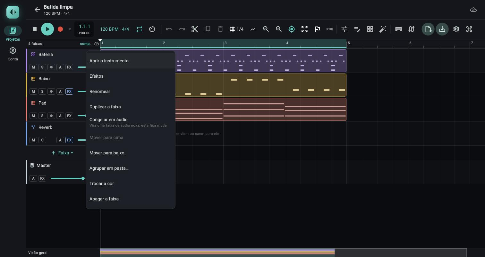
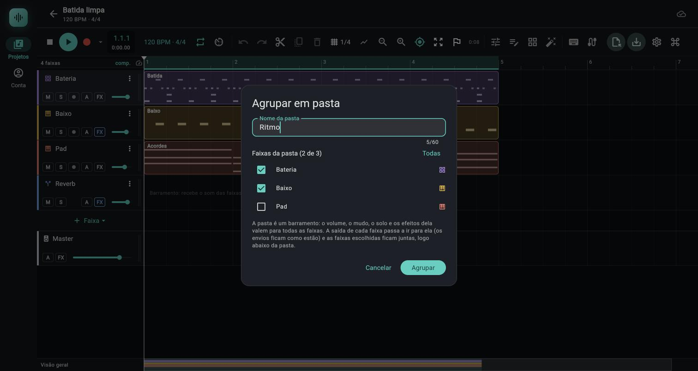
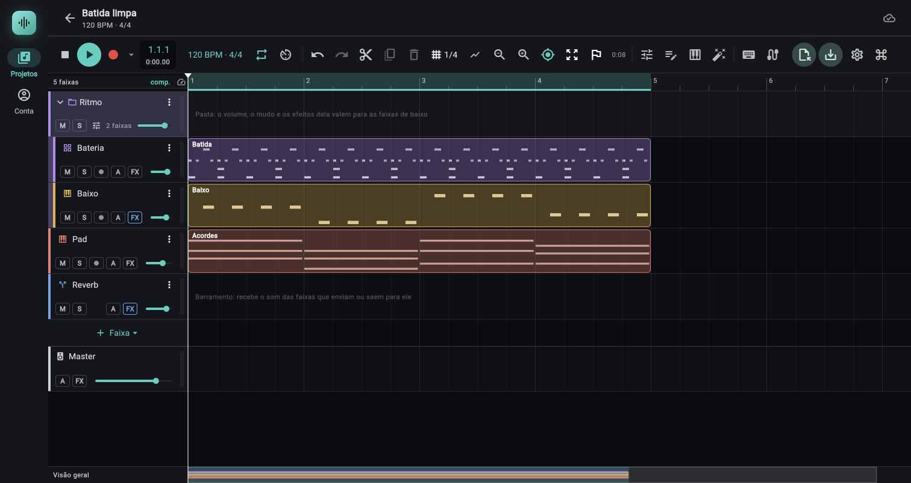
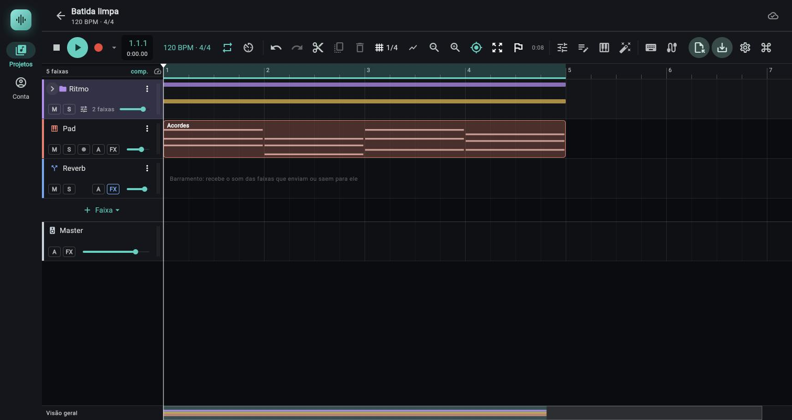

# Pastas de faixa

> Uma pasta reúne faixas de áudio e de instrumento sob um barramento de grupo: um volume, um mudo, um solo e uma cadeia de efeitos para o conjunto (a bateria inteira, o coro), e uma linha que recolhe as faixas quando o projeto fica grande. Use para tratar várias faixas como uma só e para navegar num arranjo comprido.

*O menu de três pontos de uma faixa: o item Agrupar em pasta… fica logo depois de Mover para baixo.*

*Diálogo Agrupar em pasta: o nome da pasta, as faixas que entram (aqui Bateria e Baixo, 2 de 3) e o botão Todas; o texto lembra que a pasta é um barramento.*

*A pasta Ritmo expandida: a linha da pasta (seta, ícone de pasta, M, S, Nº de faixas e volume) e as faixas filhas recuadas, com uma tira da cor da pasta.*

*A mesma pasta recolhida: as faixas filhas somem e seus clipes aparecem como faixas finas dentro da linha da pasta; o som continua saindo pelo grupo.*

Situação de teste deste capítulo: o comportamento vem da leitura do código (`app/lib/daw/track_groups.dart`, `track_groups_ui.dart`, `timeline.dart`, `mixer_panel.dart`) e de 34 testes automáticos (`app/test/track_groups_test.dart`). O exemplo `Ritmo` (bateria e baixo, `2 faixas`) é o relato da sessão de código. Nada aqui foi ouvido por quem escreve: os pontos de som estão marcados `(testado só por testes automáticos)` ou `(não confirmado)`.

## Onde fica

- **Criar:** menu de três pontos da faixa (`Opções da faixa`) na linha do tempo, item `Agrupar em pasta…` ([02b Timeline e clipes](02b-timeline-e-clipes.md#menu-opções-da-faixa-três-pontos)).
- **A pasta na linha do tempo:** uma linha própria de cabeçalho, com as faixas dela logo abaixo, recuadas ([Cabeçalho da pasta](#cabeçalho-da-pasta)).
- **A pasta no mixer:** um canal de barramento (fundo violeta), com uma barra `Grupo` colorida em cima dele e uma faixa mais clara em cima dos canais das faixas da pasta ([Mixer](#no-mixer)).
- **No celular** (janela abaixo de 800 px) a linha da pasta é menor: só a seta, o ícone, o nome, os três pontos, `M`, `S`, o botão de efeitos e o número de faixas. Não tem o texto `N faixas` nem o volume; o volume da pasta se ajusta no mixer.

## O que a pasta é

Por dentro a pasta é um **barramento** comum com uma marca de "grupo"; o motor de áudio não sabe de pastas ([dev/01 O motor](../dev/01-motor.md#roteamento-e-solo)). Ao agrupar, a **saída** de cada faixa passa a ser a pasta e as faixas escolhidas ficam juntas logo abaixo dela. Por isso tudo o que vale para um barramento vale para a pasta:

| Na pasta | Efeito |
|---|---|
| Volume (fader) | Muda o nível de tudo o que sai pelas faixas da pasta, depois dos faders delas. Vai de −∞ a +6 dB, como qualquer fader. |
| Mudo `M` | Cala o que passa pela pasta, isto é, todas as faixas dela. Os `M` das faixas não se mexem. |
| Solo `S` | Ver [Solo](#solo-da-pasta-e-solo-das-faixas). |
| Efeitos | A cadeia da pasta processa a **soma** das faixas (depois dos faders delas). Um compressor ali "cola" o conjunto. Abrir: botão de efeitos da linha da pasta, ou o ícone dela no mixer. |
| Pan | O canal da pasta no mixer tem o pan de um barramento (não há knob de pan na linha da pasta). |
| Envios das faixas | **Ficam como estavam.** Um envio de uma faixa da pasta para o retorno de reverb continua saindo da faixa, direto para o retorno. |
| Saída da pasta | Padrão `Master`; no mixer dá para mandá-la a outro barramento que venha **depois** dela na lista ([06 Mixer, ordem dos barramentos](06-mixer.md#como-o-som-corre-ordem-de-processamento)). |
| Automação | Volume e demais alvos de um barramento, como em qualquer barramento ([07 Automação](07-automacao.md)). |

## Controles

### Cabeçalho da pasta

| Controle (rótulo ou tooltip exato) | O que faz | Valores / padrão | Dica |
|---|---|---|---|
| Barra de cor na esquerda | A cor da pasta. As faixas dela ganham uma tira desta cor, mais fraca, à esquerda do cabeçalho. | Cor da primeira faixa agrupada. | No celular a tira das faixas vira uma borda fina de 2 px dentro da barra da faixa. |
| Seta (tooltip `Recolher a pasta` / `Expandir a pasta`) | Recolhe ou expande a pasta. | Nasce expandida. | Ver [Recolher e expandir](#recolher-e-expandir). |
| Ícone de pasta | Pasta aberta quando expandida, fechada quando recolhida. Só decora. | | |
| Nome | Texto do nome. **Duplo clique** abre `Nome da pasta` (campo `Nome`, botão `Salvar`). | Até 60 caracteres; nome vazio é ignorado. | O mesmo que `Renomear` do menu. |
| **Opções da pasta** (três pontos) | Menu da pasta (tabela abaixo). | | |
| **M** (tooltip `Mudo da pasta (cala todas as faixas dela)`) | Liga e desliga o mudo do barramento da pasta. | Desligado. Aceso em vermelho-salmão. | Entra no desfazer como qualquer `M`. |
| **S** (tooltip `Solo da pasta (deixa soar só as faixas dela)`) | Liga e desliga o solo do barramento da pasta. | Desligado. Aceso em amarelo. | Ver [Solo](#solo-da-pasta-e-solo-das-faixas). |
| Botão de efeitos (tooltip `Efeitos da pasta`) | Abre o painel `Efeitos` na pasta; tocar de novo com ele aberto fecha o painel. O ícone fica na cor da pasta quando a cadeia tem efeitos. | | Ver [06c Painel de efeitos](06c-painel-de-efeitos.md). |
| Texto `N faixas` (`0 faixas`, `1 faixa`, `2 faixas`…) | Quantas faixas a pasta tem. No celular aparece só o número. | | Conta as faixas mesmo com a pasta recolhida. |
| Volume da pasta (controle deslizante; tooltip `Volume da pasta: X dB`) | Volume do barramento da pasta. | −∞ a +6 dB (ganho 0 a 2, curva cúbica), como o fader das faixas. Só no computador. | Um arraste é um passo do desfazer. Com a música tocando e o botão `Automação` em `Escrever`, `Toque` ou `Trava`, arrastá-lo **grava automação de volume** da pasta ([07 Automação, Gravar automação](07-automacao.md#gravar-automação)). Com automação de volume lendo, a bolinha anda na cor da automação. |
| Medidor de 6 px na direita | Pico da pasta (o barramento), depois do fader e do mudo. | Escala de −48 a 0 dB. | Mesmo com a pasta recolhida ele mostra o som que sai pelo grupo. |
| Tocar no cabeçalho | Seleciona a pasta. | | Com a pasta selecionada, `F` abre os efeitos dela. |

A linha da pasta **não tem** os botões `A` (automação), armar para gravar nem o mini fader de faixa comum. No espaço das raias, com a pasta expandida, aparece a dica `Pasta: o volume, o mudo e os efeitos dela valem para as faixas de baixo`; recolhida, no lugar da dica ficam as miniaturas dos clipes.

### Menu Opções da pasta (três pontos)

| Item | O que faz | Aparece / habilitado |
|---|---|---|
| `Recolher a pasta` (vira `Expandir a pasta`) | O mesmo que a seta. | Sempre |
| `Recolher todas as pastas` | Recolhe todas as pastas do projeto. | Só com **mais de uma** pasta |
| `Expandir todas as pastas` | Expande todas. | Só com mais de uma pasta |
| `Renomear` | Abre `Nome da pasta`. | Sempre |
| `Trocar a cor` | Passa a pasta para a próxima cor da paleta (6 cores, em ciclo). As cores das faixas dela não mudam; só a tira de recuo delas acompanha a pasta. | Sempre |
| `Mover para cima` / `Mover para baixo` | Move a pasta **com as faixas dela** uma posição. Se ela cairia dentro de outra pasta, o bloco todo pula para fora dela. | Desligado na primeira / na última faixa do projeto |
| `Desagrupar…` | Pede confirmação e desfaz a pasta ([abaixo](#desagrupar)). | Sempre |

A linha da pasta não se arrasta (o reordenar por toque longo é só do cabeçalho de faixa): para mover a pasta use `Mover para cima` e `Mover para baixo`. Não há `Apagar` nem `Duplicar` no menu da pasta: para tirá-la do projeto use `Desagrupar…`.

### Itens de pasta no menu da faixa

No menu de três pontos de uma faixa ([02b](02b-timeline-e-clipes.md#menu-opções-da-faixa-três-pontos)), entre `Mover para baixo` e `Trocar a cor`:

| Item | O que faz | Aparece |
|---|---|---|
| `Agrupar em pasta…` | Abre o diálogo abaixo com esta faixa já marcada. Numa faixa que **não pode** entrar, abre o aviso `Não dá para agrupar` (botão `Entendi`). | Faixa fora de pasta |
| `Tirar da pasta` | A faixa desce para logo depois da última faixa da pasta e a saída dela volta ao `Master`. | Faixa que está numa pasta |
| `Mover para a pasta "Nome"` | Coloca a faixa no **fim** da pasta `Nome` (a saída passa a ser a pasta). Uma faixa que estava em outra pasta sai dela. Um item por pasta que não seja a atual; vale também para pasta recolhida. | Só em faixa de áudio ou de instrumento |

Os avisos do diálogo `Não dá para agrupar`:

| Faixa | Mensagem |
|---|---|
| Barramento | `Só faixas de áudio e de instrumento entram numa pasta: "Nome" é um barramento.` |
| Pasta | `Não há pasta dentro de pasta nesta versão: "Nome" é uma pasta.` (o menu da pasta não tem `Agrupar em pasta…`; a mensagem existe no código, sem caminho pela interface `(lido do código)`.) |
| Faixa que já está em pasta | `"Nome" já está na pasta "Pasta". Tire-a de lá antes.` (o menu dela mostra `Tirar da pasta` no lugar; a mensagem aparece se a faixa já estiver marcada no diálogo por outro caminho `(lido do código)`.) |

### Diálogo Agrupar em pasta

| Controle (rótulo exato) | O que faz | Valores / padrão | Dica |
|---|---|---|---|
| `Nome da pasta` (campo) | Nome da pasta nova. | Até 60 caracteres. Vem preenchido com `Pasta N` (o próximo número livre; vazio também vira `Pasta N`). | Enter confirma, se houver faixa marcada. |
| `Faixas da pasta (N de M)` | Contador das faixas marcadas contra as que podem entrar. | | |
| `Todas` (vira `Nenhuma` com tudo marcado) | Marca ou desmarca todas as faixas da lista. | | Desabilitado sem faixas livres. |
| Caixas de faixa (ícone do tipo, cor e nome) | Escolhem as faixas da pasta. A lista traz só faixas de **áudio e de instrumento fora de pasta**. | A faixa do menu já vem marcada. | Podem ser faixas distantes na lista. |
| Texto de ajuda | `A pasta é um barramento: o volume, o mudo, o solo e os efeitos dela valem para todas as faixas. A saída de cada faixa passa a ir para ela (os envios ficam como estão) e as faixas escolhidas ficam juntas, logo abaixo da pasta.` | | |
| Lista vazia | `Não há faixa livre para agrupar: só faixas de áudio e de instrumento fora de pasta entram.` | | |
| `Cancelar` | Fecha sem criar. | | |
| `Agrupar` | Cria a pasta. Desabilitado sem nenhuma faixa marcada. | Uma faixa só vale. | Um passo só no desfazer. |

Ao agrupar: a pasta nasce **no lugar da primeira faixa marcada** (na ordem da lista) e as outras vêm para baixo dela, contíguas; as faixas que estavam no meio, sem marcar, descem para depois do bloco. A cor da pasta é a da primeira faixa marcada. A pasta fica selecionada.

### Desagrupar

`Desagrupar…` abre a confirmação `Desagrupar "Nome"?` com o texto `N faixas da pasta continuam no projeto e voltam a sair direto no Master. O barramento da pasta some; se ele tiver efeitos, automação ou receber de outras faixas, fica como um barramento comum. Dá para desfazer.` e os botões `Cancelar` e `Desagrupar` (vermelho).

- As faixas ficam onde estão, sem pasta, e as que saíam para a pasta voltam ao `Master`. **Não voltam à saída que tinham antes de agrupar** (por exemplo, um retorno).
- O barramento da pasta é apagado se **não tem** efeitos, pontos de automação, envios próprios, nem recebe de outras faixas (por saída ou por envio).
- Se tem qualquer um desses, ele **fica** como barramento comum, expandido, no mesmo lugar; as faixas que estavam na pasta já não saem nele, então o efeito da pasta deixa de processar o grupo (o barramento fica sem entrada, a não ser que você religue as saídas).
- Um passo só no desfazer.

## Recolher e expandir

Recolher esconde as faixas da pasta da linha do tempo para deixar o arranjo curto.

| O que muda com a pasta recolhida | Detalhe |
|---|---|
| Linhas das faixas | Somem, **junto com as raias de automação abertas nelas** (elas voltam ao expandir, como estavam). |
| Clipes | Não são desenhados nas faixas escondidas, e não dá para tocá-los. A linha da pasta mostra uma **miniatura**: uma faixinha por faixa da pasta, na cor dela, com um retângulo para cada clipe de áudio e de notas, seguindo o zoom e a rolagem. A miniatura não recebe toques. |
| Retângulo da gravação | Não aparece nas faixas armadas escondidas `(lido do código; a gravação em si não foi testada com a pasta recolhida)`. |
| Som | Nada muda: as faixas seguem tocando e o medidor da pasta mostra o grupo. |
| Mixer | Continua com todos os canais e a barra `Grupo` ([abaixo](#no-mixer)). |
| Seleção | Se a faixa selecionada ficou escondida, a seleção passa para a pasta. |
| Salvo | O estado fica **salvo no projeto** e vai para os outros aparelhos com ele. |
| Desfazer | **Não entra no desfazer**, e desfazer outra coisa não expande nem recolhe pasta nenhuma. |

## No mixer

- Quando o projeto tem ao menos uma pasta, todos os canais ganham no alto uma faixa de 14 px (o painel cresce essa altura; o canal do `Master` ganha só o vão).
- Sobre o canal da pasta: barra da cor dela com o rótulo `Grupo`. Sobre cada canal de faixa da pasta: barra da mesma cor, mais fraca e sem texto, que se emenda à da pasta e fecha com ponta arredondada na última faixa.
- O canal da pasta é o de um barramento: efeitos, envios, pan, fader, `M`, `S`, saída, nome. O ícone dele é uma pasta e o tooltip é `Grupo` (`Grupo: abrir os efeitos`, ao tocar no ícone). Não tem botão de armar nem de monitorar.
- Recolher a pasta na linha do tempo **não** tira os canais das faixas do mixer.
- Sem pasta nenhuma a barra não existe.

Ver também [06 Mixer](06-mixer.md).

## Solo da pasta e solo das faixas

O solo é o do motor, e vale a mesma regra dos barramentos ([06 Mixer, solo e mudo](06-mixer.md#solo-e-mudo)):

| Solo em… | Soa | Cala |
|---|---|---|
| A pasta (`S` da linha da pasta) | A pasta, **todas** as faixas dela e o que a pasta alimenta (o `Master`, ou o barramento de saída dela). | Tudo o que não passa por ali. |
| Uma faixa da pasta | Só essa faixa, a pasta (com o fader e os efeitos dela) e o que elas alimentam, inclusive o retorno de reverb ligado por envio dessa faixa. | As **outras faixas da pasta** e o resto do projeto. |
| Duas faixas da pasta | As duas e a pasta. | O resto. |
| Uma faixa fora da pasta | Essa faixa e o que ela alimenta. | A pasta e todas as faixas dela (a menos que alimentem um barramento em solo). |

Mudo e solo juntos na mesma pasta ficam mudos: o mudo vence. `(testado só por testes automáticos)`: o Dart manda `M` e `S` da pasta ao motor no índice dela, e a regra do solo em barramento tem teste no motor (`solo_com_barramentos`); ninguém ouviu uma pasta em solo.

## Regras e limites

- **Só faixas de áudio e de instrumento entram.** Barramentos (como o retorno `Reverb`) não entram, e **não há pasta dentro de pasta**.
- **Uma faixa está em uma pasta só.** Para trocar de pasta use `Mover para a pasta "Nome"` (ou arraste).
- **As faixas da pasta ficam juntas**, logo abaixo dela; a ordem entre elas é a da lista, e a pasta vem sempre acima.
- **Arrastar** uma faixa (toque longo no cabeçalho): largar **logo abaixo da pasta ou entre duas faixas dela** a põe na pasta (a saída passa a ser a pasta); largar **logo depois da última faixa** já é fora e, se a saída era a pasta, ela volta ao `Master`. Uma **pasta recolhida não recebe faixa por arraste**: a faixa pula o bloco (por isso `Mover para baixo` não esconde faixa sem querer). Um barramento largado ali também pula para fora.
- **Mover a pasta** leva as faixas junto e nunca a deixa cair dentro de outra pasta.
- **Ordem do sinal:** a pasta é um barramento, então só manda para barramentos **abaixo** dela na lista; as faixas normais podem sair nela mesmo estando acima ou abaixo. Se mover (a pasta ou uma faixa) fizer uma rota se perder, abre `Mover a faixa?` com as linhas do que muda ([06 Mixer](06-mixer.md#como-o-som-corre-ordem-de-processamento)). Quando a faixa entra numa pasta e tinha outra saída, ou sai de uma pasta, o diálogo lista também: `a saída de "Faixa" para "Retorno" (passa a ir para a pasta "Pasta")` e `a saída de "Faixa" para a pasta "Pasta" (volta ao master)`.
- **Duplicar** uma faixa da pasta põe a cópia na mesma pasta, logo abaixo, com a mesma saída. A pasta em si não se duplica (não há o item).
- **Apagar** uma faixa da pasta tira só ela; a pasta continua, mesmo vazia (`0 faixas`). Apagar o barramento da pasta solta as faixas com a saída no `Master` (só é possível depois de `Desagrupar…` com o barramento mantido).
- **Limite do motor de 16 efeitos** por cadeia vale para a pasta.

## Passo a passo

### Agrupar a bateria e o baixo

Modelo: um projeto com `Bateria 1`, `Baixo` (ou qualquer faixa de instrumento) e outras faixas.

1. No cabeçalho de `Bateria 1`, abra o menu de três pontos e escolha `Agrupar em pasta…`.
2. No campo `Nome da pasta`, apague o `Pasta 1` e digite `Ritmo`.
3. Marque também a caixa de `Baixo` (`Faixas da pasta (2 de N)`). Se as duas não são vizinhas, tudo bem: as que estão no meio descem para depois do bloco.
4. Toque em `Agrupar`. Aparece a linha `Ritmo` com `2 faixas`, e a bateria e o baixo logo abaixo, recuados, com uma tira de cor.
5. Confira no mixer (`X`): a barra `Grupo` sobre o canal `Ritmo` e a faixa mais clara sobre os dois canais.

### Ajustar o volume do grupo

1. Na linha `Ritmo`, arraste o controle deslizante de volume (no computador; o tooltip mostra `Volume da pasta: X dB`). No celular, use o fader do canal `Ritmo` no mixer.
2. Para a pasta inteira abaixar sem mexer no equilíbrio interno, mexa **só** na pasta; os faders da bateria e do baixo ficam como estão.
3. Para calar o grupo, `M` na linha da pasta. Lembre: envios das faixas para um reverb **não** calam junto ([pegadinhas](#limites-e-pegadinhas)).
4. Para o volume andar sozinho, ponha o botão `Automação` da barra em `Toque` ou `Escrever`, toque o projeto e arraste o volume da pasta ([07 Automação](07-automacao.md#gravar-automação)).

### Pôr um compressor no grupo

1. Toque no botão `Efeitos da pasta` da linha `Ritmo` (ou no ícone de pasta do canal dele no mixer). O painel `Efeitos` abre no rack da pasta.
2. `Adicionar efeito` e escolha `Compressor` (ou o preset `Bateria cola`: −16 dB, 2:1, `Ataque` 30 ms, ver [06d Compressor](06d-efeitos-referencia.md#2-compressor)).
3. Toque com o projeto em loop e baixe o `Limiar` até o medidor de redução marcar cerca de 2 a 4 dB nos golpes mais fortes.
4. Use `Ganho` para repor o volume e compare ligando e desligando o efeito (a luz do cartão). O compressor age sobre a **soma** da bateria e do baixo.

### Desagrupar

1. Menu de três pontos da **linha da pasta** (`Opções da pasta`) e `Desagrupar…`.
2. Leia a confirmação e toque em `Desagrupar`.
3. As faixas voltam ao `Master`. Se a pasta tinha o compressor, ela **fica** como barramento `Ritmo`, sem entrada: apague-o pelo menu dele (`Apagar a faixa`) ou religue a saída das faixas nele no mixer.
4. `Ctrl+Z` (`⌘+Z` no Mac) traz tudo de volta, inclusive a pasta.

## Combina com

- [02b Timeline e clipes](02b-timeline-e-clipes.md): o cabeçalho de faixa, o menu da faixa e o reordenar arrastando.
- [06 Mixer](06-mixer.md): o canal da pasta, a barra `Grupo`, saídas, envios e a ordem dos barramentos.
- [06c Painel de efeitos](06c-painel-de-efeitos.md) e [06d Referência dos efeitos](06d-efeitos-referencia.md): o que pôr na cadeia da pasta.
- [07 Automação](07-automacao.md): volume da pasta e raias das faixas escondidas.
- [08 Exportação](08-exportacao.md#stems): como a pasta e as faixas dela viram stems.
- [Guia: organizar um projeto com pastas](../guias/organizar-um-projeto-com-pastas.md): bateria com compressor no grupo, coro com reverb no grupo e projeto grande recolhido.

## Limites e pegadinhas

- **O mudo e o volume da pasta não calam os envios das faixas.** Os envios saem da faixa direto para o retorno, sem passar pela pasta. Com `M` na pasta, o reverb ligado por envio continua soando com a cauda das faixas. Para calar tudo, mude o `M` de cada faixa ou tire os envios. `(deduzido do roteamento do motor; não ouvido)`
- **Solo numa faixa da pasta não silencia a pasta:** ela continua audível (com o fader e os efeitos dela), só as outras faixas da pasta calam. E o solo na pasta liga **todas** as faixas dela.
- **Agrupar troca a saída das faixas** para a pasta, sem aviso: uma faixa que saía para outro barramento passa a sair na pasta (o envio dela fica). O `Desagrupar` devolve ao `Master`, não à saída anterior. Se errou, use o desfazer logo em seguida.
- **`Tirar da pasta` e `Mover para a pasta "Nome"` não perguntam nada:** só o arraste (e os itens `Mover para cima`/`Mover para baixo`) passa pelo diálogo `Mover a faixa?`.
- **Trocar a saída de uma faixa da pasta no mixer** (botão de saída) para `Master` ou outro barramento **não** a tira da pasta: ela continua recuada e contada em `N faixas`, mas já não passa pelo volume e pelos efeitos da pasta `(lido do código; não testado)`. Para sair de verdade, use `Tirar da pasta`. O mesmo vale para `Novo barramento` no menu da saída.
- **`Congelar em áudio` numa faixa da pasta:** a faixa nova `(áudio)` é criada logo abaixo com a saída da original (a pasta), mas **fora** da pasta: não fica recuada, não some ao recolher, e separa as faixas da pasta em dois blocos. Para arrumar, use `Mover para a pasta "Nome"` na faixa nova `(lido do código; não testado)`.
- **Recolher não entra no desfazer.** `Ctrl+Z` desfaz agrupar, desagrupar, mover, entrar e sair de pasta, mas não recolher nem expandir (e um desfazer nunca muda o estado recolhido).
- **A pasta só desaparece por `Desagrupar…`.** Não há `Apagar a faixa` no menu da pasta.
- **Não há atalho de teclado** para pastas.
- **Abrir um projeto de outro aparelho ou de versão anterior:** um documento sem pastas abre e volta igual; faixas que apontam para uma pasta que não existe mais viram faixas comuns.
- **Web e Android:** mesmas regras e mesmos menus. A linha da pasta no celular é a versão compacta (sem `N faixas` nem volume).

## Atalhos

Nenhum atalho de teclado é específico de pasta. Valem os de sempre: `F` abre os efeitos da faixa selecionada (a pasta, se ela estiver selecionada), `X` abre o mixer, `Ctrl+Z` e `Ctrl+Shift+Z` desfazem e refazem ([09 Configurações, atalhos e Android](09-configuracoes-atalhos-android.md)).
