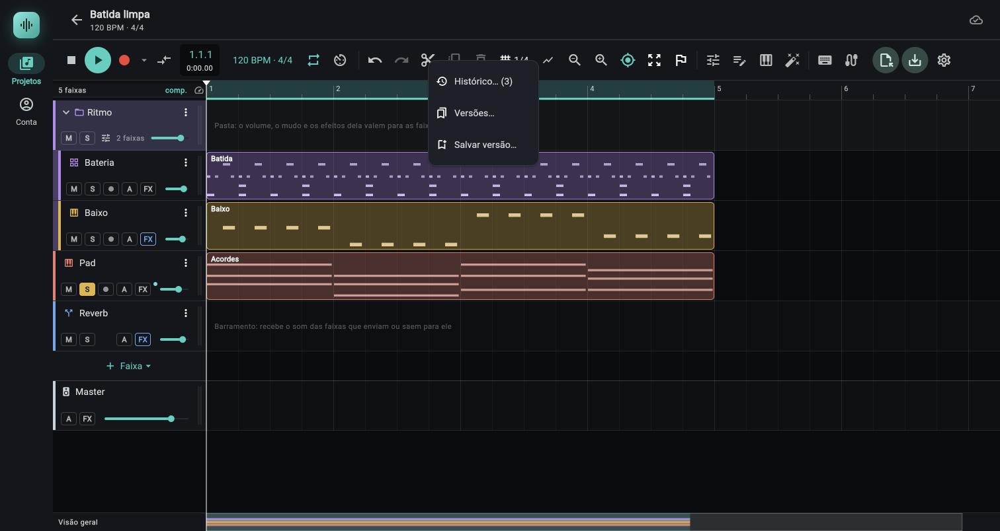
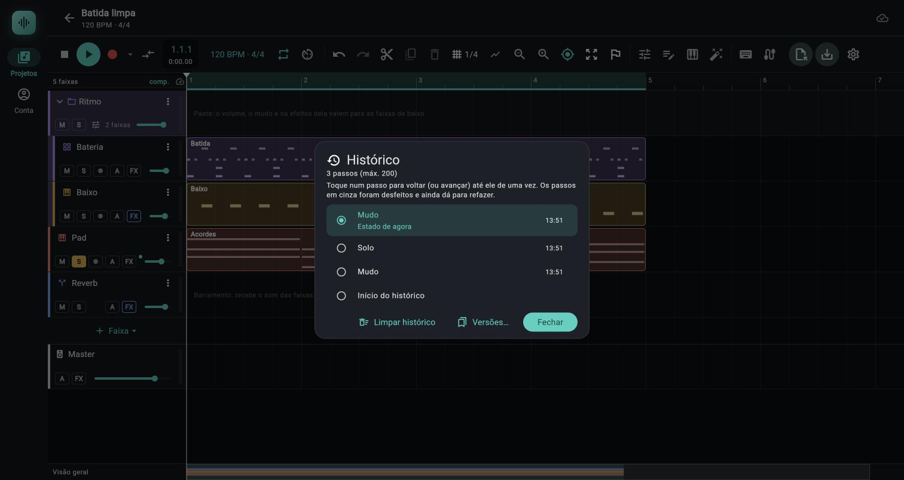
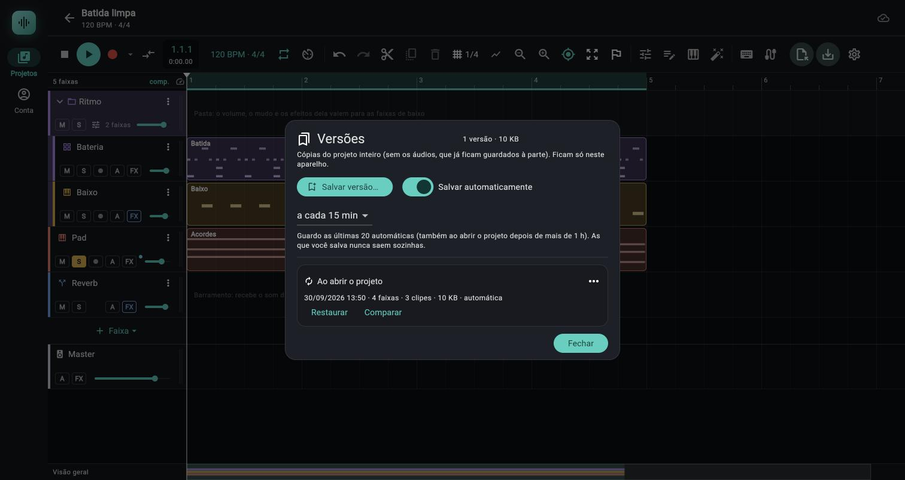

# Histórico de desfazer e versões do projeto

> Voltar atrás no projeto de duas maneiras: o `Histórico` mostra cada passo do `Desfazer` com nome e hora e leva o projeto a qualquer um de uma vez; as `Versões` são cópias nomeadas do projeto inteiro, guardadas no aparelho, que sobrevivem a fechar o projeto e que você restaura quando quiser.

*O menu do botão `Desfazer`: `Histórico… (3)` (o número é quantos passos o histórico tem), `Versões…` e `Salvar versão…`.*

*O painel `Histórico`: do mais recente ao mais antigo, o estado de agora destacado, e no fim o `Início do histórico`.*

*O painel `Versões`: a versão automática `Ao abrir o projeto`, marcada com o ícone de setas circulares e `automática`.*

Situação de teste deste capítulo: o comportamento vem da leitura do código (`app/lib/daw/history.dart`, `history_ui.dart`, `snapshots.dart`, `snapshots_ui.dart`, `controller.dart`, `structure_menu.dart`, `transport_bar.dart`, `keymap.dart`) na versão `ed605e3`, corrigida pela fase 21 (`6e87e92`). Foram **vistos no Chrome** (pela sessão que escreveu o código): o painel `Histórico` com os passos, o menu do botão `Desfazer`, o painel `Versões`, `Salvar versão…` e a versão automática `Ao abrir o projeto` (as três imagens acima). Todo o resto, em particular `Restaurar`, `Comparar`, `Renomear…`, `Apagar…`, `Duplicar como projeto novo…`, as versões automáticas a cada N minutos (inclusive o relógio de parede da fase 21), o limite de 20, o alerta de 50 MB e o uso no Android, é `(testado só por testes automáticos)` (`app/test/history_versions_test.dart`, 46 casos, 8 deles novos da fase 21, e `app/test/fase21_test.dart`) ou `(não confirmado)` quando o texto diz.

## Onde fica

- **Botões `Desfazer` e `Refazer`** (as setas do grupo de edição da barra do estúdio, [capítulo 02](02-transporte.md#edição-e-visão)): o tooltip diz qual passo vale agora, por exemplo `Desfazer: Mudo (Ctrl+Z)`. **Botão direito** do mouse ou **pressão longa** do dedo (não confirmado no Android) abrem um menu com `Histórico… (N)`, `Versões…` e `Salvar versão…`, mas **só com o botão ligado**: `Desfazer` (ou `Refazer`) apagado, sem passo ou durante a gravação, não abre menu nenhum (antes da fase 21 abria, com o `Histórico` inerte). Sem nada a desfazer, o `Histórico… (N)` e as `Versões…` continuam no menu `Visão`. O clique normal continua desfazendo um passo.
- **Menu `Visão`** da barra (tooltip `Visão: enquadrar, altura das faixas, seguir o cursor`, ícone de quatro setas para fora): os dois últimos itens, abaixo de um traço, são `Histórico… (N)` e `Versões…`. Não tem `Salvar versão…` aqui.
- **Atalho `Ctrl+Shift+H`** (`⌘+Shift+H` no Mac): abre o painel `Histórico`. É a ação `Abrir o histórico` (id `history.open`) da janela de atalhos, pode ser trocada em `Personalizar` ([capítulo 09](09-configuracoes-atalhos-android.md#personalizar-os-atalhos)). Não há atalho para as `Versões`.
- **Dentro dos painéis:** o `Histórico` tem o botão `Versões…` (fecha o histórico e abre as versões); as `Versões` têm o botão `Salvar versão…`.
- **No celular** a barra é a mesma e rola na horizontal; o que muda é que o menu abre com a pressão longa no lugar do botão direito.

## Controles

### Tooltips de `Desfazer` e `Refazer`

| Situação | Tooltip | Dica |
|---|---|---|
| Há passo a desfazer | `Desfazer: <nome do passo> (Ctrl+Z)` | O tooltip só aparece com o mouse em cima; o dedo longo abre o menu, não o tooltip. |
| Há passo a refazer | `Refazer: <nome do passo> (Ctrl+Shift+Z)` | |
| Sem passo | `Desfazer (Ctrl+Z)` / `Refazer (Ctrl+Shift+Z)` | O botão fica apagado e o botão direito (ou a pressão longa) **não** abre o menu. |
| Passo sem nome (nome em branco) | `Desfazer: Edição (Ctrl+Z)` | Hoje nenhuma ação do app grava passo sem nome (ver [os nomes](#os-nomes-dos-passos)). |

A tecla entre parênteses é a que está valendo agora: se você trocou o atalho em `Personalizar`, o tooltip de `Desfazer` e `Refazer` já mostra a nova.

### Menu do botão direito em `Desfazer` e `Refazer`

| Item | O que faz | Dica |
|---|---|---|
| `Histórico… (N)` | Abre o painel `Histórico`. `N` é o número de passos (desfazíveis mais refazíveis). | Igual ao item do menu `Visão`. |
| `Versões…` | Abre o painel `Versões`. | |
| `Salvar versão…` | Pede um nome e guarda uma versão do projeto como está. | Só existe neste menu e dentro de `Versões`. |

### Painel `Histórico`

| Controle | O que faz | Valores / padrão | Dica |
|---|---|---|---|
| Título `Histórico` e contagem `N passos (máx. 200)` | Quantos passos o histórico guarda agora. | Limite de 200 passos; `1 passo` no singular. | O número inclui os passos desfeitos que ainda dá para refazer. |
| Lista de passos | Do mais recente (em cima) ao mais antigo; o último item é sempre `Início do histórico`. Tocar num passo leva o projeto ao estado **depois** dele, desfazendo ou refazendo quantos passos for preciso, numa operação só. | Cada linha: ícone, nome, hora (`14:05`, hora local) à direita. | O estado de agora fica destacado, com a legenda `Estado de agora`, e não responde ao toque. |
| Passos em cinza, em itálico, com seta de refazer | Foram desfeitos e ainda dá para refazer; tocar neles avança até eles. | | Uma edição nova apaga todos os cinzas. |
| `Início do histórico` | O projeto antes do primeiro passo guardado. Sem hora. | Tocar nele desfaz tudo o que o histórico guarda. | Com 200 passos cheios, o início é só o mais antigo que ainda cabe: o que já saiu da pilha não volta. |
| Passo sem nome: `Edição (14:05)` | A hora vem junto do nome, no texto da linha, e não à direita. | | Só aparece para um nome em branco; o app nomeia todas as ações desde a fase 21. |
| Texto `Nenhuma edição ainda: o que você fizer no projeto aparece aqui.` | Aparece no lugar da lista enquanto não há passo. | | |
| Aviso `Parado durante a gravação.` | Enquanto grava, a lista fica desabilitada e tocar num passo não faz nada. | | |
| `Limpar histórico` | Pede confirmação (`Limpar o histórico?`: `O projeto fica como está, mas não dá mais para desfazer o que foi feito até aqui. As versões salvas não mudam.`; botões `Cancelar` e `Limpar`) e esquece todos os passos. | Desligado sem passos. | Não muda o projeto nem as versões. |
| `Versões…` | Fecha o histórico e abre o painel `Versões`. | | |
| `Fechar` | Fecha o painel. | | |

### Janelas de nome (`Salvar versão`, `Renomear versão`, `Duplicar como projeto novo`)

| Controle | O que faz | Valores / padrão | Dica |
|---|---|---|---|
| Campo `Nome` | O nome da versão (ou do projeto novo). | Até 80 caracteres. Em `Salvar versão` o padrão é `Versão 30/09/2026 14:05` (a data e a hora de agora) **já selecionado**: digitar substitui em vez de emendar. Em `Duplicar como projeto novo` o padrão é `<projeto> — <versão>`, **cortado em 80 caracteres** (antes da fase 21 um nome longo passava do limite do campo). Vazio dá o erro `Dê um nome à versão.` | |
| Campo `Nota (opcional)` | Um texto livre que aparece embaixo da versão, em itálico. | Até 300 caracteres, até 3 linhas. Só em `Salvar versão` e `Renomear versão`; `Duplicar` não tem nota. | |
| `Cancelar` | Fecha sem fazer nada. | | |
| Botão de confirmar | `Salvar` (em `Salvar versão` e `Renomear versão`) ou `Criar projeto` (em `Duplicar como projeto novo`). | | |

### Painel `Versões`

| Controle | O que faz | Valores / padrão | Dica |
|---|---|---|---|
| Título `Versões` e contagem `3 versões · 45 KB` | Quantas versões este projeto tem neste aparelho e o espaço somado. | `1 versão` no singular; tamanho em KB ou `12,4 MB`. | |
| Texto `Cópias do projeto inteiro (sem os áudios, que já ficam guardados à parte). Ficam só neste aparelho.` | Lembrete fixo. | | |
| `Salvar versão…` | Abre `Salvar versão` e guarda. Mensagem: `Versão “nome” salva neste aparelho.` | Se o projeto é **igual** à versão mais nova, não guarda outra: `O projeto está igual à versão mais nova: não guardei outra cópia idêntica.` Se a mais nova era **automática** e o projeto é igual, ela vira a sua (manual), com o nome e a nota que você deu. | |
| Interruptor `Salvar automaticamente` | Liga e desliga as versões automáticas. | Ligado por padrão. A escolha vale para o aparelho, para todos os projetos. | |
| Lista `a cada N min` (só com o interruptor ligado) | O intervalo das versões automáticas. | `a cada 5 min`, `a cada 10 min`, `a cada 15 min` (padrão), `a cada 30 min`, `a cada 60 min`. | Só esses cinco valem: um valor guardado de outro jeito (por exemplo 7 ou 1440) volta ao padrão de 15 min. Mudar o intervalo vale já: o relógio em curso é refeito na próxima edição. |
| Texto `Guardo as últimas 20 automáticas (também ao abrir o projeto depois de mais de 1 h). As que você salva nunca saem sozinhas.` | Lembrete das regras (só com o interruptor ligado). | | |
| Cartão de cada versão | Do mais novo ao mais antigo: o nome (com o ícone de setas circulares se for automática), a linha `30/09/2026 13:50 · 4 faixas · 3 clipes · 10 KB · automática`, a nota (se houver). | Faixas não contam pastas; clipes contam os de áudio e os MIDI. | |
| `Restaurar` | Pede confirmação e leva o projeto àquela versão (ver [restaurar](#restaurar)). | | |
| `Comparar` / `Fechar comparação` | Abre ou fecha, dentro do cartão, o resumo do que difere entre a versão e o projeto de agora (ver [comparar](#comparar)). | | Não muda nada. |
| Três pontos do cartão (tooltip `Mais ações`) | `Renomear…`, `Duplicar como projeto novo…` e `Apagar…`. | | O item leva o mesmo nome do título da janela que abre (até a fase 20 o item dizia `Duplicar como novo projeto…`). |
| Avisos | `As versões deste projeto já ocupam X (mais de 50,0 MB). Apague as que não precisa mais para liberar espaço.` (o tamanho soma **bytes UTF-8**, o que o arquivo ocupa de fato; acentos e ideogramas contam mais de um byte); `N arquivo(s) de versão está(ão) ilegível(is)` com o botão `Limpar`; mensagens de erro e de sucesso das ações. | Os avisos de erro e de sucesso fecham no `x` do aviso. | |
| Lista vazia | `Este aparelho ainda não tem versões deste projeto. As versões ficam só no aparelho onde foram salvas e não vêm da nuvem.` | | |
| `Fechar` | Fecha o painel. | | |

## Como o histórico funciona

### Cada passo tem nome e hora

Cada edição que entra no `Desfazer` guarda o projeto **de antes** dela, o nome da ação e a hora em que foi feita. Desfazer move o passo para a pilha do `Refazer` (com o mesmo nome e a hora original), e refazer traz de volta. Um gesto contínuo (arrastar um clipe, mexer num fader) é **um passo só**; a passada inteira de uma gravação de automação também é um passo só, `Gravar automação`.

### Os nomes dos passos

O app dá nome à maioria das ações. Os nomes exatos, por assunto:

| Assunto | Nomes dos passos |
|---|---|
| Faixas | `Adicionar faixa`, `Adicionar faixa de instrumento`, `Adicionar bus`, `Apagar faixa`, `Duplicar faixa`, `Mover faixa`, `Renomear faixa` (também para pasta), `Mudar a cor da faixa`, `Mudo`, `Solo`, `Mudar a saída da faixa`, `Congelar faixa` (vale para `Congelar faixa…` e para `Renderizar em faixa nova`), `Descongelar faixa`, `Converter em áudio` ([02e](02e-congelar-faixa.md)) |
| Pastas | `Agrupar em pasta`, `Desfazer a pasta`, `Tirar da pasta`, `Pôr na pasta`, `Volume da pasta` |
| Clipes | `Mover clipe`, `Aparar o início do clipe`, `Aparar o fim do clipe`, `Cortar clipe`, `Duplicar clipe`, `Apagar clipe`, `Renomear clipe` (clipe MIDI, pela linha do tempo e pelo piano roll), `Criar clipe MIDI`, `Silenciar clipe`, `Reativar clipe`, `Inverter a fase do clipe`, `Loop do clipe`, `Desligar o loop do clipe`, `Ganho do clipe` (também o deslizante do diálogo `Ganho do clipe…`), `Dividir clipe`, `Remover silêncio`, `Quantizar por fatias`, `Normalizar clipe`, `Mudar fade`, `Mudar curva do fade`, `Ajustar o fade-in`, `Ajustar o fade-out`, `Aplicar crossfades`, `Inverter o áudio do clipe`, `Mudar a altura do clipe`, `Esticar o clipe no tempo`, `Desligar o warp do clipe`, `Ajustar o andamento do clipe`, `Mudar o warp do clipe`, `Trocar de take`, `Comp: escolher trecho` (cada escolha no comp por trecho: um passo, mesmo partindo o clipe em vários), `Comp: achatar` ([03f](03f-comping.md)) |
| Importar, gravar, converter | `Importar áudio`, `Importar MIDI`, `Gravar`, `Converter áudio em MIDI` |
| Mixer | `Volume da faixa`, `Volume do master`, `Volume`, `Pan`, `Adicionar envio`, `Mudar envio`, `Remover envio` |
| Efeitos | `Adicionar efeito`, `Remover efeito`, `Mover efeito`, `Mudar parâmetro do efeito`, `Bypass do efeito`, `Preset de efeito` |
| Instrumento e sampler | `Mudar parâmetro do instrumento`, `Aplicar preset`, `Trocar o áudio do instrumento`, `Adicionar zona do sampler`, `Dividir zona em camadas`, `Criar zona do áudio da faixa`, `Mudar zona do sampler`, `Mover zona do sampler`, `Duplicar zona do sampler`, `Remover zona do sampler`, `Limpar zonas do sampler`, `Fatiar o áudio` |
| Modulação | `Adicionar fonte de modulação`, `Remover fonte de modulação`, `Atribuir modulação`, `Remover destino de modulação`, `Aplicar preset de modulação`, `Mudar modulação`, `Mudar quantidade da modulação` (o deslizante de quantidade de cada destino) |
| Automação | `Adicionar raia de automação`, `Remover raia de automação`, `Inserir ponto de automação`, `Apagar pontos de automação`, `Zerar a curva do ponto`, `Editar automação`, `Gravar automação` |
| Notas e MIDI | `Inserir nota`, `Inserir acorde`, `Apagar notas`, `Colar notas`, `Transpor notas`, `Mover notas`, `Quantizar`, `Legato`, `Arpejo`, `Humanizar`, `Staccato`, `Mudar a escala`, `Editar notas`, `Transformar notas`, `Editar controle MIDI`, `Apagar evento de controle`, `Apagar a raia de controle`, `Sequenciador de passos`, `Controle MIDI mapeado` |
| Andamento, loop e marcadores | `Mudar andamento`, `Mudar compasso`, `Mudar andamento e compasso`, `Região do loop`, `Mudar o loop`, `Região de punch`, `Adicionar marcador`, `Mover marcador`, `Renomear marcador`, `Cor do marcador`, `Remover marcador` |
| Versões | `Restaurar versão “<nome>”` |

Desde a fase 21 **toda** ação desfazível do app tem nome: um teste varre o código (`lib/`) atrás de `checkpoint()` sem nome e de `edit` desfazível sem rótulo, e não acha nenhum. O passo **`Edição`** (com a hora junto: `Edição (14:05)`) sobrou só como reserva para um nome em branco. Até a fase 20 apareciam assim os cortes da edição de áudio (dividir, remover silêncio, quantizar por fatias), renomear um clipe pelo piano roll e alguns deslizantes (modulação, zonas do sampler, ganho do clipe). Quem muda andamento e compasso na janela `Andamento e compasso` (e o tap tempo) grava o passo pelo que mudou de fato: `Mudar andamento` (só o BPM, ou nada mudou), `Mudar compasso` (só as batidas por compasso) ou `Mudar andamento e compasso`; antes saía como `Região do loop`. `(testado só por testes automáticos)`

Na fase 24 (`ebea0b1`) o diálogo `Warp e altura…` passou a nomear o passo pelo que mudou; até a fase 23 todo passo dele se chamava `Detectar andamento do clipe`, mesmo ao inverter o áudio ou mexer na altura. Agora, na ordem em que o app confere (vale o primeiro que bater): `Inverter o áudio do clipe` (o interruptor `Inverter o áudio` mudou), `Mudar a altura do clipe` (`Um semitom abaixo`, `Um semitom acima` ou `Zerar` mudaram a altura), `Esticar o clipe no tempo` (o warp estava desligado e `Ajustar ao andamento` ou a detecção o ligou), `Desligar o warp do clipe` (botão `Desligar o warp`), `Ajustar o andamento do clipe` (o warp já estava ligado e só o andamento do áudio mudou, por `Ajustar ao andamento`, pelos botões `÷2` e `×2` ou pela detecção de novo). `Mudar o warp do clipe` é o nome de reserva, quando nenhum dos campos mudou de fato (não se chega a ele pelos botões do diálogo) `(lido do código)`. O mudo e a fase do clipe têm nomes próprios (`Silenciar clipe`, `Reativar clipe`, `Inverter a fase do clipe`) e, diferente do warp e do loop, valem também durante a gravação; ver [03 Mudo, fase invertida e loop do clipe](03-audio-e-clipes.md#mudo-fase-invertida-e-loop-do-clipe). `(testado só por testes automáticos)`

### O que entra no histórico e o que não entra

- **Entra:** o que muda o documento da música (faixas, clipes, notas, efeitos, automação, andamento, compasso, marcadores, loop desenhado na régua, região do punch) e cada passo acima. Fazer uma edição nova depois de desfazer **apaga** os passos refazíveis.
- **Não entra** (muda, mas não vira passo, e desfazer ou restaurar nunca mexe nisso): ligar o loop, o metrônomo e a contagem, as opções do metrônomo, o pré-roll, o punch ligado e a região dele, a compensação de latência, armar e monitorar faixas, os mapeamentos de MIDI learn, e **recolher e expandir uma pasta**. Abrir e fechar raias de automação também não entra. O loop ligado só volta junto quando o passo desfeito é o de desenhar a região do loop. A seleção, o zoom e o modo de automação nem são do documento.
- **Modo comp:** abrir e fechar o comp por trecho (raias de tomada) é estado de tela e não vira passo; só `Comp: escolher trecho` e `Comp: achatar` entram ([03f](03f-comping.md#desfazer)).
- **Gravando:** desfazer, refazer, a tela `Histórico` e a restauração de versão ficam parados (`Parado durante a gravação.`; `Pare a gravação antes de restaurar uma versão.`).
- **Limite:** 200 passos; ao passar disso o mais antigo sai. O histórico é da sessão de edição: some ao fechar o projeto.
- **Sincronização:** quando a nuvem traz o projeto de outro aparelho e o app o troca, o histórico **zera** (desfazer e refazer) e aparece o aviso `Projeto atualizado de outro aparelho. Desfazer não disponível para o que veio de lá.` Ver [01b Nuvem e sincronização](01b-nuvem-e-sincronizacao.md). Se o projeto da nuvem é igual ao daqui, nada é trocado e o histórico fica.

## Versões do projeto

Uma versão é uma cópia do projeto inteiro (faixas, clipes, notas, efeitos, automação, andamento, marcadores), com nome, nota e data. **Não leva os áudios**: os clipes citam o áudio pelo hash (sha-256), e o áudio já vive à parte no aparelho (e na nuvem).

### Salvar

`Salvar versão…` (menu do botão `Desfazer`, ou no painel `Versões`). Dê um nome que diga o momento (`Antes do solo`, `Mix aprovada`) e, se quiser, uma nota. O nome padrão (`Versão 30/09/2026 14:05`) já vem selecionado. Se nada mudou desde a versão mais nova, o app avisa e não cria cópia idêntica.

### Restaurar

`Restaurar` abre `Restaurar “<nome>”?` com o texto `O projeto volta ao estado de <data e hora>. Antes disso, guardo uma versão “Antes de restaurar <nome>” com o que está agora, e o Desfazer também volta.` e os botões `Cancelar` e `Restaurar`. Ao confirmar:

1. O app guarda uma versão `Antes de restaurar <nome>` com o projeto de agora. (Se o projeto de agora já é idêntico à versão mais nova, não cria outra; se aquela era automática, ela é renomeada para `Antes de restaurar <nome>` e passa a ser manual.)
2. O projeto vira o da versão, como **um passo** do histórico chamado `Restaurar versão “<nome>”`. O aviso diz `Versão “<nome>” restaurada. Desfazer volta ao que era antes.`
3. Os áudios que a versão cita e que este aparelho ainda não tinha carregado são carregados.

O que **não** volta com a versão (fica como está agora, como no desfazer): metrônomo, contagem, opções do metrônomo, pré-roll, punch, compensação de latência, mapeamentos de MIDI learn, faixas armadas ou monitorando e pastas recolhidas. O loop ligado também fica como está, se a região do loop é a mesma.

Erros: `O arquivo desta versão está ilegível ou sumiu: não dá para restaurar.` (a lista é recarregada) e `Não deu para restaurar esta versão.`

### Comparar

`Comparar` mostra, dentro do cartão e sob o título `Do projeto desta versão para o de agora:`, só as linhas que diferem; se nada difere, `Igual ao projeto de agora.` Cada linha é `O quê: +A, −R, M mudados`:

- `+A`: está no projeto de agora e não estava na versão (apareceu depois).
- `−R`: estava na versão e não está mais.
- `M mudados` (ou `1 mudado`): mesmo item, conteúdo diferente.

As linhas possíveis: `Faixas` (pelo que é da própria faixa: nome, volume, pan, mudo, solo, instrumento, saída; o que ela carrega é comparado à parte), `Clipes de áudio`, `Clipes MIDI`, `Notas MIDI` (mover uma nota conta como uma removida e uma adicionada; aqui não há `mudados`), `Efeitos` (inclusive os do master), `Envios`, `Raias de automação` (inclusive as do master) e `Marcadores`. Depois vêm frases soltas quando mudou: `Andamento: 120 → 128`, `Batidas por compasso`, `Mapa de andamento` (`2 pontos → 3 pontos`), `Mapa de compassos` (`N mudanças`), `Volume do master` e `Pan do master` (valores internos, o volume em escala linear). `nenhum` aparece quando o lado não tinha o valor. Não entram na comparação o loop, o punch, o metrônomo nem os áudios em si.

### Renomear, apagar e duplicar

- **`Renomear…`** (menu de três pontos do cartão): muda nome e nota. Renomear também **tira a versão da limpeza das automáticas**: ela deixa de ser `automática` e nunca mais sai sozinha. Erro: `Não deu para renomear: o arquivo da versão sumiu ou está ilegível.`
- **`Apagar…`**: `Apagar “<nome>”?`, `Esta versão some do aparelho e não dá para recuperar. O projeto de agora não muda.` Botões `Cancelar` e `Apagar` (vermelho). Não há lixeira.
- **`Duplicar como projeto novo…`**: abre `Duplicar como projeto novo` com o nome `<projeto> — <versão>` (`Criar projeto` confirma). Cria, na sua conta, um projeto novo com o documento daquela versão, pelo mesmo caminho do `Importar projeto` de um `.jopendaw` ([capítulo 01](01-projetos-modelos-conta.md#projeto-em-arquivo-jopendaw)). Se já existe um projeto com o nome, o app acrescenta ` (importado)` (e um número, se precisar). O aviso `Criei o projeto “<nome>” com esta versão. Ele já está na sua lista de projetos.` traz o botão `Abrir`. O projeto original e a versão não mudam. Precisa de conta e de rede (o projeto é criado pela API). Os áudios não são copiados: o projeto novo cita os mesmos, que já estão no aparelho, e sobem pela sincronização normal na primeira abertura.

### Versões automáticas

Com `Salvar automaticamente` ligado, o app guarda versões sozinho, sem perguntar:

- **Durante a edição:** a primeira edição depois da última versão (ou do começo da sessão) arma um **relógio** dos minutos escolhidos (5 a 60; padrão 15). Passado o prazo, o app guarda `Versão automática` do projeto naquele momento, **mesmo que você não edite mais nada** (o relógio é de parede; antes da fase 21 era preciso uma edição depois do prazo). Quem edita sem parar também ganha a versão: a edição que passa do prazo dispara do mesmo jeito (vale o que vier primeiro). Guardar qualquer versão (manual ou automática), mudar o intervalo ou desligar o interruptor zera o relógio; sem nenhuma edição desde a última versão, não há versão nova. Uma versão idêntica à mais nova não é guardada. Com o app fechado ou o aparelho suspenso o relógio não anda `(não confirmado no Android)`.
- **Ao abrir o projeto:** se a versão mais nova tem mais de 1 hora (ou não há nenhuma) e o projeto tem **conteúdo**, guarda `Ao abrir o projeto`: o ponto de partida da sessão. Vale conteúdo: mais de uma faixa, ou alguma faixa com clipe, nota, efeito, áudio de sampler ou zona, ou que não seja de áudio (um instrumento). Só a faixa de áudio vazia de um projeto recém-criado não ganha versão ao abrir. (Até a fase 20 exigia ao menos um clipe de áudio ou MIDI, então um projeto só com instrumento montado e ainda sem clipe ficava sem versão.)
- **Limite:** ficam as **20 últimas automáticas**; as mais velhas saem. As que você salvou ou renomeou nunca saem sozinhas.

### Onde as versões ficam guardadas

Só no aparelho onde foram salvas, no guardado local do app: no navegador, no IndexedDB (banco `jopendaw`), com as chaves `snapshots:<id do projeto>:<id da versão>`; no Android, em arquivos do app (pasta `jopendaw` dos documentos, com o nome da chave codificado). O interruptor e o intervalo ficam numa chave só do aparelho (`versions-prefs`). Apagar o projeto apaga as versões dele. Cada versão é um texto JSON do documento (formato `jopendaw-version`, versão 1); uma versão de um projeto pequeno tem da ordem de 10 KB.

Quando as versões de um projeto passam de **50 MB** somados (em bytes UTF-8, o mesmo número que o cartão mostra como `10 KB`), o painel mostra o aviso de espaço; nada é apagado nem bloqueado, e salvar continua funcionando. Um arquivo de versão cortado ou de outro formato não derruba nada: é contado em `N arquivo(s) de versão está(ão) ilegível(is)`, e o botão `Limpar` apaga esses arquivos.

## Passo a passo

### Voltar três passos pelo painel

1. Faça as edições normalmente (por exemplo `Mudo`, `Solo`, `Mudo` numa faixa).
2. Abra o histórico: botão direito em `Desfazer` e `Histórico…`, ou `Ctrl+Shift+H`.
3. Procure a linha `Estado de agora` e toque na linha **três abaixo** dela (ou em `Início do histórico`, se ele for a terceira). O projeto desfaz os três passos de uma vez.
4. Os passos que você pulou ficam em cinza. Toque num deles para avançar de novo, ou no `Refazer` da barra.
5. Se quiser seguir por outro caminho, basta editar: os cinzas somem.

### Salvar uma versão antes de um experimento

1. Botão direito em `Desfazer` e `Salvar versão…` (se o `Desfazer` está apagado, sem nada a desfazer, o menu não abre: use `Versões…` no menu `Visão` e o botão `Salvar versão…` do painel).
2. Digite um nome (`Antes da mudança de refrão`); o nome padrão já vem selecionado, então basta começar a digitar. Se quiser, escreva uma nota.
3. `Salvar`. O aviso é `Versão “Antes da mudança de refrão” salva neste aparelho.`
4. Faça o experimento. Para voltar, `Versões…` e `Restaurar` naquela versão.

### Restaurar e desfazer a restauração

1. `Versões…`, no cartão da versão `Restaurar` e confirme em `Restaurar`.
2. O projeto muda. Se não gostou, `Desfazer` (o tooltip diz `Desfazer: Restaurar versão “<nome>”`) traz de volta o que estava antes, enquanto o histórico não for limpo nem o projeto trocado pela nuvem.
3. Se o histórico se perdeu (fechou o projeto, a nuvem trouxe outra versão), a cópia está na lista como `Antes de restaurar <nome>`: `Restaurar` nela.

### Duplicar uma versão como projeto novo

1. `Versões…`, nos três pontos do cartão, `Duplicar como projeto novo…`.
2. Confira ou mude o nome (`<projeto> — <versão>`) e `Criar projeto`.
3. No aviso `Criei o projeto “…” com esta versão…`, toque em `Abrir`, ou ache o projeto novo na tela `Projetos`.
4. O projeto novo é independente: editar um não mexe no outro.

## Combina com

- [02 Transporte](02-transporte.md): os botões `Desfazer` e `Refazer` da barra e o que a gravação trava.
- [01 Projetos, modelos e conta](01-projetos-modelos-conta.md): `Importar projeto` e o `.jopendaw`, o mesmo caminho do `Duplicar como projeto novo…`.
- [01b Nuvem e sincronização](01b-nuvem-e-sincronizacao.md): o que zera o histórico e por que as versões não sobem.
- [09 Configurações, atalhos e Android](09-configuracoes-atalhos-android.md): o atalho `Ctrl+Shift+H` e como trocá-lo.
- Guia [Voltar atrás: histórico e versões](../guias/voltar-atras-historico-e-versoes.md): três cenários de uso.
- Guia [Backup e levar o projeto para outro aparelho](../guias/backup-e-levar-projeto-para-outro-aparelho.md): as versões não viajam; para levar uma, duplique e exporte.

## Limites e pegadinhas

- **O histórico dura a sessão.** Fechar o projeto, recarregar a página ou receber o projeto de outro aparelho o esvazia. Para algo que precisa sobreviver, salve uma **versão**.
- **As versões são só do aparelho.** Não sobem para a nuvem e não vão dentro do `.jopendaw` (o arquivo leva só o documento e os áudios). Num aparelho novo, o painel começa vazio. Para levar uma versão: `Duplicar como projeto novo…` e sincronize, ou exporte o projeto novo.
- **Limpar os dados do site, desinstalar o app ou apagar o projeto apaga as versões** (elas moram no mesmo guardado local do documento e dos áudios). `(lido do código)`
- **Restaurar não é Desfazer tudo.** Metrônomo, contagem, latência, punch, mapeamentos de MIDI learn, armar e pastas recolhidas ficam como estão.
- **A restauração depende dos áudios.** Se um áudio que a versão cita não está mais no aparelho (por exemplo depois de `Limpar áudios sem uso`), o app o marca como ausente (o clipe fica sem som, como em qualquer áudio que o aparelho não tem). `(lido do código; não confirmado com um caso real)`
- **`Antes de restaurar` pode não aparecer.** Se o projeto já era idêntico à versão mais nova, a cópia de segurança não é feita (o conteúdo já está nela).
- **A versão automática guarda o projeto como está no fim do prazo**, já com as edições feitas até ali, não o de antes de começar a mexer. Para um ponto de volta garantido antes de um experimento, salve você mesmo.
- **Versões automáticas pedem conteúdo.** `Ao abrir o projeto` só existe se o projeto tem mais que a faixa de áudio vazia do início (mais faixas, clipes, notas, instrumento, efeito ou áudio de sampler); e só vale com o interruptor ligado.
- **Sem `Edição` no dia a dia.** Desde a fase 21 toda ação tem nome; se aparecer `Edição (hora)`, é um nome em branco e a hora ajuda a achá-lo.
- **Desfazer apagado não abre menu.** Com nada a desfazer, o botão direito em `Desfazer` não faz nada; `Versões…` e o `Histórico…` estão no menu `Visão`, e `Salvar versão…` dentro de `Versões`.
- **`Ctrl+Shift+H` e o navegador.** Em alguns navegadores esse atalho também abre o histórico de navegação (por exemplo, no Firefox); se o app não receber a tecla, use o botão direito em `Desfazer` ou o menu `Visão`. `(não confirmado)`
- **Tocar num passo do painel vai até o estado depois dele**, não "desfaz aquele passo": para voltar ao estado de **antes** do `Solo`, não adianta tocar em `Solo`; toque na linha logo abaixo dele (e o que foi feito depois do `Solo` também é desfeito).

## Atalhos

| Tecla | Ação |
|---|---|
| `Ctrl+Z` (`⌘+Z`) | Desfazer um passo |
| `Ctrl+Shift+Z` ou `Ctrl+Y` | Refazer um passo |
| `Ctrl+Shift+H` (`⌘+Shift+H`) | Abrir o painel `Histórico` (ação `Abrir o histórico`, id `history.open`) |
| Botão direito ou pressão longa em `Desfazer`/`Refazer` | Menu `Histórico…`, `Versões…`, `Salvar versão…` |
