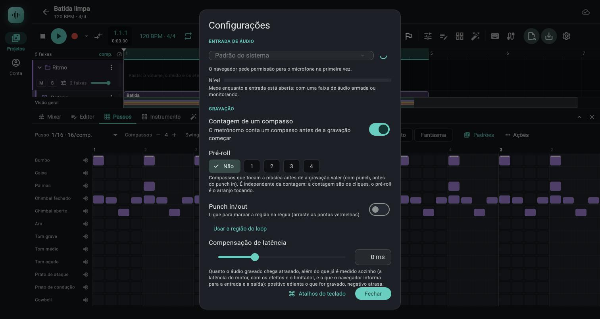

# Gravação

> Grave o microfone (ou uma interface de áudio) numa faixa de áudio e as notas que você toca (teclado do computador ou controlador MIDI) numa faixa de instrumento, com contagem, pré-roll, punch in/out para regravar só um trecho, loop com várias tomadas e compensação de latência.

*Configurações, seção Gravação: Contagem de um compasso, Pré-roll (Não, 1, 2, 3 ou 4 compassos), Punch in/out com Usar a região do loop e Compensação de latência; no pé, o botão Atalhos do teclado.*

## Onde fica

- **Gravar:** botão vermelho (círculo cheio) na barra do transporte, ao lado de parar e tocar. A setinha logo à direita dele (tooltip `Opções de gravação`) abre a contagem e as configurações.
- **Armar a faixa:** cada faixa tem um ponto de gravação (`Armar para gravar`), no cabeçalho da faixa (entre `S` e `A`) e no canal do mixer. Sem faixa armada, gravar não grava nada.
- **Monitorar a entrada:** no canal do mixer (botão com ícone de fone, `Monitorar a entrada`) e no menu de três pontos da faixa (`Monitorar a entrada`, com marca de seleção); só em faixa de áudio.
- **Configurações de gravação:** engrenagem da barra (tooltip `Configurações: entrada de áudio, latência e contagem`) ou item `Configurações de gravação…` da setinha do botão gravar. Abre a janela `Configurações`.
- **Punch e pré-roll (fase 17):** o botão de duas setas horizontais opostas logo depois da setinha do gravar (tooltip `Punch (P): …`), o menu da setinha (`Punch in/out (P)` e a lista de `Pré-roll`), a janela `Configurações` (seção `GRAVAÇÃO`) e, para a região, as pontas vermelhas `IN` e `OUT` no alto da régua ([02b](02b-timeline-e-clipes.md#régua)). Detalhes na seção [Punch, pré-roll e metrônomo](#punch-pré-roll-e-metrônomo-fase-17).
- **Teclado e MIDI:** dois ícones no meio da barra: teclado (`Tocar com o teclado do computador (Ctrl+K)`) e cabo (`Entrada MIDI: ligar teclado ou controlador`).

## Controles

### Botão gravar e o transporte

| Controle (rótulo exato) | O que faz | Valores / padrão | Dica |
|---|---|---|---|
| Botão gravar (tooltip muda: `Gravar (R): nenhuma faixa armada; arme no mixer (●)`, `Gravar (R) na faixa armada, com um compasso de contagem`, `Gravar (R) nas N faixas armadas`) | Começa a gravar a partir do cursor. Com faixa de áudio armada abre o microfone (se ainda não estava aberto) | Atalho `R`. Desde a fase 17 o tooltip acrescenta, depois da contagem, `, N de pré-roll` (com pré-roll) e `, só na região de punch` (com punch ligado e região): por exemplo `Gravar (R) na faixa armada, com um compasso de contagem, 2 de pré-roll, só na região de punch` | Vermelho cheio = gravando. **Pisca no andamento** durante a contagem (tooltip `Contando o compasso de entrada: toque para cancelar (R)`). Gravando: `Gravando: toque para parar (R)` |
| `Punch (P)` (botão só com o ícone de duas setas opostas, logo depois da setinha; tooltip `Punch (P): grava só numa região. Ligue e ajuste as pontas na régua` sem região, `Punch (P): a gravação só vale entre o punch in e o punch out da régua` com região) | Liga e desliga o punch (a gravação só vale entre o punch in e o punch out). Ligando sem região, ela é criada na hora (ver a seção abaixo). Aceso na cor da marca quando o punch vale (ligado e com região) | Atalho `P`. Desligado por padrão; fica no projeto, fora do desfazer | Gravando, não liga nem desliga: `Pare a gravação para ligar ou desligar o punch.` |
| Setinha `Opções de gravação` › `Contagem de um compasso` (item com marca) | Liga/desliga a contagem antes de gravar | Padrão: **ligada**; vale para o projeto; fora do desfazer | O mesmo interruptor existe em `Configurações` |
| Setinha › `Punch in/out (P)` (item com marca) | O mesmo que o botão `Punch (P)` | A marca fica ligada quando o punch vale | |
| Setinha › `Pré-roll: toca a música antes de gravar` (título cinza, sem ação) e, abaixo, `Sem pré-roll`, `1 compasso`, `2 compassos`, `3 compassos`, `4 compassos` (uma marca no atual) | Escolhe quantos compassos de música tocam antes do ponto de gravar | 0 a 4; padrão `Sem pré-roll`; fica no projeto, fora do desfazer | O mesmo controle existe em `Configurações` (`Pré-roll`, com `Não`, `1`, `2`, `3`, `4`) |
| Setinha › `Configurações de gravação…` | Abre a janela `Configurações` | | |
| Parar / tocar (`Parar a gravação e voltar (Enter)`, `Parar a gravação (espaço)`) | Encerram a gravação e geram os clipes | `Enter`, `Home`, `Espaço`, `R` | Parar durante a contagem ou o pré-roll **cancela** sem gravar nada e avisa `Gravação cancelada: você parou antes do ponto de gravar (contagem ou pré-roll); nada foi gravado.` ([Pré-roll](#pré-roll)). Com o punch ligado e sem loop, a gravação também **para sozinha** no punch out ([Punch in/out](#punch-inout)) |
| Posição na barra | Durante a contagem mostra `−N` em vermelho quando o cursor está antes do zero | | Só se a gravação começa no primeiro compasso |
| Selo `Contando…` (na régua) | Aparece durante o compasso de contagem, à direita do cursor | | |
| Faixa vermelha na raia (`Gravando` / `Tomada N`) | Retângulo que cresce com o cursor nas faixas armadas; volta do loop vira `Tomada 2`, `Tomada 3`… | | |

Durante a gravação ficam **travados**: mover o cursor e marcar/arrastar o loop na régua, ligar/desligar o loop, mudar o andamento (`BPM`), desfazer/refazer, importar, exportar, armar/desarmar pelo cabeçalho da faixa, mudar warp e trocar a entrada. O app mostra `Pare a gravação para <ação>.` Desde a fase 17 também ficam travados ligar/desligar o punch, arrastar as pontas `IN` e `OUT` e o botão `Usar a região do loop` (as pontas e o botão simplesmente não respondem; só o interruptor avisa). O pré-roll da setinha e o do `Configurações` não são travados, mas a gravação em andamento já partiu com o valor que havia ao apertar `R`.

### Na faixa: armar, monitorar, medidor

| Controle (rótulo exato) | O que faz | Valores / padrão | Dica |
|---|---|---|---|
| `Armar para gravar` (ponto vermelho, tooltip `Armar para gravar: ao gravar (R), o que entra no microfone vira um clipe nesta faixa` na de áudio; `... as notas que você tocar (teclado do computador ou MIDI) viram um clipe nesta faixa` na de instrumento) | Escolhe as faixas que recebem a gravação. Armar a primeira faixa de áudio **abre a entrada** (o navegador pede o microfone). Desarmar a última que precisava dela fecha a entrada | Desligado por padrão. Barramento não tem o botão. Fica no projeto, mas **fora do desfazer** | Armada: contorno vermelho; cheio enquanto grava de verdade (depois da contagem). No cabeçalho da faixa os tooltips são `Armar para gravar a entrada de áudio`, `Armar para gravar as notas (teclado ou MIDI)`, `Desarmar` e, gravando, `Gravando nesta faixa` |
| `Monitorar a entrada` (fone azul, só faixa de áudio; também existe no menu de três pontos da faixa; tooltip `Monitorar a entrada: ouvir o microfone ao vivo pelos efeitos e pelo fader desta faixa (use fones, senão microfona)`) | Faz o microfone soar ao vivo na faixa, **depois dos efeitos e do fader**, sem precisar tocar nem gravar | Desligado por padrão | Use fones para não dar microfonia. Também abre a entrada; funciona com o transporte parado |
| Medidor de entrada | Mostra o nível de pico do que chega **antes de qualquer efeito** | Escala de −48 a 0 dB; verde até 70% do curso, âmbar até 88%, vermelho depois; ~30 atualizações por segundo, sobe na hora e cai devagar | Aparece só em faixa de **áudio armada**: barra vertical ao lado do fader no mixer, barra fina de 3 px no pé do cabeçalho da faixa, e a barra `Nível` na janela `Configurações` |
| Luz de saturação (ponta do medidor) | Fica vermelha por 2 s quando o pico chega a −0,1 dBFS ou mais (já cortou no conversor) | | Tooltip `Vermelho no topo: saturou; baixe o ganho na fonte` |

### Janela `Configurações`

| Controle (rótulo exato) | O que faz | Valores / padrão | Dica |
|---|---|---|---|
| Seção `ENTRADA DE ÁUDIO`, seletor | Escolhe de onde vem o áudio | `Padrão do sistema` (ou `Padrão (<nome>)`), depois as entradas encontradas (`Entrada N` quando o navegador esconde os nomes) e, se a escolhida sumiu, `Entrada desconectada` | A escolha fica **no aparelho**, não no projeto. Não troca durante a gravação |
| Botão de recarregar (tooltip `Procurar as entradas de novo (depois de conectar um microfone ou interface)`) | Relê a lista de entradas (pede a permissão do microfone se ainda não tem) | | Vira um círculo girando enquanto procura |
| `Nível` | Medidor de entrada (o mesmo do mixer) | | Só se mexe com a entrada aberta (faixa de áudio armada ou monitorando) |
| Seção `GRAVAÇÃO`, interruptor `Contagem de um compasso` | O metrônomo conta um compasso antes de a gravação começar | Padrão ligado | Se o metrônomo estava desligado, ele soa só durante a contagem |
| Seção `GRAVAÇÃO`, `Pré-roll` (cinco fichas: `Não`, `1`, `2`, `3`, `4`) e o texto de apoio `Compassos que tocam a música antes de a gravação valer (com punch, antes do punch in). É independente da contagem: a contagem são os cliques, o pré-roll é o arranjo tocando.` | Quantos compassos de música tocam antes do ponto de gravar | 0 a 4; padrão `Não` (0); fica no projeto, fora do desfazer | Ver [Pré-roll](#pré-roll) |
| Seção `GRAVAÇÃO`, interruptor `Punch in/out` | Liga e desliga o punch. Sem região, o texto embaixo é `Ligue para marcar a região na régua (arraste as pontas vermelhas)`; com região, `Da posição 9.1.1 à 11.1.1: só isso é gravado` (as posições no formato `compasso.tempo.dezesseis-avos`, pelo mapa de compassos) | Padrão desligado; fica no projeto, fora do desfazer | Gravando, o interruptor avisa `Pare a gravação para ligar ou desligar o punch.` |
| Seção `GRAVAÇÃO`, botão de texto `Usar a região do loop` | Copia a região do loop para o punch (não liga o punch) | Fica ativo só com o **loop ligado**, com a região com mais de 0,01 batida de largura, e sem gravar (o mesmo critério do interruptor `Punch in/out`: o loop desligado guarda uma região qualquer, o padrão 0 a 16, que não foi escolha sua) | Serve para o caso "loop e punch iguais" sem arrastar as pontas. Com o loop desligado o botão fica apagado |
| Controle deslizante e campo `ms`: `Compensação de latência` | Ajuste manual, somado à latência que o navegador (ou o sistema, no Android) informa e à do motor, que o app soma sozinho ([06e](06e-compensacao-de-latencia.md)) | **−200 a +500 ms**, passo de 1 ms, padrão 0. Positivo adianta o que foi gravado; negativo atrasa | Só vale para o **áudio** gravado, não para as notas MIDI. Vale para o projeto; fora do desfazer. Campo aceita só números inteiros (`De -200 a 500 ms` se sair da faixa) |
| Seção `METRÔNOMO` (`Timbre`, `Subdivisão`, `Quando soa`, `Volume`, `Acento do primeiro tempo`, `Altura do acento`, `Volume das subdivisões`) | Como o clique soa e quando | Campo a campo, com faixas e padrões, em [09](09-configuracoes-atalhos-android.md) (seção `METRÔNOMO`); resumo na seção [Metrônomo](#metrônomo) abaixo | Ficam no projeto, fora do desfazer |
| `Fechar` | Fecha (leva junto um número digitado e ainda não confirmado) | | |

### Teclado do computador e MIDI

| Controle (rótulo exato) | O que faz | Valores / padrão | Dica |
|---|---|---|---|
| Ícone de teclado (tooltip `Tocar com o teclado do computador (Ctrl+K)`; ligado: `Teclado tocando: atalhos suspensos (C L S X Z E F K J e Shift+H/K/L). A a P tocam a partir do C4, Z/X mudam a oitava, C/V a intensidade (80%). Ctrl+K desliga`) | Liga as teclas como piano. Ligado, mostra a oitava no ícone (`C4`) | `A W S E D F T G Y H U J K O L P` = dó a ré# da oitava seguinte. Oitava **0 a 8**, padrão 4 (tecla `A` = dó central, nota 60). Intensidade **10% a 100%**, passo de 10%, padrão 80% | `Z`/`X` baixam/sobem a oitava; `C`/`V` diminuem/aumentam a intensidade. Segurar a tecla não reataca |
| Ícone de cabo (tooltip `Entrada MIDI: ligar teclado ou controlador`; depois `Entrada MIDI: <nomes>` ou `MIDI ligado, nenhum aparelho conectado: conecte e ele aparece aqui sozinho`) | Pede acesso ao MIDI e passa a ouvir todos os aparelhos. O número no ícone é a quantidade de aparelhos conectados | Web MIDI **sem sysex**; aparelho que entra ou sai com a página aberta é detectado sozinho | Precisa de um clique (gesto). Negado ou sem suporte: aviso em texto |

O MIDI entende, em qualquer canal (o número do canal é ignorado na expressão; só o [MIDI learn](06f-midi-learn.md) distingue o canal):

| Mensagem | O que faz | Valores |
|---|---|---|
| Nota ligada e desligada | Toca e solta a nota (nota ligada com velocidade 0 vale como desligada) | A velocidade vem do controlador |
| Pitch bend (`0xE0`) | Afina as notas da faixa, até o `Alcance do bend` do instrumento | 14 bits (LSB e MSB), 8192 no centro: de -1 a quase +1 (8191/8192) |
| `CC 1` (roda de modulação) | Liga o vibrato da roda | 0 a 127, vira 0 a 1 |
| `CC 64` (pedal de sustain) | Segura as notas soltas até o pedal subir | Embaixo a partir de 64 |
| `CC 121` (reset dos controles) | Bend, roda e pedal voltam ao repouso, cada um na faixa em que estava | |
| `CC 120` (all sound off) | Corta tudo na hora, inclusive as caudas, e zera bend, roda e pedal | |
| `CC 123` (todas as notas desligadas) | Solta as notas que o MIDI estava tocando | |

Outros controles não são lidos como expressão (só agem se você os mapear com o MIDI learn; ver "MIDI learn e o que se grava", abaixo). O bend, a roda e o pedal vão para a mesma faixa das notas (regra abaixo) e, com uma gravação em andamento, são gravados junto (ver "Gravar bend, modulação e pedal"). O pedal agora é resolvido dentro do motor: as notas soltas com o pedal embaixo ficam soando até ele subir, também as tocadas pelas teclas do teclado da tela e do computador. A bateria ignora bend, roda e pedal: o app nem os manda a uma faixa de bateria (as rodas da tela não aparecem nela) e a gravação não os registra nela.

Seja qual for a origem (controlador MIDI, rodas da tela ou os pontos desenhados na faixa de controle), o valor tem a mesma resolução: o bend em passos de 1/8192 (14 bits, o centro exato), a modulação em passos de 1/127 e o pedal só solto ou embaixo. Assim, o que se grava e o que se desenha soam iguais.

**MIDI learn e o que se grava.** Os outros controles (CC de knobs e faders) só agem se você os mapeou com o [MIDI learn](06f-midi-learn.md), e nunca são gravados como notas nem como pontos de controle do clipe: o que um CC mapeado faz é mexer num controle do app (fader, pan, envio, knob), e isso só vira dado gravado se o botão `Automação` estiver em `Escrever`, `Toque` ou `Trava`, com a música **tocando e sem gravar áudio ou MIDI** (gravando, o app mostra `A automação não grava junto com a gravação de áudio ou MIDI.` e só muda o valor). Se você mapeia de propósito o `CC 1`, o `CC 64` ou o pitch bend, aquela origem (canal + controle) deixa de ser expressão do instrumento: a mensagem é consumida e **não vira ponto de bend, modulação ou pedal no clipe** enquanto o mapeamento existir, mesmo com o alvo removido. Os `CC 120` a `CC 127` nunca são mapeados e seguem o caminho da tabela acima. `(testado só por testes automáticos; não visto com um controlador de verdade)`

**Qual faixa toca:** a faixa **selecionada**, se for de instrumento; mas havendo faixa de instrumento **armada** e a selecionada não estando armada, toca (e grava) a **primeira armada**. Armar leva a entrada para a faixa. Se a entrada muda de faixa com a roda de modulação, o bend ou o pedal fora do repouso, a faixa antiga volta ao repouso.

As rodas do teclado da tela (ver [Painel de instrumento](04-painel-de-instrumento.md#rodas-de-pitch-bend-e-de-modulação)) tocam a faixa do painel, não a regra acima; se essa faixa está armada, também são gravadas. O app lembra separadamente onde o controlador MIDI e as rodas da tela deixaram cada controle fora do repouso: trocar a faixa de entrada num deles não devolve ao repouso o que o outro deixou.

**Parar zera o que se tocou ao vivo.** Parar (`Enter`, `Home`) e pausar (`Espaço`, com a música tocando) soltam o pedal e levam o pitch bend e a roda de modulação ao centro, seja o que vier do controlador MIDI ou das rodas da tela (elas voltam ao zero sozinhas). Antes o motor só zerava o que o clipe dirigia, então um pedal seguro no controlador na hora de parar continuava valendo. Se a entrada troca de faixa (por exemplo, você seleciona outra faixa com o pedal embaixo), a faixa antiga volta ao repouso mesmo quando o valor novo é o de repouso: soltar o pedal já na faixa nova não deixa a antiga presa. Encerrar uma gravação em andamento (`R`, espaço ou `Enter`, ou cancelá-la durante a contagem) **também solta** o pedal e leva o bend e a roda ao centro no motor, a partir da fase 14: o mesmo comando de parar da gravação carrega a devolução ao repouso (até a fase 13 ele só mandava `stop`, e um pedal seguro no controlador ao encerrar seguia valendo ao vivo depois que o clipe já estava pronto). O que vai para o **clipe** continua sendo o repouso do fim da gravação descrito em "Gravar bend, modulação e pedal". `(testado só por testes automáticos; não visto com um controlador de verdade)`

## Punch, pré-roll e metrônomo (fase 17)

Três recursos para regravar um trecho sem refazer a música inteira. O **punch** limita a gravação a uma região; o **pré-roll** faz o arranjo tocar alguns compassos antes de você entrar; o **metrônomo** ganhou timbres e subdivisões. Tudo abaixo foi lido do código (`controller.dart`, `model.dart`, `settings_dialog.dart`, `transport_bar.dart`, `timeline.dart`) e coberto por testes automáticos; a gravação com punch e pré-roll **não foi vista rodando** (nem o som dos timbres) `(testado só por testes automáticos; não visto rodando)`.

### Punch in/out

**Ideia.** Você marca uma região (o **punch in** é o começo, o **punch out** o fim) e liga o punch. O transporte toca como sempre, a entrada é capturada como sempre, mas ao parar o app **corta** o que entrou e deixa só o que caiu na região. O que estava no arranjo antes do punch in e depois do punch out não é tocado pela gravação.

**Onde a região aparece.** No alto da régua, uma faixa vermelha de 3 px com duas pontas (`IN` na esquerda, `OUT` na direita, cada uma de 14 px de largura, tooltips `Punch in: arraste para mover` e `Punch out: arraste para mover`) e, sobre as raias, uma faixa vermelha translúcida com um fio em cada ponta. Ligado, o vermelho é mais forte; desligado, a região continua lá, esmaecida, e as pontas continuam à mostra (o gesto está em [02b](02b-timeline-e-clipes.md#régua)).

**Três jeitos de criar a região:**
1. Ligar o punch **sem região**: com o loop ligado e com largura, a região é a do loop; senão, começa no cursor (com o encaixe da grade) e dura **dois compassos** (do compasso do cursor). Ex.: cursor em `9.1.1` em 4/4 dá da posição `9.1.1` à `11.1.1`.
2. Arrastar as pontas `IN` e `OUT` na régua (encaixe da grade; as pontas não se cruzam: a região tem no mínimo 0,05 batida).
3. `Configurações` › `Usar a região do loop`: copia o loop para o punch sem ligar o punch. Só funciona com o **loop ligado** e com largura (o mesmo critério do item 1; com o loop desligado o botão fica apagado).

Uma região com menos de 0,01 batida some (e desliga o punch). Ela existe mesmo desligada e fica no projeto (`punch_in`, `punch_out`, `punch_on`, [dev/10](../dev/10-app-flutter.md#punch-pré-roll-tap-tempo-e-opções-do-metrônomo-fase-17-c)), fora do desfazer.

**De onde a gravação parte, com o punch ligado** (a contagem, se ligada, vem antes de tudo):

| Situação ao apertar `R` | Onde o transporte começa | O que vira clipe |
|---|---|---|
| Parado, sem pré-roll, cursor **antes** do punch in | No cursor (mais a contagem, se ligada) | Só a região: o que foi capturado do cursor ao punch in é descartado |
| Parado, **com** pré-roll, cursor antes do punch in | `N` compassos antes do **punch in** (o cursor deixa de contar) | Só a região |
| Parado, cursor **dentro** da região | No cursor (com pré-roll: `N` compassos antes do cursor) | Do cursor ao punch out |
| Parado, cursor **depois** do punch out | Não começa: `O cursor está depois do punch out: nada seria gravado. Mova o cursor ou a região de punch.` | Nada |
| Parado, cursor depois do punch out, mas o loop está ligado e contém a região inteira | Começa; a volta do loop traz o transporte de novo à região | Só a região, uma tomada por volta |
| Tocando (transporte já andando) | Onde ele estiver, sem contagem nem pré-roll | Só a região, se o ponto de partida está antes do punch out |

**Sem loop, a gravação para sozinha no punch out** (fase 19). Quando o transporte chega ao punch out o app encerra a gravação e mostra `A gravação parou no punch out.`; os clipes saem como se você tivesse parado ali. **O play para junto**: a captura do motor só liga e desliga com o transporte, então a música não segue tocando depois do punch out (limitação do motor). Com o **loop ligado** a gravação atravessa várias passadas (tomadas) e **não** para sozinha: o punch out só recorta os clipes e você para com `R`, `Espaço` ou `Enter`. Se você parar antes do punch out, o clipe vai só até onde você parou; o que entrou fora da região é sempre descartado. Ao parar, o cursor volta ao ponto de gravar: onde ele estava, ou o punch in quando o pré-roll o trocou.

**Áudio.**
- Cada clipe gravado (e cada tomada, no loop) fica só com o trecho da região. O clipe novo entra sobre a faixa como qualquer gravação: **substitui só aquele trecho**. O clipe que estava embaixo é aparado, partido ou removido *dentro da região* e o resto dele fica intacto e no mesmo lugar (a frase antiga de fora da região continua tocando). A gravação inteira é **um passo do desfazer**: `Ctrl+Z` devolve o clipe antigo.
- **Emendas de 7 ms, só onde a gravação foi cortada.** Nas pontas em que havia áudio gravado além da região, que foi jogado fora, o clipe novo ganha um fade de **7 ms** de curva `Potência constante` (`min(7 ms, um terço da duração)`), e o clipe antigo vizinho vira um crossfade: o de antes avança **7 ms para baixo** do novo com fade de saída complementar, o de depois começa **7 ms antes** com fade de entrada, desde que o áudio dele tenha esses 7 ms a mais, que o clipe seja simples (sem warp, sem reverso, sem transposição) e que ele ainda não tenha fade naquele lado. Sem essa sobra, só vale o fade do clipe novo. Isso acontece:
  - no **punch out**, quando a gravação sobra além dele: parando sozinha, o app ainda espera a latência da entrada antes de fechar o arquivo, então costuma sobrar uma fração além da região (e com loop, ou se você parar depois do punch out, sobra o quanto você gravou) `(lido do código; não medido ao ouvido)`;
  - no **punch in**, só quando a gravação já estava rodando antes dele: cursor antes do punch in **sem pré-roll**, ou gravando com a música já tocando.
  - Com **pré-roll**, ou com o cursor **dentro** da região, a gravação *começa* no punch in: o clipe novo entra **sem fade** e o antigo termina seco nessa borda (corte seco no punch in). Se estalar, arraste a alça de fade de entrada do clipe novo para uns 5 a 10 ms ([03](03-audio-e-clipes.md)).
- **Com loop**, cada volta é uma tomada, mas só do trecho da região. A ativa é a última tomada que cobre a região inteira (98% ou mais); uma volta que parou antes da região não vira tomada.

**MIDI.** O punch corta as **notas gravadas**, não o som ao vivo (o que você toca continua soando pelo instrumento fora da região, só não vira nota).
- Nota que **já estava soando no punch in** (segurada) entra começando nele; nota que **passa do punch out** (segurada além dele) é cortada no punch out. Nota inteira fora da região, ou que termina até 1/64 de batida depois do punch in, é descartada. É o que evita a nota presa: nenhuma nota gravada atravessa a fronteira da região.
- Pedal, bend e roda de modulação **fora** da região não entram (na fronteira, inclusive, entram).
- O clipe que recebe as notas é o que está sob o punch in (ou sob o cursor, se ele já está dentro da região); se não há clipe ali, nasce um que cobre só os compassos inteiros da região. As notas que **já estavam** no clipe **ficam** (é sobreposição, como antes do punch): para trocar uma frase de notas, apague as antigas no editor antes.
- Notas tocadas no pré-roll ou na contagem ficam de fora, com ou sem punch.

**Latência.** A região vale na linha do tempo, **depois** da compensação: o áudio já foi alinhado (latência do aparelho, do motor e a `Compensação de latência`) e as notas já voltaram pela latência do motor e da saída, e só então o corte acontece. Um punch in no compasso 9 pega o que ficou alinhado ao compasso 9 na grade. `(lido do código; a ordem não foi medida ao ouvido)`

**Avisos.** `O cursor está depois do punch out: nada seria gravado. Mova o cursor ou a região de punch.` (ao apertar `R`) e `Nada foi gravado dentro da região de punch: a gravação parou antes do punch in, ou nada foi tocado nela.` (ao parar, quando entrou áudio ou havia faixa de instrumento armada mas nada caiu na região; nenhum clipe é criado e o que estava lá continua intacto).

### Pré-roll

**Ideia.** Sem pré-roll você entra "no frio": a gravação parte do cursor. Com pré-roll, o transporte parte **N compassos antes** do ponto de gravar e o arranjo toca até ali, para você entrar no groove; a gravação só vale a partir do ponto de gravar.

- **Ponto de gravar.** O cursor; com punch ligado e o cursor antes do punch in, o **punch in**.
- **N** é de 0 a 4 compassos, contados para trás pelo **mapa de compassos** (em 3/4 um compasso são 3 batidas, em 6/8 também 3; em 7/8, 3,5). Duração de um compasso 4/4: `4 × 60 ÷ BPM` segundos: 2 s a 120 BPM, 2,67 s a 90 BPM, 1,5 s a 160 BPM. Com mapa de andamento, o tempo real vem do mapa.
- **Perto do começo**, o pré-roll só vai até o zero (com o cursor no compasso 2, `4` compassos de pré-roll dão 1 compasso de pré-roll). Se o **fim do loop** cai dentro do trecho do pré-roll (ele levaria o transporte de volta ao loop), o pré-roll é ignorado.
- **Só com o transporte parado.** Apertar `R` com a música já tocando não tem pré-roll nem contagem.
- **MIDI e áudio do pré-roll** ficam de fora do clipe: o áudio do pré-roll é descartado do começo do que a entrada mandou, e as notas tocadas nele não são gravadas.
- **Salvo** no projeto como `pre_roll` (só quando maior que zero), fora do desfazer.

**Pré-roll × contagem.** São independentes. A **contagem** (`Contagem de um compasso`) é um compasso de cliques do metrônomo; o **pré-roll** é música do arranjo. Juntos, o transporte parte `contagem + pré-roll` antes do ponto de gravar: o primeiro compasso é a contagem e os `N` seguintes são o pré-roll.

| `Contagem de um compasso` | `Pré-roll` | Antes do ponto de gravar o transporte toca |
|---|---|---|
| desligada | 0 (`Não`) | nada: parte direto do cursor |
| ligada | 0 | 1 compasso de contagem (o arranjo também toca por baixo, é o mesmo transporte) |
| desligada | `N` | `N` compassos do arranjo, sem cliques (a menos que o metrônomo esteja ligado) |
| ligada | `N` | 1 compasso de contagem + `N` de pré-roll |

- **Os cliques da contagem** soam mesmo com o metrônomo desligado (é um metrônomo provisório), mas **só durante o compasso da contagem**: o provisório cala meio tempo antes do fim dela, então o **pré-roll toca sem clicar** (o arranjo sozinho) e o primeiro tempo da gravação também não clica (fase 19; antes, com a contagem ligada e o metrônomo desligado, os cliques vazavam para o pré-roll). Com o metrônomo **ligado** (botão `C`), ele soa em tudo, inclusive no pré-roll. `(testado só por testes automáticos)`
- **Perto do começo do projeto** (a contagem não cabe antes do zero), ela é feita numa região vazia bem depois do fim de tudo e o transporte volta ao começo do pré-roll (ou ao cursor, sem pré-roll). Ali o arranjo **não** toca durante a contagem, e os cliques só duram a contagem.
- **Parar antes do ponto de gravar.** Com a contagem ligada (e ela cabendo antes do zero), o botão pisca e o selo `Contando…` fica na régua até o ponto de gravar, **incluindo o pré-roll**; parar nessa fase cancela e nada é gravado. Sem contagem, o botão já fica vermelho cheio durante o pré-roll; parar nele também cancela e não deixa clipe (nada valeu ainda). Na contagem fora do lugar, o selo some quando ela termina e o pré-roll já conta como gravação em andamento, mas parar nele cancela do mesmo jeito. **Nos dois casos o app avisa**, em vez de sumir em silêncio: `Gravação cancelada: você parou antes do ponto de gravar (contagem ou pré-roll); nada foi gravado.` (aviso informativo, não de erro, abaixo da barra: some sozinho em 6 s ou no X). O cursor volta ao ponto de gravar e o desfazer não ganha passo. Depois de chegar ao ponto de gravar, parar guarda o que entrou.
- **Exemplo (120 BPM, 4/4, compasso = 2 s).** Cursor no compasso 17 (`17.1.1`, 32 s), contagem desligada, pré-roll `2`: o transporte parte no compasso 15 (`15.1.1`, 28 s), você ouve 4 s do arranjo e a gravação começa em 32 s. Com a contagem ligada: parte no compasso 14 (`14.1.1`, 26 s): 2 s de contagem, 4 s de pré-roll, gravação em 32 s.

### Exemplo completo: refazer uma frase com punch, pré-roll e contagem

Projeto a 120 BPM em 4/4 (compasso = 2 s), faixa `Voz` com um clipe de áudio do compasso 1 ao 17 (0 a 32 s). A frase ruim vai do compasso 9 ao 11 (`9.1.1` a `11.1.1`, batidas 32 a 40, de 16 s a 20 s). Configuração: punch de `9.1.1` a `11.1.1`, ligado; pré-roll `2`; contagem ligada.

1. `R`, com o cursor em qualquer ponto antes do compasso 9: o ponto de gravar passa a ser o punch in (batida 32).
2. O transporte parte na batida 20 (`6.1.1`, 10 s): 10 s a 12 s é a contagem, 12 s a 16 s é o pré-roll (compassos 7 e 8), e em 16 s (`9.1.1`) você canta.
3. Você canta até 20 s (compasso 11). Sem loop, ao chegar ao punch out o app para sozinho (`A gravação parou no punch out.`; a música para junto). A entrada capturada vai de 16 s a um pouquinho depois de 20 s (a espera da latência da entrada antes de fechar o arquivo); o app guarda de 16 s a 20 s.
4. Resultado na faixa: um clipe novo de 4 s de 16 s a 20 s, **sem fade de entrada** (a gravação começou no punch in, por causa do pré-roll) e com fade de saída de 7 ms `(pela sobra da latência; não medido ao ouvido)`; o clipe antigo de 0 a 16 s, inalterado (termina seco em 16 s); e o antigo de 20 s a 32 s, que agora começa 7 ms antes, em 19,993 s, com fade de entrada de 7 ms (o crossfade do punch out). O cursor volta para `9.1.1` para você ouvir a emenda.
5. Não gostou? `Ctrl+Z` devolve o clipe antigo inteiro; a região continua marcada para outra tentativa.

Se você parasse em 19 s (antes do punch out): o clipe novo iria de 16 s a 19 s, sem fade de saída (a gravação não foi cortada no fim), e o clipe antigo voltaria a aparecer de 19 s a 20 s (o resto da frase antiga). Sem o pré-roll e com o cursor em 12 s (compasso 7): o transporte parte do cursor, a entrada de 12 s a 16 s é descartada e o clipe novo ganha o fade de entrada de 7 ms, com o clipe antigo de 0 a 16 s avançando 7 ms sob ele (até 16,007 s).

### Metrônomo

`Configurações` › `METRÔNOMO` (campo a campo, com faixas e padrões, em [09](09-configuracoes-atalhos-android.md)):
- `Timbre`: `Clique` (padrão, o de sempre: 30 ms, 1000 Hz), `Madeira`, `Bipe agudo`, `Cowbell`, `Hi-hat`.
- `Subdivisão`: `Um clique por tempo` (padrão), `Colcheias`, `Tercinas`, `Semicolcheias`, `Só o acento do compasso`. A subdivisão divide o **tempo do compasso** (a semínima em x/4; a colcheia em 6/8 e 7/8): em 4/4 são 8 cliques por compasso nas colcheias, 12 nas tercinas, 16 nas semicolcheias; em 6/8, 12, 18 e 24; em qualquer compasso, `Só o acento do compasso` dá um clique por compasso.
- `Quando soa`: `Sempre que ligado` (padrão) ou `Só ao gravar`: nesse modo o botão do metrônomo (`C`) vira a permissão e o clique só soa gravando, na contagem e no pré-roll; parado, cala.
- `Volume` (0 a 100%, padrão **60%**, o ganho 0,6 do próprio motor: desde a fase 19 o app e um motor recém-criado soam igual; antes o padrão era 50%), `Acento do primeiro tempo` (0 a 200%, padrão 100%), `Altura do acento` (`×0,50` a `×4,00`, padrão `×1,60`: o acento em 1600 Hz sobre o clique de 1000 Hz) e `Volume das subdivisões` (0 a 200%, padrão 50%; só aparece com colcheias, tercinas ou semicolcheias).
- **Teto de pico 1,0 (fase 19).** O clique sai com `Volume × nível` (do acento ou das subdivisões). Com `Volume` 100% e `Acento do primeiro tempo` 200% o pico seria 2,0 e estouraria; por isso o nível mandado ao motor é limitado a `1 ÷ Volume` (com `Volume` 60%, o acento vai no máximo a 166,7%; com `Volume` 25% ou menos o 200% passa inteiro). O projeto guarda o número que você pôs (o controle segue mostrando 200%): o teto só vale no que soa. Com `Volume` 0 não há limite (nada soa).
- O clique segue o compasso e o andamento (inclusive os mapas) e é atrasado pela mesma compensação das faixas. Os controles deslizantes só mandam o valor **ao soltar**.
- Só o que foge do padrão vai ao arquivo (`metronome_options`). O motor recebe o estilo pela chamada `metronome_style` uma vez por mudança ([dev/01](../dev/01-motor.md#metrônomo-timbres-subdivisões-e-acento-enginesrcmetronomers-fase-17)); com um motor sem a chamada (uma página em cache ou APK antigo), o clique segue o de sempre.
- O metrônomo não vai para a exportação.

## Passo a passo

**Gravar voz ou instrumento no microfone**
1. Selecione uma faixa de áudio (ou crie com `Faixa` › `Áudio`).
2. Toque o ponto `Armar para gravar`. O navegador pede o microfone (no Android, a permissão do app); permita. O medidor da faixa começa a se mexer.
3. Fale ou toque forte: o pico deve ficar no verde/âmbar, sem acender a luz vermelha do topo. Ajuste o ganho na fonte (interface ou sistema).
4. Ponha o cursor onde quer começar e aperte `R`. O botão pisca, o metrônomo conta um compasso e a gravação começa.
5. Para encerrar, `R`, espaço ou `Enter`. Aparece `Salvando a gravação…` e o clipe nasce na faixa, com nome `Gravação N.wav`. O cursor volta ao ponto em que você começou, para ouvir.

**Gravar várias tomadas em loop e escolher**
1. Marque o loop arrastando na régua e ligue `Loop (L)`.
2. Arme a faixa de áudio e grave (`R`). A cada volta do loop o retângulo vermelho passa a dizer `Tomada 2`, `Tomada 3`…
3. Pare. Nasce **um clipe** cobrindo o loop, com o selo `N tomadas`. A tomada ativa é a **última passada completa** (uma passada é completa se cobre pelo menos 98% do loop, sem ter começado no meio).
4. Para trocar, toque o selo `N tomadas` ou use o menu do clipe (`Tomadas`): a lista `TOMADAS` marca a ativa com um visto; escolha outra (posição, corte e fades do clipe ficam).

**Gravar notas com o teclado do computador (e fazer overdub)**
1. Crie uma faixa de instrumento (`Sintetizador`, por exemplo) e arme o ponto dela.
2. Ligue o teclado (`Ctrl+K`); o ícone mostra `C4`.
3. Aperte `R`, espere a contagem e toque com `A W S E D F T G Y H U J K O L P`.
4. Pare. As notas caem no clipe de notas que já estava sob o cursor (o clipe **estica em compassos inteiros** se passar do fim) ou num clipe novo que cobre os compassos gravados. Para dar outra camada, volte o cursor para dentro do mesmo clipe e grave de novo: as notas novas **somam** às antigas.

**Gravar bend, modulação e pedal junto das notas**
1. Faixa de instrumento com afinação (`Sintetizador`, `FM`, `Wavetable` ou `Sampler`) armada e um teclado MIDI ligado (ícone de cabo), ou use as duas rodas do teclado da tela (a de bend volta ao centro sozinha; a de modulação fica onde você a deixa).
2. Aperte `R`, espere a contagem e toque mexendo a roda de bend, a de modulação e o pedal.
3. Pare. As notas e os pontos caem no mesmo clipe. Abra-o no editor de notas e, embaixo da grade, escolha `Pitch bend`, `Modulação` ou `Sustain` no canto esquerdo da faixa para ver e editar os pontos ([Faixa de controle](05-piano-roll.md#faixa-de-controle)).
4. Para regravar só o bend (ou só o pedal) por cima de um clipe, volte o cursor para dentro dele e grave de novo: veja as regras de overdub abaixo.
5. Para gravar só o pedal (ou só o bend) sem tocar nota nenhuma, é o mesmo caminho: se há um clipe sob o cursor, os pontos entram nele; se não há, nasce um clipe novo, vazio de notas, com os pontos.

**Gravar com o transporte andando**
1. Dê play (espaço), com faixa armada.
2. Aperte `R` no ponto onde quer começar a gravar. Não há contagem: a gravação vale a partir dali. A posição exata do início vem do primeiro bloco de áudio capturado (`recordBeat` da entrada), e não do desenho do cursor no momento do clique.
3. Pare com `R`, espaço ou `Enter`.

**Regravar uma frase com punch (áudio)**
1. Arme a faixa (`Armar para gravar`) e marque a frase: ligue o punch (`P` ou o botão `Punch (P)`) e arraste as pontas `IN` e `OUT` na régua até cobrir só a frase (por exemplo, `9.1.1` a `11.1.1`). Ou marque o loop em cima da frase e use `Configurações` › `Usar a região do loop`, e depois ligue o punch.
2. Escolha o pré-roll (`Pré-roll` na setinha do gravar ou em `Configurações`): 2 compassos costumam bastar. Confira a linha `Da posição … à …: só isso é gravado`.
3. Aperte `R`. O transporte parte antes do punch in (contagem, se ligada, e depois o pré-roll). Cante a frase.
4. Sem loop, a gravação para sozinha no punch out (`A gravação parou no punch out.`) e a música para junto; se quiser encerrar antes, use `R`, `Espaço` ou `Enter`. Aparece `Salvando a gravação…` e só o trecho da região vira clipe. O cursor volta ao ponto de gravar: dê play e ouça as duas emendas.
5. `Ctrl+Z` desfaz a gravação inteira e devolve a frase antiga. Se apareceu `Nada foi gravado dentro da região de punch…`, você parou antes do punch in ou não cantou dentro dela.

**Gravar um solo com pré-roll e sem contagem**
1. Desmarque `Contagem de um compasso` (setinha do gravar) e escolha `2 compassos` de pré-roll.
2. Ponha o cursor onde o solo começa e arme a faixa. Sem punch, o ponto de gravar é o cursor.
3. `R`: a música toca 2 compassos e a gravação vale a partir do cursor. Sem cliques, a menos que o metrônomo (`C`) esteja ligado.
4. Para ouvir o clique só enquanto grava, ponha `Quando soa` em `Só ao gravar` (`Configurações` › `METRÔNOMO`) e deixe o metrônomo ligado.

## Combina com

- [Áudio e clipes](03-audio-e-clipes.md): o clipe gravado é um clipe de áudio comum (aparar, cortar, mover, fades).
- [Warp e altura](03b-warp-e-altura.md): esticar ou transpor uma gravação depois; o warp só liga com a gravação parada.
- [Áudio para MIDI](03d-audio-para-midi.md): uma gravação de voz ou linha de baixo (que sai como WAV) pode virar notas.
- [Mixer](06-mixer.md): efeitos, fader e envios da faixa; o monitor passa por eles.
- [Compensação de latência dos efeitos](06e-compensacao-de-latencia.md): por que o som de um projeto com `Limitador` ou `Distorção` sai alguns ms atrasado e o que fazer ao gravar por cima.
- [Transporte e barra de ferramentas](02-transporte.md): botão gravar, contagem, loop e a janela `Configurações`.
- [Editor de notas (piano roll)](05-piano-roll.md): limpar, quantizar e editar as notas gravadas e, na faixa de controle, os pontos de bend, modulação e pedal.
- [Painel de instrumento](04-painel-de-instrumento.md): as rodas do teclado da tela e o `Alcance do bend` de cada instrumento.
- [Expressão MIDI na prática](../guias/expressao-midi-na-pratica.md): receitas de gravação com teclado MIDI, bend e pedal.
- [MIDI learn](06f-midi-learn.md): ligar knobs e faders do controlador a controles do app; o `CC 1`, o pedal e o bend mapeados deixam de ser expressão gravada.
- [Timeline e clipes](02b-timeline-e-clipes.md#régua): as pontas `IN` e `OUT` do punch na régua e o gesto de arrastá-las.
- [Configurações, atalhos e Android](09-configuracoes-atalhos-android.md): `Pré-roll`, `Punch in/out` e a seção `METRÔNOMO` campo a campo.
- [Regravar um trecho com punch e pré-roll](../guias/regravar-um-trecho-com-punch-e-pre-roll.md): consertar uma frase, gravar um solo sem contagem, ajustar o andamento por tap tempo e configurar um metrônomo com subdivisões.
- [Gravar uma banda e mixar](../guias/gravar-uma-banda-e-mixar.md): o punch usado para regravar um verso (passo 7b).

## Limites e pegadinhas

**Punch, pré-roll e metrônomo (fase 17)**
- **O punch não silencia nada ao vivo.** Ele decide só o que vira clipe: fora da região o arranjo e o que você toca continuam soando normalmente, e o monitoramento da entrada não muda.
- **Sem loop, para sozinho no punch out, e o play para junto** (limitação do motor: a captura só liga e desliga com o transporte); com o loop ligado não para, as tomadas seguem até você parar. O punch **não apaga nota nenhuma** (no MIDI as notas que já estavam no clipe ficam).
- **Parar na contagem ou no pré-roll cancela** a gravação, com o aviso `Gravação cancelada: …` (o cursor volta ao ponto de gravar; nenhum clipe nasce).
- **O toggle do punch e `Usar a região do loop` exigem o loop ligado e com largura** (o loop desligado guarda uma região qualquer, o padrão 0 a 16, que o app não copia). Sem loop ligado, ligar o punch cria a região de dois compassos a partir do cursor.
- **Corte seco no punch in com pré-roll.** O fade e o crossfade de 7 ms só existem onde havia gravação além da região; com pré-roll, ou cursor dentro da região, a entrada da região é um corte seco (ver "Emendas de 7 ms").
- **Punch em vários clipes.** Se a região cobre partes de clipes diferentes, cada um é aparado só dentro da região; o clipe novo é um só por faixa gravada (por passada, no loop).
- **Clipe antigo com warp, reverso ou transposição** não recebe o crossfade (só o fade do clipe novo).
- **Andamento e compasso não mudam gravando**, como sempre; o tap tempo (`T`) também não faz nada gravando.
- **Pré-roll e contagem com o cursor perto do início** usam uma contagem fora do lugar (arranjo mudo durante ela).
- **O pré-roll da gravação em andamento** é o que havia ao apertar `R`; mudar depois só vale na próxima.
- **Só ao gravar** cala o metrônomo parado mesmo com o botão aceso; ao parar de gravar ele cala na hora.
- **Projetos antigos soam um pouco mais alto.** O `Volume` só vai ao arquivo quando foge do padrão; um projeto que nunca mexeu nele, salvo quando o padrão era 50%, agora abre com 60%. Quem tinha escolhido outro valor (inclusive 60%) mantém o que escolheu.
- **Motor sem `metronome_style`** (página web em cache, APK de antes da fase 17): o metrônomo toca sempre o clique padrão, mas o `Volume` continua valendo (ele vai pela chamada `metronome`).

**Como o áudio é gravado**
- A entrada é aberta **sem** cancelamento de eco, supressão de ruído nem ganho automático (voz e instrumento não são "melhorados"). Pede estéreo se houver e na mesma taxa do motor; se a entrada for mono (os dois lados iguais, ou um lado em silêncio absoluto), o clipe sai **mono**.
- A gravação é a entrada **crua**: os efeitos da faixa não entram no arquivo, só no que você ouve. Cada gravação é guardada como WAV de 32 bits float, na taxa do motor, e entra no projeto como qualquer áudio importado (sha-256, guardado no aparelho, enviado ao servidor com a sincronização).
- Gravação com menos de 50 ms depois da compensação (um toque e solta no botão) não gera clipe. Se a entrada não mandou nada, o aviso é `A entrada não mandou áudio durante a gravação: confira o microfone e a entrada escolhida.`. Sem nota tocada numa faixa de instrumento armada: `Nenhuma nota foi tocada na faixa armada durante a gravação.`. Sem faixa armada: `Arme uma faixa para gravar (o botão de gravação dela): a de áudio grava a entrada; a de instrumento, as notas tocadas.`.
- Gravar por cima de um clipe existente **substitui** o trecho: o que estava embaixo é aparado, partido ou removido (como o restante do arranjo). Se duas faixas de áudio estão armadas, **cada uma recebe um clipe** com o mesmo áudio.
- A última passada do loop com menos de **uma batida** é descartada (é o passo além da volta de quem parou).
- Uma gravação em loop que começou **antes** do início do loop deixa um clipe comum para o trecho de antes do loop, mais o clipe de tomadas para o loop. Uma que começou **no meio** do loop tem a primeira tomada com silêncio na frente e não é escolhida como ativa (a menos que nenhuma passada esteja completa; aí vale a última).
- O clipe de tomadas dura o tamanho do loop em segundos no andamento em que foi gravado.

**Latência e compensação**
- **Áudio.** O app desconta sozinho do começo do áudio a soma de: latência do contexto e da saída do navegador (`baseLatency` + `outputLatency`; no Android, a de saída que o sistema informa), latência do próprio motor (PDC dos efeitos com latência, cadeia de inserts do `Master` e limitador de segurança de 1,5 ms, que o motor informa às pontes), latência da entrada que o aparelho informa e a `Compensação de latência` da janela `Configurações`. O clipe sai alinhado com a grade.
- **Notas MIDI e controles.** As notas e os pontos de bend, modulação e pedal gravados voltam para antes da latência do motor mais a de saída do aparelho: quem toca ouvindo o som chega atrasado desse tanto, e o app devolve a nota para onde você a ouviu. A latência da entrada e a `Compensação de latência` não entram no MIDI (só a do motor e a de saída do aparelho). As notas não recuam para antes do começo da gravação (com o loop ligado, do que vier primeiro entre o começo da gravação e o do loop), e uma nota recuada mantém pelo menos 1/64 de batida. Os pontos de bend, modulação e pedal têm o mesmo piso das notas (o começo da gravação ou, com o loop, o do loop, o que vier primeiro): um ponto tocado nos primeiros milissegundos depois do começo não recua para antes dele, então o filtro da contagem, que roda depois do recuo, não o joga fora (só não têm o tamanho mínimo de 1/64, pois são pontos e não notas) `(testado só por testes automáticos)`. Antes da fase 13 o MIDI não tinha compensação nenhuma. `(testado só por testes automáticos)`
- **Quando é lida.** A latência do motor e a do aparelho são lidas uma vez, ao começar a gravação. Mudar o `Lookahead` de um `Limitador` ou o roteamento no meio de uma tomada não muda a compensação dela.
- **Metrônomo.** O clique é atrasado da mesma latência total das faixas ([06e](06e-compensacao-de-latencia.md)), então soa junto delas (antes da fase 13 ele soava adiantado). Tocando junto do clique, a gravação cai na grade.
- **Limites dessa conta:** o `engine.wasm` e os `.so` commitados já trazem a chamada de latência; uma página web em cache ou um APK de antes da fase 13 fica com a latência do motor valendo 0 e a gravação volta a compensar só a do aparelho (e o MIDI não recua nada). Na web o valor chega do worklet só quando muda, a cada ~32 ms.
- **Se ainda sobrar um desvio no áudio:** ajuste a `Compensação de latência`. Passo a passo em [06e](06e-compensacao-de-latencia.md#gravar-por-cima-de-um-projeto-com-efeitos-de-latência).
- Para calibrar: grave o metrônomo (ou um clique) pelo microfone e ajuste a compensação até a batida gravada cair na grade. Positivo adianta, negativo atrasa. A latência do motor já entra sozinha; calibre com o projeto no estado em que vai gravar. O texto de ajuda da janela `Configurações` cita a latência do motor (com os efeitos e o limitador) e a que o navegador (ou o sistema) informa para a entrada e a saída como o que já é medido sozinho, e a linha logo abaixo mostra a `Ida e volta do monitoramento` em ms ([09](09-configuracoes-atalhos-android.md)).
- Ao parar, o app espera uma fração de segundo (a latência total mais 20 ms) para a entrada terminar de chegar, antes de encerrar. Nessa espera (só quando a gravação tem áudio e a latência é maior que zero) o transporte ainda anda, então o app **solta na hora** o pedal, o bend e a roda de modulação ao vivo, devolvendo-os ao repouso: o que você tocar nesses milissegundos não fica valendo depois de você ter pedido para parar. Antes da fase 16 eles só voltavam ao repouso quando a espera acabava `(testado só por testes automáticos)`.

**Contagem**
- Um compasso, o do mapa de compassos no ponto onde a gravação começa (4 batidas em 4/4, 3 em 3/4 ou 6/8, 3,5 em 7/8). Só quando o transporte estava parado: gravando com play rodando não há contagem.
- Notas de instrumento tocadas **durante a contagem** são aproveitadas só se estiverem até 1/4 de batida antes do primeiro tempo (entram no primeiro tempo); a nota ainda segurando no primeiro tempo começa nele; o resto some.
- Quando o cursor está antes do fim do primeiro compasso, a contagem é feita numa região vazia longe do fim do projeto e volta (o cursor mostra os tempos negativos). Não muda nada do que você grava.

**Permissão do microfone**
- **Navegador:** a permissão é pedida ao **armar** a primeira faixa de áudio (ou ao abrir `Configurações`), não ao gravar. Precisa de `https` (ou `localhost`). Permissão negada desarma a faixa e mostra: `O navegador negou o acesso ao microfone. Libere o microfone nas permissões do site e tente de novo.`. Outras mensagens: `Nenhuma entrada de áudio encontrada. Conecte um microfone ou uma interface de áudio e tente de novo.`, `A entrada de áudio está ocupada por outro programa ou não respondeu…`, `A entrada de áudio escolhida não está mais conectada…`.
- **Android:** a permissão do sistema (`RECORD_AUDIO`) é pedida na primeira vez. Negada: `O Android negou o acesso ao microfone. Permita o microfone para o jopendaw e tente de novo.`; negada de vez: o app manda liberar em Configurações › Apps › jopendaw › Permissões.
- Ao abrir um projeto que tinha faixa **armada ou monitorando**, o app reabre o microfone; se falhar, desarma tudo (para não parecer pronto).
- Quando ninguém precisa do microfone (nenhuma faixa de áudio armada nem monitorando, fora de gravação), o app o solta e o aviso do navegador some.
- Se a entrada cai no meio (cabo, interface desligada, permissão revogada), o app avisa `A entrada de áudio "<nome>" foi desconectada.` (no Android `A entrada de áudio foi desconectada.`); as faixas ficam armadas e uma gravação em andamento segue com **silêncio** no lugar, para o resto continuar no lugar.
- Duplicar uma faixa **não** duplica o estado armado nem o de monitorar.

**Gravação MIDI**
- Grava as notas tocadas **ao vivo** (teclado do computador ou MIDI) enquanto o transporte toca, com a batida exata em que o motor as aplicou. O motor guarda até **16.384 notas** por gravação; passou disso, as novas são descartadas. A mesma tecla apertada de novo sem soltar termina a anterior. Nota segurada quando você para termina no ponto de parada.
- Nota com velocidade 0 não é nota. Nota mais curta que 1/64 de batida é esticada até isso.
- A nota segurada na volta do loop vira duas (até o fim do loop, e do começo dele até a soltura). Em loop, as notas de todas as passadas ficam **no mesmo clipe** (não há tomadas de MIDI).
- O clipe novo cobre compassos inteiros e tem no mínimo um compasso, com o nome da faixa. Os compassos são os do mapa de compassos (num projeto em 7/8 o clipe cresce em blocos de 3,5 batidas); antes a conta usava só os tempos por compasso do compasso inicial.
- Tocar notas clicando no teclado do piano roll também é "ao vivo" e pode ser gravado (não confirmado).
- `jopendawEngine.injectMidi(status, d1, d2)` (no console do navegador, só na web) injeta uma mensagem MIDI pelo mesmo caminho de um aparelho: por exemplo `jopendawEngine.injectMidi(0x90, 60, 100)` liga o dó central e `jopendawEngine.injectMidi(0x80, 60, 0)` desliga. **É só para teste e depuração**, sem hardware. Só chega depois de ligar o MIDI (ícone do cabo) (não confirmado sem isso).

**Gravação de bend, modulação e pedal**
- Os controles chegam ao motor pela mesma via das notas ao vivo (`live_bend`, `live_cc`) e são registrados com a batida exata em que ele os aplicou, **só com o transporte tocando**. O motor guarda até **32.768 eventos de controle** por gravação, numa cota à parte das 16.384 notas: uma roda mexida a fundo não toma o lugar das notas. Passou disso, os novos são descartados.
- O que entra no clipe: um ponto por mudança de valor (bend de -1 a 1; modulação de 0 a 1; pedal solto ou embaixo), com a batida contada do começo do clipe. A gravação é **afinada** antes de entrar: por controle, no máximo um ponto a cada 1/48 de batida (uns 10 ms a 120 bpm; dentro dessa janela vale o valor mais recente), sem repetir o valor anterior, sem o primeiro ponto se ele só confirma o repouso, e o último valor (onde a roda parou) sempre fica. O pedal guarda só as mudanças de estado.
- O que se tocou **na contagem** fica de fora (as notas da contagem têm regra própria, acima).
- **Repouso no fim:** o que estava fora do repouso quando a gravação parou volta a ele no clipe, e, desde a fase 14, também **ao vivo**: ao encerrar a gravação o app solta o pedal e leva o bend e a roda ao centro no motor (a roda da tela volta ao zero sozinha). Se o pedal estava embaixo, o bend fora do centro ou a roda de modulação levantada, o clipe ganha, para cada um, um ponto de retorno (pedal solto, bend no centro, modulação em zero) no ponto de parada, nunca menos de 1/16 de batida depois do último evento (para o pedal não ter duração zero). Sem isso, o clipe tocaria o resto dele com o pedal preso ou a nota dobrada (testado só por testes automáticos).
- **Overdub:** gravando sobre um clipe existente, para cada controle que você mexeu, os pontos velhos **do mesmo controle** no trecho tocado (do primeiro ao último ponto novo dele) são substituídos pelos novos; os outros controles e os pontos fora do trecho ficam. Notas novas somam às antigas, como sempre. Se o clipe estica para a esquerda para caber a gravação, os pontos velhos vão junto.
- **Só controles, sem nenhuma nota:** os pontos entram no clipe que estava sob o cursor (útil para gravar só o pedal por cima de notas que já existem), esticando-o em compassos inteiros se a gravação passar do fim. Sem clipe ali, nasce um **clipe novo, sem notas**, que cobre do ponto onde a gravação começou (ou do loop, se gravou em loop) até onde ela parou, em compassos inteiros e com no mínimo um compasso, como a gravação de notas faz. O aviso `Nenhuma nota foi tocada…` só sai quando não houve nota nem controle.
- **Em loop**, só a **última passada** vale para os controles (as passadas anteriores cobrem as mesmas batidas com outra curva, e curvas intercaladas dariam tremor); as notas de todas as passadas continuam entrando.
- Gravar só considera faixas de instrumento **armadas**; pontos de faixa desarmada ou inexistente são ignorados.
- **Bateria:** não recebe controles ao vivo (o app não os manda a uma faixa de bateria) e, se algum chegasse ao registro do motor, a gravação o descarta ao montar o clipe: o clipe de bateria não ganha pontos de bend, modulação nem pedal. Gravar só controles com uma faixa de bateria armada não cria clipe nenhum (não confirmado: lido no código; o teste cobre a bateria com uma nota e sem pontos). Tudo isto vale só por testes automáticos, não foi conferido com um controlador de verdade.
- Se a roda de modulação já estava levantada quando você apertou gravar, o motor grava só o que muda depois: o valor inicial não entra no clipe (não confirmado).
- Teste sem hardware (só web, depois de ligar o MIDI): `jopendawEngine.injectMidi(0xE0, 0, 96)` manda um pitch bend de meio alcance para cima (14 bits: MSB 96, LSB 0 = 12288, ou +0,5); `jopendawEngine.injectMidi(0xB0, 1, 127)` levanta a roda de modulação; `jopendawEngine.injectMidi(0xB0, 64, 127)` desce o pedal e `jopendawEngine.injectMidi(0xB0, 64, 0)` o solta (não confirmado).

**Teclado do computador ocupa atalhos**
- Com o teclado ligado, as letras de nota (`A W S E D F T G Y H U J K O L P`) e `Z X C V` são consumidas por ele: `S` (cortar no cursor), `E` (editor), `F` (efeitos), `L` (loop), `C` (metrônomo), `P` (punch), `T` (tap tempo), `X` (mixer) e `Z` (enquadrar) **deixam de funcionar** como atalhos. `R`, `M`, `I`, espaço e `Enter` continuam. Com `Ctrl`/`⌘` apertado, as teclas voltam a ser atalhos. Desligue o teclado (`Ctrl+K`) para usar os atalhos de letra.

**Diferenças entre web e Android**
- Web: entrada pelo `getUserMedia` do navegador, captura em blocos de 4096 quadros (uns 85 ms a 48 kHz). Android: entrada nativa (AAudio) do aparelho, MIDI pelo plugin de MIDI do app.
- Bend (`0xE0`), modulação (`CC 1`) e pedal (`CC 64`) chegam pelo mesmo caminho nas duas plataformas: o Web MIDI do navegador e o plugin de MIDI do app no Android entregam a mensagem à mesma função do app, que a passa ao motor (o WASM na web, `libjopendaw_engine.so` no Android), com a mesma cota de 32.768 eventos por gravação. Este trecho vem da leitura do código e dos testes; nenhuma das duas plataformas foi conferida com um controlador de verdade (não confirmado).
- Em Firefox o navegador não converte taxa: se a entrada estiver numa taxa diferente do motor, o app manda ajustar nas configurações de som do sistema (`A entrada de áudio está em <taxa> Hz e o motor em <taxa> Hz…`).

## Atalhos

| Tecla | Ação |
|---|---|
| `R` | Gravar / parar a gravação (com `Ctrl`/`⌘` fica para o navegador recarregar) |
| `Espaço` | Tocar / pausar; gravando, encerra a gravação |
| `Enter` ou `Home` | Parar e voltar; gravando, encerra a gravação primeiro |
| `Ctrl+K` (`⌘+K`) | Liga/desliga o teclado do computador como piano |
| `A W S E D F T G Y H U J K O L P` | Notas (com o teclado ligado) |
| `Z` / `X` | Oitava abaixo / acima (com o teclado ligado) |
| `C` / `V` | Intensidade menor / maior (com o teclado ligado) |
| `L` | Loop liga/desliga (bloqueado durante a gravação) |
| `C` | Metrônomo (sem o teclado ligado) |
| `P` | Punch liga/desliga (sem o teclado ligado; bloqueado durante a gravação) |
| `T` | Tap tempo (sem o teclado ligado; não faz nada gravando) |
