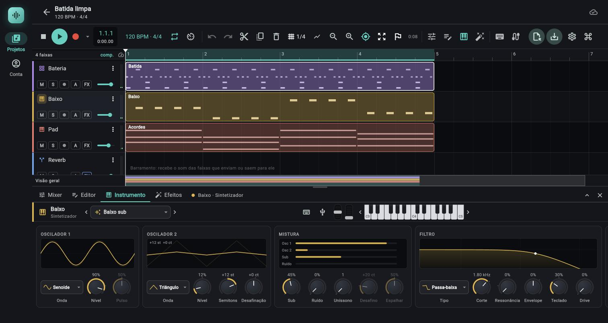

# Sintetizador

> Sintetizador subtrativo de dois osciladores com sub, ruído, uníssono, filtro ressonante, dois envelopes e um LFO: serve para baixos, leads, pads, teclas e efeitos, e sai de fábrica com 22 presets.

*Painel Instrumento do sintetizador (preset Baixo sub): osciladores 1 e 2, mistura e filtro.*

## Onde fica

1. Crie a faixa em `Nova faixa` (coluna de faixas do arranjo) > `Sintetizador`, ou selecione uma faixa `Sintetizador` existente.
2. Abra o painel de baixo na aba `Instrumento` (tecla `I`).
3. O cabeçalho (nome, presets, teclado) é o do [painel de instrumento](04-painel-de-instrumento.md); abaixo dele ficam oito cartões, da esquerda para a direita: `OSCILADOR 1`, `OSCILADOR 2`, `MISTURA`, `FILTRO`, `AMPLITUDE`, `ENVELOPE DO FILTRO`, `LFO` e `GERAL`. No celular eles quebram em linhas.

Os gestos dos knobs (arrastar, `Shift`, roda, duplo clique, botão direito) estão em [Como os knobs funcionam](04-painel-de-instrumento.md#como-os-knobs-funcionam).

## Caminho do som

Cada nota toca uma voz. Numa voz, o sinal segue esta ordem:

1. `OSCILADOR 1` e `OSCILADOR 2` geram as ondas; cada um pode ter até 7 cópias (uníssono), espalhadas na afinação e no estéreo.
2. Somam-se o `Sub` (senoide uma oitava abaixo da nota) e o `Ruído` (ruído branco); os dois vão sempre ao centro e ficam fora do uníssono.
3. O `Drive` satura o conjunto, antes do filtro.
4. O `FILTRO` (12 dB por oitava, um por canal) corta ou realça frequências; o corte se move pelo `Envelope`, pelo `Teclado` e pelo LFO.
5. O envelope de `AMPLITUDE` dá o formato de volume da nota, e a velocidade do toque e o `Volume` dão o nível final.

O LFO é um só para todo o instrumento (não recomeça a cada nota) e pode mexer na afinação (`Vibrato`), no corte (`Filtro`) e no volume (`Tremolo`).

## Controles

Os valores aparecem nos knobs no formato do app: tempos abaixo de 1 s em ms (`5.0 ms`, `300 ms`), acima em segundos (`1.20 s`), frequências em Hz ou kHz (`2.40 kHz`), porcentagens inteiras (`70%`), semitons com sinal (`+7 st`), cents com sinal (`+7 ct`), oitavas com uma casa (`1.0 oit`).

### Oscilador 1

Visor: dois ciclos da onda escolhida; o contorno fraco é a onda em nível cheio e o traço forte é a onda no `Nível` atual. Com `Quadrada`, o visor mostra a legenda `pulso NN%`.

| Controle (rótulo exato) | O que faz | Valores / padrão | Dica |
|---|---|---|---|
| Onda | Forma da onda do oscilador | Lista: `Serra`, `Quadrada`, `Triângulo`, `Senoide`; padrão `Serra` | Serra é a mais rica em harmônicos (brilhante); senoide é pura; quadrada tem só harmônicos ímpares (som "oco"); triângulo é suave |
| Nível | Volume do oscilador na mistura | 0 a 100%, padrão 80% | Em 0% o oscilador para de ser calculado |
| Pulso | Largura do pulso da onda `Quadrada` | 5% a 95%, padrão 50% | Vale para os dois osciladores: mexe em qualquer um que esteja em `Quadrada`. Fica apagado quando nenhum oscilador audível usa `Quadrada`. 50% dá a quadrada simétrica; valores baixos dão o som anasalado de pulso estreito |

### Oscilador 2

Mesmo visor; a legenda mostra a soma de afinação (por exemplo `+0 st  +7 ct`).

| Controle | O que faz | Valores / padrão | Dica |
|---|---|---|---|
| Onda | Forma da onda | Mesma lista; padrão `Serra` | Apagado com `Nível` em 0% |
| Nível | Volume do oscilador 2 | 0 a 100%, padrão 50% | Em 0% o oscilador 2 fica desligado |
| Semitons | Transposição do oscilador 2 em relação à nota | -24 a +24 st, inteiro, padrão +0 st | +12 st sobe uma oitava; +7 st soa uma quinta acima; -12 st dobra uma oitava abaixo |
| Desafinação | Ajuste fino do oscilador 2 | -100 a +100 ct, padrão +7 ct | Uns poucos cents contra o oscilador 1 dão o "batimento" que engrossa o som; 0 ct funde os dois |

### Mistura

Visor: quatro barras (`Osc 1`, `Osc 2`, `Sub`, `Ruído`) com o nível de cada fonte; com `Uníssono` acima de 1 aparece `×N` no canto.

| Controle | O que faz | Valores / padrão | Dica |
|---|---|---|---|
| Sub | Nível do sub-oscilador: senoide uma oitava abaixo da nota | 0 a 100%, padrão 0% | Firma o grave; fica no centro do estéreo e fora do uníssono |
| Ruído | Nível do ruído branco | 0 a 100%, padrão 0% | Serve para sopro, pancada e efeitos; passa pelo filtro como o resto |
| Uníssono | Número de cópias de cada oscilador tocando juntas | 1 a 7, inteiro, padrão 1 | O volume é normalizado (as cópias não somam volume); mais cópias, som mais largo e mais denso |
| Desafino | Abertura de afinação entre a cópia mais grave e a mais aguda | 0 a 100 ct, padrão +20 ct | As cópias se distribuem de -metade a +metade do valor; 30 a 35 ct dão o supersaw. Apagado com `Uníssono` em 1 |
| Espalhar | Quanto as cópias se espalham entre esquerda e direita | 0 a 100%, padrão 50% | 0% deixa o uníssono mono; 100% abre ao máximo. Apagado com `Uníssono` em 1 |

Com `Uníssono` em 1, a nota parte sempre da mesma fase da onda (ataque igual toda vez); com mais cópias, cada uma parte de uma fase sorteada, para as cópias não soarem como uma só.

### Filtro

Visor: a curva de resposta do filtro (frequência em escala logarítmica, de 20 Hz a 20 kHz), com uma bolinha no corte. O contorno fraco mostra até onde o `Envelope` leva o corte no pico.

| Controle | O que faz | Valores / padrão | Dica |
|---|---|---|---|
| Tipo | Que parte do espectro passa | Lista: `Passa-baixa`, `Passa-alta`, `Passa-banda`; padrão `Passa-baixa` | Passa-baixa tira os agudos (o clássico do subtrativo); passa-alta tira os graves; passa-banda deixa uma faixa estreita |
| Corte | Frequência de corte | 20 Hz a 20 kHz, escala logarítmica, padrão 2.40 kHz | O corte real sobe e desce com o `Envelope`, o `Teclado` e o LFO, e nunca passa de 45% da taxa de amostragem |
| Ressonância | Realce em torno do corte | 0 a 100%, padrão 20% | Em 0% o filtro não tem pico (Q 0,5); em 100% o Q chega a 30. Um limitador suaviza o pico para o som não estourar |
| Envelope | Quanto o envelope do filtro move o corte | -100% a +100%, padrão +30% | +100% abre o corte em até 6 oitavas no pico do envelope; valores negativos fazem o contrário (fecham). A velocidade do toque reduz esse efeito nas notas fracas |
| Teclado | Quanto o corte acompanha a altura da nota | 0 a 100%, padrão 50% | 100% faz o corte subir uma oitava por oitava tocada, tendo o C4 como referência; 0% deixa o corte igual para todas as notas |
| Drive | Saturação antes do filtro | 0 a 100%, padrão 0% | Engrossa e distorce; até 24 dB de ganho de entrada. Nos primeiros 12% do curso a transição de limpo para saturado é gradual |

### Amplitude

Visor: o desenho do envelope (ataque em rampa; decaimento e soltura em queda exponencial; tempos em escala logarítmica para 1 ms e 10 s caberem juntos).

| Controle | O que faz | Valores / padrão | Dica |
|---|---|---|---|
| Ataque | Tempo até o volume chegar ao máximo depois de apertar a tecla | 0,5 ms a 10 s, logarítmico, padrão 5.0 ms | Curto para baixos e plucks; longo (centenas de ms a segundos) para pads |
| Decaimento | Tempo da queda do máximo até a `Sustentação` | 1 ms a 10 s, logarítmico, padrão 300 ms | |
| Sustentação | Nível mantido enquanto a tecla está apertada | 0 a 100%, padrão 70% | Em 0% a nota morre sozinha depois do decaimento, mesmo com a tecla apertada (pluck); a voz nem é calculada depois disso |
| Soltura | Tempo da queda depois de soltar a tecla | 1 ms a 10 s, logarítmico, padrão 250 ms | Cauda da nota; pad longo pede segundos |

Os tempos dos envelopes são de queda de cerca de 99,9% do caminho no decaimento e na soltura.

### Envelope do filtro

Mesmo desenho, mas move o `Corte` em vez do volume, na quantidade do knob `Envelope` do cartão `FILTRO`. O cartão inteiro fica apagado, com a legenda `sem efeito: Envelope do filtro em 0`, quando esse knob está em 0%.

| Controle | O que faz | Valores / padrão | Dica |
|---|---|---|---|
| Ataque | Tempo para o corte chegar ao pico | 0,5 ms a 10 s, logarítmico, padrão 5.0 ms | Longo dá o filtro que "abre" devagar (pads, riser) |
| Decaimento | Tempo da queda até a `Sustentação` | 1 ms a 10 s, logarítmico, padrão 400 ms | Em plucks e baixos ácidos fica entre 150 e 350 ms |
| Sustentação | Nível em que o corte fica com a tecla apertada | 0 a 100%, padrão 20% | Em 0%, o corte volta ao valor do knob `Corte` depois do decaimento |
| Soltura | Tempo para o corte voltar depois de soltar | 1 ms a 10 s, logarítmico, padrão 300 ms | |

### LFO

Visor: a onda do LFO, com mais ciclos quanto mais rápido (de 1 a 16 ciclos na tela). O cartão fica apagado, com a legenda `sem efeito: vibrato, filtro e tremolo em 0`, quando os três destinos estão em zero.

| Controle | O que faz | Valores / padrão | Dica |
|---|---|---|---|
| Onda | Forma do LFO | Lista: `Senoide`, `Triângulo`, `Serra`, `Quadrada`, `Aleatório`; padrão `Senoide` | `Aleatório` é sample and hold: um valor novo sorteado a cada ciclo (degraus) |
| Taxa | Frequência do LFO | 0,05 a 30 Hz, logarítmico, padrão 5.00 Hz | É em Hz, não sincroniza com o andamento. Apagado quando os destinos estão em zero |
| Vibrato | Quanto o LFO oscila a afinação (para cima e para baixo) | 0 a 12 st, padrão +0 st | Vibrato natural: 0,05 a 0,1 st a 5 a 6 Hz |
| Filtro | Quanto o LFO oscila o corte, em oitavas (para cima e para baixo) | 0 a 4 oit, padrão 0.0 oit | Wobble: 2 a 3 oit numa onda lenta |
| Tremolo | Quanto o LFO baixa o volume | 0 a 100%, padrão 0% | 100% chega ao silêncio no fundo da onda |

### Geral

Visor de texto: `Mono · legato` (com `Vozes` em 1) ou `Poli · N vozes`, e embaixo `Glide 80 ms` ou `Sem glide`.

| Controle | O que faz | Valores / padrão | Dica |
|---|---|---|---|
| Glide | Tempo que a afinação leva para deslizar da nota anterior para a nova (portamento) | 0 a 2 s, linear, padrão 0 (sem glide) | O tempo é o de percorrer cerca de 99% do caminho. Vale também no modo polifônico, deslizando da última nota tocada |
| Vozes | Polifonia máxima | 1 a 16, inteiro, padrão 8 | Em 1 o instrumento é monofônico com legato: com uma tecla apertada, uma nova só muda a altura (sem reatacar os envelopes); ao soltar, volta para a tecla anterior que ainda está apertada. Baixar `Vozes` com notas tocando faz as sobras saírem em fade |
| Sens. vel. | Sensibilidade à velocidade do toque (velocity), não uma velocidade de reprodução | 0 a 100%, padrão 70% | Em 0% todas as notas soam com o mesmo volume; em 100% o volume cresce com o quadrado da força (metade da força dá -12 dB). Também reduz o efeito do envelope do filtro nas notas fracas |
| Volume | Nível de saída do instrumento | 0 a 150%, padrão 70% | Vem antes do fader da faixa no mixer; o volume por voz já deixa uma nota perto de -10 dBFS |

## Presets

O seletor de presets do cabeçalho tem 22 presets do sintetizador, em sete categorias. Todos são polifônicos, exceto onde dito "mono". Lembre: escolher um preset devolve ao padrão tudo o que ele não cita (ver [Presets](04-painel-de-instrumento.md#presets)). Além dos 22 de fábrica, você pode guardar os seus (todos os parâmetros do sintetizador) na seção `MEUS PRESETS`, no topo do menu: ver [Meus presets](04-painel-de-instrumento.md#meus-presets).

### Básico

| Preset | Caráter |
|---|---|
| Inicial | Tudo no padrão: duas serras com 7 ct de diferença e filtro passa-baixa em 2,4 kHz. Ponto de partida neutro |

### Baixos (todos mono, sem cauda longa)

| Preset | Caráter |
|---|---|
| Baixo sub | Senoide com uma pitada de triângulo uma oitava acima (12%) e sub em 45%; filtro em 1,8 kHz sem envelope; glide de 30 ms. Grave redondo que ainda aparece em caixa pequena |
| Baixo ácido (303) | Serra com corte em 260 Hz, ressonância 80%, envelope do filtro 60% com decaimento de 250 ms e sustentação zero, drive 45% e glide de 80 ms. O "guincho" da 303 |
| Reese | Duas serras desafinadas (18 ct) em uníssono 3, sub 35%, corte em 700 Hz respirando com um LFO triangular lento (0,3 Hz, 0,7 oit) e drive 35%. Baixo de drum and bass |
| Baixo Moog | Serra mais quadrada uma oitava abaixo, sub 25%, corte em 420 Hz com envelope de 45% e decaimento de 350 ms, drive 25%. Baixo gordo e áspero de analógico |

### Leads

| Preset | Caráter |
|---|---|
| Lead serra | Duas serras em uníssono 5 (18 ct, `Espalhar` 70%), corte em 3,6 kHz, vibrato leve (5,5 Hz, 0,08 st), mono com glide de 60 ms |
| Lead quadrado | Quadrada com pulso 42% mais outra uma oitava acima (35%), corte em 2,6 kHz, ressonância 35% e vibrato; mono com glide de 80 ms. Som mais "oco" e nasal |
| Supersaw | Duas serras em uníssono 7 com 35 ct de `Desafino` e `Espalhar` 100%, corte em 6 kHz e soltura de 350 ms. Parede de serras típica de trance |
| Chiptune | Quadrada com pulso 25%, sem oscilador 2, filtro totalmente aberto (20 kHz) e sem envelope, 4 vozes. O pulso cru dos consoles de 8 bits |

### Pads

| Preset | Caráter |
|---|---|
| Pad quente | Duas serras em uníssono 3, corte em 900 Hz que abre devagar (ataque do filtro 1,2 s), ataque de 0,9 s, soltura de 1,8 s e LFO triangular lento no corte; 12 vozes. Colchão macio |
| Pad estéreo | Serra mais quadrada uma oitava acima, uníssono 7 (28 ct, `Espalhar` 100%), corte em 2,2 kHz, ataque de 1,4 s, soltura de 2,6 s e LFO de 0,18 Hz no corte; 10 vozes. Largo e brilhante |
| Cordas | Duas serras (9 ct de diferença) em uníssono 4, corte em 3,2 kHz, ataque de 350 ms e vibrato leve de 5,5 Hz; 12 vozes |
| Metais | Duas serras em uníssono 2, corte em 700 Hz que abre em 70 ms com envelope de 45% (o "sopro" do naipe), drive 15% e vibrato; sensibilidade à velocidade alta (80%); 8 vozes |

### Teclas

| Preset | Caráter |
|---|---|
| Teclado (EP) | Senoide mais triângulo uma oitava acima (30%), decaimento de 1,8 s com sustentação 25% e tremolo do LFO (4,5 Hz, 18%); sensibilidade 90%. Piano elétrico de maleta |
| Órgão | Duas senoides (uma oitava de diferença) mais sub em 50%, sustentação 100%, sem sensibilidade à velocidade, vibrato e tremolo leves; 16 vozes |
| Sino | Senoides com um parcial inarmônico (+19 st e +40 ct), ressonância 50%, decaimento de 2,5 s e sustentação 0, `Teclado` em 100%; 16 vozes. Batimento metálico de sino |

### Plucks e arpejos

| Preset | Caráter |
|---|---|
| Pluck | Serra mais quadrada (pulso 30%) uma oitava acima, corte em 350 Hz que abre 70% e fecha em 220 ms, sustentação 0. Nota curta e "borbulhante" |
| Arpejo | Quadrada com pulso 30% mais serra uma oitava acima, corte em 1,4 kHz, ressonância 40%, notas curtas (decaimento 180 ms, sustentação 30%); 6 vozes. Pensado para sequências rápidas |
| Marimba | Triângulo mais senoide duas oitavas acima (15%), corte em 3 kHz, decaimento de 350 ms, sustentação 0, `Teclado` em 80%. Percussão melódica de madeira |

### Efeitos

| Preset | Caráter |
|---|---|
| Wobble | Serra mais quadrada uma oitava abaixo, sub 40%, corte em 300 Hz, ressonância 50%, drive 40% e LFO senoide de 3 Hz movendo o corte em 3 oitavas; mono. O "uóbi-uóbi" do dubstep |
| Vento | Só ruído (90%) por um passa-banda em 900 Hz com ressonância 60%, LFO triangular lento (0,15 Hz, 2 oit), ataque de 1,5 s e soltura de 2,5 s; 4 vozes |
| Subida (riser) | Serra em 40% mais ruído em 60%, uníssono 5 (30 ct), corte em 200 Hz com envelope de 80% e ataque do filtro de 8 s, ataque de amplitude de 4 s. Segure a nota: o filtro leva 8 s para abrir, e a subida é para uma virada |

## Passo a passo

### Um baixo mono

1. Selecione uma faixa `Sintetizador` e, no seletor de presets, escolha `Baixo Moog`.
2. Abra o piano roll (tecla `E`) e escreva notas graves; o glide de 20 ms liga as notas emendadas.
3. Para mais grave, suba `Sub` até 40%. Para mais "mordida", suba `Ressonância` para 45% e ajuste `Corte` entre 300 e 500 Hz.
4. Para um baixo mais curto, baixe `Sustentação` da `AMPLITUDE` para 40% ou a `Soltura` para 60 ms.

### Um pad largo do zero

1. No `OSCILADOR 1` deixe `Serra`; no `OSCILADOR 2` `Serra` com `Desafinação` em -9 ct.
2. Na `MISTURA`, `Uníssono` 4, `Desafino` 16 ct, `Espalhar` 80%.
3. No `FILTRO`, `Corte` 1,2 kHz, `Envelope` +25%; no `ENVELOPE DO FILTRO`, `Ataque` 1 s e `Decaimento` 2 s.
4. Na `AMPLITUDE`, `Ataque` 0,8 s, `Sustentação` 85% e `Soltura` 1,8 s.
5. No `GERAL`, `Vozes` 12.

### Wobble à mão

1. Comece de `Inicial`. Em `OSCILADOR 2`, `Semitons` -12; na `MISTURA`, `Sub` 40%.
2. No `FILTRO`, `Corte` 300 Hz, `Ressonância` 50%, `Envelope` 0%.
3. No `LFO`, `Onda` `Senoide`, `Taxa` 3 Hz, `Filtro` 3 oit.
4. No `GERAL`, `Vozes` 1 para o baixo ser mono. Ajuste `Taxa` (do LFO) para acelerar ou desacelerar o balanço.

### Uma nota que abre sozinha

1. Escolha `Subida (riser)`.
2. Toque uma nota longa (de 8 s ou mais) no piano roll.
3. Para o filtro abrir mais rápido, baixe o `Ataque` do `ENVELOPE DO FILTRO`; para abrir mais, suba `Envelope`.

## Combina com

- [04 Painel de instrumento](04-painel-de-instrumento.md): presets, teclado da tela, gestos dos knobs.
- [05 Piano roll](05-piano-roll.md): escrever as notas; a duração da nota vale, porque o sintetizador tem soltura.
- [06c Painel de efeitos](06c-painel-de-efeitos.md): o supersaw e os pads pedem reverberação e chorus depois do instrumento.
- [07 Automação](07-automacao.md): automatize `Corte`, `Ressonância` ou `Vibrato`; o knob fica laranja e acompanha a curva.
- [04d FM](04d-fm.md) e [04e Wavetable](04e-wavetable.md): instrumentos irmãos, com a mesma estrutura de painel.

## Limites e pegadinhas

- **`Pulso` é dos dois osciladores.** Ele fica no cartão `OSCILADOR 1`, mas a largura vale também para o oscilador 2 quando este é `Quadrada`.
- **Rótulos repetidos.** `Filtro` aparece como grupo (cartão `FILTRO`) e como destino do LFO (oitavas); `Envelope` é o quanto o filtro se move (cartão `FILTRO`), não o envelope em si (o cartão `ENVELOPE DO FILTRO`).
- **`Desafino` é afinação; `Espalhar` é panorama.** `Desafino` (em cents) abre a diferença de afinação entre as cópias do uníssono; quem abre o estéreo é `Espalhar` (em %).
- **Só um filtro, de 12 dB por oitava**, com três tipos; não há filtro em série ou em paralelo, nem modulação por matriz. O LFO tem três destinos fixos, e não sincroniza com o andamento.
- **O LFO não recomeça a cada nota**: ele corre livre para todas as vozes, então duas notas iguais tocadas em momentos diferentes pegam fases diferentes do vibrato.
- **Sub e ruído não entram no uníssono**: ficam mono, no centro.
- **Polifonia.** No máximo 16 vozes (mais 4 de folga, só para o fade da voz roubada). Ao passar do limite, a voz mais antiga, de preferência uma já solta, sai em fade de 5 ms. Pads com soltura longa consomem vozes rápido: se notas somem, suba `Vozes` ou encurte a `Soltura`.
- **Notas com `Sustentação` em 0.** A voz para de ser calculada assim que o decaimento termina, mesmo com a tecla apertada.
- **Cada mexida vai ao motor na hora**, sem estalo (os valores são suavizados), inclusive durante a reprodução.
- **Tudo o que está no cartão faz parte do projeto** e sincroniza; o nome do preset não é guardado, só os valores.
- **Knobs apagados** são os que não têm efeito agora (`Pulso`, o oscilador 2, o uníssono, o LFO ou o envelope do filtro desligados), mas continuam ajustáveis.

## Atalhos

| Tecla | Ação |
|---|---|
| `I` | Abre e fecha o painel `Instrumento` |
| `Ctrl+K` | Liga o teclado do computador (`A` a `P` tocam as notas; `Z`/`X` mudam a oitava; `C`/`V` a intensidade) |
| Duplo clique no knob | Volta ao padrão |
| `Shift` + arrastar | Ajuste fino |
| Botão direito no knob | Digitar o valor |
