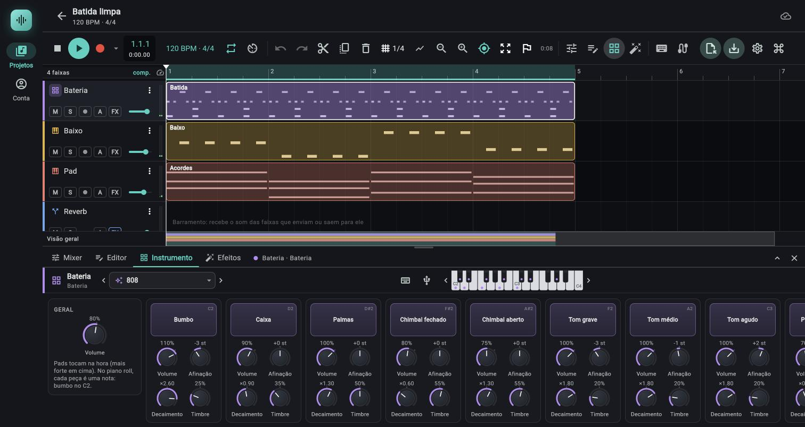

# Bateria

> Bateria eletrônica com 12 peças sintetizadas na hora (sem samples), no espírito das 808 e 909: cada peça tem volume, afinação, decaimento e timbre próprios, e há 7 kits prontos.

*Painel Instrumento da bateria (kit 808): uma coluna por peça, com volume, afinação, decaimento e timbre.*

## Onde fica

1. Crie a faixa em `Nova faixa` (coluna de faixas do arranjo) > `Bateria`, ou selecione uma faixa `Bateria`.
2. Abra o painel de baixo na aba `Instrumento` (tecla `I`).
3. O cabeçalho é o do [painel de instrumento](04-painel-de-instrumento.md), com uma diferença: o seletor chama-se `Kits de bateria` e as setas `Anterior (kit)` e `Próximo (kit)`.

O teclado da tela da bateria abre em C2 (notas 36 a 60), onde ficam as peças; os outros instrumentos abrem em C3.

### Disposição no computador (painel com 800 px ou mais)

Uma fileira com rolagem horizontal: primeiro o cartão `GERAL`, depois uma coluna por peça, na ordem Bumbo, Caixa, Palmas, Chimbal fechado, Chimbal aberto, Tom grave, Tom médio, Tom agudo, Prato de ataque, Prato de condução, Aro, Cowbell. Cada coluna tem, em cima, o pad da peça e, embaixo, os quatro knobs dela (em 2 por 2 se o painel for alto o bastante, senão numa fileira).

### Disposição no celular

Cartões em uma ou duas colunas: `PADS` (todos os 12 pads juntos, para tocar com os dedos, em 4 colunas, ou 6 se a tela for larga), `GERAL`, e um cartão por peça (`BUMBO`, `CAIXA`, `PALMAS`, `CHIMBAL FECHADO`, `CHIMBAL ABERTO`, `TOM GRAVE`, `TOM MÉDIO`, `TOM AGUDO`, `PRATO DE ATAQUE`, `PRATO DE CONDUÇÃO`, `ARO`, `COWBELL`) com os quatro knobs.

## As 12 peças e as notas MIDI

A bateria responde a notas do mapa General MIDI. O nome da nota é o do app (nota 60 = C4). No piano roll, cada peça é uma linha.

| Peça | Nota MIDI | Nota no app | Notas vizinhas que tocam a mesma peça | Posição no estéreo |
|---|---|---|---|---|
| Bumbo | 36 | C2 | 35 | Centro |
| Caixa | 38 | D2 | 40 | Centro |
| Palmas | 39 | D#2 | | Centro |
| Chimbal fechado | 42 | F#2 | 44 | Um pouco à direita |
| Chimbal aberto | 46 | A#2 | | Um pouco à direita |
| Tom grave | 41 | F2 | 43 | Esquerda |
| Tom médio | 45 | A2 | 47 | Quase no centro (leve à direita) |
| Tom agudo | 48 | C3 | 50 | Direita |
| Prato de ataque | 49 | C#3 | 52, 55, 57 | Direita |
| Prato de condução | 51 | D#3 | 53, 59 | Esquerda |
| Aro | 37 | C#2 | | Centro |
| Cowbell | 56 | G#3 | | Um pouco à esquerda |

Notas fora dessa tabela (por exemplo 34, 54, 58 e tudo a partir de 60) são ignoradas: o motor não toca nada. As posições no estéreo são discretas, vistas da plateia (chimbal e prato de ataque à direita, condução à esquerda, toms do agudo à direita ao grave à esquerda).

## Controles

### Geral

| Controle (rótulo exato) | O que faz | Valores / padrão | Dica |
|---|---|---|---|
| Volume | Nível da bateria inteira | 0 a 150%, padrão 80% | Muda na hora, com uma rampa curta, mesmo com peças soando |

No computador o cartão `GERAL` traz ainda a dica `Pads tocam na hora (mais forte em cima). No piano roll, cada peça é uma nota: bumbo no C2.`

### Pad de cada peça

O pad mostra o nome da peça e, no canto de cima, a nota (`C2`, `D2`...). Toca ao apertar (mouse com o botão principal, ou toque) e acende enquanto pressionado. A força depende de onde você aperta: no topo do pad, 100%; no fundo, 50% (nunca abaixo de 40%). Isso é o contrário do teclado de piano da tela, em que quanto mais embaixo, mais forte.

### Os quatro knobs de cada peça

O rótulo de cada knob é o mesmo em todas as peças; o que muda é o significado do `Timbre` (tabela seguinte). Cada peça tem os mesmos quatro knobs.

| Controle (rótulo exato) | O que faz | Valores / padrão | Dica |
|---|---|---|---|
| Volume | Nível da peça | 0 a 150%, padrão 100% | Muda na hora, com rampa; equilibre o kit por aqui |
| Afinação | Sobe ou desce toda a peça | -12 a +12 st, padrão +0 st, linear | Mexe em todas as frequências da peça (osciladores e filtros, parcialmente); vale a partir do próximo golpe |
| Decaimento | Multiplica o tempo de queda da peça | ×0,25 a ×4, logarítmico, padrão ×1.00 | ×0.25 deixa a peça bem mais curta; ×4 alonga. Vale a partir do próximo golpe |
| Timbre | Muda o caráter do som; depende da peça | 0 a 100%, padrão 50% | Vale a partir do próximo golpe. Ver a tabela abaixo |

Afinação, Decaimento e Timbre valem no próximo golpe, como numa bateria eletrônica de verdade: mexer neles não altera o som que já está soando. Os volumes (o da peça e o geral) mudam na hora.

### O que cada peça é, e o que o Timbre faz nela

O tempo de queda abaixo é o de cair 60 dB com `Decaimento` em ×1.00, e multiplica por esse valor.

| Peça | Como o som é feito | Queda aproximada (×1.00) | O que o Timbre faz |
|---|---|---|---|
| Bumbo | Senoide de cerca de 50 Hz com queda rápida de afinação no ataque, mais um clique de ruído e saturação | 0,5 s | Clique do ataque e saturação: 0% é redondo e limpo, 100% é estalado e saturado |
| Caixa | Duas senoides (cerca de 185 e 330 Hz) mais o ruído da esteira | Corpo 0,18 s; esteira 0,3 s | Corpo contra esteira: 0% é mais corpo (som de tom), 100% é mais chiado |
| Palmas | Quatro rajadas curtas de ruído em passa-banda, mais uma cauda, levemente aberta no estéreo | Cauda 0,32 s | Centro do passa-banda: mais escuras (baixo) ou mais claras (alto) |
| Chimbal fechado | Seis quadrados em razões metálicas (como a 808) filtrados, mais um pouco de ruído | 0,07 s | Brilho e quantidade de ruído |
| Chimbal aberto | O mesmo banco metálico, com queda rápida inicial e uma cauda de chiado | Cauda 0,6 s | Brilho e quantidade de ruído |
| Tom grave | Senoide (cerca de 98 Hz) com queda de afinação, mais o segundo modo de uma membrana e o ruído da baqueta | 0,75 s | Profundidade da queda de afinação e força do ataque da baqueta |
| Tom médio | Igual (cerca de 131 Hz) | 0,6 s | Igual |
| Tom agudo | Igual (cerca de 175 Hz) | 0,5 s | Igual |
| Prato de ataque | Banco metálico em passa-banda largo, ruído e dois envelopes (o estouro e a cauda) | Cauda 2,5 s | Brilho |
| Prato de condução | Banco metálico mais agudo e estreito, que "pinga" | Cauda 3,2 s | Brilho |
| Aro | Duas senoides curtíssimas (cerca de 1,7 kHz e 480 Hz) mais um estalo de ruído, saturadas e sem grave | 0,03 a 0,05 s | Agudo contra grave: 0% mais grave, 100% mais agudo |
| Cowbell | Dois quadrados (cerca de 540 e 800 Hz) em passa-banda | Cauda 0,5 s | Centro do passa-banda |

A força do toque também molda o som: golpes fortes ficam mais brilhantes e mais cheios (o bumbo começa mais agudo, os filtros abrem). A curva de volume por força é aproximadamente a força elevada a 1,5: uma nota fantasma a 25% soa cerca de 18 dB mais baixa que a 100%.

## Kits (presets)

O seletor `Kits de bateria` (categoria `KITS`) tem 7 kits. Cada kit fixa os quatro knobs das 12 peças e o `Volume` geral; escolher um kit sobrescreve tudo (ver [Presets](04-painel-de-instrumento.md#presets)). Valores de exemplo entre parênteses. Um kit seu (`Salvar como preset…`, seção `MEUS PRESETS` no topo do menu) guarda os mesmos 49 valores (as 12 peças e o `Volume` geral), sem as notas do piano roll: ver [Meus presets](04-painel-de-instrumento.md#meus-presets).

| Kit | Caráter |
|---|---|
| Inicial | Todos os knobs nos padrões (volumes 100%, afinação 0, decaimento ×1, timbre 50%) e `Volume` geral em 80% |
| 808 | Bumbo grave e comprido com pouco clique (volume 110%, -3 st, ×2.60, timbre 25%), caixa mais escura, toms longos e graves (×1.80, timbre 20%), chimbais e pratos suaves. O "boom" da 808 |
| 909 | Bumbo curto com clique na frente (110%, +1 st, ×0.80, timbre 75%), caixa com muita esteira (timbre 75%), chimbais e pratos brilhantes (timbre 85% no chimbal, ×1.40 no prato de ataque, ×1.50 na condução) |
| Acústico eletrônico | Bumbo curto (×0.55), caixa mais longa (×1.25, timbre 60%), palmas baixas (55%), toms mais abertos entre si (-4, -1 e +2 st, ×1.35), pratos longos (×2.00 no de ataque); `Volume` geral 85% |
| Lo-fi | Tudo mais escuro e mais curto, como sample de fita: timbres entre 15% e 30% (bumbo -1 st, ×0.70, timbre 15%), chimbais e pratos baixos; `Volume` geral 85% |
| Trap | Bumbo virando baixo (120%, -5 st, decaimento no máximo ×4.00, timbre 35%), caixa mais aguda (+2 st, ×0.70), palmas fortes (110%), chimbal fechado bem curto (×0.35, timbre 70%), toms graves e longos |
| Techno | Bumbo firme (115%, -2 st, ×1.20, timbre 60%), caixa mais baixa e seca (80%, ×0.80), chimbais curtos e brilhantes (fechado ×0.40), pratos e condução mais longos (×1.30) e brilhantes (timbre 70% a 80%), com volume de 80% |

## Programar no piano roll

A faixa `Bateria` usa o piano roll com um modo próprio: em vez de um teclado de semitons, o editor mostra as linhas das peças.

- O cabeçalho da coluna da esquerda diz `Peças` (nos outros instrumentos, `Notas`).
- Cada linha traz o nome da peça em branco e, no canto direito, o nome da nota (`C2`). As linhas vão do agudo para o grave: Cowbell, Prato de condução, Prato de ataque, Tom agudo, Chimbal aberto, Tom médio, Chimbal fechado, Tom grave, Palmas, Caixa, Aro, Bumbo (de cima para baixo).
- Uma nota das vizinhas do General MIDI aparece com o nome da peça que ela aciona, em cinza mais fraco, com o nome da nota ao lado. Uma altura que nenhuma peça reconhece aparece como `sem peça` (e não toca nada). Essas linhas extras só existem se alguma nota do clipe as usa.
- Um clipe de bateria vazio abre rolado para o fim: bumbo, caixa e chimbais (as notas graves) já à vista.
- O botão de escala e as ferramentas de acorde não existem na bateria; o `Shift` com as setas não pula oitava (cada seta move uma linha).
- A duração da nota não importa: a peça toca até o fim mesmo que você solte a nota, então notas curtas e longas soam iguais. O que muda o som é a linha, a posição e a velocidade da nota.

## Passo a passo

### Um beat básico de quatro tempos

1. No arranjo, `Nova faixa` > `Bateria`. No seletor `Kits de bateria`, escolha `909` (ou `808` para algo mais grave).
2. Dê dois cliques numa área vazia da faixa, no compasso 1 (tooltip: `Clique duas vezes para criar um clipe de notas`; no toque, dois toques). O clipe abre no piano roll.
3. Escolha o `Lápis` e a grade da barra do editor. Clique na linha `Bumbo` nas batidas 1, 2, 3 e 4; na linha `Caixa` nas batidas 2 e 4; na linha `Chimbal fechado` a cada meia batida.
4. Aperte a barra de espaço para ouvir; ative o loop (ver [02 Transporte](02-transporte.md)) para ajustar tocando.
5. Ajuste os knobs das peças no painel `Instrumento` enquanto o clipe repete.

Mais rápido: a aba `Passos` faz o mesmo desenho com um clique por passo (ou `Padrões` > `Quatro no chão`); ver [05c](05c-sequenciador-de-passos.md).

### Dinâmica e notas fantasma

1. No piano roll, mostre a faixa de velocidade (tooltip `Mostrar a faixa de velocidade`).
2. Baixe a velocidade de algumas notas de caixa e de chimbal (cerca de 25 a 40%) para virarem notas fantasma; deixe as principais em 100%.
3. Se o piano roll tocar as notas ao editar (tooltip `Não tocar as notas ao editar` indica que está ligado), você ouve a peça ao clicar.

### Afinar e encurtar as peças

1. No painel `Instrumento`, baixe o `Decaimento` do `Chimbal fechado` para ×0.40 para ele ficar seco.
2. Suba o `Timbre` do `Chimbal fechado` e do `Chimbal aberto` para 70% a 85% para mais brilho.
3. Afine os toms em intervalos (por exemplo -4, -1 e +2 st, como no kit `Acústico eletrônico`).
4. O chimbal fechado corta o aberto (e o contrário): programe o aberto e feche com o fechado quando quiser abafar.

### Tocar a bateria no computador

1. Ligue o teclado do computador (`Ctrl+K`).
2. Numa faixa de bateria o teclado já começa na oitava 2: o botão da barra mostra `C2 · sem atalhos`. Se você mexeu com `Z`/`X`, volte até `C2`.
3. Toque: `A` = Bumbo, `S` = Caixa, `E` = Palmas, `T` = Chimbal fechado, `U` = Chimbal aberto, `F`, `H` e `K` = Toms grave, médio e agudo, `O` = Prato de ataque, `P` = Prato de condução, `W` = Aro. As teclas `D`, `G`, `Y`, `J` e `L` caem em notas vizinhas do General MIDI e tocam a peça ao lado (`D` a Caixa, `G` o Tom grave, `Y` o Chimbal fechado, `J` o Tom médio, `L` o Tom agudo). O Cowbell (nota 56) fica fora dessas 16 teclas: com a oitava em C3, é a tecla `Y`.

## Combina com

- [04 Painel de instrumento](04-painel-de-instrumento.md): kits, teclado da tela, gestos dos knobs.
- [05 Piano roll](05-piano-roll.md): as linhas das peças, a grade e a faixa de velocidade.
- [05c Sequenciador de passos](05c-sequenciador-de-passos.md): a aba `Passos`, a batida em grade de quadradinhos, com swing, acentos, fantasmas e nove padrões prontos.
- [06 Mixer](06-mixer.md): os envios de reverberação para caixa e palmas, e compressão no barramento da bateria.
- [06c Painel de efeitos](06c-painel-de-efeitos.md): efeitos na faixa inteira; a bateria sai numa única faixa, então o efeito vale para todas as peças juntas.
- [07 Automação](07-automacao.md): dá para automatizar os knobs, mas `Afinação`, `Decaimento` e `Timbre` só valem no próximo golpe.
- [08 Exportação](08-exportacao.md): a bateria vai inteira num único stem, porque as 12 peças são uma faixa só.

## Sequenciador de passos (aba Passos)

Com uma faixa `Bateria` selecionada, o painel de baixo tem a aba `Passos` (entre `Editor` e `Instrumento`): a mesma batida do piano roll desenhada como grade, uma linha por peça (na ordem `Bumbo`, `Caixa`, `Palmas`, `Chimbal fechado`, `Chimbal aberto`, `Aro`, `Tom grave`, `Tom médio`, `Tom agudo`, `Prato de ataque`, `Prato de condução`, `Cowbell`) e um quadrado por subdivisão. Ela edita as mesmas notas do clipe (não há formato novo, então o piano roll, a exportação MIDI e o som não mudam) e traz o botão `Padrões` com nove ritmos prontos (`Quatro no chão`, `Rock`, `Funk`, `Hip-hop`, `Trap`, `Reggaeton (dembow)`, `Bossa nova`, `House` e `Shuffle (tercinas)`), swing e os pincéis `Normal`, `Acento` e `Fantasma`. Tudo está em [05c Sequenciador de passos](05c-sequenciador-de-passos.md); o guia [Batida com o sequenciador de passos](../guias/batida-com-o-sequenciador-de-passos.md) mostra três estilos com valores.

## Limites e pegadinhas

- **Uma faixa, um par estéreo.** Todas as 12 peças saem juntas na mesma faixa. Para tratar só o bumbo, por exemplo, use uma segunda faixa `Bateria`, ponha só as notas do bumbo nela e leve o `Volume` das outras peças a 0%.
- **Afinação, Decaimento e Timbre são do próximo golpe.** Mexer neles com uma peça soando só é ouvido no golpe seguinte; o volume muda na hora.
- **Soltar a nota não corta a peça.** Nem o `note off` do teclado, nem o fim da nota no piano roll, nem parar o transporte cortam pratos ou chimbal aberto: as caudas terminam sozinhas.
- **Chimbais se cortam.** O chimbal fechado abafa o aberto em cerca de 6 ms, e o aberto abafa o fechado.
- **Retoque da mesma peça.** Um golpe novo na mesma peça esvanece o anterior em 1,5 ms; só nos pratos (ataque e condução) a cauda anterior continua por baixo, até 3 golpes sobrepostos.
- **A oitava do teclado do computador é por tipo de faixa.** Na bateria ela começa em C2 (nota 36) e as 16 teclas `A` a `P` tocam direto; nos outros instrumentos ela começa em C4. Se você subir a oitava da bateria com `X` (por exemplo para C4, nota 60), o teclado cai fora do mapa e não toca nada: volte com `Z` até `C2`. Mudar a oitava numa bateria não muda a oitava dos outros instrumentos, e o inverso também vale.
- **Nota fora do mapa é silêncio.** Se você cola ou grava notas graves demais ou agudas demais, elas aparecem como `sem peça` e não tocam.
- **Sem MIDI de velocidade zero.** Uma nota com velocidade 0 é tratada como "soltar" e não dispara nada.
- **Tudo é sintetizado**: não há como carregar samples nas peças (para isso, use o [sampler](04c-sampler.md)).
- **Sincroniza com o projeto**: os 49 valores (12 peças por 4, mais o geral) vão junto; o nome do kit não.

## Atalhos

| Tecla | Ação |
|---|---|
| `I` | Abre e fecha o painel `Instrumento` |
| `Ctrl+K` | Liga o teclado do computador |
| `Z` / `X` (teclado ligado) | Desce ou sobe a oitava do teclado do computador, só para faixas de bateria (começa em C2; deixe em C2) |
| `A` `W` `S` `E` `F` `T` `H` `U` `K` `O` `P` (oitava C2) | Bumbo, Aro, Caixa, Palmas, Tom grave, Chimbal fechado, Tom médio, Chimbal aberto, Tom agudo, Prato de ataque, Prato de condução |
| `C` / `V` (teclado ligado) | Intensidade das notas do teclado (10% a 100%) |
