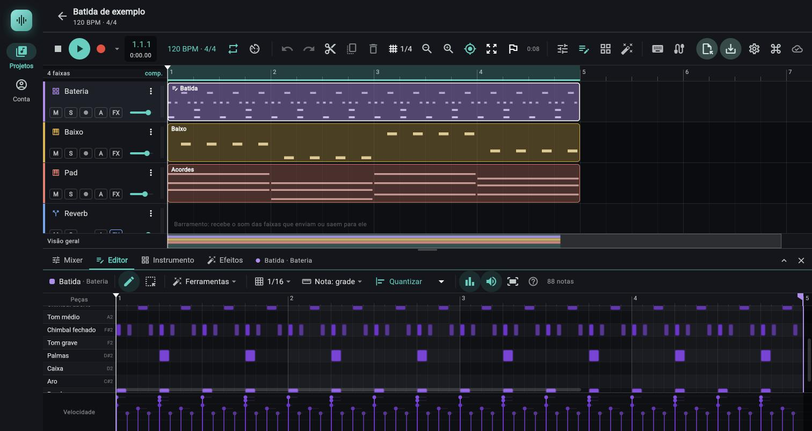

# Editor de notas (piano roll)

> Onde as notas de um clipe MIDI são escritas, movidas, apagadas e ajustadas em altura, tempo, duração e velocidade; use para compor melodias, acordes, baixos e batidas com o mouse ou com o dedo.

*Editor de notas com um clipe de bateria: uma linha por peça, grade 1/16 e o painel de velocidade embaixo.*

Este capítulo cobre o editor em si: barra de ferramentas, grade, teclado lateral, régua, painel de velocidade, faixa de controle (pitch bend, modulação e sustain), seleção, cópia, teclas e zoom. O menu **Ferramentas** (acordes, arpejador, humanizar, escalar o tempo e o resto) tem capítulo próprio: [Ferramentas MIDI](05b-ferramentas-midi.md).

Nos exemplos, "compasso" quer dizer compasso de 4 tempos; o valor real vem do projeto (`beatsPerBar`), e os atalhos "1 compasso" seguem ele.

## Onde fica

- **Abrir um clipe:** dê dois cliques num clipe de notas na linha do tempo, ou dois cliques no vazio de uma faixa de instrumento (cria um clipe novo, de um compasso, e já o abre), ou clique com o botão direito no clipe e escolha `Abrir no editor`. Não é preciso abrir o painel antes.
- **Abrir o painel sem escolher clipe:** aba **Editor** do painel de baixo (tooltip `Editor de notas (E)`), o botão de nota com lápis da barra de transporte (mesmo tooltip) ou a tecla `E`. O painel abre no clipe de notas selecionado; se nenhum estiver aberto nem selecionado, mostra "Nenhum clipe de notas aberto" com a instrução de dar dois cliques num clipe MIDI de uma faixa de instrumento.
- **Fechar:** `E` de novo, ou `Esc` (com o editor ativo e sem notas selecionadas, o `Esc` fecha o painel; com notas selecionadas ele só limpa a seleção).
- **Celular:** o painel ocupa cerca de 60% da altura disponível e não tem alça de arrastar. Linhas, teclas, alças e a faixa de velocidade ficam maiores (modo "toque"). No computador o painel tem uma alça para arrastar a altura.
- Se a barra de ferramentas não cabe na largura, ela rola na horizontal.

O editor mostra um clipe por vez. A borda de cima da barra de ferramentas fica na cor de destaque enquanto o editor é "o último lugar clicado": é nesse estado que as teclas de edição (`Delete`, `Ctrl+D`, setas, `Q`...) valem para as notas; clicando fora, elas voltam para o arranjo.

## Controles

### Barra de ferramentas, da esquerda para a direita

| Controle (rótulo exato) | O que faz | Valores / padrão | Dica |
|---|---|---|---|
| Quadradinho colorido + nome do clipe + `· nome da faixa` (tooltip `Renomear o clipe`) | Abre o diálogo `Nome do clipe` (campo `Nome`, botão `Salvar`) | até 60 caracteres; sem nome aparece `Clipe MIDI` | A cor é a da faixa; as notas usam essa cor |
| Lápis (tooltip `Lápis: clique numa área vazia cria nota, arraste define a duração`) | Ferramenta de desenho | Ligada por padrão | Com Lápis, arrastar no vazio só seleciona se você segurar `Shift` ou `Ctrl`/`Cmd` |
| Seleção (tooltip `Seleção: arraste numa área vazia seleciona; dois cliques criam nota`) | Ferramenta de seleção por retângulo | Desligada por padrão | Um clique no vazio, sem arrastar, limpa a seleção |
| `Ferramentas` (tooltip `Ferramentas de produtor: escala, acordes, arpejo, humanizar e transformações das notas`) | Abre o menu com os cinco submenus | Ver [Ferramentas MIDI](05b-ferramentas-midi.md) | Age na seleção; sem seleção, em todas as notas |
| `Escala` (tooltip `Escala do clipe: realça as notas dela e permite prender nelas`) | Abre o diálogo `Escala do clipe` | Sem escala por padrão; com escala o rótulo vira, por exemplo, `A menor natural`, em destaque | Não aparece em faixa de bateria |
| Grade (ícone de grade + rótulo; tooltip `Grade do editor (Alt ao arrastar desliga)`) | Escolhe o passo de encaixe do editor, independente da grade do arranjo | `1/4`, `1/8`, `1/16` (padrão), `1/32`, `1/8T`, `1/16T`, `Livre` | Tercinas: `1/8T` = 1/3 de tempo, `1/16T` = 1/6 de tempo. `Livre` desliga o encaixe (setas e quantização usam 1/16 nesse caso) |
| `Nota: …` (tooltip `Duração da nota nova`) | Escolhe a duração da nota criada por clique | `Seguir a grade` (padrão, rótulo `Nota: grade`), `Última usada` (rótulo `Nota: última`, mostra a duração entre parênteses no menu), `1/32`, `1/16`, `1/8`, `1/4`, `1/2`, `1/1` | `Última usada` repete a duração da última nota que você criou, esticou ou agarrou (começa em 1 tempo) |
| `Quantizar` (tooltip `Quantizar a seleção na grade (Q) · força 100%`; sem seleção diz `todas as notas`; com durações ligadas acrescenta `· durações também`) | Puxa o início das notas para a grade | Desligado se o clipe não tem notas. Usa a grade do editor (1/16 se `Livre`) | Conta a grade a partir do início do arranjo, então as notas caem na grade da música mesmo com o clipe fora do compasso |
| Seta ao lado de `Quantizar` (tooltip `Opções da quantização`) | Menu com `Força` e `Quantizar as durações também` | Força `100%` (padrão), `75%`, `50%`, `25%`; durações desligado por padrão | Força 50% anda só metade do caminho até a grade: mantém a "pegada" |
| Gráfico de barras (tooltip `Ocultar a faixa de velocidade e controles` / `Mostrar a faixa de velocidade e controles`) | Liga e desliga a faixa embaixo da grade, que mostra a velocidade ou um controle (pitch bend, modulação, sustain; ver [Faixa de controle](#faixa-de-controle)) | Ligado por padrão | Desligando, a grade ganha a altura dela |
| Alto-falante (tooltip `Não tocar as notas ao editar` / `Tocar as notas ao editar`) | Liga e desliga o som de prévia ao criar, mover, transpor e tocar as teclas | Ligado por padrão | O teclado lateral toca mesmo com a prévia desligada |
| `Enquadrar as notas` (ícone de tela cheia) | Ajusta o zoom horizontal para caber o clipe e as notas que passam dele, e a altura das linhas para caber as notas | Zoom horizontal entre 24 e 320 px por tempo (64 a 320 no toque) | Bom depois de colar ou de escalar o tempo |
| `?` (ícone de ajuda; toque para abrir) | Mostra um resumo dos gestos por 12 segundos | Texto fixo; no Mac o texto diz `⌘` no lugar de `Ctrl`. Inclui a linha `Com o teclado do computador ligado, K, J e Shift+H/L viram notas (atalhos suspensos).` | O resumo é o mesmo destas tabelas |
| Contador (`3 notas`, `1 nota`, `2 de 5 selecionadas`, `1 de 5 selecionada`) | Total de notas ou quantas estão selecionadas | Só leitura | Serve para conferir o que uma ferramenta vai afetar |

As escolhas de grade, duração de nota, ferramenta, força da quantização, faixa de velocidade, qual faixa de controle está à mostra, `Linha reta`, prévia sonora, fantasmas, "prender na escala" e "acorde no clique" valem para a sessão toda (de um clipe para outro) e voltam ao padrão quando a página é recarregada. A escala do clipe e os pontos de pitch bend, modulação e sustain, ao contrário, são gravados dentro do clipe.

### Grade de notas: mouse e toque

Cada linha é um semitom (C0 a C8; a faixa cresce se alguma nota passar disso). Em faixa de bateria cada linha é uma peça do kit (mais as alturas soltas que alguma nota use) e o canto mostra `Peças` em vez de `Notas`.

| Gesto | O que faz | Detalhe | Dica |
|---|---|---|---|
| Clique no vazio (Lápis) | Cria uma nota na linha clicada | Início: o clique arredondado para baixo na grade. Duração: `Nota:`. Velocidade: a da última nota que você criou ou agarrou (começa em 0,8, ou seja 102 de 127) | Clique logo depois da linha do tempo desejado: o início cai na linha anterior da grade |
| Arrastar depois de criar | Define a duração | Arredonda para cima na grade; mínimo de um passo (1/64 com `Alt` ou grade `Livre`). O rótulo mostra nota e duração (`1/8`, `3/16`...) | O arraste vale para todas as notas de um acorde criado com "Acorde no clique" |
| Clique numa nota | Seleciona só ela e a toca | Se ela já estava numa seleção maior, a seleção só encolhe para ela ao soltar sem arrastar | |
| `Shift` + clique numa nota | Soma a nota à seleção; em nota já selecionada, tira ela da seleção | Se você arrastar, move o grupo todo | |
| Arrastar o corpo de uma nota | Move a nota (e as outras selecionadas, juntas) | A nota agarrada encaixa na grade; as outras andam o mesmo tanto. Ninguém passa para antes do início do clipe. O rótulo mostra nota e posição `compasso.tempo.semicolcheia`. Com "Prender na escala" ligado, a altura encaixa na escala quando muda de linha | `Alt` durante o arraste tira o encaixe |
| `Alt` no começo do arraste do corpo | Duplica: arrasta cópias e deixa as originais | As cópias ficam selecionadas | Soltar no mesmo lugar deixa as cópias em cima das originais (use `Remover duplicadas` para limpar) |
| Arrastar a borda direita | Muda a duração | Zona de 6 px (12 px no toque), até um terço da nota | Vale para todas as selecionadas pelo mesmo tanto; não encolhe abaixo de um passo da grade |
| Arrastar a borda esquerda | Muda o início mantendo o fim | Só em notas com pelo menos 12 px de largura | Aumente o zoom para pegar a borda de notas curtas |
| Clique direito sobre uma nota | Apaga | Segurar o botão e passar por várias notas apaga todas | |
| Dois cliques numa nota | Apaga | Não apaga a nota que o primeiro clique acabou de criar | Evita perder a nota nova por um clique duplo |
| Seleção: arrastar no vazio | Seleciona por retângulo | Pega toda nota que toca o retângulo. Ao começar, limpa a seleção anterior | |
| Seleção: dois cliques no vazio | Cria uma nota | | É a forma de criar sem trocar de ferramenta |
| `Shift` + arrastar no vazio | Seleciona por retângulo somando à seleção atual | Funciona também com o Lápis ligado | |
| `Ctrl`/`Cmd` + arrastar no vazio | Seleciona por retângulo (troca a seleção atual) | Funciona também com o Lápis ligado | |
| Botão do meio do mouse, arrastar | Desloca a visão | | |
| Arrastar a linha do fim do clipe | Muda a duração do clipe | Tolerância de 4 px (10 px no toque); ver Régua | |
| Toque curto (celular) | Numa nota: seleciona e toca. No vazio com o Lápis: cria. No vazio com a Seleção: limpa a seleção | | |
| Toque longo, 0,45 s (celular) | Sobre uma nota: apaga. No vazio: começa a seleção por retângulo | Vibra ao disparar | |
| Dois dedos (celular) | Rolam e dão zoom | O zoom só age no eixo em que os dedos começaram afastados (mais de 48 px); dedos lado a lado não mudam a altura das linhas | Se o primeiro dedo já tinha editado, a edição é desfeita |

Quando há mais de uma nota no ponto clicado (acorde de notas iguais empilhadas), vale a última pintada; notas selecionadas ganham das outras.

### Teclado lateral

| Controle | O que faz | Valores | Dica |
|---|---|---|---|
| Teclas (faixa de instrumento melódico) | Tocam a nota ao clicar; arrastar sobre elas toca uma após a outra | Clicar mais à direita na tecla toca mais forte: velocidade `0,35 + 0,65 × posição`, entre 0,1 e 1 | Toca mesmo com a prévia desligada |
| Dois cliques numa tecla | Seleciona todas as notas daquela altura no clipe | Com `Shift` soma à seleção | Ótimo para transpor ou apagar só um som |
| Pontinhos nas teclas | Mostram as notas da escala do clipe | Ponto maior na tônica | Só aparecem com escala escolhida |
| Nomes das peças (bateria) | Peça do kit em branco; nota vizinha que aciona uma peça, em cinza mais escuro; sem peça, mais apagado | Peças: Bumbo 36 (C2), Caixa 38, Palmas 39, Chimbal fechado 42, Chimbal aberto 46, Tom grave 41, Tom médio 45, Tom agudo 48, Prato de ataque 49, Prato de condução 51, Aro 37, Cowbell 56 | Notas vizinhas do General MIDI (35, 40, 44, 43, 47, 50, 52, 55, 57, 53, 59) tocam a peça mais próxima |

O nome das notas usa letras em inglês com sustenidos (`C4`, `D#4`); C4 (dó central) é a nota MIDI 60. O nome aparece dentro da nota quando a linha tem pelo menos 12 px de altura e a nota 26 px de largura.

### Régua e cursor

| Controle | O que faz | Valores | Dica |
|---|---|---|---|
| Números de compasso | Contam a partir do compasso do arranjo em que o clipe começa (se ele começa exatamente num compasso); senão contam do início do clipe | | |
| Clique ou arraste na régua | Move o cursor de reprodução (encaixa na grade) | | O cursor é o mesmo do transporte; é nele que `Dividir no cursor` e `Ctrl+V` atuam |
| Bandeirinha e linha colorida no fim do clipe | Marcam o fim do clipe. Arrastar muda a duração do clipe | Mínimo: um passo da grade (1/16 com `Livre`/`Alt`). Se você soltar no comprimento original, nada é gravado | Puxar a bandeirinha também vale na grade, na linha do fim |
| Linha branca com triângulo | Cursor de reprodução | Com "Seguir o cursor na reprodução" ligado no transporte (padrão), a janela acompanha o cursor quando ele sai dela | |

**Fim do clipe e "loop".** O clipe de notas não tem laço próprio: ele toca uma vez, do início ao fim que você definiu. Tudo o que fica depois do fim (ou antes do início) é escurecido no editor e não toca, mas continua guardado; puxe a bandeirinha para trazer as notas de volta. Duplicar e colar aumentam o clipe até o compasso que contém a última nota nova (se ela começa até 8 compassos depois do fim). As ferramentas do menu `Ferramentas` fazem o mesmo quando empurram o fim das notas para além do que já passava do clipe (`Escalar o tempo` ×2, `Arpejador…`, `Legato`, `Inserir acorde…`...): o clipe cresce até o compasso inteiro que contém a última nota, junto com a transformação, num passo só do `Ctrl+Z`. O clipe nunca encolhe por esse caminho, e notas que já estavam além do fim antes da ferramenta continuam além. O laço de reprodução do projeto é outro recurso, do transporte.

### Painel de velocidade (`Vel.`)

Fica embaixo da grade e alinha com ela no tempo. Cada nota é um "pirulito": haste no início da nota, bolinha na altura da velocidade e um rastro fino pela duração. Linhas-guia em 25%, 50%, 75% e 100%. Altura: 72 px (84 no toque).

| Controle | O que faz | Valores | Dica |
|---|---|---|---|
| Canto à esquerda: `Vel.` (`Velocidade` em faixa de bateria, que tem teclado mais largo) | Rótulo; com uma nota só selecionada, mostra o valor dela | 1 a 127 | O valor também aparece num balão enquanto você arrasta |
| Arrastar a bolinha ou a haste de uma nota | Muda a velocidade dela; se ela está selecionada, muda todas as selecionadas pelo mesmo tanto (relativo) | 1 a 127 (nunca 0: velocidade zero seria nota desligada). A altura útil (72 px menos 6 px de margem em cima e embaixo = 60 px; 72 px no toque) cobre toda a faixa de 0 a 127 | Tolerância de 6 px na horizontal (12 no toque). Em acordes as hastes se sobrepõem: vale a bolinha mais perto do ponteiro |
| Arrastar no vazio do painel | "Pinta" velocidades por onde o ponteiro passa | Age nas selecionadas ou, sem seleção, em todas; interpola entre um evento e outro, então um arraste rápido faz uma rampa sem falhas | Para uma rampa exata entre duas notas, use `Rampa de velocidade` |
| Cor da nota | Velocidade fraca: escura e apagada; forte: clara e viva | | Dá para ver a dinâmica na própria grade |

### Faixa de controle

A faixa de baixo da grade (a mesma de 72 px, 84 no toque, que mostra a velocidade) tem quatro "visões": `Velocidade`, `Pitch bend`, `Modulação` e `Sustain`. As três últimas editam os **eventos de controle do clipe**: pontos (batida, valor) que o motor toca junto das notas, no instante exato, com o instrumento da faixa. Servem para desenhar um bend de guitarra ou de solo, um vibrato que entra devagar (roda de modulação) e o pedal de um piano. Também são o lugar onde aparece o que você gravou ao vivo com as rodas do teclado ou com um controlador MIDI (ver [Gravação](03c-gravacao.md)).

#### Escolher a visão

| Controle (rótulo exato) | O que faz | Valores / padrão | Dica |
|---|---|---|---|
| Canto esquerdo da faixa (tooltip `Faixa de controle: velocidade, pitch bend, modulação e sustain`) | Abre o menu para trocar a visão | Padrão `Velocidade` | Toque ou clique no rótulo. A escolha vale para a sessão, de um clipe para outro, e volta a `Velocidade` ao recarregar |
| Rótulo do canto | Diz o que a faixa mostra e, nas três de controle, quantos pontos o clipe tem dela | `Vel.` (`Velocidade` na bateria); `Bend`, `Mod.`, `Pedal` (na bateria, com o teclado mais largo: `Pitch bend`, `Modulação`, `Sustain`); embaixo `N pontos` ou `1 ponto` | Só leitura |
| Item `Velocidade`, `Pitch bend`, `Modulação`, `Sustain` (com marca na visão atual) | Troca a visão | | `Velocidade` é o painel de sempre (ver acima) |
| Item `Linha reta (ou Shift)` (caixa de marcar) | Liga a ferramenta reta (ver abaixo) | Desligado por padrão | Só aparece nas três visões de controle |
| Item `Limpar pitch bend`, `Limpar modulação` ou `Limpar sustain` | Apaga todos os pontos daquele controle no clipe | Apagado (cinza) quando não há ponto; uma edição só no `Ctrl+Z` | Apaga o clipe inteiro, não só o trecho visível |

#### Valores e como a curva aparece

| Visão | Valor de cada ponto | Desenho da faixa | Balão enquanto você desenha |
|---|---|---|---|
| `Pitch bend` | De -1 a +1, onde ±1 é o `Alcance do bend` do instrumento (padrão ±2 semitons; 0 a 24, ver [Painel de instrumento](04-painel-de-instrumento.md#rodas-de-pitch-bend-e-de-modulação)). O meio da faixa é o centro (sem bend) | Linha mais clara no zero e guias em ±50% | Semitons com sinal, por exemplo `+1.00 st`, `-0.50 st` (valor × alcance da faixa; 2 se o instrumento não tem o parâmetro) |
| `Modulação` | De 0 a 100% (0 a 127 no MIDI), 0 embaixo | Guias em 25%, 50%, 75% e 100% | `NN%` |
| `Sustain` | Só dois estados: solto (embaixo da faixa) e embaixo (em cima) | Guias como a modulação | `Pedal embaixo` ou `Pedal solto` |

- O valor do ponto segue a altura do ponteiro em passos de 1/127 (a resolução do MIDI). No `Pitch bend` o centro "atrai": soltar a menos de 3% do alcance (0,03 de -1 a 1) do meio dá zero exato, para voltar ao afinado sem precisar de pontaria.
- A curva é desenhada em **degraus**: cada ponto vale até o próximo (é assim que o motor toca; o próprio motor suaviza o bend em poucos milissegundos, então não se ouve escada). Por isso o lápis põe um ponto por passo da grade, e para o bend voltar ao centro é preciso um ponto em zero.
- Cada ponto é uma bolinha na cor da faixa com aro branco (a que você está arrastando fica maior e branca); a área sob a curva é preenchida em tom fraco. A parte antes do início e depois do fim do clipe é escurecida: pontos ali ficam guardados, mas não tocam.
- A batida de cada ponto encaixa na grade do editor (`Alt` no gesto desliga; com a grade `Livre` não há encaixe) e fica sempre entre 0 e o fim do clipe. O passo entre os pontos do lápis é o passo da grade (1/16 se `Livre`).
- Ao chegar ao fim do clipe, o que estiver fora do repouso volta a ele: o bend ao centro, a modulação a zero, o pedal solto. O pedal que fica embaixo não segura as notas do resto do projeto.

#### Ferramentas (mouse)

Não há botões de ferramenta: elas são gestos na faixa (o cursor vira uma mira). As ferramentas `Lápis` e `Seleção` da barra do editor só valem para as notas.

| Ferramenta | Gesto | O que faz | Detalhe |
|---|---|---|---|
| Lápis | Arrastar no vazio (`Pitch bend` e `Modulação`) | Desenha a curva por onde o ponteiro passa | Um ponto por passo da grade entre uma posição e a seguinte; pontos que já estavam no trecho percorrido são substituídos. Um clique sem arrastar cria um ponto só |
| Reta | `Shift` + arrastar no vazio, ou `Linha reta (ou Shift)` marcado no menu | Traça uma reta entre o ponto onde você apertou e onde está o ponteiro | A reta é refeita a cada movimento a partir do que havia antes; dá para arrastar para a esquerda. Substitui os pontos do trecho e mantém o valor que valia depois dele |
| Mover | Arrastar um ponto | Muda a batida (encaixa na grade) e o valor | Tolerância de 8 px em volta do ponto (16 no toque); pega o mais próximo. No `Sustain`, arrastar o ponto acima do meio da faixa o deixa "embaixo" e abaixo do meio, "solto" |
| Apagar | Clique com o botão direito num ponto, `Alt` + clique num ponto, ou segurar o ponteiro parado sobre o ponto por 0,55 s | Apaga o ponto | Cada apagamento é um passo no `Ctrl+Z` |
| Pedal pintado | Arrastar no vazio da visão `Sustain` | Pinta um trecho com o pedal embaixo (ou solto) | Ver abaixo |

**Pedal pintado.** No `Sustain` o lápis não desenha curva: arrastar de uma batida a outra pinta um trecho. Se onde você apertou o pedal estava solto, pinta "embaixo": um ponto de descida no começo do trecho e, no fim dele, um ponto que devolve o pedal ao estado que ele tinha ali antes (solto, por exemplo). Se estava embaixo, pinta "solto" (um ponto de subida no começo) e o pedal volta a descer no fim do trecho. Os pontos de pedal que estavam dentro do trecho pintado são substituídos. Um clique sem arrastar põe um ponto só: sobre um trecho solto, o pedal desce ali e fica embaixo até o próximo ponto (ou o fim do clipe); sobre um trecho embaixo, ele sobe ali. No `Sustain`, `Shift` e `Linha reta (ou Shift)` não mudam nada (o item aparece no menu, mas o gesto é sempre a pintura).

Um gesto inteiro (arrastar, desenhar, pintar) é **uma edição só** no histórico; um gesto que termina onde começou não deixa nada nele.

#### Toque (celular)

| Gesto | O que faz | Detalhe |
|---|---|---|
| Tocar e arrastar um dedo no vazio | Lápis (ou reta, com `Linha reta (ou Shift)` marcado no menu; sem teclado, o menu é o único jeito de traçar reta) | O toque já cria um ponto; os seguintes só entram depois de 8 px de movimento |
| Arrastar um ponto | Move | Tolerância de 16 px |
| Segurar o dedo parado sobre um ponto por 0,55 s | Apaga | Não apaga se o dedo se mexer |

#### Depois de gravar

O que se toca ao vivo entra no clipe como pontos dessas mesmas visões, já "afinado" para não lotar o clipe (no máximo um ponto a cada 1/48 de batida por controle). Abra o clipe, escolha a visão e edite como qualquer ponto: mova, apague, redesenhe um trecho com o lápis por cima ou use `Limpar` e recomece. `Ferramentas > Escalar o tempo` e `Inverter no tempo` levam os pontos junto ([Ferramentas MIDI](05b-ferramentas-midi.md#os-controles-nas-ferramentas)).

### Zoom e rolagem

| Gesto | O que faz | Valores | Dica |
|---|---|---|---|
| Roda do mouse na grade | Rola na vertical (e na horizontal se houver movimento lateral) | | Na régua e no painel de velocidade, rola na horizontal; no teclado, na vertical |
| `Shift` + roda | Rola na horizontal | | |
| `Ctrl`/`Cmd` + roda | Zoom horizontal no ponto do mouse (sobre o teclado lateral, zoom vertical) | 6 a 1600 px por tempo; um clipe novo abre com 64 px por tempo | |
| `Alt` + roda | Muda a altura das linhas | Melódico: 6 a 44 px (padrão 14; 22 no toque). Bateria: 14 a 72 px (padrão 24; 34 no toque) | |
| Pinça no trackpad | Zoom horizontal (sobre o teclado lateral, vertical); dois dedos rolam | | |
| Barras de rolagem finas (direita e embaixo) | Rolam arrastando o polegar | Só o polegar recebe o ponteiro; clicar fora dele continua sendo clicar na grade | A área rolável vai do começo do clipe (ou da primeira nota, se antes dele) até o fim (ou a última nota) mais 2 compassos |

O zoom e a rolagem de cada clipe ficam guardados enquanto o app está aberto: ao voltar a um clipe, ele reabre onde você deixou. Ao abrir um clipe pela primeira vez, o editor enquadra o clipe e centraliza as notas (na bateria vazia, mostra as peças graves, bumbo e caixa, embaixo).

### Fantasmas e escala na grade

- **Fantasmas** (submenu de `Ferramentas`): notas de outros clipes desenhadas em cinza translúcido, só para referência; não são editáveis e não entram em seleção. `Outros clipes da faixa` vem ligado; `Outras faixas de instrumento` vem desligado. Alinham pelo tempo do arranjo. Faixa de bateria só mostra fantasmas de outras faixas de bateria, e melódica só de melódicas.
- **Escala:** com escala escolhida, a grade realça as linhas da escala (mais forte na tônica) e escurece as de fora; o teclado ganha pontinhos. Com `Prender na escala`, notas criadas, movidas para outra linha e coladas encaixam na nota da escala mais próxima (em empate, a de baixo; ao arrastar para cima, a de cima). Ligando também `Manter o encaixe ao mudar a altura` (menu `Ferramentas > Escala e acordes`, desligado por padrão), as setas `↑`/`↓`, `Inverter na altura` e `Inserir acorde…` passam a respeitar a escala; e o item `Prender seleção na escala` leva de uma vez as notas da seleção (ou todas) para a escala. Detalhes no diálogo `Escala do clipe`, em [Ferramentas MIDI](05b-ferramentas-midi.md).

## Passo a passo

**Escrever uma melodia**

1. Dê dois cliques no vazio de uma faixa de instrumento para criar o clipe e abrir o editor.
2. Escolha a grade (`1/8` para colcheias, `1/16` para semicolcheias) e `Nota: grade`.
3. Com o Lápis, clique nas linhas e nos tempos; para uma nota mais longa, arraste para a direita antes de soltar.
4. Puxe a bandeirinha do fim do clipe na régua para dar mais compassos ao clipe, e continue.
5. Aperte `Espaço` para ouvir; ajuste com `Enquadrar as notas` se perder as notas de vista.

**Corrigir o ritmo de uma linha tocada ao vivo**

1. Aperte `Ctrl+A` (ou `Cmd+A`) para selecionar tudo, ou selecione só um trecho com `Shift` + arrastar.
2. Escolha a grade certa (`1/16`) e clique na seta ao lado de `Quantizar`.
3. Para não deixar rígido, marque `Força` `50%` e clique em `Quantizar` (ou tecle `Q`).
4. Se quiser que os finais também encaixem, marque `Quantizar as durações também`.
5. Confira: um passo só de `Ctrl+Z` desfaz.

**Dar dinâmica (notas fortes e fracas)**

1. Deixe a faixa de velocidade ligada (ícone de gráfico de barras).
2. Arraste as bolinhas das notas que devem soar mais forte ou mais fraca; com várias selecionadas, a mudança é relativa.
3. Para um crescendo, escolha a primeira e a última nota (suas velocidades) e use `Ferramentas > Seleção > Rampa de velocidade`.

**Desenhar um bend de duas notas (ou de um solo)**

1. Escolha um instrumento com afinação (`Sintetizador`, `FM`, `Wavetable` ou `Sampler`); a `Bateria` ignora o bend.
2. No canto esquerdo da faixa de baixo, escolha `Pitch bend`.
3. Arraste com o lápis por baixo da nota, de uma batida antes do fim dela até o fim, subindo do meio da faixa até o topo: o balão mostra `+2.00 st` no topo com o alcance padrão.
4. Ponha um ponto no centro (clique perto do meio da faixa) depois do fim da nota, para o bend voltar a zero.
5. Toque: para bends maiores (uma oitava, por exemplo), suba o `Alcance do bend` do instrumento para 12 no cartão `GERAL`.

**Segurar acordes com o pedal**

1. Escolha a visão `Sustain`.
2. Arraste do começo de cada acorde até um passo da grade antes do acorde seguinte: cada arraste pinta um trecho de pedal embaixo.
3. Ouça: as notas que terminam dentro de um trecho continuam soando até o pedal subir (vale para todos os instrumentos, menos a bateria). É na subida do pedal que o acorde anterior é solto e entra a soltura do instrumento.

**Repetir um trecho**

1. Selecione as notas do compasso.
2. `Ctrl+D` cria a cópia logo depois do trecho (em compassos inteiros, se ele passa de meio compasso) e a seleciona.
3. Aperte `Ctrl+D` de novo para encadear cópias; o clipe cresce sozinho até caber.
4. Para colar em outro clipe, use `Ctrl+C` no primeiro, abra o outro clipe, posicione o cursor na régua e use `Ctrl+V`.

## Combina com

- [Ferramentas MIDI](05b-ferramentas-midi.md): acordes, arpejador, humanizar, legato, escalar o tempo e limpeza das notas; todas usam a seleção do editor.
- [Melodia e harmonia com as ferramentas](../guias/melodia-e-harmonia-com-as-ferramentas.md): receitas que juntam escala, acorde no clique, arpejo, humanizar e quantizar.
- Instrumentos e faixas: o som que sai é o do instrumento da faixa do clipe; a prévia ao editar usa esse mesmo instrumento.
- Gravação: notas tocadas no teclado do computador ou MIDI e gravadas viram notas de um clipe que se edita aqui (ver capítulo de gravação). Pitch bend, modulação e pedal tocados junto entram no mesmo clipe, na faixa de controle: [Gravação](03c-gravacao.md).
- [Painel de instrumento](04-painel-de-instrumento.md): as rodas de bend e de modulação do teclado da tela e o `Alcance do bend` de cada instrumento.
- [Expressão MIDI na prática](../guias/expressao-midi-na-pratica.md): solo com bend e vibrato, pedal em acordes, bend desenhado e gravação com teclado MIDI.
- [Expressão MIDI (técnico)](../dev/04-expressao-midi.md): como os pontos chegam ao motor.

## Limites e pegadinhas

- **Notas fora do clipe não tocam.** Notas movidas ou coladas além do fim ficam escurecidas: estique o clipe. `Escalar o tempo` e as outras ferramentas do menu `Ferramentas` esticam o clipe sozinhas quando o fim das notas passa do fim dele (até o compasso que as contém); se não quiser o clipe maior, use `Ctrl+Z` (volta notas e comprimento juntos) ou puxe a bandeirinha do fim de volta (testado só por testes automáticos).
- **Não há loop do clipe** dentro do editor; o clipe toca uma vez do começo ao fim que você definiu.
- As preferências do editor (grade, ferramenta etc.) não são salvas com o projeto; a escala do clipe e as notas são.
- Com o **teclado musical do computador ligado** (`Ctrl+K`; o botão da barra superior mostra `C4 · sem atalhos`), as letras `A W S E D F T G Y H U J K O L P` tocam notas antes de virarem atalhos: `K`, `J`, `Shift+H` e `Shift+L` não dividem, unem, humanizam nem fazem legato. `Q` e as setas seguem funcionando.
- As teclas de edição valem assim que o editor abre (ele nasce ativo) e deixam de valer quando você clica fora dele; um clique de volta dentro do editor o reativa. Com o editor ativo, `Delete` nunca apaga o clipe, só notas (sem seleção não faz nada).
- Segurar uma seta ou uma tecla repetida é uma edição só no histórico; o histórico guarda os últimos 200 passos.
- Transpor com as setas, `Inverter na altura` e `Inserir acorde…` só respeitam a escala se `Prender na escala` **e** `Manter o encaixe ao mudar a altura` estiverem ligados (o segundo vem desligado). Sem ele, essas operações podem gerar notas fora da escala; o encaixe padrão age só em criar, mover de linha e colar. `Prender seleção na escala` funciona sozinho, sem depender dos dois. Em faixa de bateria, nada disso existe (testado só por testes automáticos).
- **Controles são do clipe, não das notas.** Colar (`Ctrl+V`), duplicar (`Ctrl+D`), recortar e apagar notas, `Quantizar`, `Humanizar`, `Legato` e `Dividir no cursor` não movem, copiam nem cortam os pontos de bend, modulação e pedal. Só `Escalar o tempo` e `Inverter no tempo` (e, na linha do tempo, cortar, duplicar, mover e aparar o clipe) os levam junto; ver [Ferramentas MIDI](05b-ferramentas-midi.md#os-controles-nas-ferramentas).
- As ferramentas do menu `Ferramentas` ficam apagadas num clipe sem notas, mesmo que ele tenha pontos de controle.
- A faixa de controle não olha a seleção de notas: `Limpar` apaga o controle do clipe todo.
- Em faixa de **bateria** a faixa de controle aceita pontos, mas a bateria ignora bend, modulação e pedal: nada muda no som.
- Em faixa de bateria: sem botão `Escala`, sem acordes e sem `Inverter na altura`; `Shift+↑/↓` move uma linha (não uma oitava); as linhas são peças, não semitons. Alturas sem peça aparecem como `sem peça` e não soam.
- A quantização usa a grade do editor, não a do arranjo.
- Colar sem cursor dentro do clipe põe as notas no começo da parte visível; colar de novo no mesmo ponto põe a cópia logo depois da anterior. A área de transferência de notas vale para a sessão e funciona entre clipes, mas não sobrevive ao recarregar a página.

## Atalhos

Valem com o editor ativo (último lugar clicado) e sem estar digitando num campo. `Ctrl` vira `Cmd` no Mac.

| Tecla | Ação |
|---|---|
| `Delete` ou `Backspace` | Apaga as notas selecionadas |
| `Esc` | Limpa a seleção (sem seleção, o atalho geral fecha o painel) |
| `Ctrl+A` | Seleciona todas as notas |
| `Ctrl+C` | Copia a seleção |
| `Ctrl+X` | Recorta a seleção |
| `Ctrl+V` | Cola no cursor de reprodução (se ele está dentro do clipe) ou no começo da parte visível |
| `Ctrl+D` | Duplica a seleção logo depois dela |
| `Q` | Quantiza a seleção (ou todas as notas) na grade, com a força e a opção de durações escolhidas |
| `K` | Divide no cursor as notas que ele atravessa (seleção ou todas) |
| `J` | Une notas iguais adjacentes (seleção ou todas) |
| `Shift+H` | Humaniza com os últimos ajustes do diálogo (sorteio novo a cada vez) |
| `Shift+L` | Legato: cada nota vai até o início da próxima |
| `↑` / `↓` | Transpõe a seleção 1 semitom (na bateria, 1 linha) |
| `Shift+↑` / `Shift+↓` | Transpõe 1 oitava (12 semitons; na bateria, 1 linha) |
| `←` / `→` | Move a seleção 1 passo da grade (1/16 se `Livre`) |
| `Shift+←` / `Shift+→` | Move a seleção 1 compasso |
| `Alt` (segurado ao arrastar) | Tira o encaixe da grade |
| `Alt` (segurado ao começar a arrastar uma nota) | Duplica em vez de mover |
| `Shift` + arrastar na faixa de controle | Traça uma reta em vez de desenhar com o lápis (`Pitch bend` e `Modulação`) |
| `Alt` + clique num ponto da faixa de controle | Apaga o ponto |
| `Alt` (segurado ao arrastar na faixa de controle) | Tira o encaixe da grade nas batidas |
| `Shift` / `Ctrl` + arrastar no vazio | Seleção por retângulo (`Shift` soma) |
| `Shift` + clique numa nota | Soma ou tira da seleção |
| `Ctrl` + roda | Zoom horizontal |
| `Alt` + roda | Altura das linhas |
| `Shift` + roda | Rolagem horizontal |
| `E` | Abre e fecha o painel do editor |
