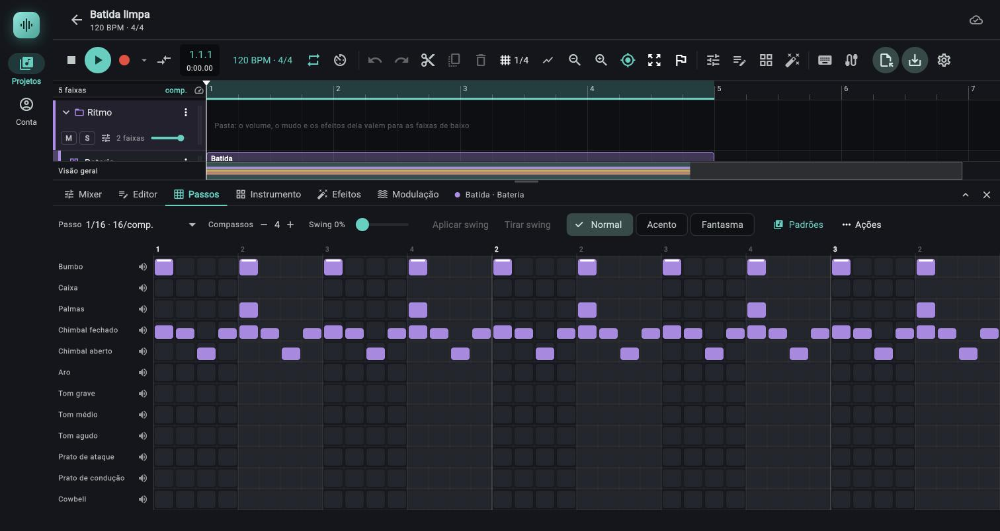
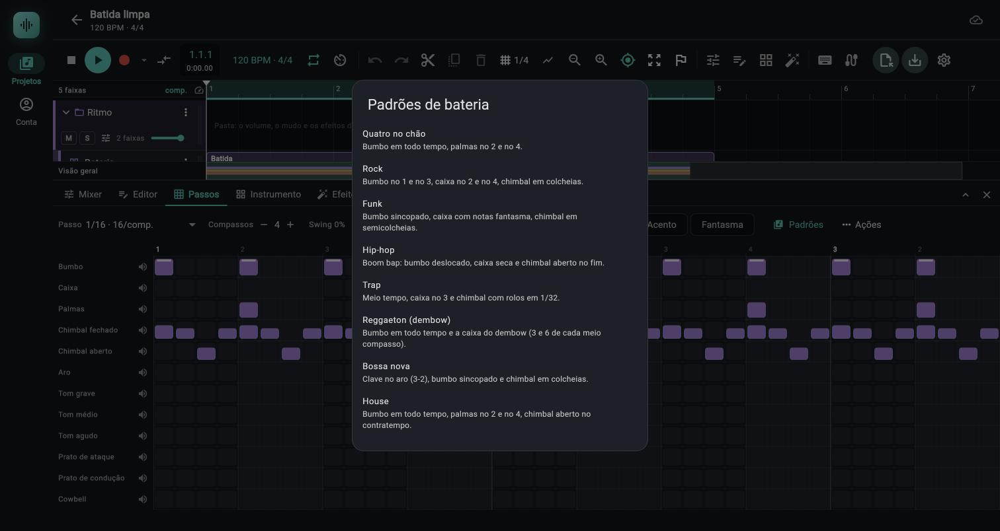

# Sequenciador de passos

> Uma grade de quadradinhos (uma linha por peça da bateria ou por fatia do sampler, um quadrado por subdivisão do compasso) para programar batidas com cliques em vez de notas no piano roll; use para montar um ritmo em minutos, com acentos, notas fantasma, swing e nove padrões de fábrica.

*A aba Passos de uma faixa de bateria: a barra (Passo, Compassos, Swing, Aplicar swing e Tirar swing, os pincéis Normal, Acento e Fantasma, Padrões e Ações) e a grade com uma linha por peça; a batida que já existia aparece como grade.*

*O diálogo Padrões de bateria, com a descrição de cada padrão de fábrica; escolher um escreve o padrão na faixa e avisa com uma mensagem.*

## Onde fica

- Aba `Passos` do painel de baixo (tooltip `Sequenciador de passos da bateria e do sampler fatiado`), entre `Editor` e `Instrumento`. Não há botão na barra de transporte nem tecla própria.
- A aba só aparece na barra de abas quando a faixa selecionada é uma `Bateria` ou um `Sampler` que tem ao menos uma zona (áudio único, sem zonas, não conta). Se você já está na aba e seleciona uma faixa de outro tipo, a aba fica e mostra `Sequenciador de passos` com o texto `Selecione uma faixa de bateria ou um sampler com zonas (fatias) para desenhar batidas em passos.`
- O assunto ao lado das abas diz `<clipe> · <faixa>` (ou só `<faixa>`, se o clipe não tem nome).
- Com a aba `Passos` visível há seis abas: abaixo de 760 px de largura os rótulos somem e ficam só os ícones (sem a aba `Passos`, o limite é 560 px). Isso vale para o computador e para o celular.
- `E`, `I`, `X` e `F` trocam para as abas `Editor`, `Instrumento`, `Mixer` e `Efeitos`, como sempre; não existe atalho que abra a aba `Passos`.

**Que clipe a grade edita.** O clipe de notas da faixa selecionada, nesta ordem: o clipe selecionado no arranjo, o aberto no editor, ou o que está debaixo do cursor de reprodução. Sem nenhum deles, a aba mostra `Nenhum clipe de notas sob o cursor`, o texto `A faixa <nome> não tem um clipe de notas aqui.` e o botão `Criar clipe aqui`. O botão cria um clipe de um compasso a partir do começo do compasso do cursor (empurrado para depois de um clipe que já ocupe o lugar, e encurtado se o próximo clipe começa antes de fechar o compasso).

**É uma visão, não um formato.** A grade lê e escreve as mesmas notas do clipe que o [piano roll](05-piano-roll.md) mostra. Não há dado novo no projeto: o som, o `.mid` exportado, o `Ctrl+Z` e a sincronização são os das notas de sempre.

## Controles

### Barra da aba

Em janelas de 700 px ou mais a barra quebra em linhas; abaixo disso ela é uma linha só que rola na horizontal.

| Controle (rótulo exato) | O que faz | Valores / padrão | Dica |
|---|---|---|---|
| `Passo` (menu) | Escolhe a resolução: quanto vale um quadrado | `1/4 · 4/comp.`, `1/8 · 8/comp.`, `1/8 tercina · 12/comp.`, `1/16 · 16/comp.`, `1/16 tercina · 24/comp.`, `1/32 · 32/comp.`, `1/64 · 64/comp.` (o número depois do ponto é quantos passos cabem num compasso de 4 tempos; em outro compasso ele muda). Padrão `1/16` | Trocar a resolução não mexe nas notas, só na grade que as lê |
| `Compassos` com `−` (tooltip `Menos um compasso`), número e `+` (tooltip `Mais um compasso`) | Tamanho do padrão, em compassos | 1 a 8. Enquanto você não mexe nos botões, é automático: os compassos que cobrem as notas do clipe (pelo início da última nota), no mínimo 1 e no máximo os compassos do clipe | Depois do primeiro clique em `−` ou `+` o valor fica fixo até você fechar o app |
| `Swing N%` e o controle deslizante ao lado | Escolhe o swing que `Aplicar swing` vai gravar | 0 a 75%, de 1 em 1; padrão 0% | Só o número muda ao arrastar; as notas só andam ao clicar em `Aplicar swing` |
| `Aplicar swing` | Atrasa as notas dos passos pares até o valor escolhido | Só liga quando o controle está diferente do swing já aplicado. Aviso: `Swing de N% aplicado (M notas).` | Um passo do `Ctrl+Z` |
| `Tirar swing` | Devolve as notas ao passo reto | Só liga quando há swing aplicado. Aviso: `Swing tirado (M notas).` | Um passo do `Ctrl+Z` |
| `Normal`, `Acento`, `Fantasma` (pincéis) | Escolhem a velocidade dos passos que você liga | `Normal` 0,80 (padrão), `Acento` 1,00, `Fantasma` 0,30 | Vale também para `Inverter` e `Preencher a cada N passos…` |
| `Padrões` (só na bateria) | Abre `Padrões de bateria`, com 9 padrões prontos | Ver [Padrões de fábrica](#padrões-de-fábrica) | No sampler o botão não existe |
| `Ações` (ícone de reticências; tooltip `Ações do padrão`) | Menu de operações sobre o padrão | Ver [Ações](#ações) | |

Depois de uma ação, um aviso em cor de destaque aparece sob a barra (`Padrão copiado (N notas).` e os outros abaixo). Ele some quando você troca a resolução ou faz outra ação sem aviso.

Nada dessa barra é salvo com o projeto: resolução, `Compassos`, swing aplicado, pincel e linha selecionada valem enquanto o app está aberto, um conjunto por clipe.

### A grade

| Elemento | O que é | Dica |
|---|---|---|
| Nomes das linhas (152 px de largura; 112 px abaixo de 560 px de janela) | Uma linha por peça ou fatia. Tocar no nome seleciona a linha (fundo colorido e nome em negrito); tocar de novo tira a seleção | A seleção decide a quem as `Ações` se aplicam e abre a faixa `Velocidade` |
| Alto-falante no fim do nome (tooltip `Ouvir <nome>`) | Toca a peça uma vez, na velocidade 0,80, por 220 ms | Só com o transporte parado |
| Régua de cima | Um número por tempo: o do compasso em destaque no começo de cada um, depois `2`, `3`, `4` | Em `1/4` cada quadrado é um tempo |
| Quadrados (32 a 56 px de largura, 32 px de altura) | Cada um é um passo. Apagado: cinza escuro. Aceso: a cor da faixa | A grade ocupa a largura da janela; se 32 px por passo não cabem, ela rola na horizontal |
| Altura do preenchimento | Mostra a velocidade: de 30% da altura (velocidade 0) a 100% (velocidade 1) | Um filete branco no topo marca o acento; o fantasma fica mais transparente |
| Contorno âmbar com um ponto | Nota fora da grade (ver adiante) | |
| Faixa de fundo mais clara | Os tempos 2 e 4 (a cada tempo par) | Ajuda a se localizar em `1/32` e `1/64` |
| Passos escurecidos | Passos que caem depois do fim do clipe | Não se editam por clique; estique o clipe |
| Linha vertical branca | O cursor de reprodução, com o passo atual iluminado. Ele dá a volta na largura do padrão (`Compassos`) e a grade rola sozinha para acompanhá-lo | Só na reprodução |
| Faixa `Velocidade <nome da linha>` (64 px de altura, embaixo da grade) | Aparece quando há uma linha selecionada: uma barra por passo aceso | Ver [Velocidade](#velocidade-pincéis-acento-duplo-clique-e-a-faixa) |

## Gestos

| Gesto | O que faz |
|---|---|
| Clicar num passo apagado | Acende com a velocidade do pincel e toca a peça (se o transporte está parado) |
| Clicar num passo aceso | Apaga (todas as notas que caem naquele passo) |
| Arrastar com o mouse | O primeiro passo decide: começando num passo apagado, o arraste acende os apagados por onde passa; começando num aceso, apaga. Ele fica na linha em que começou. Um gesto inteiro é um passo do `Ctrl+Z` |
| Dois cliques rápidos no mesmo passo (até 320 ms entre eles) | O passo vira acento (1,00), qualquer que seja o pincel. Cada clique é um passo do `Ctrl+Z` |
| Toque curto (celular) | Liga ou desliga o passo, como um clique |
| Arrastar o dedo (celular) | Rola a grade; não pinta |
| Segurar o dedo 300 ms e arrastar (celular) | Pinta ou apaga como o mouse, com a rolagem travada. Mexer o dedo mais de 10 px antes disso cancela o toque longo e vira rolagem |
| Tocar o nome da linha | Seleciona ou desmarca a linha. Clicar num passo também seleciona a linha dele |

## Velocidade: pincéis, acento, duplo clique e a faixa

- **Os três pincéis** gravam a velocidade de cada passo novo: `Normal` 0,80, `Acento` 1,00, `Fantasma` 0,30. Um passo é lido como acento a partir de 0,95 e como fantasma até 0,40; qualquer valor entre eles aparece como normal. Trocar o pincel não muda passos que já estão acesos.
- **Duplo clique** acende (ou reacende) o passo como acento, mesmo com o pincel em `Normal`.
- **Faixa `Velocidade`**: com uma linha selecionada, arraste sobre a barra de um passo aceso: a altura do ponteiro dentro dos 64 px vira a velocidade (topo 1,00, base 0,05). Só muda passos que já existem; nunca cria nem move nota. Um gesto inteiro é um passo do `Ctrl+Z`.
- Uma nota vinda do piano roll com velocidade 0,55, por exemplo, aparece como passo normal, com o preenchimento na altura certa.
- No `Sampler` a velocidade escolhe a camada de velocidade das zonas (ver [04c](04c-sampler.md)); na bateria ela muda o nível e um pouco o timbre do golpe (ver [04b](04b-bateria.md#programar-no-piano-roll) e o passo a passo de notas fantasma).

## Resoluções e como a grade lê as notas

- **A grade não adivinha a resolução.** Ela abre em `1/16` (16 passos por compasso de 4 tempos) em todo clipe e só muda quando você escolhe outra em `Passo` ou aplica um padrão de fábrica. `Compassos`, esse sim, é calculado pelas notas do clipe enquanto você não o fixa.
- **Passo aceso** quer dizer: existe nota daquela linha a até 1/1000 de batida do início do passo.
- **Fora da grade.** Uma nota que não cai em nenhum passo (humanizada, tocada ao vivo, ou escrita em `1/32` quando a grade está em `1/16`) aparece no passo mais próximo, com contorno âmbar e um ponto. Se a nota fica no meio de dois passos, vai para o anterior. Editar outros passos não a move. Apagar aquele passo apaga todas as notas dele, as fora da grade também.
- **Duas notas no mesmo passo.** Se a resolução é mais grossa que a das notas, várias notas da mesma linha caem no mesmo quadrado. Se uma delas está exatamente no passo, o quadrado parece normal e as outras ficam escondidas atrás; clicar nele apaga todas juntas. Para ver o que há de verdade, escolha a resolução que combina com as notas (por exemplo `1/32` num padrão de rolos).
- **Tercinas.** `1/8 tercina` (12 passos por compasso de 4/4) e `1/16 tercina` (24) dividem o tempo em 3 e em 6. Notas de tercina em grade reta aparecem fora da grade, e o contrário também.
- **Outros compassos.** Em 3/4 o compasso tem 3 tempos; o número de passos por compasso e o desenho da régua seguem o compasso do clipe no mapa de compassos ([guia](../guias/mapa-de-andamento-e-compasso.md)).
- **Notas fora do padrão.** Notas depois do fim do padrão (`Compassos`) e notas de alturas que não são linhas da grade (por exemplo uma nota melódica num clipe de bateria) não aparecem e não são mexidas pelas ações de limpar, inverter, deslocar e preencher. Só `Repetir até o fim do clipe` as leva.
- **Comprimento das notas que a grade cria:** o do passo, no máximo 1/16 de batida (0,25). A bateria toca a peça inteira de qualquer jeito; no `Sampler`, ver [Sampler com zonas](#sampler-com-zonas).

## Swing

- **A conta.** Os passos pares da grade (o 2º, o 4º, o 6º..., contando de 1) começam mais tarde que o passo reto por `swing × duração do passo`. A 1/16 (0,25 batida) e 50%, o 2º passo de cada par sai 0,125 batida depois (62,5 ms a 120 BPM). A 33% o segundo 16 cai em 0,3325 batida, quase a tercina (0,333); 75% é o máximo. Vale em qualquer resolução: em `1/8` atrasa as colcheias fracas, em `1/16` as semicolcheias fracas.
- **`Aplicar swing`** move só as notas que estão exatamente num passo par no swing atual, em todas as linhas. Notas fora da grade e passos ímpares (o 1º, o 3º...) não se movem. Se já havia swing aplicado, ele vai do valor atual ao novo.
- **A grade passa a enxergar o swing.** Depois de aplicar, os passos continuam acesos e os novos cliques nos passos pares já caem atrasados.
- **`Tirar swing`** volta as notas dos passos pares ao passo reto.
- **O swing aplicado é estado da tela, não do projeto.** Fechar o app (ou recarregar a página) esquece que havia swing: as notas seguem atrasadas, agora aparecem com contorno âmbar nos passos pares, e `Tirar swing` fica apagado (para a tela, o swing é 0). Para desfazer nessa situação, use `Quantizar` no [piano roll](05-piano-roll.md) com a grade em `1/16` `(dedução)`. Dentro da mesma sessão, `Ctrl+Z` logo depois de aplicar desfaz as notas, mas o valor de swing da tela permanece, e os passos pares aparecem fora da grade até você tirar o swing ou mexer no controle `(lido do código, não confirmado no app)`.
- **Padrão de fábrica com swing ligado:** o padrão chega reto (sem swing) e os passos pares dele aparecem como fora da grade. Aplique o swing depois do padrão, não antes.

## Padrões de fábrica

O botão `Padrões` (só na bateria) abre `Padrões de bateria`, uma lista de 9 itens com nome e descrição; tocar num item aplica na hora, sem confirmação.

**O que aplicar faz:** apaga as notas das 12 peças da bateria nos primeiros 4 tempos por compasso do padrão (`bars × 4` batidas, contadas a partir do começo do clipe) e escreve as do padrão. Notas de outras alturas e notas depois dessa faixa ficam. Notas que passariam do fim do clipe não são escritas. A resolução da grade e `Compassos` mudam para os do padrão (todos têm 1 compasso de 4 tempos; em 3/4 são 2 compassos). O swing aplicado e o pincel continuam como estavam. Aviso: `Padrão "<nome>" aplicado.` Um passo do `Ctrl+Z`.

Nas linhas abaixo, cada caractere é um passo na resolução indicada: `.` vazio, `x` normal (0,80), `X` acento (1,00), `o` fantasma (0,30).

| Padrão (item da lista) | Resolução | Bumbo | Caixa / palmas / aro | Chimbal fechado | Chimbal aberto |
|---|---|---|---|---|---|
| `Quatro no chão` (`Bumbo em todo tempo, palmas no 2 e no 4.`) | `1/16` | `x...x...x...x...` | Palmas `....x.......x...` | `x.x.x.x.x.x.x.x.` | |
| `Rock` (`Bumbo no 1 e no 3, caixa no 2 e no 4, chimbal em colcheias.`) | `1/16` | `x.......x.x.....` | Caixa `....x.......x...` | `x.x.x.x.x.x.x.x.` | |
| `Funk` (`Bumbo sincopado, caixa com notas fantasma, chimbal em semicolcheias.`) | `1/16` | `x..x...x..x.....` | Caixa `....x..o.o..x..o` | `XxxxXxxxXxxxXxxx` | |
| `Hip-hop` (`Boom bap: bumbo deslocado, caixa seca e chimbal aberto no fim.`) | `1/16` | `x.....x..x......` | Caixa `....x.......x...` | `x.x.x.x.x.x.x.x.` | `..............x.` |
| `Trap` (`Meio tempo, caixa no 3 e chimbal com rolos em 1/32.`) | `1/32` | `x.........x.x...` (16 caracteres, cada um vale 1/16) | Caixa `........x.......` (16 caracteres de 1/16, um só golpe: o tempo 3) | `x...x...x...x...x.x.x.x.oxoxxXXX` (32 caracteres de 1/32) | |
| `Reggaeton (dembow)` (`Bumbo em todo tempo e a caixa do dembow (3 e 6 de cada meio compasso).`) | `1/16` | `x...x...x...x...` | Caixa `...x..x....x..x.` | `x.x.x.x.x.x.x.x.` | |
| `Bossa nova` (`Clave no aro (3-2), bumbo sincopado e chimbal em colcheias.`) | `1/16` | `x..x....x..x....` | Aro `x..x..x...x..x..` | `x.x.x.x.x.x.x.x.` | |
| `House` (`Bumbo em todo tempo, palmas no 2 e no 4, chimbal aberto no contratempo.`) | `1/16` | `x...x...x...x...` | Palmas `....x.......x...` | `.o.o.o.o.o.o.o.o` (fantasmas) | `..x...x...x...x.` |
| `Shuffle (tercinas)` (`Balanço ternário: três passos por tempo.`) | `1/8 tercina` | `x.....x.....` | Caixa `...x.....x..` | `x.xx.xx.xx.x` | |

Cada linha do padrão vira notas na linha da peça de mesmo nome: `Bumbo` (nota 36), `Caixa` (38), `Palmas` (39), `Aro` (37), `Chimbal fechado` (42), `Chimbal aberto` (46).

Notas sobre o que cada padrão escreve de fato (lidas do código):

- No `Trap`, na grade de 32 passos o bumbo cai nos passos 1, 21 e 25 (no tempo 1, no "e" do tempo 3 e no tempo 4) e a caixa no passo 17 (tempo 3). O chimbal faz colcheias do passo 1 ao 17 (de 4 em 4), semicolcheias nos passos 19, 21 e 23 e, no último tempo, o rolo em 1/32: fantasmas nos passos 25 e 27, normais nos 26, 28 e 29 e três acentos nos 30, 31 e 32.
- No `Rock` a descrição diz "bumbo no 1 e no 3", mas a linha do bumbo tem também o passo 11 (o "e" do tempo 3): `x.......x.x.....`.
- No `House` os chimbais fechados são todos fantasmas nos passos 2, 4, 6... (o "e" e o "a" de cada tempo) e o aberto fica no "&" de cada tempo. Como o fechado abafa o aberto e o aberto abafa o fechado (6 ms de fade, ver [04b](04b-bateria.md#limites-e-pegadinhas)), o aberto soa só até o fantasma seguinte, um 16 depois.
- No `Hip-hop` o chimbal fechado e o aberto caem juntos no passo 15; na ordem em que entram, o aberto vence e corta o fechado.
- Cada padrão tem 1 compasso. Para tocar um clipe de 4 compassos, use `Ações` > `Repetir até o fim do clipe`.

## Ações

O menu `Ações` abre com uma linha desativada, `Vale para: todas as linhas` (sem linha selecionada) ou `Vale para: <nome da linha>`, e itens. As ações trabalham só dentro do padrão (`Compassos`) e cada uma é um passo do `Ctrl+Z`.

| Item | O que faz | Detalhes |
|---|---|---|
| `Limpar linha` | Apaga os passos da linha selecionada | Desativado sem linha selecionada |
| `Limpar tudo` | Apaga os passos de todas as linhas da grade | Ignora a seleção. Não mexe em notas de fora das linhas nem nas depois do padrão |
| `Copiar padrão` | Guarda as notas do escopo (linha selecionada ou todas) | Aviso `Padrão copiado (N notas).`. A cópia fica na memória do app: vale entre clipes e faixas, some ao recarregar |
| `Colar padrão` | Troca o escopo pelo conteúdo copiado | Desativado sem cópia. Cola nas mesmas posições em relação ao começo do clipe, só nas linhas do escopo. Se você copiou todas as linhas e cola com uma selecionada, só entra a dela |
| `Deslocar ←` | Move os passos acesos do escopo um passo para trás | Dá a volta: o primeiro vai para o último passo do padrão. O micro-tempo de uma nota fora da grade acompanha |
| `Deslocar →` | Move um passo para a frente | Idem, o último vai para o primeiro |
| `Inverter` | Acende o que está apagado e apaga o que está aceso | Os acesos novos usam a velocidade do pincel |
| `Aleatorizar…` | Refaz o escopo ao acaso | Abre `Aleatorizar` com o controle `Densidade: N%` (0 a 100, padrão 40) e `Cancelar` / `Aplicar`. Apaga o escopo e acende cada passo com essa chance, com velocidades sorteadas entre 0,55 e 1,00 (nunca fantasma) |
| `Preencher a cada N passos…` | Refaz o escopo com um passo aceso a cada N | Abre `Preencher a cada N passos…` com `A cada: N passos` (de 1 até metade dos passos do padrão, no mínimo 2; padrão 4, ou 2 se o padrão tem menos de 16 passos), `Cancelar` / `Aplicar`. Começa no primeiro passo, com a velocidade do pincel. Em `1/16`, `4` é quatro no chão; `2` são colcheias; `8` são os tempos 1 e 3 |
| `Repetir até o fim do clipe` | Repete o padrão até o fim do clipe | Copia as notas dos primeiros `Compassos` do clipe (todas as linhas e alturas, sem olhar a seleção) e **apaga tudo que havia depois do padrão**, no lugar das cópias. Aviso: `Padrão repetido até o fim do clipe (N vezes).` (`1 vez` no singular), ou `O padrão já ocupa o clipe inteiro.` se o padrão é do tamanho do clipe ou maior |

Com uma linha selecionada, `Limpar linha`, `Copiar`, `Colar`, `Deslocar`, `Inverter`, `Aleatorizar…` e `Preencher…` valem só para ela; sem seleção, valem para todas as linhas. Como clicar num passo seleciona a linha dele, é fácil esquecer uma linha selecionada: confira a primeira linha do menu (`Vale para: …`) e toque de novo no nome da linha para voltar a `todas as linhas`.

## Sampler com zonas

- Uma linha por zona do sampler, na ordem das zonas, com o nome `Fatia N · <nota>` (por exemplo `Fatia 1 · C1`, `Fatia 2 · C#1`). A nota da linha é a `Nota base` da zona, ou a mais próxima dentro da faixa `Notas de`–`até` se a base estiver fora dela. Zonas que resultam na mesma nota (camadas de velocidade, round-robin) dividem uma linha só; o número `N` conta as linhas, não as zonas.
- O nome `Fatia` aparece para qualquer zona, mesmo num piano multi-sample que não veio de `Fatiar sample…`.
- Depois de [Fatiar sample](04c-sampler.md#fatiar-sample) (uma zona por fatia a partir de C1), a grade vira um sequenciador de fatias: cada linha toca um pedaço do loop.
- Não há o botão `Padrões` (os padrões são de bateria). Faixa de sampler com áudio único, sem zonas, não mostra a aba.
- As notas da grade têm no máximo 1/16 de batida. Zonas no modo `Até o fim` (as de `Fatiar sample…`) tocam inteiras assim mesmo; zonas em `Sustenta` soam só enquanto a nota dura, então uma nota de 1/16 corta um som longo. Para notas longas, edite no piano roll.
- A velocidade dos passos escolhe a camada de velocidade e o round-robin das zonas (04c): `Fantasma`, `Normal` e `Acento` são um jeito rápido de alternar camadas.

## Relação com o piano roll

- É a mesma nota. Um passo aceso é uma nota do clipe, de duração 1/16 (ou o passo, se menor); apagar o passo apaga a nota; a velocidade do passo é a da nota.
- Abrir o clipe no [piano roll](05-piano-roll.md) mostra a mesma batida nas linhas das peças; mover uma nota para um lugar fora do passo a deixa com contorno âmbar na aba `Passos`.
- Edições de duração, de altura (dentro do kit) e de micro-tempo se fazem no piano roll; a grade só liga, desliga e muda a velocidade.
- A ordem das notas no clipe é sempre a do início delas (a grade reordena depois de cada edição, sem trocar a ordem de notas empatadas).
- O `Ctrl+Z` é o mesmo: um gesto da grade, uma ação do menu, um padrão aplicado, um `Aplicar swing`, cada um é um passo.

## Passo a passo

### Programar um house de quatro no chão

1. Selecione a faixa `Bateria`. Dê dois cliques no vazio da raia, no compasso 1, para criar um clipe de um compasso. Abra a aba `Passos` (se a faixa ainda não tem clipe no cursor, o botão `Criar clipe aqui` da aba faz o mesmo).
2. Confira `Passo` em `1/16 · 16/comp.` e `Compassos` em `1` (o clipe vazio abre assim).
3. Na linha `Bumbo`, clique nos passos 1, 5, 9 e 13 (os tempos). Atalho: toque no nome `Bumbo`, `Ações` > `Preencher a cada N passos…`, `A cada` 4, `Aplicar`.
4. Na linha `Palmas`, clique nos passos 5 e 13 (tempos 2 e 4).
5. Na linha `Chimbal aberto`, clique nos passos 3, 7, 11 e 15 (o "e" de cada tempo).
6. Escolha o pincel `Fantasma` e, na linha `Chimbal fechado`, clique nos passos 2, 4, 6... até 16 (dá 8 fantasmas).
7. Ligue o loop (`L`) e aperte `Espaço`. O cursor branco corre pela grade. É o mesmo desenho do padrão `House`: para ter tudo pronto de uma vez, `Padrões` > `House`.

Para um clipe de 4 compassos, `Ações` > `Repetir até o fim do clipe`.

### Aplicar swing

1. Com o padrão de hip-hop (`Padrões` > `Hip-hop`) ou o seu, deixe `Passo` em `1/16`.
2. Arraste o controle ao lado de `Swing` até `Swing 40%`. As notas ainda não mexeram.
3. Toque em `Aplicar swing`. O aviso diz `Swing de 40% aplicado (N notas).`, com o número de notas que andaram. As semicolcheias fracas (passos 2, 4, 6...) ficam 0,1 batida mais tarde.
4. Ouça; compare com `Tirar swing` e refaça, ou `Ctrl+Z`. Para outro valor, arraste o controle e toque em `Aplicar swing` de novo: ele parte do valor aplicado, não do zero.
5. O swing vale sempre para todas as linhas de uma vez (não há swing por linha). Para deixar só o chimbal balançando, aplique o swing e, no piano roll, leve à mão as notas das outras linhas de volta ao tempo reto (ou faça o padrão sem swing e mova só as notas do chimbal `(dedução)`).

### Rolos de chimbal com fantasmas

1. Escolha `Passo` `1/32 · 32/comp.`. Toque no nome `Chimbal fechado` para selecionar a linha (aparece a faixa `Velocidade`).
2. Pincel `Normal`: clique nos passos 1, 5, 9, 13, 17, 19, 21 e 23 (colcheias e semicolcheias).
3. Nos passos 25 a 32 faça o rolo: pincel `Fantasma` nos passos 25 e 27, `Normal` nos passos 26, 28 e 29, `Acento` nos passos 30, 31 e 32 (para acender vários com o mesmo pincel, arraste sobre eles).
4. Ajuste as alturas finas na faixa `Velocidade`: arraste sobre as barras dos passos do rolo para desenhar uma rampa de baixo para cima.
5. O caminho curto é `Padrões` > `Trap`, que traz esse rolo pronto: 16 notas de chimbal, com dois fantasmas e três acentos.

### Passar um padrão para o piano roll e editar

1. Monte o padrão na aba `Passos`.
2. Aperte `E` (ou toque na aba `Editor`). O piano roll abre no mesmo clipe, com as notas nas linhas das peças e a grade `1/16`.
3. Faça o que a grade não faz: alongue uma nota, arraste um chimbal um pouco para fora do tempo, use `Humanizar…` ou `Quantizar` ([05b](05b-ferramentas-midi.md)).
4. Volte para a aba `Passos`: as notas que saíram dos passos aparecem com contorno âmbar e continuam tocando onde estão. Editar outros passos não as move.

## Combina com

- [04b Bateria](04b-bateria.md): as 12 peças, os kits e o `Volume` de cada uma, que a grade usa como linhas.
- [04c Sampler](04c-sampler.md): `Fatiar sample…` cria as zonas que viram linhas.
- [05 Piano roll](05-piano-roll.md): as mesmas notas em outra visão, com duração, altura e micro-tempo.
- [05b Ferramentas MIDI](05b-ferramentas-midi.md): `Humanizar` e `Quantizar` sobre o padrão da grade (humanizar cria notas fora da grade; quantizar as devolve).
- [02 Transporte](02-transporte.md): loop, metrônomo e andamento para programar ouvindo.
- [06d Efeitos, compressor e sidechain](06d-efeitos-referencia.md#2-compressor): efeitos na faixa inteira da bateria.
- [Guia: batida com o sequenciador de passos](../guias/batida-com-o-sequenciador-de-passos.md): house, hip-hop com swing e trap com rolos, com valores.

## Limites e pegadinhas

- **Só bateria e sampler com zonas.** Sintetizador, FM e wavetable não têm a aba (nem linhas para notas melódicas).
- **A bateria mostra as 12 peças e mais nada.** Notas de outras alturas não aparecem na grade. Ordem das linhas: `Bumbo`, `Caixa`, `Palmas`, `Chimbal fechado`, `Chimbal aberto`, `Aro`, `Tom grave`, `Tom médio`, `Tom agudo`, `Prato de ataque`, `Prato de condução`, `Cowbell`.
- **Sem mudo por linha.** Só o alto-falante de ouvir. Para calar uma peça, zere o `Volume` dela no painel `Instrumento` ([04b](04b-bateria.md)).
- **Uma resolução para a grade toda.** Não há resolução por linha, nem passos com probabilidade, repetição (ratchet) ou micro-tempo por passo. Para isso, use resolução mais fina (`1/32`, `1/64`) ou o piano roll.
- **Não adivinha a resolução.** Um clipe em `1/32` aberto na grade padrão de `1/16` mostra notas fora da grade e as junta nos passos vizinhos. Escolha a resolução certa antes de clicar: clicar num passo que esconde notas apaga todas.
- **Um clipe de cada vez.** A grade edita o clipe da seleção; para o de outra faixa, selecione a faixa.
- **`Repetir até o fim do clipe` é destrutivo.** Apaga tudo que estava depois do padrão, de todas as alturas e linhas, incluindo notas de variação que você fez nos compassos seguintes. `Ctrl+Z` volta.
- **Sem seleção, as ações valem para todas as linhas.** `Inverter`, `Aleatorizar…` e `Preencher a cada N passos…` sem linha selecionada refazem a bateria inteira.
- **Padrão maior que o clipe.** Se `Compassos` passa do fim do clipe, os passos de fora ficam escurecidos e o clique não os liga; mas `Inverter`, `Aleatorizar…` e `Preencher a cada N passos…` podem gravar notas lá `(lido do código, não confirmado no app)`. Elas não tocam (notas depois do fim do clipe não tocam); estique o clipe.
- **O arraste do mouse lê uma posição por vez.** Um arraste muito rápido pode pular passos no meio do caminho `(lido do código, não confirmado no app)`.
- **Estado da tela.** Resolução, `Compassos` fixado, swing aplicado, pincel, linha selecionada e a cópia do `Copiar padrão` não vão para o projeto nem para a nuvem: cada aparelho começa em `1/16`, `Compassos` automático e swing 0.
- **Android.** A grade é a mesma; os gestos são os de toque descritos acima. `(testado só por testes automáticos; não foi visto no aparelho)`
- **Testado.** A lógica (conversões passo/nota, ações, swing, os 9 padrões) e a interface (cliques, arraste, toque longo, duplo toque, faixa de velocidade, presets, ações, swing, sampler, layout de 360 px) só têm testes automáticos; a aba não foi vista no Chrome nem no Android `(testado só por testes automáticos)`.

## Atalhos

| Tecla | Ação |
|---|---|
| `Ctrl+Z` / `Ctrl+Shift+Z` | Desfaz e refaz: um gesto, uma ação de menu, um padrão ou um swing por passo |
| `Espaço` | Toca e para; a grade acompanha com o cursor |
| `E`, `I`, `X`, `F` | Trocam para o editor, o instrumento, o mixer e os efeitos |
| `L`, `C` | Loop e metrônomo, úteis para programar ouvindo |

A aba `Passos` não tem teclas próprias: tudo é clique, arraste e menu.
