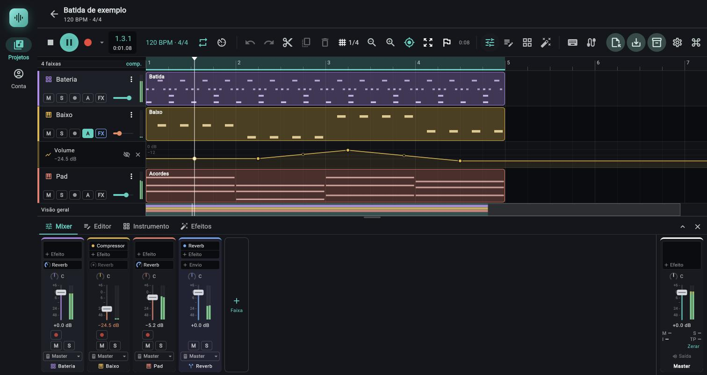
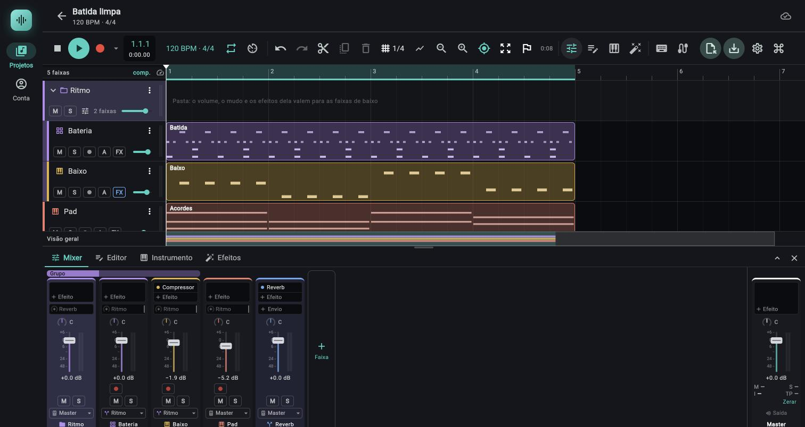

# Mixer

> O painel onde cada faixa vira um canal (volume, pan, mudo, solo, envios, saída) e onde o master fecha a mistura; use para acertar níveis, montar retornos de reverb e agrupar faixas.

*Aba Mixer durante a reprodução: uma coluna por faixa, o barramento Reverb e o Master à direita, com o medidor de loudness.*

*O mixer com a pasta Ritmo: a barra Grupo sobre os canais da pasta e das duas filhas; o menu de saída de Bateria e Baixo mostra Ritmo em vez de Master.*

## Onde fica

- **Computador:** botão com ícone de controles deslizantes na barra superior (tooltip `Mixer (X)`), aba `Mixer` no painel de baixo, ou a tecla `X`. `Esc` fecha o painel.
- **Celular:** o mesmo painel de baixo; na tela estreita as abas mostram só o ícone (tooltip `Mixer (X)`).
- O painel mostra um canal por faixa, na ordem da lista de faixas, e o **Master** fixo à direita, separado por uma linha. Com muitas faixas a lista de canais rola na horizontal; o Master não sai do lugar. Se o painel de baixo ficar baixo demais, o mixer rola na vertical em vez de espremer o fader (o fader tem no mínimo 72 px de curso).
- Tocar no fundo de um canal seleciona a faixa (o fundo clareia); o mesmo vale na linha do tempo.

De cima para baixo, cada canal de faixa tem: lista de efeitos (inserts), lista de envios, pan, fader com medidor, leitura em dB, armar/monitorar, `M`/`S`, saída e nome. O canal do Master não tem envios, armar, `M`/`S` nem nome editável; ele usa o espaço dos envios para a lista de efeitos dele e o espaço do armar e do `M`/`S` para a leitura de loudness (`M`, `S`, `I`, `TP` e `Zerar`; ver Master, abaixo). Atenção: no canal do Master, `M` e `S` são **momentâneo** e **curto prazo**, não mudo e solo.

Os barramentos aparecem com um fundo violeta discreto, para não se confundirem com faixas de som.

Quando há **pastas** (ver [02c Pastas de faixa](02c-pastas-de-faixa.md)), uma barra colorida de 14 px com o rótulo `Grupo` fica sobre o canal da pasta e uma faixa da mesma cor, mais clara e sem texto, sobre os canais das faixas dela, que vêm logo depois. O canal da pasta é o de um barramento (fundo violeta, ícone de pasta): o fader dele controla todas as faixas da pasta, e um efeito nele vale para todas. Recolher a pasta no arranjo não tira as faixas do mixer. Sem pasta no projeto a barra não existe; com pasta, o painel cresce 14 px e o canal do `Master` ganha só o vão.

## Controles

### Efeitos do canal (inserts)

| Controle (rótulo exato) | O que faz | Valores / padrão | Dica |
|---|---|---|---|
| Linha com o nome do efeito (ex.: `Reverb`) | Um efeito da cadeia da faixa. Tocar abre o painel `Efeitos` já naquela faixa. A ordem de cima para baixo é a ordem do sinal. | Até 16 efeitos por cadeia no motor (ver Limites e o item `Efeito` abaixo). Tooltip: `Reverb: toque para abrir` + `Botão direito ou toque longo: ligar, mover, remover`. | Efeito desligado fica com o nome apagado e o texto `(desligado)` no tooltip. |
| Luz redonda à esquerda do nome | Liga e desliga (bypass) o efeito sem abrir o painel. Cheia na cor da faixa = ligado; só o contorno = desligado. | O motor troca por crossfade de 10 ms, sem estalo. | Ao religar, o efeito esquece o que tinha guardado (um delay não devolve os ecos de antes do bypass). |
| Menu da linha (botão direito ou toque longo): `Abrir nos efeitos` | Abre o painel `Efeitos` neste efeito. | | |
| `Ligar` / `Desligar (bypass)` | O texto muda conforme o estado. Mesma ação da luz. | | |
| `Mover para cima` / `Mover para baixo` | Sobe ou desce o efeito na cadeia. Só aparecem quando há para onde ir. | | Ordem importa: EQ antes ou depois do compressor soa diferente. |
| `Remover` | Tira o efeito e apaga as automações que apontavam para ele. | Entra no desfazer. | |
| Linha `Efeito` (com `+`) | Abre o menu de efeitos, agrupado por família (Timbre, Dinâmica e utilidade, Espaço, Modulação, Saturação); cada item mostra nome e descrição. | Tooltip: `Adicionar efeito`; no master, `Adicionar efeito no master`. Com a cadeia cheia (16 efeitos) a linha fica desabilitada e o tooltip vira `Limite de 16 efeitos por faixa` (testado só por testes automáticos). | O painel de efeitos tem mais opções: ver [06c](06c-painel-de-efeitos.md). Os 15 efeitos estão em [06d](06d-efeitos-referencia.md). |

A altura da lista acompanha o painel de baixo (o painel maior mostra mais linhas, todas as faixas usam a mesma altura); passando do que cabe, um trilho fino à direita avisa que há mais e a lista rola.

### Envios

| Controle (rótulo exato) | O que faz | Valores / padrão | Dica |
|---|---|---|---|
| Linha `Envio` (com `+`) | Aparece quando a faixa não tem nenhum barramento para onde enviar (numa faixa comum: quando o projeto ainda não tem barramento; num barramento: quando não há outro depois dele). Cria um barramento novo e já manda esta faixa para ele. | Tooltip: `Criar um barramento e enviar esta faixa para ele (retorno de reverb, delay...)`. O barramento nasce com o nome `Barramento 1`, no fim da lista, e fica selecionado. Com a faixa já em 16 envios a linha fica desabilitada e o tooltip vira `Limite de 16 envios por faixa`. | O caminho mais curto para montar um retorno de reverb. |
| Linha com o nome de um barramento (ex.: `Barramento 1`) e um knob pequeno | Um envio possível para aquele barramento. Com o knob vazio (só um `+`) não há envio. Tocar cria o envio; arrastar na vertical dosa (e cria se preciso). | Nível de −∞ a +6 dB (ganho de 0 a 2), pela mesma curva do fader. Envio novo nasce em **−6,0 dB, pós-fader**. Arrastar: 150 px para o curso todo; `Shift` deixa 5 vezes mais fino. | Passando o mouse ou arrastando, o nome dá lugar ao nível em dB (ex.: `−6.0 dB`). |
| Roda do mouse sobre o knob do envio | Mexe no nível (`Shift`: fino). | | |
| Duplo clique no envio | Volta o nível a 0 dB (tooltip: `duplo clique: 0 dB`). | Só age se já existe envio e o nível não é 0 dB. | |
| Menu do envio (botão direito ou toque longo), sem envio: `Criar envio pós-fader`, `Criar envio pré-fader` | Cria o envio já no modo escolhido. | Com a faixa em 16 envios, o menu tem um único item apagado, `Limite de 16 envios por faixa`, e o toque na linha não cria nada (o tooltip diz `Limite de 16 envios por faixa: remova um envio para criar este`) (testado só por testes automáticos) | Remova um envio existente (menu do envio, `Remover envio`) para liberar lugar. |
| Menu do envio, com envio: `Pós-fader`, `Pré-fader` | Marca qual dos dois vale. | Pós-fader é o padrão. | |
| `Nível em 0 dB` | Põe o nível do envio em 0 dB. | | |
| `Modular…` (no menu do envio, entre `Nível em 0 dB` e `Remover envio`; só com o envio criado) | Abre o seletor `Modular: Envio → <barramento>` para ligar o nível do envio a um LFO, seguidor de envelope ou macro ([06g](06g-modulacao.md#o-menu-modular)). | O tooltip do envio existente termina em `botão direito ou toque longo: pré/pós, Modular… e remover` (sem o `Modular…` se o nível não se modula) | Sem botão direito no celular, o toque longo abre o mesmo menu. |
| `Remover envio` | Apaga o envio e a automação de nível dele. | | |
| Etiqueta `PRÉ` (âmbar) | Aparece à direita da linha quando o envio é pré-fader. | | |

**Pré ou pós-fader.** No motor o caminho é: efeitos → **envios pré-fader** → volume, pan e mudo → **envios pós-fader** → porta do solo → saída. O pré-fader tira o sinal *antes* do volume, do pan e do mudo: baixar o fader ou apertar `M` não mexe nele. O pós-fader segue o fader (e leva o pan da faixa).

Quais barramentos aparecem na lista: uma faixa comum lista todos os barramentos. Um barramento lista só os barramentos que vêm *depois* dele na lista de faixas (ver "Ordem de processamento" abaixo). O master não envia.

### Pan, fader e medidores

| Controle (rótulo exato) | O que faz | Valores / padrão | Dica |
|---|---|---|---|
| Knob de pan, com a leitura ao lado (tooltip `Pan: C` + `Arraste na vertical ou use a roda · duplo clique: centro` + `Botão direito ou toque longo: Aprender MIDI, Modular…, Mapeamentos MIDI…`) | Posição da faixa entre esquerda e direita. Arrastar na vertical ou roda. | Leitura `C` (centro), `E30` (30% à esquerda) até `E100`; `D30` a `D100` à direita. Padrão `C`. Perto do centro (±3%) o arraste "gruda" em `C`. `Shift` deixa mais fino. | Duplo clique volta ao centro. |
| Fader (tooltip `Volume: −6.0 dB` + `Arraste (Shift: fino) ou use a roda · duplo clique: 0 dB` + `Botão direito ou toque longo: Aprender MIDI, Modular…, Mapeamentos MIDI…`) | Volume da faixa. Arrasta a partir de onde a tampa está (clicar no trilho não pula o volume, como numa mesa). | De −∞ a **+6 dB**; padrão **0 dB**. Curva cúbica: ganho = 2 × posição³, então 0 dB fica a ~79% do curso. | Escala ao lado do trilho: `+6`, `0`, `6`, `12`, `24`, `48` (os números de baixo são negativos: −6, −12, −24, −48). Em fader baixo, rótulos que se encostariam somem e ficam só os traços. |
| Leitura em dB abaixo do fader (tooltip `Volume (duplo clique: 0 dB)`) | Valor atual do volume. | Ex.: `−6.0 dB`, `+0.0 dB`, `−∞ dB`. | Duplo clique nela volta a 0 dB. |
| Medidor de duas barras ao lado do fader | Pico esquerdo e direito da faixa, depois de volume, pan, mudo e solo. | Escala de −48 a 0 dB. Ver [06b](06b-analisador-e-medidores.md). | Faixa silenciada por mudo ou solo não mexe o medidor. |
| Barra fina à direita do medidor (só em faixa de áudio armada) | Nível da entrada (o que chega do microfone, antes dos efeitos). Tooltip: `Nível da entrada (o que chega do microfone, antes dos efeitos)` + `Vermelho no topo: saturou; baixe o ganho na fonte`. | O lugar fica reservado em toda faixa, para armar não empurrar o fader. Faixa de instrumento armada não mostra: ali entram notas, não áudio. | Detalhes do "clip" em [06b](06b-analisador-e-medidores.md). |

Fader, pan e envios entram no desfazer como **um passo por gesto** (do começo ao fim do arraste). Tudo é salvo com o projeto.

**Fader, pan e nível de envio gravam automação.** Com o botão `Automação` da barra em `Escrever`, `Toque` ou `Trava` (ou com o seletor da raia num desses modos) e a música **tocando**, arrastar o fader, o knob de pan ou o knob de envio (ou usar a roda do mouse sobre eles) grava o movimento como pontos na raia do alvo (`Volume`, `Pan` ou `Envio → nome`), criando a raia se ela não existe. Em `Ler` (o padrão) o gesto muda só o valor fixo, como antes. Enquanto grava, o controle mostra o que a sua mão põe; os pontos aparecem na raia quando o trecho acaba (ao soltar, no `Toque`; ao parar, em `Escrever` e `Trava`). Uma passada inteira vira **um passo só** no desfazer. O mesmo vale para o fader e o pan do `Master`. O envio só grava se ele já existe; criar o envio (tocar no knob vazio) não grava. Modos, valores e passo a passo em [07 Automação, Gravar automação](07-automacao.md#gravar-automação). O mini fader do cabeçalho da faixa e o da linha `Master` da linha do tempo gravam igual ([02b](02b-timeline-e-clipes.md)); o do `Master` também mostra o valor da sua mão enquanto grava `(testado só por testes automáticos)`.

**Fader, pan e nível de envio aceitam MIDI learn.** Com um controlador ligado, o fader, o knob de pan e o knob de envio (do canal, do `Master` e o mini fader do cabeçalho da faixa) podem ser comandados por um botão ou fader do teclado: ligue o modo `Aprender MIDI` (botão da barra ou `Shift+K`), clique no controle contornado e mexa no botão do controlador. Botão direito do mouse (ou toque longo no celular) no fader ou no pan, fora do modo, abre o menu do controle com `Aprender MIDI`, `Remover mapeamento (...)`, `Modular…` e `Mapeamentos MIDI…` (no envio o botão direito ou o toque longo continua sendo o menu do envio: para mapeá-lo ligue o modo). Com o modo ligado o controle só responde a clique (não arrasta). Tudo em [06f MIDI learn](06f-midi-learn.md).

**Fader e pan aceitam modulação.** O botão direito do mouse no fader ou no pan (também os do `Master`) ou o **toque longo** no celular traz ainda `Modular…`, que liga o controle a um LFO, seguidor de envelope ou macro; o mesmo vale para o mini fader do cabeçalho da faixa e para o nível de cada envio (no menu do envio). Os tooltips dizem: fader, `Botão direito ou toque longo: Aprender MIDI, Modular…, Mapeamentos MIDI…` (com o controle mapeado entra também `Remover mapeamento` depois de `Aprender MIDI`); pan, o mesmo; envio, `botão direito ou toque longo: pré/pós, Modular… e remover`. Desde a fase 21 essas dicas saem da mesma lista de ações do menu, então só citam `Modular…` (e `Remover mapeamento`) quando o menu os tem; um controle que não se modula fica sem o `Modular…` também na dica (no envio: `pré/pós e remover`). `(testado só por testes automáticos)` O fader e o pan não se mexem sozinhos na tela (mostram o valor base) e ganham só um pontinho ciano no canto superior esquerdo, sem o anel dos knobs. A aba `Modulação` também liga qualquer um deles pela lista `Destino` do cartão. `(o toque longo: testado só por testes automáticos; não visto no Android)` Tudo em [06g Modulação](06g-modulacao.md).

### Gravação, mudo e solo

| Controle (rótulo exato) | O que faz | Valores / padrão | Dica |
|---|---|---|---|
| Botão com ponto vermelho (`Armar para gravar`) | Arma a faixa: ao gravar (`R`), o microfone (faixa de áudio) ou as notas tocadas ao vivo (faixa de instrumento) viram um clipe nela. | Desligado por padrão. Barramento não tem o botão. | Detalhes em [03c Gravação](03c-gravacao.md). |
| Botão de fones (`Monitorar a entrada`) | Só em faixa de áudio: o microfone passa ao vivo pelos efeitos e pelo fader da faixa. Na faixa de instrumento o lugar fica vazio, para o armar alinhar com os vizinhos. | Desligado por padrão. | Use fones; sem eles o microfone capta o próprio som (o tooltip avisa). |
| `M` (tooltip `Mudo`) | Silencia a faixa (vermelho quando ligado). | O volume desce a zero em ~5 ms, sem estalo. | Mudo e solo também estão no cabeçalho da faixa na linha do tempo. |
| `S` (tooltip `Solo`) | Deixa soar só as faixas em solo (âmbar quando ligado). | Vários solos acumulam; não há "desligar os outros solos" automático. | Ver "Solo e mudo" abaixo. |

### Saída e nome

| Controle (rótulo exato) | O que faz | Valores / padrão | Dica |
|---|---|---|---|
| Botão de saída, com o nome do destino (tooltip `Saída: Master`) | Para onde a faixa sai: `Master` ou um barramento. Abre um menu. | Padrão `Master`. O item marcado é o atual. | A saída é *no lugar* do master: a faixa deixa de ir direto para ele. |
| Menu da saída: `Master` | Volta a faixa para o master. Numa faixa de pasta, ela sai da pasta (ver a linha abaixo). | | |
| Menu da saída: nome de um barramento | Manda a faixa para ele (só lista os que não fecham ciclo). Uma pasta aparece aqui pelo nome, como qualquer barramento. | | Use para grupos (bateria, vozes); para agrupar de uma vez, com linha própria na timeline, use `Agrupar em pasta…` ([02c](02c-pastas-de-faixa.md)). Numa faixa que está numa pasta, escolher qualquer destino que não seja a própria pasta **tira a faixa da pasta**: ela não passaria mais pelo volume nem pelos efeitos da pasta, então desce para logo depois do bloco dela. Antes disso abre a confirmação `Tirar "Nome" da pasta?` com o texto `A pasta "Pasta" só afeta o que sai nela. Com outra saída, "Nome" deixa de passar pelo volume e pelos efeitos da pasta, então sai da pasta (desce para logo depois dela). Isto muda:` e a linha `a saída de "Nome" para a pasta "Pasta" (passa a ir para o Master)` (ou `"Barramento"`, ou `um barramento novo`), com `Cancelar` e `Tirar da pasta`. Um passo só no desfazer. Escolher de novo a própria pasta não pergunta nada. |
| Menu da saída: `Novo barramento` | Cria um barramento no fim da lista e já liga a saída da faixa nele. | | Numa faixa de pasta, vale a mesma confirmação e a faixa também sai da pasta. |
| Ícone do tipo + nome, no pé do canal | Mostra o tipo da faixa (tooltip: `Áudio`, `Sintetizador`, `Bateria`, `Sampler`, `FM`, `Wavetable`, `Barramento`, `Grupo` para uma pasta). Tocar no ícone de uma faixa de instrumento abre o instrumento (`Sintetizador: abrir o instrumento`); no de um barramento abre os efeitos (`Barramento: abrir os efeitos`); no de uma pasta (ícone de pasta) também, com o tooltip `Grupo: abrir os efeitos`. | Nome truncado com reticências; o tooltip mostra inteiro. | Renomear é pelo menu da faixa na linha do tempo. |

### Coluna `Faixa` (fim da lista)

| Controle (rótulo exato) | O que faz | Valores / padrão | Dica |
|---|---|---|---|
| `Faixa` com `+` (tooltip `Nova faixa ou barramento`) | Abre um menu com `Áudio`, `Sintetizador`, `Bateria`, `Sampler`, `FM`, `Wavetable` e, por último, `Barramento`. | Barramento novo entra no fim da lista, com o nome `Barramento N`. | Criar sem sair do mixer. |

### Master

| Controle (rótulo exato) | O que faz | Valores / padrão | Dica |
|---|---|---|---|
| Lista de efeitos do master (`Efeito`, tooltip `Adicionar efeito no master`) | Efeitos que processam a mistura inteira, em série, **antes** do volume do master e do limitador de segurança. | Mesmo menu e mesmas ações de uma faixa. | Sugestão do próprio app para o master vazio: `EQ`, `Compressor`, `Limitador`. |
| Pan do master | **Balanço**, não pan: só atenua o lado oposto; o centro fica em 0 dB. | Mesma leitura `C`, `E..`, `D..`. Padrão `C`. | |
| Fader do master e leitura em dB | Volume final da mistura. | −∞ a +6 dB, padrão 0 dB. Automatizável e grava automação como o das faixas (`Master` > `A` > `Volume`; ver [07](07-automacao.md#gravar-automação)). | |
| Medidor do master | Pico esquerdo e direito **depois do limitador**. | Nunca passa de −0,3 dB quando o limitador age. | |
| Leitura de loudness do master: `M`, `S`, `I`, `TP` | Volume percebido da mistura (norma BS.1770-4 / EBU R128), medido depois do limitador. `M` = momentâneo (últimos 400 ms), `S` = curto prazo (3 s), `I` = integrado desde o último `Zerar` (em negrito), `TP` = true peak máximo. Tooltip: `Loudness do master (EBU R128)`. | `M`, `S` e `I` em LUFS (`−14,2`); `TP` em dBTP. `—` sem medida. `TP` acima de −1 dBTP fica vermelho. No canal do Master (92 px de largura) as leituras ficam em duas linhas, `M` `S` em cima e `I` `TP` embaixo, com `Zerar` à direita, logo abaixo; o texto encolhe para caber. | Detalhes, janelas, gates e valores de referência em [06b](06b-analisador-e-medidores.md). O `I` de referência para streaming é −14 LUFS. |
| `Zerar` (tooltip `Zerar a medida de loudness`) | Apaga o integrado, os máximos e o true peak; a medição recomeça. | Não é salvo com o projeto. | Toque antes de tocar a música do começo ao fim para conferir. |
| `Saída` (tooltip `O master sai no áudio do aparelho, depois do limitador de segurança`) | Só informa: o master vai para a saída de áudio do aparelho. Não é botão. | | |
| Nome `Master` | Fixo. | | |

### Como o som corre (ordem de processamento)

1. **Faixas comuns.** Cada uma faz: fonte (clipes, instrumento, e a entrada se estiver monitorando) → efeitos → envios pré-fader → volume, pan e mudo → envios pós-fader → porta do solo → saída.
2. **Barramentos**, em ordem de posição na lista. Cada um soma o que chegou (saídas e envios), passa pelos efeitos, fader, envios e saída dele.
3. **Master.** Soma tudo o que saiu para ele → efeitos do master → volume e balanço → clique do metrônomo (se ligado; ele segue o volume do master mas não passa pelos efeitos do master) → **limitador de segurança** → saída, medidor do master e analisador do master.

**Limite conhecido da ordem dos barramentos.** As faixas comuns sempre são processadas antes de todos os barramentos, então uma faixa comum pode mandar (envio ou saída) para *qualquer* barramento. Já um barramento só pode mandar para um barramento que venha **depois** dele na lista de faixas (índice maior). O app só oferece esses destinos nos menus. Se você usa `Mover para cima` / `Mover para baixo` (menu da faixa na linha do tempo) ou arrasta o cabeçalho da faixa (toque longo) e a nova ordem quebra uma dessas ligações, o app **pergunta antes**: abre o diálogo `Mover a faixa?` com o texto `Barramento só manda sinal para um barramento que vem depois dele na lista. Mover a faixa para lá desfaz:` seguido de uma linha com marcador para cada rota que se perde (`o envio de "Grupo" para "Reverb"`, com ` e a automação dele` quando o envio tem automação, ou `a saída de "Grupo" para "Reverb" (volta ao master)`) e do aviso `Desfazer (Ctrl+Z) traz de volta.` (`⌘+Z` no Mac). Os botões são `Cancelar` e `Mover mesmo assim` (vermelho). Cancelar deixa tudo como estava; `Mover mesmo assim` move a faixa, **apaga o envio** (com a automação dele) ou **volta a saída para o Master**, e um `Ctrl+Z` traz de volta a ordem e as rotas. Se o movimento não desfaz nenhuma rota, a faixa se move sem diálogo (testado só por testes automáticos). O motor, por segurança, ignora um destino inválido (a saída vira o master).

Efeito prático: crie primeiro os barramentos que vão *alimentar* outros (grupos, delay) e depois os que recebem (o retorno de reverb, no fim). Como o barramento novo entra sempre no fim da lista, todos os que já existem conseguem mandar para ele.

**Com pastas.** A pasta é um barramento e vale a mesma regra. As faixas dela são comuns e sempre podem sair nela; a pasta, por sua vez, só manda (saída ou envio) para um barramento que venha depois dela. Como a pasta nasce onde estava a primeira faixa agrupada e o retorno de reverb costuma ficar no fim, a saída da pasta para o retorno funciona; um barramento que fique **acima** da pasta não consegue receber dela. Mover a pasta com `Mover para baixo` para além de um barramento que ela alimenta abre o diálogo `Mover a faixa?`.

### Solo e mudo

- **Mudo** zera o volume da faixa (pós-fader). Os envios *pós*-fader dela calam junto; os *pré*-fader continuam. Mudo num barramento cala tudo o que passa por ele.
- **Solo** deixa audível: a faixa em solo, tudo que ela alimenta (o barramento da saída dela e os barramentos dos envios dela, em cadeia) e, se o solo estiver num barramento, tudo o que sai nele. As demais são silenciadas em ~5 ms (o medidor delas também apaga).
- Por isso, soar uma faixa em solo mantém o reverb dela: o retorno é alimentado só por ela, porque os envios das faixas caladas para o retorno são cortados. Solo no próprio barramento de retorno deixa só ele soar, com o que chega pelos envios.
- **Pasta:** solo na pasta deixa soar a pasta e todas as faixas dela (elas saem nela); solo numa faixa da pasta deixa soar só ela e a pasta, e as outras faixas da pasta calam. O mudo da pasta cala o que passa por ela, mas os envios das faixas para retornos saem direto da faixa e continuam (ver [02c](02c-pastas-de-faixa.md#solo-da-pasta-e-solo-das-faixas)) `(testado só por testes automáticos)`.
- Faixa com `M` e `S` juntos fica muda: o mudo vence.
- Não existe solo exclusivo, "solo seguro" nem solo no Master.

### Sidechain (de onde vem a fonte)

O sidechain existe no `Compressor` e no `Gate`, no parâmetro `Sidechain` (grupo Chave), que é um menu: `Própria entrada` (o padrão) ou o nome de qualquer outra faixa (barramentos incluídos). A faixa em que o efeito está não aparece na lista dela mesma. Também dá para usar no master.

- O sinal-chave é a saída da faixa-fonte **depois dos efeitos dela e antes do fader**, do mudo e do solo. Então a fonte pode estar muda, com o fader baixo ou calada por solo e ainda assim controlar o compressor.
- O motor processa a faixa-fonte antes de quem a usa, para a chave ser do mesmo bloco. Numa chave circular (A é chave de B e B de A), uma das duas usa a chave do bloco anterior.
- O sidechain escolhido não é automatizável, não é trocado por presets e acompanha a faixa se ela mudar de lugar na lista.

## Passo a passo

**Acertar volume e pan de uma faixa**
1. Abra o mixer (`X`).
2. Arraste o fader do canal para cima ou para baixo; `Shift` para ajuste fino. Leia o valor em dB abaixo do fader.
3. Arraste o knob de pan na vertical até a leitura desejada (`E30`, `D40`...). Duplo clique volta ao centro.
4. Duplo clique no fader ou na leitura devolve 0 dB.

**Criar um retorno de reverb**
1. No canal de uma faixa, toque na linha `Envio` (é o que aparece enquanto o projeto não tem barramento). Nasce `Barramento 1` com o envio já ligado em −6,0 dB.
2. No canal `Barramento 1`, toque em `Efeito` e escolha `Reverb`.
3. Nas outras faixas, na lista de envios, toque no knob de `Barramento 1` e arraste para dosar.
4. Para o passo a passo completo, com valores: [guia de mixagem e automação](../guias/mixagem-e-automacao.md).

**Agrupar faixas num barramento**
1. No botão de saída de uma faixa, escolha `Novo barramento` (ou um barramento que já exista).
2. Repita nas outras faixas do grupo, escolhendo o mesmo barramento.
3. No canal do barramento, acerte o fader do grupo e ponha efeitos de grupo (ex.: `Compressor`).

**Ler o loudness do master**
1. No canal `Master`, toque em `Zerar` (a leitura volta a `—`).
2. Toque a música do começo ao fim. O `M` e o `S` andam com a música; o `I` (negrito) vai se acertando.
3. No fim, leia o `I` e o `TP`. Para streaming, o `I` deve chegar perto de −14 e o `TP` ficar abaixo de −1 dBTP.
4. Se o `TP` ficou vermelho, baixe o fader do master (ou o `Teto` do `Limitador` do master), toque em `Zerar` e meça de novo.

**Ouvir só uma faixa**
1. Toque em `S` no canal. As outras calam; o retorno de reverb dela continua.
2. Toque de novo em `S` para voltar.

**Tirar o pré-fader de um envio**
1. Botão direito no envio (ou toque longo no celular).
2. Escolha `Pré-fader`. A etiqueta `PRÉ` aparece.

## Combina com

- [06b Analisador e medidores](06b-analisador-e-medidores.md): como ler os medidores, o loudness do master (`M`, `S`, `I`, `TP`) e o espectro.
- [02c Pastas de faixa](02c-pastas-de-faixa.md): agrupar faixas sob um barramento, a barra `Grupo` e o solo da pasta. Guia: [organizar um projeto com pastas](../guias/organizar-um-projeto-com-pastas.md).
- [06c Painel de efeitos](06c-painel-de-efeitos.md) e [06d Referência dos efeitos](06d-efeitos-referencia.md): o que colocar nos inserts, nos barramentos e no master.
- [07 Automação](07-automacao.md): mover volume, pan, envios e parâmetros no tempo (desenhando na raia ou gravando com o fader, o pan e os knobs); fader, pan e knobs seguem a automação enquanto toca.
- [08 Exportação](08-exportacao.md): o arquivo sai depois do limitador do master (`Normalizar o loudness` leva a mixagem ao alvo de LUFS); `Renderizar em faixa nova` (antigo "Congelar em áudio") leva volume, pan, saída e envios para a faixa nova; `Congelar faixa…` os deixa na própria faixa ([02e](02e-congelar-faixa.md)).
- [03c Gravação](03c-gravacao.md): armar e monitorar.
- [06f MIDI learn](06f-midi-learn.md): ligar o fader, o pan e os envios a um controlador MIDI.
- [06g Modulação](06g-modulacao.md): tremolo no volume, auto-pan e envio que respira com um LFO ou um seguidor de envelope (aba `Modulação`, ao lado de `Efeitos`).
- [06e Compensação de latência](06e-compensacao-de-latencia.md): como o motor alinha faixas, envios e sidechain quando há `Limitador` ou `Distorção`.
- [Guia: mixagem e automação](../guias/mixagem-e-automacao.md): mix do zero, retorno de reverb, fades.
- [Guia: loudness e master](../guias/loudness-e-master.md): levar o master a −14, −16 ou −23 LUFS sem estourar, e conferir o arquivo.

## Limites e pegadinhas

- **Limitador de segurança do master** (ver seção própria abaixo): sempre ligado, sem controle na tela e sem medidor de redução. O medidor do master mostra o sinal *depois* dele.
- **Acima de 0 dB nas faixas não estala.** O motor trabalha em ponto flutuante: o som de uma faixa (ou de um barramento) pode passar de 0 dBFS e voltar sem distorcer, desde que a soma no master seja domada. Quem ataca o excesso é o limitador do master, e só no fim.
- **Pan por faixa perde 3 dB no centro.** O pan da faixa é uma lei de potência constante aplicada **por canal**: o canal esquerdo é multiplicado por cos e o direito por sen de um ângulo que vai de 0 a 90 graus conforme o pan. No centro os dois canais saem −3,01 dB (`E100` e `D100` deixam um canal em 0 dB e zeram o outro). Como é por canal, num conteúdo **estéreo** o pan `E100` descarta o canal direito (ele não é somado ao esquerdo); numa fonte que já sai igual nos dois lados (como os instrumentos mono, ver [04d FM](04d-fm.md)), o efeito é o de um pan comum (não confirmado para arquivo de áudio mono). A leitura em dB do fader não inclui isso. O pan do master é diferente (balanço, centro em 0 dB).
- **Barras são pico; o volume percebido é a leitura do master.** As barras de cada canal mostram o pico de amostra, não RMS nem LUFS. O loudness (`M`, `S`, `I`) e o true peak (`TP`) só existem no canal do Master, e o `I` acumula desde o último `Zerar`.
- **Envio pré-fader continua com a faixa muda.** É a definição de pré-fader; se o reverb some quando você silencia a faixa, o envio é pós-fader.
- **Envios e solo:** com outra faixa em solo, os envios das faixas que não estão em solo são cortados (menos os que vão para um barramento solado).
- **Só faixas de áudio monitoram.** A entrada soma antes dos efeitos e o monitoramento tem a latência do aparelho mais a do motor: a compensação de latência dos efeitos ([06e](06e-compensacao-de-latencia.md)) também atrasa o que você ouve de si mesmo, inclusive o limitador de segurança do master (1,5 ms).
- **Latência de efeitos é compensada entre faixas:** o `Limitador` (pelo `Lookahead`, padrão 3 ms) e a `Distorção` (32 quadros) atrasam o som, e o motor atrasa as outras faixas, barramentos e retornos por igual para tudo chegar alinhado ao master (também na exportação, que descarta essa latência no começo). Vale para saídas, envios (pré e pós-fader), barramentos em cadeia e a chave do sidechain, com o efeito ligado ou em bypass. O clique do metrônomo é atrasado da mesma latência e soa junto das faixas, e a gravação do app soma a latência do motor à do aparelho (áudio e notas MIDI). Limites: o monitoramento de uma faixa armada sai atrasado dessa latência, e a automação de volume de uma faixa com efeito de latência age alguns ms adiantada. Capítulo próprio: [06e Compensação de latência](06e-compensacao-de-latencia.md); tabela dos efeitos em [06d](06d-efeitos-referencia.md#latência-e-custo-de-cada-efeito) `(testado só por testes automáticos)`.
- **Limites do motor:** até 16 efeitos por cadeia (faixa ou master) e 16 envios por faixa. O app avisa antes de passar: com 16 efeitos a linha `Efeito` (e os botões `Adicionar efeito` / `Efeito` do painel de efeitos) ficam desabilitados com a dica `Limite de 16 efeitos por faixa`; com 16 envios não se cria outro e a dica é `Limite de 16 envios por faixa`. Remova um para liberar lugar (testado só por testes automáticos).
- **O knob de envio não anda com a automação** do nível do envio (só a raia de automação mostra o valor). Fader, pan e knobs de efeito e instrumento andam em laranja, tocando.
- **Faixa congelada no mixer:** o fader, o pan, `M`, `S`, os envios e a saída continuam atuando depois do áudio congelado, e o mixer não mostra que a faixa está congelada (o sinal é o floco no cabeçalho da timeline, [02e](02e-congelar-faixa.md)). Os efeitos do canal aparecem, mas não rodam (editar a cadeia de efeitos de uma faixa congelada mostra `Faixa congelada: a alteração só soa ao descongelar.`, uma vez por congelamento; o fader, o pan, os envios e a automação deles não avisam: seguem vivos). O sidechain de outra faixa que tem esta como chave continua valendo.
- **Salvo com o projeto:** ganho, pan, mudo, solo, armar, monitorar, efeitos, envios (nível e pré/pós) e saída de cada faixa, mais volume e balanço do master.

### O limitador de segurança do master

É o último estágio antes da saída. Somar várias faixas passa fácil de 0 dBFS, e sem ele o que saía era corte duro (distorção audível). Ele age assim:

| Característica | Valor |
|---|---|
| Teto | 0,966 de amplitude, ou seja, **−0,3 dBFS** (folga para a reconstrução do conversor) |
| Lookahead | **1,5 ms** (72 amostras a 48 kHz); é também a latência que o master ganha |
| Soltura | 80 ms |
| Abaixo do teto | Transparente: o áudio só sai atrasado do lookahead, sem alteração. Como fica depois da soma, atrasa tudo por igual e não precisa de compensação entre faixas ([06e](06e-compensacao-de-latencia.md)) |
| Ligado | Sempre; o app não tem chave para desligar |

Ele existe para **nunca deixar passar nada acima do teto**, não para dar volume: não é o limitador de masterização (esse é o efeito `Limitador`, que você coloca no master ou nas faixas). Se o medidor do master vive encostado no topo, abaixe as faixas: o limitador está trabalhando o tempo todo e o som se achata.

## Atalhos

| Tecla / gesto | Ação |
|---|---|
| `X` | Abre ou fecha o mixer |
| `Esc` | Fecha o painel de baixo |
| Arrastar (vertical) no fader, pan ou envio | Muda o valor |
| `Shift` ao arrastar | Ajuste fino (5 vezes mais lento) |
| Roda do mouse sobre fader, pan ou envio | Muda o valor (com `Shift`, mais fino) |
| Duplo clique no fader, na leitura de dB ou no envio | 0 dB |
| Duplo clique no pan | Centro |
| Botão direito (ou toque longo no celular) num efeito ou num envio | Menu do item |
| `Shift+K` | Liga e desliga o modo `Aprender MIDI` (fader, pan e envios ganham contorno; ver [06f](06f-midi-learn.md)) |
| Botão direito do mouse (toque longo no celular) no fader ou no pan | Menu do controle: `Aprender MIDI`, `Remover mapeamento (...)`, `Modular…`, `Mapeamentos MIDI…` |
