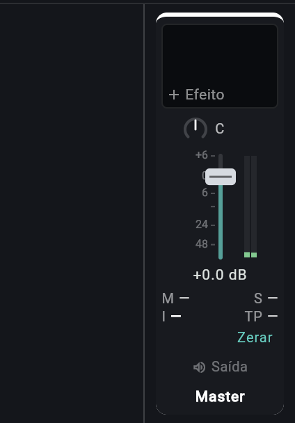

# Analisador e medidores

> Como ler os medidores de nível (faixas, master, entrada), o medidor de loudness do master (LUFS e true peak), o medidor de redução de ganho dos efeitos de dinâmica e o analisador de espectro do EQ; use para acertar ganhos sem estourar, para saber o volume percebido da mistura e para ver onde está a energia de uma faixa.

*Coluna do Master: fader, medidor de pico e a leitura de loudness (M, S, I e TP) com o botão Zerar.*

## Onde fica

Não há um painel de análise à parte. Cada leitura mora onde a decisão é tomada:

| O quê | Onde aparece |
|---|---|
| Medidor de pico da faixa (duas barras, esquerda e direita) | Ao lado do fader de cada canal no mixer (9 px de largura); no cabeçalho de cada faixa na linha do tempo, à direita (6 px) |
| Medidor do master | Canal `Master` do mixer; linha `Master` no fim da lista de faixas da linha do tempo |
| Medidor de loudness (`M`, `S`, `I`, `TP` e `Zerar`) | Canal `Master` do mixer, no lugar onde as faixas têm armar e `M`/`S` |
| Medidor de entrada | Faixa de **áudio armada**: barra fina ao lado do medidor do canal no mixer; barra horizontal de 3 px no rodapé do cabeçalho da faixa na linha do tempo; linha `Nível` em `Configurações` |
| Medidor de redução de ganho | Cartão de `Compressor`, `Gate` e `Limitador` no painel `Efeitos` (tecla `F`) |
| Analisador de espectro | Atrás do gráfico do `EQ`, no painel `Efeitos` |

Os medidores de faixa e de master funcionam também no celular; o painel `Efeitos` do celular mostra o gráfico do EQ com 180 px de altura.

## Controles

Os medidores e o analisador não têm botões: são só de leitura. A tabela diz o que cada um mostra e como interpretar.

### Medidores de nível (faixa e master)

| Medidor | O que mostra | Valores / padrão | Dica |
|---|---|---|---|
| Duas barras verticais (esquerda e direita) | O **pico** de cada canal depois de volume, pan, mudo e solo. O do master é lido depois do limitador de segurança. | Escala de −48 dB (vazio) a 0 dB (cheio), linear em dB. Verde até −14,4 dB; a cor vai virando amarelo até −5,8 dB (amarelo pleno) e daí vira vermelho até 0 dB (degradê, sem cortes bruscos). | Uma faixa calada por mudo ou por solo de outra não mexe. |
| Subida e descida | Sobe na hora; desce devagar (a barra perde 18% do valor a cada atualização, algo como 100 dB por segundo). | Atualiza cerca de 60 vezes por segundo. | O motor acumula o maior pico entre duas leituras, então nenhum pico curto escapa entre um quadro e outro. |

Como ler:

- O que se vê nas barras é **pico de amostra**, não volume percebido (não é RMS nem LUFS). Duas faixas com o mesmo pico podem soar bem diferentes. O volume percebido do master está no medidor de loudness (seção abaixo).
- **Não há trava de "clip" nos medidores de saída.** A barra para em 0 dB: um pico 3 dB acima de 0 dBFS aparece igual a um em 0 dBFS. O que dá para dizer é "passou do amarelo" ou "encostou no topo".
- Uma faixa ou barramento pode passar de 0 dBFS por dentro sem distorcer (o motor calcula em ponto flutuante); o problema é a **soma** no master. Por isso a leitura que importa no fim é a do master.
- O medidor do master é lido *depois* do limitador de segurança (teto de −0,3 dBFS; ver [06 Mixer](06-mixer.md)). Ele não passa de aproximadamente 99% da altura (−0,3 dB). Se a barra vive grudada no topo, o limitador está agindo, e o som está sendo achatado. O app não tem um indicador de quanto o limitador reduziu.
- A leitura é **por faixa depois do fader**: mexer no fader mexe no medidor. Para conferir o nível de uma faixa sem tocar no volume dela, compare com o de outra em 0 dB.

### Medidor de loudness do master (`M`, `S`, `I`, `TP`)

Os medidores de barras acima mostram **pico**. O que decide se a música vai soar tão alta quanto as outras num serviço de streaming é o **loudness**: o volume percebido, medido pela norma ITU-R BS.1770-4 (a base do EBU R128). Ele aparece como quatro números no canal `Master` do mixer, no espaço que nas faixas é de armar e de `M`/`S`. Não há medidor de loudness nas faixas, só no master.

| Leitura (rótulo) | O que mostra | Janela | Unidade |
|---|---|---|---|
| `M` (momentâneo) | Loudness dos últimos 400 ms. Acompanha as batidas e as frases. | 400 ms, atualizada a cada 100 ms | LUFS |
| `S` (curto prazo) | Loudness dos últimos 3 s. Acompanha o refrão e a estrofe. | 3 s, atualizada a cada 100 ms | LUFS |
| `I` (integrado, em negrito) | Loudness de tudo o que soou desde a última vez que se tocou em `Zerar` (ou desde que o projeto abriu). É o número que se compara com o alvo da plataforma. | Desde o zero, com dois filtros de silêncio (abaixo) | LUFS |
| `TP` (true peak) | O maior pico que o sinal teria depois de convertido para analógico, desde o zero. | Máximo acumulado | dBTP |
| `Zerar` (tooltip `Zerar a medida de loudness`) | Apaga o integrado, os máximos e o true peak; a medição recomeça do que soar dali em diante. | | |

Como os números são escritos: vírgula decimal, uma casa, sinal de menos de verdade (`−14,2`), sem a unidade. `—` quer dizer sem medida: o `M` e o `I` só aparecem depois de 400 ms de som, o `S` só depois de 3 s, e o silêncio volta a `—`. Parar o mouse sobre as leituras (ou tocar e segurar, no celular) abre o tooltip `Loudness do master (EBU R128)`, com o resumo das quatro leituras.

**O que é LUFS.** É a unidade do volume percebido: `0 LUFS` é um som muito alto, e cada −1 LUFS é 1 dB mais baixo. O filtro **K-weighting** corta os graves extremos (passa-altas perto de 38 Hz) e realça os agudos (+4 dB acima de uns 1,7 kHz), porque o ouvido é assim. Os dois canais entram somados em energia, com peso igual. Um seno de 1 kHz a −20 dBFS de pico nos dois canais mede −20 LUFS.

**Como o integrado é calculado.** O motor fecha um bloco de 400 ms a cada 100 ms (75% de sobreposição) e ignora dois tipos de bloco:

1. Os abaixo de **−70 LUFS** (silêncio e ruído de fundo, o gate absoluto).
2. Depois, os que ficam mais de **10 LU** (10 dB de loudness) abaixo da média dos que sobraram (o gate relativo). Por isso uma introdução muito baixa ou uma pausa longa não puxam o `I` para baixo.

**True peak.** O pico de amostra dos medidores de barras pode subestimar o pico real: entre duas amostras o sinal pode subir mais. O `TP` sobreamostra 4 vezes (interpola três pontos entre cada par de amostras) e guarda o maior valor absoluto. Ele fica em **vermelho e negrito** quando passa de **−1 dBTP**: acima disso o MP3, o AAC e a recodificação dos serviços de streaming podem estourar. O limitador de segurança do master trabalha com o pico de amostra (teto de −0,3 dBFS), então o `TP` pode ler perto de 0 dBTP mesmo com o medidor de barras parado em −0,3.

**Onde a medida é tirada.** Na saída do master **depois do limitador de segurança**, no mesmo ponto do medidor de pico: é o que vai para o arquivo exportado. Como mede a saída ao vivo, entram nela o clique do metrônomo (se ligado) e a entrada monitorada; a exportação não leva nenhum dos dois.

Valores de referência (pontos de partida; cada serviço muda a política de tempos em tempos, confira a atual antes de publicar):

| Destino | `I` alvo | `TP` máximo | Alvo no app (exportação) |
|---|---|---|---|
| Streaming de música (Spotify, YouTube etc.) | −14 LUFS | −1 dBTP | `Streaming −14,0` |
| Podcast e vídeo para celular | −16 LUFS | −1 dBTP | `Podcast −16,0` |
| Rádio e TV (EBU R128) | −23 LUFS (±0,5 LU) | −1 dBTP | `Broadcast −23,0` |
| Música masterizada para ser alta (referência de gosto, não de plataforma) | −9 a −8 LUFS | −1 dBTP | `Personalizado` |

O motor também calcula a **faixa de loudness** (LRA, em LU: a diferença entre os percentis 95 e 10 do curto prazo, com gates de −70 LUFS e −20 LU) e os máximos de `M` e `S`, mas a tela ainda não mostra nenhum dos três.

Como ler:

- **Toque o trecho mais forte da música do começo ao fim** com o mixer aberto e olhe o `I` no fim. Um `I` que cai e sobe muito de um trecho para outro indica mixagem com muita variação de volume; o `S` mostra onde.
- **`I` só vale para a música inteira.** Se você toca só o refrão, o `I` é o do refrão. Toque a música do começo ao fim (ou use o número que a exportação mostra no fim, que mede o arquivo todo).
- **`Zerar` antes de cada conferência.** Sem isso o `I` acumula tudo o que soou desde que o projeto abriu, incluindo ensaios de outro trecho.
- **Se o `TP` está em vermelho, abaixe** o fader do master ou baixe o `Teto` do efeito `Limitador` do master antes de exportar.
- Para chegar a um volume exato sem mexer no mix, use **Normalizar o loudness** na exportação: [08 Exportação](08-exportacao.md).

### Medidor de entrada (e o "clip")

| Medidor | O que mostra | Valores / padrão | Dica |
|---|---|---|---|
| Barra fina do canal (tooltip `Nível da entrada (o que chega do microfone, antes dos efeitos)` + `Vermelho no topo: saturou; baixe o ganho na fonte`) | O pico da entrada (mono, um valor só) **antes** de qualquer efeito da faixa. É por ele que se acerta o ganho do microfone antes de gravar. | Mesma escala de −48 a 0 dB e mesmas cores. Só aparece em faixa de **áudio** armada. | Em faixa de instrumento armada não há medidor: entram notas, não áudio. |
| Ponta vermelha no topo (luz de saturação) | Acende quando a entrada chegou ao máximo do conversor. No mixer, a partir de 0,989 (cerca de −0,1 dBFS), e fica acesa 2 s. Na barra do cabeçalho da faixa na linha do tempo, a partir de 0,999 e por 1,5 s. | | Ver abaixo. |
| Linha `Nível` em `Configurações` (engrenagem na barra superior; tooltip `Configurações: entrada de áudio, latência e contagem`) | O mesmo medidor, deitado, para testar o microfone antes de armar qualquer faixa. | Só se mexe com a entrada aberta: com uma faixa de áudio armada ou monitorando (o texto da tela avisa). | |

**O que significa o clip.** O som que chegou já bateu no teto do conversor e foi cortado *antes* de entrar no jopendaw; não dá para consertar depois. A luz vermelha avisa que aquela gravação vai ter distorção. A solução é baixar o ganho **na fonte** (o botão da interface de áudio ou o volume de entrada do sistema), até o medidor ficar no verde ou no amarelo nos trechos mais fortes. O app não tem um botão de ganho de entrada.

### Medidor de redução de ganho (dinâmica)

| Medidor | O que mostra | Valores / padrão | Dica |
|---|---|---|---|
| Barra vertical ao lado do gráfico de transferência, com o número embaixo | Quantos dB o efeito está tirando do sinal agora. Cresce de cima para baixo. | Escala em raiz quadrada (os primeiros dB, onde a boa compressão mora, ganham mais espaço). `Compressor` e `Limitador`: até 24 dB, marcas em 1, 3, 6, 12 e 24. `Gate`: até 60 dB, marcas em 3, 12, 30 e 60. | O traço branco segura o pico por 1,2 s e depois cai a 12 dB por segundo. |
| Número embaixo | `0.0` sem redução, `−4.5` com 4,5 dB de redução (o valor do traço de pico). `—` quando este cartão não é o medido. | | |

O motor mede **um efeito de dinâmica por vez**: o que você tocou por último no painel (ou o primeiro da lista, se você ainda não tocou em nenhum). Tocar em outro cartão de dinâmica passa o medidor para ele (tooltip: `O medidor mostra um efeito de dinâmica por vez: toque neste para medir`). Com o efeito desligado, o tooltip diz `Efeito desligado: nada a medir`. Os detalhes dos parâmetros estão em [06d Referência dos efeitos](06d-efeitos-referencia.md).

### Analisador de espectro

| Característica | Valor |
|---|---|
| Onde | Atrás das curvas do `EQ`, em cinza claro, preenchido. Só existe dentro do editor do EQ. |
| O que analisa | A saída da faixa dona do EQ **depois do fader** (com volume, pan, mudo e solo, e depois de todos os efeitos dela, o próprio EQ incluído). Num EQ do master, a mistura depois do limitador. Os dois canais entram como um só (média de esquerda e direita). |
| Qual faixa | A do EQ que estiver aberto (montado) por último. Só um espectro por vez. Sem nenhum EQ aberto, o analisador fica desligado. |
| Resolução | FFT de 2048 pontos com janela de Hann, sobre os últimos 2048 quadros (uns 43 ms a 48 kHz): 1024 faixas, cada uma com `taxa ÷ 2048` de largura (cerca de 23 Hz a 48 kHz). |
| Atualização | Uns 20 quadros por segundo. |
| Escala vertical | 0 dB no topo a −90 dB embaixo. **Sem números na tela**: leia só o formato e as diferenças entre regiões. |
| Escala horizontal | Logarítmica, de 20 Hz a 20 kHz, a mesma do gráfico do EQ (as marcas do EQ são `100`, `1k` e `10k`). |
| Inclinação | O desenho levanta 3 dB por oitava em torno de 1 kHz (agudos sobem, graves descem). É de propósito: a música tem menos energia por faixa nos agudos, e sem isso a metade de cima do gráfico ficaria vazia. Um ruído rosa aparece mais ou menos plano. |
| Queda | Sobe na hora e cai a 36 dB por segundo, para o desenho não piscar. Sem som, some devagar. |
| Vários pontos num pixel | Nos agudos, cada pixel mostra o maior pico das faixas que caem nele. |

Como ler:

- Comece pelas **saliências**. Uma ponta estreita e alta pode ser uma ressonância (uma nota que sobressai, um apito); uma barriga larga em 200 a 400 Hz costuma ser "embolado".
- Compare **antes e depois**: ligue e desligue a luz do efeito (bypass) e veja o que muda. Lembre que o analisador vê a saída final da faixa, então mostra o resultado do EQ, não o sinal cru.
- Abaixo de uns 100 Hz há poucas faixas de análise (23 Hz cada), e o desenho dos graves é grosso. Não dá para separar o bumbo do baixo só olhando.
- Faixa muda, calada por solo ou com o fader no fundo mostra silêncio.

## Passo a passo

**Acertar o nível do microfone antes de gravar**
1. Escolha a entrada em `Configurações` e arme a faixa de áudio (botão de ponto vermelho no mixer ou no cabeçalho da faixa).
2. Cante ou toque no volume mais forte que vai usar e olhe a barra fina de entrada.
3. Ajuste o ganho na fonte até a barra chegar ao amarelo nos picos, sem acender a ponta vermelha.
4. Se a ponta acender, baixe mais o ganho e teste de novo; ela apaga sozinha em 2 s.

**Conferir a soma antes de exportar**
1. Toque a música do trecho mais forte com o mixer aberto.
2. Olhe o medidor do `Master`: o ideal é o pico chegar ao amarelo, sem grudar no topo.
3. Se encostar no topo, baixe os faders das faixas mais altas (ou o do master) em vez de deixar o limitador segurar tudo.

**Medir o loudness da música inteira**
1. Abra o mixer (`X`), volte ao começo (`Enter` com a música parada) e toque em `Zerar`, no canal `Master`.
2. Toque a música do começo ao fim, sem parar.
3. Leia o `I` (negrito) e o `TP`. Compare o `I` com o alvo da plataforma (−14 LUFS para streaming, −16 para podcast, −23 para rádio e TV).
4. Se o `TP` ficou vermelho (acima de −1 dBTP), abaixe o master ou o `Teto` do `Limitador` e meça de novo (`Zerar` primeiro).

**Ver o espectro de uma faixa**
1. Selecione a faixa e abra `Efeitos` (`F`).
2. Se não houver `EQ`, adicione um (família `Timbre`). O gráfico do EQ mostra o espectro atrás das curvas com a faixa tocando.
3. Para ver o espectro da mistura toda, abra o painel de efeitos do `Master` e ponha um `EQ` lá.

**Medir a compressão**
1. No painel `Efeitos`, toque no cartão do `Compressor`.
2. Toque a faixa e olhe o medidor ao lado do gráfico: 3 a 6 dB de redução nos picos costuma ser suave.
3. Toque no cartão de outro efeito de dinâmica para passar o medidor para ele.

## Combina com

- [06 Mixer](06-mixer.md): onde ficam os medidores de canal, o de loudness e o limitador do master.
- [08 Exportação](08-exportacao.md): `Normalizar o loudness`, que leva a mixagem ao alvo e mede o arquivo final.
- [Guia: loudness e master](../guias/loudness-e-master.md): do nível das faixas ao arquivo entregue.
- [06c Painel de efeitos](06c-painel-de-efeitos.md) e [06d Referência dos efeitos](06d-efeitos-referencia.md): EQ, Compressor, Gate e Limitador.
- [03c Gravação](03c-gravacao.md): medidor de entrada, armar e monitorar.
- [Guia: mixagem e automação](../guias/mixagem-e-automacao.md): como usar as leituras para montar o mix.

## Limites e pegadinhas

- Os medidores de barras mostram **pico**, não volume percebido; não há RMS. O loudness (LUFS) e o *true peak* existem só para o master, nas leituras `M`, `S`, `I` e `TP`; as faixas e os barramentos não têm.
- O `I` acumula desde o último `Zerar`: sem zerar, mistura o que você tocou antes. Ele não é salvo com o projeto.
- O `M`, o `S` e o `I` medem a saída ao vivo, com o metrônomo e o monitoramento da entrada; a exportação mede só a mixagem. Por isso o valor final do arquivo pode diferir do que o mixer mostrou.
- A faixa de loudness (LRA) e os máximos de `M` e `S` são calculados pelo motor, mas não aparecem na tela.
- Web e Android usam o mesmo cálculo (o do motor). A atualização na tela é de uns 30 quadros por segundo na web e uns 20 no Android `(não confirmado em aparelho)`.
- O medidor precisa do motor recente (`engine.wasm` e os `.so` do commit `357b6fc` em diante); com um motor mais antigo ele fica em `—` e o botão `Zerar` não faz nada. Ver [dev 02](../dev/02-pontes-web-e-android.md).
- O medidor de saída não tem trava de clip e não diz quanto passou de 0 dBFS.
- O analisador só existe dentro do EQ, sem números nem ajuste de janela, e observa uma faixa por vez.
- O medidor de redução observa um efeito de dinâmica por vez.
- O medidor de entrada só existe em faixa de áudio armada, é mono e lê o sinal antes dos efeitos.
- O limitador de segurança do master não tem indicador de redução no app (o motor mede, mas a tela não mostra).
- As duas luzes de clip da entrada têm limiares parecidos mas não iguais (0,989 no mixer, 0,999 na linha do tempo) e tempos de retenção diferentes (2 s e 1,5 s).
- Os medidores param de atualizar se o app está em segundo plano no Android `(não confirmado)`.

## Atalhos

| Tecla | Ação |
|---|---|
| `X` | Abre o mixer (medidores dos canais e do master) |
| `F` | Abre o painel `Efeitos` da faixa selecionada (EQ com analisador, medidor de redução) |
| `Esc` | Fecha o painel de baixo |
