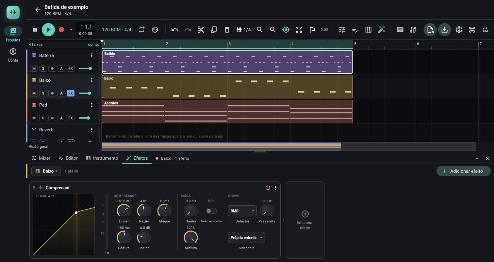

# Painel de efeitos

> A cadeia de efeitos (inserts) de uma faixa ou do master: adicionar, reordenar, ligar e desligar, aplicar presets e mexer nos controles de cada efeito. Use quando o som de uma faixa precisa de timbre, dinâmica, espaço ou cor; cada efeito, parâmetro por parâmetro, está em [06d Referência dos efeitos](06d-efeitos-referencia.md).

*Aba Efeitos de uma faixa com um Compressor: curva de transferência, controles e chave de sidechain.*

## Onde fica

O painel Efeitos é uma das quatro abas do painel de baixo da tela do projeto (Mixer, Editor, Instrumento, Efeitos). Ele mostra o rack de **uma** faixa por vez, ou do master.

| Como abrir | O que acontece |
|---|---|
| Aba `Efeitos` do painel de baixo (tooltip `Efeitos da faixa (F)`) | Abre o rack da faixa selecionada; sem faixa selecionada, o do master. Com o painel já aberto, tocar a aba não troca o que está à vista (útil quando o master foi aberto pelo mixer). |
| Botão de painel `Efeitos da faixa (F)` na barra de transporte (ícone de varinha) | Abre e fecha o painel. |
| Tecla `F` | O mesmo: abre o painel (na faixa selecionada) ou fecha se já está aberto. |
| Chip `FX` no cabeçalho de cada faixa da timeline e no cabeçalho do `Master` (tooltip `Efeitos`, `Efeitos (3)` quando há 3 efeitos, `Fechar os efeitos` quando aberto) | Abre o rack daquela faixa ou do master. O chip fica aceso quando a cadeia tem algum efeito. |
| Ícone de tipo de um barramento na timeline (tooltip `Barramento: abrir os efeitos`) | Abre o rack do barramento. |
| Linha de insert na tira do mixer (nome do efeito) | Abre o rack na faixa dela, ver [06 Mixer](06-mixer.md). |

Com o painel aberto, **escolher outra faixa** (na timeline ou no mixer) troca o rack para ela. Com a tela abaixo de 800 px de largura (celular) os cartões de efeito ficam empilhados; com 800 px ou mais (computador) a cadeia corre na horizontal. As abas do painel só mostram o ícone quando a largura é menor que 560 px.

O sinal passa pelos efeitos na ordem da cadeia, do primeiro ao último, **depois do instrumento ou dos clipes e antes do volume e do pan da faixa**. No master, os efeitos processam a mistura inteira, antes do volume final e do limitador de segurança. A cadeia aceita até 16 efeitos por faixa e no master (limite do motor, ver [Limites e pegadinhas](#limites-e-pegadinhas)).

## Controles

### Cabeçalho do painel

| Controle (rótulo exato) | O que faz | Valores / padrão | Dica |
|---|---|---|---|
| Seletor de faixa (tooltip `De qual faixa são os efeitos`) | Escolhe de quem é o rack: `Master` ou qualquer faixa. Cada item mostra um selo com o número de efeitos da faixa (só aparece quando é maior que zero) e um visto na que está aberta. Escolher uma faixa também a seleciona. | Segue a faixa selecionada ao abrir | Faixa apagada: o painel volta sozinho para o `Master`. |
| Resumo (só no computador) | Texto cinza ao lado do seletor: `nenhum efeito`, `3 efeitos`, `1 efeito`, `3 efeitos · 1 desligado`. | Só leitura | Conte aqui quantos efeitos estão em bypass. |
| `Adicionar efeito` (computador) / `Efeito` (celular) | Abre o menu de tipos de efeito, logo abaixo do botão. O efeito novo entra **no fim da cadeia**, nos valores padrão, e a lista rola até ele. | Menu abaixo. Desabilitado com 16 efeitos na cadeia (tooltip `Limite de 16 efeitos por faixa`) | Adicionar é desfazível. |

Uma barra colorida na esquerda do cabeçalho usa a cor da faixa (o master usa a cor de destaque do app).

### Menu de adicionar efeito

Os tipos vêm agrupados por família, com o nome e uma descrição de uma linha. O mesmo menu abre a partir da linha `Efeito` da tira do mixer.

| Família | Item | Descrição no menu |
|---|---|---|
| TIMBRE | `EQ` | Equalizador paramétrico de 8 bandas |
| TIMBRE | `Filtro` | Filtro com LFO e seguidor de envelope |
| DINÂMICA E UTILIDADE | `Compressor` | Controla a dinâmica: segura os picos e encorpa |
| DINÂMICA E UTILIDADE | `Gate` | Fecha o som abaixo do limiar (ruído, vazamento) |
| DINÂMICA E UTILIDADE | `Limitador` | Teto absoluto, com lookahead |
| DINÂMICA E UTILIDADE | `Utilitário` | Ganho, pan, largura, mono e fase |
| ESPAÇO | `Reverb` | Ambiência e salas, do quarto à catedral |
| ESPAÇO | `Delay` | Ecos livres ou no andamento, com ping-pong |
| MODULAÇÃO | `Chorus` | Chorus e flanger |
| MODULAÇÃO | `Phaser` | Filtros passa-tudo em movimento |
| MODULAÇÃO | `Tremolo` | Tremolo e autopan |
| SATURAÇÃO | `Distorção` | Saturação, válvula, fita, fuzz e bitcrusher |

Pode haver mais de um efeito do mesmo tipo na cadeia (dois `EQ`, por exemplo); nos alvos de automação eles aparecem numerados (`EQ 1`, `EQ 2`).

### Estado vazio

Rack sem nenhum efeito mostra um texto de orientação e atalhos.

| Controle (rótulo exato) | O que faz | Dica |
|---|---|---|
| Título `Nenhum efeito em <nome da faixa>` / `Nenhum efeito no master` | Só informa. O texto explica onde os inserts atuam: numa faixa, "depois do instrumento / dos clipes / do que chega pelos envios e saídas e antes do volume e do pan"; no master, "antes do volume final e do limitador de segurança". | |
| `EQ`, `Compressor`, `Reverb` (faixa) ou `EQ`, `Compressor`, `Limitador` (master) | Adiciona esse efeito já. Tooltip com a descrição do efeito. | Um bom começo, segundo o próprio painel. |
| `Todos os efeitos` | Abre o menu completo. | |

### Cartão de efeito

Cada efeito é um cartão com cabeçalho e o editor dele. No computador os cartões formam uma fileira horizontal, cada um com a altura toda do painel e uma seta (`>`) entre eles marcando o sentido do sinal; no fim da fileira há o bloco `Adicionar efeito` (apagado e com o cursor de proibido quando a cadeia está cheia). No celular os cartões vão um embaixo do outro e o último item da lista é o botão `Adicionar efeito`.

| Controle (rótulo exato) | O que faz | Valores / padrão | Dica |
|---|---|---|---|
| Alça de seis pontos (tooltip `Arraste para mudar a ordem`) | Arrastar muda o cartão de posição na cadeia. | Computador: começa a arrastar na hora. Celular: alça de 34 px. | O título do cartão também arrasta (no celular, com toque longo, para não brigar com a rolagem). |
| Título (ícone e nome do tipo) | Nome do efeito. Fica cinza com bypass. | `EQ`, `Compressor`... | |
| Subtítulo cinza | `Sala`: os parâmetros batem exatamente com esse preset (de fábrica ou seu). `Sala (editado)`: você aplicou o preset nesta sessão e depois mexeu. Vazio: nem uma coisa nem outra. | | O `(editado)` não é salvo: depois de recarregar o projeto só aparece o nome se os valores ainda forem idênticos aos do preset. |
| Rótulo `desligado` | Aparece ao lado do título quando o efeito está em bypass. O cartão inteiro fica a 42% de opacidade. | | |
| Botão liga/desliga (ícone de energia; tooltip `Desligar o efeito (bypass)` ou `Ligar o efeito`) | Liga e desliga o efeito sem perder os ajustes. Aceso na cor da faixa = ligado. | Padrão: ligado | Alterna em um crossfade de 10 ms, sem estalo. |
| Menu de três pontos (tooltip `Presets e mais`) | Abre o menu abaixo. | | |

Itens do menu de três pontos:

| Item | O que faz |
|---|---|
| `MEUS PRESETS`, `Nenhum ainda`, a lista dos seus, `Salvar como preset…` e `Importar preset…` | **No topo do menu**, acima dos de fábrica (desde a fase 13; antes ficavam depois deles): presets seus para este tipo de efeito (o EQ guarda as 8 bandas; o `Sidechain` do compressor e do gate não entra). O `…` de cada linha renomeia, exporta (`.jopreset`) e apaga. Detalhes em [Presets do usuário](#presets-do-usuário). |
| `PRESETS` e a lista de presets do tipo | Vêm logo depois da seção `MEUS PRESETS`. Aplica o preset com **todos** os valores: o que o preset não cita volta ao padrão do efeito. O que bate com os parâmetros atuais leva um visto. Só o `Sidechain` do compressor e do gate é preservado (é roteamento, não timbre). |
| `Reiniciar (valores padrão)` | Volta todos os parâmetros ao padrão. Fica apagado se o efeito já está no padrão. |
| `Desligar (bypass)` / `Ligar` | O mesmo do botão de energia. |
| `Mover para a esquerda` / `Mover para a direita` (computador); `Mover para cima` / `Mover para baixo` (celular) | Troca de lugar com o vizinho. Apagado na ponta da cadeia. |
| `Remover` (vermelho) | Tira o efeito da cadeia **e apaga a automação** que apontava para ele. |

Todas essas ações entram no histórico de desfazer (aplicar um preset seu também; salvar, renomear, apagar e importar presets não, porque são do aparelho e não do projeto).

### Presets do usuário

Cada tipo de efeito tem a sua lista de presets seus. Eles funcionam como os do instrumento (a mesma janela de nome, as mesmas regras de nome, a mesma exportação em `.jopreset`): o passo a passo de cada janela e os textos de erro estão em [04 Painel de instrumento, Meus presets](04-painel-de-instrumento.md#meus-presets). Aqui vai só o que muda para efeitos. Receita completa, com a cadeia vocal: [Presets do usuário](../guias/presets-do-usuario.md).

**Onde.** Menu de três pontos do cartão (tooltip `Presets e mais`), que abre com altura máxima de 680 px. A ordem é: `MEUS PRESETS`, a lista dos seus (ou `Nenhum ainda`), `Salvar como preset…`, `Importar preset…`, divisor, `PRESETS` (de fábrica), divisor, e só depois `Reiniciar (valores padrão)`, `Desligar (bypass)`, `Mover...` e `Remover`. Desde a fase 13 `MEUS PRESETS` fica no **topo** do menu (antes ficava entre os de fábrica e as ações do cartão), então `Salvar como preset…` e `Importar preset…` aparecem sem rolar. O menu é o mesmo nos cartões do rack do master e no de barramentos.

**O que cada preset guarda, por tipo.** Todos os parâmetros do tipo, na unidade da tabela do efeito ([06d](06d-efeitos-referencia.md)), menos o `Sidechain`:

| Tipo | Parâmetros guardados |
|---|---|
| `EQ` | 49: as 8 bandas (`Ligada`, `Tipo`, `Frequência`, `Ganho`, `Q`, `Inclinação` de cada uma) e a `Saída` |
| `Compressor` | 10 de 11: tudo, menos o `Sidechain` |
| `Gate` | 6 de 7: tudo, menos o `Sidechain` |
| `Limitador` | 5 |
| `Utilitário` | 8 (`Ganho`, `Pan`, `Largura`, `Mono`, `Inverter esq.`, `Inverter dir.`, `Trocar E/D`, `Tirar DC`) |
| `Reverb` | 10 |
| `Delay` | 12 |
| `Chorus` | 7 |
| `Phaser` | 7 |
| `Tremolo` | 6 |
| `Distorção` | 9 |
| `Filtro` | 11 |

**O que não é guardado:** a escolha do `Sidechain` (é roteamento do projeto: a faixa-chave não faz sentido em outro projeto; ao aplicar, o `Sidechain` do cartão continua como está), o estado ligado ou desligado (bypass), a posição do cartão na cadeia e a automação do efeito.

**Aplicar.** Escolher um preset seu põe todos os valores do preset no cartão (nada do que estava antes sobra, exceto o `Sidechain`), num passo do desfazer. O preset de um tipo só aparece no menu desse tipo: um preset de `Reverb` não aparece no `Delay`. Dois cartões do mesmo tipo (dois `EQ`) enxergam a mesma lista.

**Subtítulo do cartão.** Quando os valores do cartão batem com um preset seu, o subtítulo cinza mostra o nome dele e o menu o marca com um visto; se também batem com um de fábrica, vale o seu. Depois de aplicar e mexer, aparece `Nome (editado)` (só nesta sessão do painel). Os cartões de efeito não têm rótulos `Inicial` nem `Personalizado`: sem correspondência e sem preset aplicado, o subtítulo fica vazio.

**Ao importar.** Um arquivo `.jopreset` de outro tipo entra no tipo dele, não no do cartão onde você importou; a janela avisa `O preset é de outro tipo (reverb): ele foi guardado, mas só aparece no menu desse tipo.` Os nomes de tipo nessa mensagem são os internos: `eq`, `compressor`, `gate`, `limiter`, `utility`, `reverb`, `delay`, `chorus`, `phaser`, `tremolo`, `distortion`, `filter`.

**Onde ficam.** No aparelho (mesmo registro `userpresets` dos presets de instrumento), sem sincronizar com a conta e fora do `.jopendaw` do projeto; para levar a outro aparelho, `Exportar preset…` e `Importar preset…`. Um preset por cartão e por tipo: **não existe preset da cadeia inteira**, então uma cadeia favorita são vários presets (um por efeito) que você recoloca na ordem à mão.

### Os editores dos efeitos

Três tipos de editor cobrem os 12 efeitos:

| Editor | Efeitos | O que se vê |
|---|---|---|
| Gráfico de resposta com bandas | `EQ` | Curva de resposta, nós arrastáveis por banda, espectro ao vivo por trás e a lista das 8 bandas. |
| Curva de transferência com medidor | `Compressor`, `Gate`, `Limitador` | Gráfico entrada × saída em dB, medidor de redução de ganho e os controles. |
| Controles agrupados | `Utilitário`, `Reverb`, `Delay`, `Chorus`, `Phaser`, `Tremolo`, `Distorção`, `Filtro` | Só os controles, agrupados com título (ex.: `TIMBRE`, `LFO`, `SAÍDA`). Sem gráfico. |

#### Controles individuais

| Controle | Como se mexe | Dica |
|---|---|---|
| Knob (giratório com o valor em cima e o nome embaixo) | Arrastar na **vertical**: 200 px percorrem a faixa toda; com `Shift`, 1000 px (ajuste fino). Roda do mouse sobre o knob: mexe o valor sem rolar a lista (com `Shift`, fino). Duplo clique: volta ao padrão. Botão direito no mouse, ou toque longo no celular: abre um menu com `Digitar o valor…` (o campo para digitar o valor), `Aprender MIDI` e, se o knob já está mapeado, `Remover mapeamento (Canal 1 · CC 74)`; ver [06f MIDI learn](06f-midi-learn.md) (o tooltip continua dizendo só `botão direito: digitar o valor`; os seletores de opção e a faixa-chave do `Sidechain` não têm o menu, e o `Sidechain` não se mapeia). Tooltip: `<nome>: arraste ou use a roda (Shift: ajuste fino) / Duplo clique: padrão (<valor>) · botão direito: digitar o valor`. | Um arraste inteiro vale um passo só no desfazer. |
| Campo de valor digitado | Título com o nome do parâmetro, dica `De <mín> a <máx>`, botões `Cancelar` e `Aplicar`. Aceita número com ou sem unidade: `800 Hz`, `2,5 kHz`, `-3 dB`, `150 ms`, `70%`, `1.5 oit`; vírgula vale como ponto. Sem unidade, um valor acima do máximo de um parâmetro em segundos é lido como milissegundos. Erro: `Não entendi. Use um número, com a unidade se quiser.` Fora da faixa, o valor é limitado. | Números inteiros (vozes, bits) são arredondados. |
| Pílula liga/desliga (`Não`/`Sim` em cima, nome embaixo) | Toque ou clique alterna. | Vale para todo parâmetro de duas opções `Não`/`Sim` (`Ping-pong`, `Congelar`, `Mono`...). |
| Seletor de opções (caixa com seta) | Abre um menu com as opções. | Tipos, ondas, notas, `Tempo` (`Livre`/`Andamento`) e `Sidechain`. |
| Controle **apagado** (texto mais escuro) | O parâmetro não tem efeito com os ajustes de agora, mas continua mexível. Ex.: `Decaimento` do reverb com `Congelar` ligado; `Bits`, `Reduzir taxa` e `Dither` fora do tipo `Bitcrusher` (e `Sobreamostragem` **dentro** dele). O `Ganho` do compressor **não** fica apagado com o `Ganho automático` ligado (os dois somam). A lista completa está em cada efeito na referência. | |
| Knob laranja | O parâmetro tem automação e o projeto está tocando: o knob segue a curva. Ver [07 Automação](07-automacao.md). | Todo parâmetro de efeito é automatizável, menos a faixa-chave do `Sidechain`. Os knobs também **gravam automação** com o projeto tocando, conforme o modo do botão `Automação` da barra (`Escrever`, `Toque` ou `Trava`; em `Ler` só mudam o valor fixo): ver [07 Automação, Gravar automação](07-automacao.md#gravar-automação). |

Os controles de **tempo** mostram ou a figura ou o tempo, conforme a chave: no `Delay` e no `Filtro`/`Tremolo`, com `Tempo` em `Livre` aparece o valor em segundos ou Hz; em `Andamento` aparece `Nota`.

#### Gráfico do EQ

O EQ tem o editor mais rico. Mais detalhes por parâmetro em [06d, seção EQ](06d-efeitos-referencia.md#1-eq-8-bandas).

| O que | Como se mexe | Resultado |
|---|---|---|
| Nó numérico (círculo com o número da banda) | Clicar seleciona; **arrastar** move. Raio de captura: 11 px com mouse, 22 px no toque. | Horizontal muda a `Frequência` (escala logarítmica, 20 Hz a 20 kHz). Vertical muda o `Ganho` (±24 dB) nas bandas `Sino`, `Prateleira grave` e `Prateleira aguda`; nos `Passa-alta`/`Passa-baixa` muda o `Q` (ressonância no corte); no `Rejeita-faixa` a vertical não faz nada. `Shift` = movimento fino (20%). |
| Duplo clique num nó | Liga ou desliga a banda. | Nó vazado = banda desligada. |
| Duplo clique no vazio | Acende uma banda livre ali, como `Sino` com `Q` 1, na frequência e no ganho do ponto. Não faz nada se as 8 bandas já estão ligadas. | O jeito mais rápido de criar um corte ou um realce. |
| Roda do mouse sobre um nó (ou com uma banda escolhida) | Muda o `Q` da banda (com `Shift`, mais fino). Pinça no trackpad faz o mesmo. | Girar para cima estreita. |
| Pinça de dois dedos (toque) com uma banda escolhida | Abrir os dedos alarga a banda (`Q` menor). | |
| Balão sobre o nó (ao arrastar ou passar o mouse) | Mostra `1 · Passa-alta   30 Hz   24 dB/oit   Q 0.71` (ganho no lugar da inclinação nas bandas com ganho; `(desligada)` quando for o caso). | |
| Fundo | Grade em 50, 100, 200, 500, 1k, 2k, 5k, 10k Hz e em ±6, ±12, ±18 dB; espectro da faixa em cinza (sobe na hora, cai a 36 dB/s). | O espectro é o da **saída da faixa** (depois de todos os efeitos e do fader), não o do ponto onde o EQ está na cadeia. No master é depois do limitador. |
| Aviso `Todas as bandas desligadas. Duplo clique no gráfico acende uma banda ali.` | Aparece quando nenhuma banda está ligada. | |

A lista à direita (computador) ou embaixo (celular) tem uma linha por banda, com os cabeçalhos `#`, `TIPO`, `FREQ.`, `GANHO`, `Q`, e o `Saída` no pé:

| Célula | Como se mexe |
|---|---|
| Círculo numerado (tooltip `Ligar a banda N` / `Desligar a banda N`) | Toque liga/desliga. Cheio = ligada. |
| `TIPO` (desenho da curva; no celular também o nome curto) | Menu com os 6 tipos, cada um com seu desenho. |
| `FREQ.` | Valor arrastável na vertical (`Shift` fino, roda, duplo clique = padrão, botão direito ou toque longo = digitar). |
| `GANHO` | O ganho nas bandas que têm ganho; nos passa-alta e passa-baixa vira um menu de inclinação (tooltip `Inclinação`, itens `12 dB/oit`, `24 dB/oit`, `48 dB/oit`); no `Rejeita-faixa` mostra `—`. |
| `Q` | Valor arrastável, com duas casas abaixo de 10 (`0.71`) e uma acima. |
| `Saída` | Ganho de saída do EQ, −24 a +24 dB, mesmo comportamento dos valores arrastáveis. |

Clicar em qualquer parte da linha seleciona a banda (realça o nó e desenha a curva dela sozinha por baixo da soma).

#### Gráfico dos efeitos de dinâmica

`Compressor`, `Gate` e `Limitador` têm um gráfico quadrado (de 70 a 220 px de lado) e, ao lado, o medidor.

| O que | Como se mexe | Resultado |
|---|---|---|
| Curva de transferência (eixo horizontal = entrada, vertical = saída, ambos em dB) | Arrastar na **horizontal** em qualquer ponto do gráfico. `Shift` = fino. No compressor a curva já soma o ganho de saída como o motor (o `Ganho` manual mais, com `Ganho automático`, o automático). | Compressor e gate: muda o `Limiar` (a bolinha branca sobre a curva marca o joelho, com uma linha tracejada vertical). Limitador: muda o `Ganho` de entrada (arrastar para a esquerda empurra mais ganho). |
| Diagonal tracejada | Referência 1:1 (sem processamento). | |
| Faixa sombreada (compressor) | Largura do `Joelho` em volta do limiar. | |
| Ponto de operação (círculo colorido) | Aparece na curva enquanto há redução de ganho: onde o sinal está agora. | Só no compressor e no limitador. |
| Legenda no canto superior esquerdo | Compressor: `-18.0 dB · 4.0:1` (e ` · auto` com ganho automático). Gate: `limiar -50.0 dB`. Limitador: `teto -0.3 dB`. | |
| Faixas dos eixos | Compressor −60 a 0 dB; gate −80 a 0 dB; limitador −36 a 0 dB. | |

O **medidor de redução de ganho** (coluna à direita do gráfico) mostra quantos dB o efeito está abaixando o sinal, crescendo de cima para baixo em escala de raiz (os primeiros dB, onde mora a compressão boa, ganham mais espaço). Um traço branco segura o pico por 1,2 s e depois cai a 12 dB/s. Embaixo há o número: `0.0`, `−4.5` ou `—`. Marcas: compressor e limitador `1, 3, 6, 12, 24` dB; gate `3, 12, 30, 60` dB.

- **Um efeito de dinâmica é medido por vez.** O medidor pertence ao último que você tocou; nos outros ele mostra `—` e o tooltip `O medidor mostra um efeito de dinâmica por vez: toque neste para medir`. Ao abrir o rack, vale o primeiro da cadeia.
- Com o efeito ligado, o tooltip é `Redução de ganho agora (o traço segura o pico)`; com bypass, `Efeito desligado: nada a medir`.
- O motor chama esse indicador de `fx_meter`, e o app de `fxMeter`. Ele só é pedido enquanto há um editor de dinâmica na tela.
- A escala do medidor do gate e do compressor difere: no gate ela vai até 60 dB.

## Passo a passo

### Colocar um EQ e um compressor numa faixa

1. Selecione a faixa e aperte `F` (ou abra a aba `Efeitos`). O rack vazio mostra `EQ`, `Compressor`, `Reverb`.
2. Toque em `EQ`. O cartão aparece com as bandas 2 a 7 ligadas em 0 dB (a curva fica reta).
3. Abra o menu de três pontos do cartão e escolha um preset (por exemplo `Voz presente`).
4. Toque em `Adicionar efeito` e escolha `Compressor`. Ele entra depois do EQ. Aplique o preset `Voz`.
5. Toque uma vez no gráfico do compressor para o medidor passar a ser o dele; toque a faixa e ajuste o `Limiar` arrastando na horizontal até o medidor mostrar a redução desejada.

### Mudar a ordem dos efeitos

1. Segure a alça de seis pontos do cartão (ou o título) e arraste sobre os vizinhos; solte na posição nova.
2. Alternativa: abra o menu de três pontos e use `Mover para a esquerda` / `Mover para a direita` (`cima` / `baixo` no celular).
3. Escute: a ordem muda o som. EQ antes do compressor aperta o que você realçou; depois, só refina o resultado.

### Comparar com e sem o efeito

1. Toque no botão de energia do cartão (tooltip `Desligar o efeito (bypass)`).
2. Repita o trecho: o cartão fica apagado com `desligado`. Os ajustes ficam guardados.
3. Ligue de novo. O efeito volta zerado no estado interno (um delay não devolve os ecos de antes do bypass).

### Efeitos no master

1. Abra o painel e, no seletor de faixa, escolha `Master` (ou toque o chip `FX` do cabeçalho `Master` na timeline).
2. Use o começo sugerido: `EQ`, `Compressor`, `Limitador`.
3. Ponha o `Limitador` por último. O preset `Master −1 dB` já dá um teto de −1 dB.

### Escolher a faixa-chave de um compressor (sidechain)

1. No cartão do compressor, no grupo `CHAVE`, abra o seletor `Sidechain`.
2. Escolha a faixa pelo nome (`Própria entrada` é o padrão). A própria faixa não aparece na lista.
3. Abaixe o `Limiar` até o medidor reagir quando a faixa-chave toca. Receita completa em [Efeitos em combinação](../guias/efeitos-em-combinacao.md).

## Combina com

- [06d Referência dos efeitos](06d-efeitos-referencia.md): cada parâmetro dos 12 efeitos, faixas, padrões e presets.
- [06 Mixer](06-mixer.md): as linhas de insert de cada tira (com a luz que liga e desliga o efeito), os envios e barramentos onde `Reverb` e `Delay` costumam morar.
- [06e Compensação de latência](06e-compensacao-de-latencia.md): o que o motor faz quando um efeito atrasa o som.
- [06b Analisador e medidores](06b-analisador-e-medidores.md): espectro e níveis para julgar o que o EQ e o compressor fizeram.
- [07 Automação](07-automacao.md): mover qualquer parâmetro de efeito ao longo da música (filtro abrindo, mistura de reverb subindo).
- [06f MIDI learn](06f-midi-learn.md): ligar um knob de efeito (o `Corte` do `Filtro`, a `Mistura` do `Reverb`) a um botão ou pedal de expressão de um controlador MIDI.
- [Efeitos em combinação](../guias/efeitos-em-combinacao.md): cadeia vocal, compressão paralela, sidechain, delay em ping-pong, pad largo, baixo distorcido.
- [Presets do usuário](../guias/presets-do-usuario.md): guardar os ajustes de cada efeito com nome (a cadeia vocal favorita, por exemplo) e levá-los a outro aparelho.

## Limites e pegadinhas

- **Máximo de 16 efeitos por cadeia** (faixa ou master), o que o motor comporta. Com 16 efeitos, o botão `Adicionar efeito` (computador), o botão `Efeito` (celular), o bloco `Adicionar efeito` no fim da fileira e a linha `Efeito` do mixer ficam desabilitados, e o tooltip diz `Limite de 16 efeitos por faixa`. Remova um efeito para liberar lugar (testado só por testes automáticos).
- **Latência dos efeitos é compensada.** O `Limitador` atrasa o áudio pelo `Lookahead` (padrão 3 ms) e a `Distorção` por cerca de 0,67 ms (32 quadros a 48 kHz), fixo, e o motor atrasa as outras faixas, barramentos, envios (pré e pós-fader) e a chave do sidechain para tudo chegar alinhado ao master, com o efeito ligado ou em bypass (a luz do efeito não muda o alinhamento). A gravação do app soma essa latência à do aparelho (áudio e notas MIDI) e o clique do metrônomo é atrasado junto. Fica de fora a automação, que age alguns ms adiantada numa faixa com efeito de latência; a automação do `Lookahead` do `Limitador` refaz a conta com até 20 ms de atraso. Para tirar a latência de um `Limitador`, ponha o `Lookahead` em 0 ou remova o efeito. Capítulo [06e](06e-compensacao-de-latencia.md); tabela em [06d](06d-efeitos-referencia.md#latência-e-custo-de-cada-efeito) `(testado só por testes automáticos)`.
- **Trocar a ordem, ligar, desligar, adicionar e remover** fazem crossfade de 10 ms: sem estalo. Mudar a ordem recria, no motor, os efeitos dos lugares que trocaram de tipo (pelo que o código de sincronização faz): o estado interno deles, como a cauda de um reverb ou os ecos de um delay, recomeça do zero. Trocar o **tipo** de efeito num slot não existe no painel: remova e adicione.
- **Sidechain** só existe no `Compressor` e no `Gate`; não é automatizável; presets, de fábrica ou seus, não o alteram (o preset seu nem o guarda); a faixa apagada aparece como `Faixa N (removida)` e o efeito volta a usar a própria entrada.
- **Cauda:** com a entrada calada a cadeia continua rodando enquanto o efeito tem o que devolver (eco do delay de até 4 s, cauda do reverb). Parar o transporte não corta a cauda de imediato.
- O subtítulo `(editado)` e a escolha de qual dinâmica é medida **não são salvos** com o projeto. Efeitos, parâmetros, ordem e bypass são.
- O medidor do gate satura em 60 dB de redução, mesmo que o `Alcance` chegue a −80 dB.
- As curvas do EQ são desenhadas supondo 48 kHz de taxa de amostragem; em 44,1 kHz a diferença só aparece perto de Nyquist.
- O espectro do EQ é o da saída da faixa, não o do ponto da cadeia (ver acima).
- Web e Android usam o mesmo motor; no celular a diferença é só de layout (cartões empilhados, toque longo no lugar do botão direito, pinça no lugar da roda).

## Atalhos

| Tecla / gesto | Ação |
|---|---|
| `F` | Abre ou fecha o painel Efeitos (na faixa selecionada) |
| `Esc` | Fecha o painel de baixo |
| `Ctrl` (ou `Cmd`) + `Z` | Desfaz a última mudança (adicionar, remover, mover, bypass, preset, um arraste inteiro) |
| `Shift` + `Ctrl`/`Cmd` + `Z`, ou `Ctrl`/`Cmd` + `Y` | Refaz |
| `Shift` durante um arraste, roda ou nó do EQ | Ajuste fino |
| Duplo clique num knob ou valor | Volta ao padrão |
| Duplo clique num nó do EQ | Liga/desliga a banda |
| Duplo clique no vazio do gráfico do EQ | Acende uma banda ali |
| Botão direito (toque longo no celular) num knob | Menu: `Digitar o valor…`, `Aprender MIDI`, `Remover mapeamento (...)` |
| Botão direito (toque longo no celular) num valor do gráfico do EQ | Digitar o valor |
| `Shift+K` | Liga e desliga o modo `Aprender MIDI` (os knobs de efeito ganham contorno; ver [06f](06f-midi-learn.md)) |
| Botão direito (toque longo) numa linha de insert do mixer | Menu `Abrir nos efeitos`, `Desligar (bypass)`, `Mover para cima`, `Mover para baixo`, `Remover` |
| Roda do mouse sobre o cartão (fora de um controle) | Rola a fileira de efeitos na horizontal |
