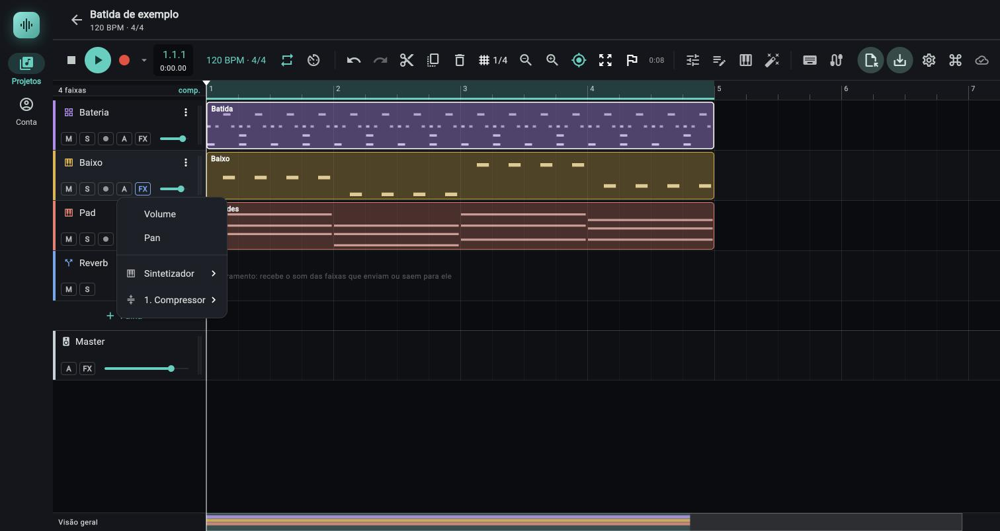
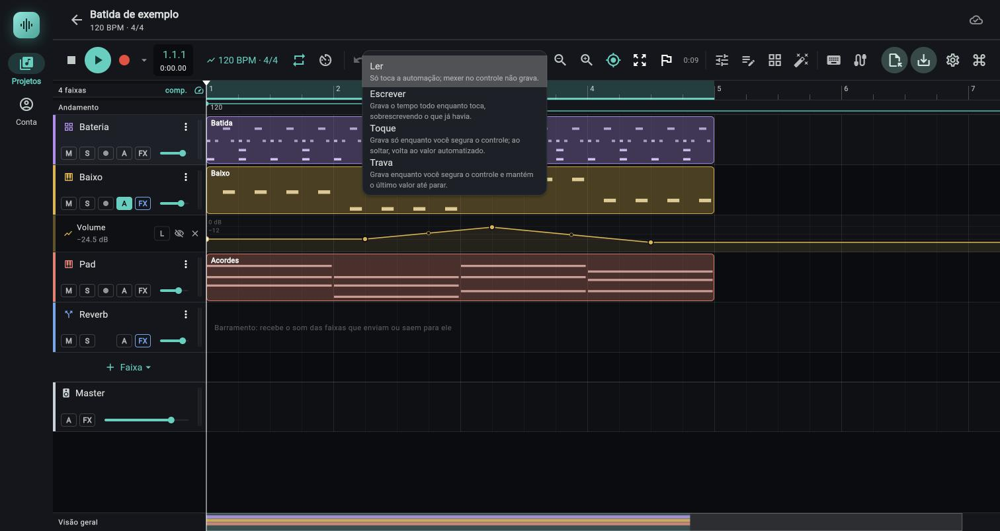

# Automação

> Desenhar na linha do tempo, ou gravar mexendo nos controles com a música tocando, como um controle muda ao longo da música (volume, pan, nível de envio e qualquer parâmetro de instrumento ou de efeito); use para fades, varreduras de filtro, entradas e saídas de reverb.

*Botão A da faixa: o menu de alvos da automação (Volume, Pan, instrumento e cada efeito da cadeia).*

*Raia de automação de volume sob a faixa Baixo: pontos e curvas entre eles, o seletor de modo L, o olho para ocultar e o X para fechar; ao alto, a faixa Andamento.*

## Onde fica

- **Botão `A`** no cabeçalho de cada faixa na linha do tempo (à direita de `S` e do botão de armar), e no cabeçalho do `Master`, no fim da lista de faixas. Tooltip: `Automação`, ou `Automação (N)` quando a faixa já tem N automações.
  - `A` cheio = há uma raia aberta; só o contorno na cor da automação = há automações, mas todas ocultas; apagado = nenhuma.
- **As raias** (sub-raias de 56 px) abrem logo abaixo da faixa, na mesma escala de tempo da linha do tempo; as do master abrem abaixo da linha `Master`.
- O mixer, o painel de instrumento e o de efeitos mostram o resultado: fader, pan e knobs andam sozinhos, em laranja, enquanto toca. Eles também **gravam** a automação quando o botão `Automação` da barra (ou o seletor da raia) está em `Escrever`, `Toque` ou `Trava`: ver [Gravar automação](#gravar-automação). Em `Ler` (o padrão) só mostram.
- **Botão `Automação`** na barra do transporte e **seletor `L`/`E`/`T`/`V`** no cabeçalho de cada raia: escolhem o modo de gravação.
- No celular vale o mesmo; os gestos de toque estão em "Controles".

## Controles

### Menu do botão `A`

Tocar em `A` abre um menu com os alvos automatizáveis daquela faixa. Escolher um alvo abre a raia dele (criando, se ainda não existe); escolher um que já está aberto **oculta** a raia (a automação continua valendo). Criar uma raia entra no desfazer; mostrar e ocultar, não.

| Item do menu (rótulo exato) | O que automatiza | Valores / padrão | Dica |
|---|---|---|---|
| `Volume` | O fader da faixa (ou do master). | De −∞ a +6 dB; escala do fader. | |
| `Pan` | O pan da faixa (no master, o balanço). | De −1 (esquerda) a +1 (direita); centro = 0. | |
| `Envio → Barramento 1` (um por envio existente) | O nível do envio da faixa para aquele barramento. | De −∞ a +6 dB, escala do fader. | Só aparece depois de criar o envio. Não existe no master. |
| Submenu com o nome do instrumento (ex.: `Sintetizador`, com ícone) | Cada parâmetro do instrumento da faixa, agrupado por seção (títulos em maiúsculas). | Faixa, unidade e escala da tabela do instrumento. | Só em faixa de instrumento. Barramento e faixa de áudio não têm este submenu. |
| Submenu `1. EQ`, `2. Reverb`... (posição do efeito na cadeia) | Cada parâmetro do efeito, agrupado por seção. | Faixa, unidade e escala da tabela do efeito (ver [06d](06d-efeitos-referencia.md)). | Dois efeitos do mesmo tipo ficam distinguíveis pelo número. |
| `Mostrar as ocultas (N)` | Reabre todas as raias ocultas. | | Só aparece com raias ocultas. |
| `Ocultar todas` | Fecha todas as raias abertas da faixa. | | A automação continua tocando. |
| `Nada para automatizar aqui` | Aviso quando o menu está vazio. | | |

Cada item de alvo mostra à esquerda um `✓` (raia aberta) ou um olho riscado (raia oculta), e à direita a contagem de pontos (`3 pontos`, `1 ponto`). O menu de um grupo mostra quantas raias já estão criadas nele.

O parâmetro `Sidechain` (compressor e gate) **não** aparece: é uma escolha de faixa, não um valor que anda.

**Os três efeitos da fase 15 (`Multibanda`, `De-esser`, `Imagem estéreo`)** aparecem com todos os parâmetros, inclusive os de `Não`/`Sim` e de opções, que andam em degraus. No submenu do efeito os títulos de seção são os grupos da tabela; o nome da raia, depois de criada, junta o efeito e o parâmetro, e acrescenta o grupo entre parênteses quando o nome se repete no efeito:

| Efeito | Seções do submenu | Nomes de raia (exemplos) |
|---|---|---|
| `Multibanda` | `CRUZAMENTO`, `SAÍDA`, `BAIXA`, `MÉDIA`, `AGUDA` | `Multibanda · Cruzamento baixo/médio`, `Multibanda · Saída`, `Multibanda · Limiar (Baixa)`, `Multibanda · Ganho (Média)`, `Multibanda · Solo (Aguda)`, `Multibanda · Bypass (Baixa)`. Cada banda tem `Limiar`, `Razão`, `Ataque`, `Soltura`, `Ganho`, `Solo`, `Bypass` e `Joelho`. |
| `De-esser` | `BANDA`, `COMPRESSÃO`, `SAÍDA` | `De-esser · Frequência`, `De-esser · Q`, `De-esser · Limiar`, `De-esser · Razão`, `De-esser · Ataque`, `De-esser · Soltura`, `De-esser · Modo`, `De-esser · Ouvir banda`. |
| `Imagem estéreo` | `CRUZAMENTOS`, `LARGURA`, `SAÍDA`, `MONO` | `Imagem estéreo · Cruzamento baixo/médio`, `Imagem estéreo · Cruzamento médio/agudo`, `Imagem estéreo · Baixa`, `Imagem estéreo · Média`, `Imagem estéreo · Aguda`, `Imagem estéreo · Balanço`, `Imagem estéreo · Mono nos graves`, `Imagem estéreo · Abaixo de`. |

As raias de largura da `Imagem estéreo` (`Baixa`, `Média`, `Aguda`) andam de 0 a 200%, e o desenho segue a escala do controle: os parâmetros em Hz (`Cruzamento`, `Frequência`, `Abaixo de`) e em segundos são logarítmicos. Faixa e padrão de cada um estão em [06d](06d-efeitos-referencia.md#13-multibanda). O teste do app confere só a escala (0 a 2, padrão 1) da largura da banda média e a do limiar da banda média (−60 a 0 dB, padrão −22) `(testado só por testes automáticos)`; automatizar os três efeitos ao ouvido não foi repetido por quem escreveu esta documentação `(não confirmado)`.

### Cabeçalho da raia

| Controle (rótulo exato) | O que faz | Valores / padrão | Dica |
|---|---|---|---|
| Nome do alvo (ex.: `Volume`, `Filtro · Corte`, `Envio → Barramento 1`) | Diz o que a raia move. Tocar seleciona a faixa. | Se o efeito ou o barramento foi apagado: `Alvo removido` e, embaixo, `não existe mais` (raia apagada, com hachura). | Remova a raia órfã com o `X`. |
| Valor embaixo do nome | O valor da curva **no cursor de reprodução**, ao vivo, na unidade do alvo (`−6.0 dB`, `C`, `E 30`, `1.41 kHz`). | Sem pontos, mostra o valor fixo do controle. | Vale também parado: mova o cursor e leia. |
| Olho riscado (tooltip `Ocultar (a automação continua valendo)`) | Fecha a raia sem apagar. | Não entra no desfazer. | Reabra pelo menu `A`. |
| `X` (tooltip `Remover a automação`) | Apaga a raia e os pontos; o controle volta ao valor fixo. | Entra no desfazer. | |

### Dentro da raia

O desenho é a curva; pontos são bolinhas; no meio de cada trecho há uma bolinha menor vazada, a **alça de curva**. A linha antes do primeiro ponto e depois do último fica parada no valor do ponto. Uma bolinha branca com contorno anda pela curva seguindo o cursor de reprodução. Linhas de grade: `0 dB`, `−12` e uma sem rótulo em −24 (volume e envios); `C` (pan); linhas em 25%, 50% e 75% da altura (parâmetros), ou uma linha `0` quando o parâmetro é linear e vai de negativo a positivo. Raia sem pontos mostra uma **linha tracejada** no valor fixo do controle e a dica `Clique para criar um ponto` (`Toque para criar um ponto` no celular).

| Gesto (mouse) | Efeito | Valores / padrão | Dica |
|---|---|---|---|
| Clique no vazio | Cria um ponto. A batida encaixa na grade; o valor é o da altura clicada. | A grade é a do botão da barra superior (tooltip `Grade de encaixe (Alt ao arrastar: livre)`: `Livre`, `Compasso`, `1/4`, `1/8`, `1/16`). `Alt` ao clicar ignora a grade. | Clicar a até 6 px da linha cria o ponto **em cima da linha** (a forma não muda). Nasce selecionado. |
| Clique num ponto | Seleciona. `Shift` alterna na seleção. | | |
| Arrastar um ponto | Move (batida e valor). Move junto todos os selecionados, sem passar do vizinho não selecionado nem antes da batida 0. | `Shift`: só o valor, em ajuste fino (um quarto). `Alt`: sem grade. | Um balão mostra `compasso.tempo.16avo · valor` (ex.: `5.1.1 · −6.0 dB`). |
| Duplo clique num ponto | Apaga o ponto. | Os dois cliques têm que cair no mesmo ponto. | Também: botão direito no ponto. |
| Arrastar no vazio | Seleção por retângulo. `Shift` soma à seleção atual. | | |
| Arrastar a alça de curva | Entorta o trecho entre este ponto e o próximo. | Curva de −100% a +100%; 50 px de arraste = 100%. `Shift`: um quarto. O balão diz `Curva +30%`, `Curva −30%` ou `Curva: reta`. | Tem alça só quando o trecho tem ao menos 18 px de largura e valores diferentes nas pontas. |
| `Alt` + arrastar no trecho | O mesmo que arrastar a alça, sem precisar acertá-la. | | |
| Duplo clique na alça (ou botão direito nela) | Volta o trecho à reta. | | |
| Botão direito no ponto | Apaga o ponto. | | |
| Botão direito no vazio | Limpa a seleção. | | |
| `Delete` ou `Backspace` | Apaga os pontos selecionados. | | Vale para a última raia em que você clicou. |
| `Ctrl+A` (`Cmd+A` no Mac) | Seleciona todos os pontos da raia. | | |
| `Esc` | Limpa a seleção (e segue para fechar o painel de baixo, se houver). | | |

**No celular (toque):** tocar no vazio cria um ponto; tocar num ponto seleciona; arrastar **um ponto** ou uma alça move; toque longo num ponto apaga. Arrastar no vazio rola a linha do tempo (não faz seleção por retângulo). Os alvos de toque são maiores (16 px de raio contra 7 do mouse).

Cada arraste é **um passo só** no desfazer; criar e apagar pontos também entram.

### Curva entre pontos (`curve`)

Cada ponto guarda a curva **até o próximo ponto**, de −1 a 1 (na tela, −100% a +100%). A forma entre dois pontos é `t^(2^(3·curva))`, onde `t` vai de 0 a 1 ao longo do trecho:

| Curva | Expoente | Como soa |
|---|---|---|
| 0 (padrão) | 1 | Reta |
| +50% | cerca de 2,8 | Começa devagar e acelera no fim |
| +100% | 8 | Quase parada no começo, muda quase tudo no finzinho |
| −50% | cerca de 0,35 | Muda depressa no começo e assenta |
| −100% | 0,125 | Salta quase tudo no começo |

O arraste da alça sempre segue o mouse (puxar para cima levanta a curva naquele trecho), mas o sinal da curva depende do sentido do trecho: num trecho que sobe, a alça para cima é curva negativa; num que desce, positiva. Dois pontos na **mesma batida** formam um **degrau**: o valor salta de um para o outro. Um ponto arrastado sobre a batida do vizinho vira degrau.

### Escala: por que o desenho não é uma reta em ganho nem em Hz

A curva entre dois pontos é calculada na **escala do controle**, não no valor bruto, para que "reta na tela" soe reta:

| Alvo | Escala do desenho | Efeito |
|---|---|---|
| `Volume` e `Envio →` | A curva do fader (ganho = 2 × posição³): 0 dB fica a ~79% da altura, +6 dB no topo, −∞ no fundo | Uma rampa reta soa como um fade parelho |
| `Pan` | Reta em −1 a +1 | |
| Parâmetros em Hz e segundos (`Corte`, `Frequência`, `Soltura`...) | Logarítmica, a mesma do knob | Uma rampa reta sobe o mesmo número de oitavas por compasso |
| Parâmetros lineares (`%`, `dB`...) | Reta no valor | |
| Parâmetros de opções e inteiros (`Tipo`, `Onda`, `Vozes`...) | Reta, com o valor arredondado a cada instante | O parâmetro anda em degraus |

Exemplos com números. **Fade de 0 dB a −∞ em 8 batidas**, reta na tela:

| Ponto do trecho | Ganho pela escala do fader (o desenho do app) | Se fosse reta no ganho linear |
|---|---|---|
| 25% | −7,5 dB | −2,5 dB |
| 50% | −18 dB | −6 dB |
| 75% | −36 dB | −12 dB |

Em ganho linear quase nada acontece no início e "despenca" no fim. **Varredura de `Corte` de 250 Hz a 8 kHz**: no meio do caminho, o filtro está em 1,4 kHz (média geométrica), meio caminho em oitavas; numa reta em Hz estaria em 4,1 kHz, e a maior parte da abertura já teria passado na primeira metade.

### Como isso vai ao motor

- O motor guarda os pontos em batidas absolutas e, **tocando**, avalia as raias a cada 32 quadros (0,7 ms a 48 kHz) e aplica: volume, pan, parâmetro de instrumento, parâmetro de efeito, nível de envio. Cada valor é limitado à faixa do parâmetro.
- Nos alvos com escala (volume, envios, e parâmetros em Hz, s etc.) o app quebra cada trecho em pequenos segmentos retos, um a cada 1/8 de batida (no mínimo 4 e no máximo 64 por trecho), porque o motor só interpola em reta. Nos trechos mais longos que 8 batidas os degraus ficam um pouco mais espaçados que 1/8 de batida.
- O valor **fixo** que você deixou no fader ou no knob fica guardado; a automação passa por cima dele sem apagá-lo. Parado, ou com a raia removida, vale o fixo.

### Knobs seguindo a automação

Enquanto **toca**, todo controle com automação passa a mostrar o valor da curva, na cor **laranja**:

| Controle | Onde |
|---|---|
| Fader e leitura em dB (a leitura fica laranja) | Mixer; minifader do cabeçalho da faixa e do master |
| Knob de pan | Mixer |
| Knobs de parâmetro | Painel de instrumento e painel de efeitos |

Parado, os controles mostram o valor fixo. Em `Ler`, arrastar um controle automatizado muda o **valor fixo** (não se ouve enquanto a curva toca; volta a valer ao parar); nos outros modos, o gesto grava. O knob de nível de envio, no mixer, **não** anda com a automação: quem mostra o valor é a raia.

## Gravar automação

Em vez de desenhar os pontos, você pode **tocar a música e mexer no controle**: o app grava o movimento como pontos de automação. Serve para fades, varreduras de filtro e ajustes de nível feitos "de ouvido". Só grava com o transporte **tocando**, e não junto com a gravação de áudio ou MIDI.

*O menu do botão Automação da barra: Ler, Escrever, Toque e Trava, cada um com a frase que resume o que faz. O seletor L da raia Volume (à esquerda do olho) mostra o modo daquela raia.*

### Onde fica

- **Botão `Automação` na barra do transporte**, entre a `Grade de encaixe` e o `Afastar` (ver [02 Transporte, Botão Automação](02-transporte.md#botão-automação)). Em `Ler` (o padrão) ele é só o ícone de gráfico, cinza-claro. Em `Escrever`, `Toque` ou `Trava` ele fica **vermelho**, com o nome do modo ao lado (só a inicial `E`, `T` ou `V` no celular). O tooltip é `Automação: <modo>. <frase do modo>`.
- **Seletor `L`/`E`/`T`/`V` no cabeçalho de cada raia**, à esquerda do olho riscado (ver [Seletor da raia](#seletor-da-raia)). Vale só para aquela raia e sobrepõe a barra.
- O modo da barra vale para todas as raias sem modo próprio, inclusive controles que ainda não têm raia (a raia é criada na hora).

### Os quatro modos

Menu do botão (cada item tem o nome e uma frase em letra pequena):

| Modo (rótulo exato) | Frase do menu | O que faz na prática |
|---|---|---|
| `Ler` (padrão) | `Só toca a automação; mexer no controle não grava.` | Nada grava. Mexer num controle automatizado muda só o valor fixo; a curva continua mandando enquanto toca. |
| `Escrever` | `Começa ao mexer no controle (só agarrar não basta): grava até parar, sobrescrevendo o que já havia.` | Depois do **primeiro toque no controle** (a primeira mexida que muda o valor), grava sem parar e por cima da curva antiga, mesmo com a mão fora do controle (nesse caso, o último valor que ele teve), até o transporte parar. Vale igual pelo botão da barra e pelo seletor `E` da raia: sem mexer no controle, a curva antiga não é apagada. `(testado só por testes automáticos)` |
| `Toque` | `Começa ao mexer no controle (só agarrar não basta) e grava enquanto você o segura; ao soltar, volta ao valor automatizado.` | Grava só enquanto o controle está seguro. Ao soltar, o valor volta ao que a automação tinha ali, numa rampa curta de **1/4 de batida**. Se não havia automação, volta ao valor fixo que o controle tinha antes da sua primeira mexida. Em parâmetros de opções e inteiros a volta é um degrau, sem rampa. Além da curva, o **valor fixo** que o controle mostra parado também volta ao de antes da mão. |
| `Trava` | `Começa ao mexer no controle (só agarrar não basta) e grava enquanto você o segura; mantém o último valor até parar.` | Grava enquanto você segura e, ao soltar, **mantém o último valor** (continua gravando-o) até o transporte parar. |

Nos três modos que gravam, a gravação só **começa quando o valor do controle muda**: agarrar o controle e soltá-lo sem mexer não grava nada (é o que as frases do menu dizem: `Começa ao mexer no controle (só agarrar não basta)`), então um clique não apaga a curva. O `Escrever` (da barra ou da raia) só começa a gravar na primeira mexida no controle, inclusive em raias ocultas: um play sem mexer em nada nunca apaga a curva. Se você troca a raia para `E` com a música já tocando, vale o mesmo: nada grava até a primeira mexida.

"Soltar" é: fim do arraste; o último dedo ou botão do mouse levantado (só o evento de levantar ou de cancelar o toque conta: mexer o mouse sem botão apertado, por exemplo girando a roda, não fecha o trecho); ou, na roda do mouse, 0,5 s sem girar.

O que acontece no fim da passada (quando o transporte para) em `Escrever` e `Trava`: se a curva antiga tem pontos **depois** do ponto onde você parou, o valor dá um **degrau de volta** à curva antiga; se não tem, a raia fica no último valor gravado até o fim da música. No `Toque` o retorno já aconteceu ao soltar.

Trocar de modo, na barra ou no seletor de uma raia, com a música tocando, fecha na hora o que estava gravando (a passada entra no desfazer) e o modo novo vale dali em diante.

### O que grava

| Controle | Alvo da raia | Grava? |
|---|---|---|
| Fader do canal no mixer, e sua roda | `Volume` da faixa | Sim |
| Fader do canal `Master` no mixer | `Volume` do master | Sim |
| Knob de pan do canal (e do `Master`, que é balanço) | `Pan` | Sim |
| Knob de envio de um barramento (só se o envio já existe) | `Envio → nome do barramento` | Sim. Criar o envio, tocando no knob vazio, não grava |
| Mini fader do cabeçalho da faixa na linha do tempo | `Volume` da faixa | Sim |
| Mini fader do cabeçalho do `Master` (linha `Master` da linha do tempo) | `Volume` do master | Sim, como o da faixa; enquanto grava, mostra o valor da sua mão. `(testado só por testes automáticos)` |
| Knobs do painel de instrumento (`I`) | `Instrumento · parâmetro` | Sim |
| Knobs do painel de efeitos (`F`) | `Efeito · parâmetro` | Sim, menos a faixa-chave do `Sidechain` |
| `Sidechain` (compressor e gate) | | Não: mostra o aviso `Este controle não tem automação.` ao lado do botão `Automação` |
| `M` e `S` (mudo e solo) | | Não são automatizáveis |
| Rodas de bend e modulação, pedal, notas tocadas | | Não: isso é expressão MIDI, que se grava no clipe ([03c Gravação](03c-gravacao.md)) |

Um parâmetro de opções ou inteiro (`Tipo`, `Onda`, `Vozes`) grava **degraus**: só as trocas, cada uma como dois pontos na mesma batida. `(testado só por testes automáticos)`

Durante o trecho gravado o controle mostra o que a sua mão pôs (não a curva), e a raia dele sai do som: vale o gesto. Os pontos **aparecem na raia quando o trecho acaba**: ao soltar (`Toque`) ou ao parar o transporte (`Escrever` e `Trava`); antes disso a raia não cresce na tela. Com o loop ligado, cada volta que termina já entra na raia.

### Densidade e alisamento dos pontos

- O app anota o valor do controle a cada atualização do cursor (cerca de uma por quadro da tela) enquanto o trecho está aberto, mesmo com a mão parada.
- No fim do trecho ele **afina** essas amostras: ficam só os pontos que a reta entre eles não consegue substituir com erro maior que **0,8% da faixa do controle**, medido na **escala do controle** (a do fader para volume e envio, logarítmica para Hz e segundos), a mesma em que a curva anda entre pontos. Valor parado vira 2 pontos; um movimento suave vira poucos. Um teste automático exige que uma senoide de 4 s (241 amostras) no pan vire no máximo 70 pontos, com erro abaixo de 0,02 numa faixa de −1 a 1 `(testado só por testes automáticos)`.
- Os pontos gravados são retas (`curve` 0), sem alças. Valores fora da faixa são presos a ela; volume nunca vira `NaN` nem passa de +6 dB.
- **Sobrescrever:** a região gravada (do primeiro ao último ponto do trecho) **substitui** os pontos antigos que estavam dentro dela; o que está fora fica. Nas duas pontas entram pontos com o valor que a curva antiga tinha ali, para a vizinhança não se deformar (um trecho **curvo** cortado ao meio é reamostrado em retas de cerca de 1/8 de batida, porque a curva de um trecho é medida do começo ao fim dele). Se o gesto começou noutro valor, há um degrau no começo.
- **Loop:** cada volta grava por cima da anterior; onde elas se cobrem, a **última vale**. No `Toque`, na volta seguinte o app **para de gravar** (e devolve o valor fixo) e só volta a gravar com um **gesto novo**: agarrar o controle de novo e mexer. O dedo que segue se mexendo desde antes da volta **não** reabre o trecho (até a fase 15, mexer de novo o reabria, mesmo sem soltar): sem isso a volta 2 regravaria o último valor mantido por cima da curva antiga. `(testado só por testes automáticos)` Na `Trava`, a volta seguinte só continua gravando se o controle ainda está seguro; se você já soltou, ela para na virada. O `Escrever` segue nas voltas.
- Um cursor que volta atrás (por exemplo, você clica na régua tocando) é tratado como a virada do loop: a volta que acabou entra na raia e uma nova começa. `(lido do código)`

### Desfazer

A **passada inteira** (do play ao stop, com todos os controles gravados, inclusive raias criadas na hora e o valor fixo) entra no desfazer como **um passo só**, guardado quando o transporte para (ou quando você troca de modo tocando). `Ctrl+Z` volta tudo de uma vez; `Ctrl+Shift+Z` refaz. O ponto de desfazer que o arraste do controle normalmente guardaria é absorvido por esse passo.

### Seletor da raia

Botão pequeno (24 × 22 px) no cabeçalho de cada raia, com a letra do modo: `L` (`Ler`), `E` (`Escrever`), `T` (`Toque`) ou `V` (`Trava`, de "travar").

| Elemento | O que faz |
|---|---|
| Tooltip | `Modo de automação desta raia: Ler (o da barra)` quando a raia segue a barra; `Modo de automação desta raia: Toque` quando tem modo próprio |
| Menu | `Seguir a barra (Ler)` (o modo atual da barra entre parênteses), `Ler`, `Escrever`, `Toque`, `Trava` |
| Aparência | Letra e fundo vermelhos se o modo que vale grava; borda vermelha só quando o modo é próprio e grava; borda cinza-clara quando é próprio em `Ler`; borda quase apagada quando segue a barra |

O modo próprio **sobrepõe** o da barra: com a barra em `Ler` e uma raia em `T`, só aquele alvo grava; com a barra em `Toque` e uma raia em `L`, ela não grava. O `Escrever` da raia também só grava depois do primeiro toque no controle.

### Limites da gravação

- Só com o transporte tocando. Parado, mexer no controle muda o valor fixo, como sempre.
- Durante a gravação de áudio ou MIDI (e na contagem) a automação não grava: aviso `A automação não grava junto com a gravação de áudio ou MIDI.` ao lado do botão, por 5 segundos.
- **O modo não é salvo no projeto**: nem o da barra nem os das raias. Reabrir o projeto volta tudo a `Ler`.
- Uma passada só guarda o que você mexeu; controles que você não tocou não mudam.
- **O valor fixo acompanha a sua mão, menos no `Toque`.** Em `Escrever` e `Trava` o valor que o fader ou o knob mostra parado é o último que você pôs (o valor fixo do documento). No `Toque`, ao soltar (ou ao parar o transporte, ou na volta do loop), o valor fixo **volta ao que era antes da sua mão**, junto com a curva. `(testado só por testes automáticos)`
- Ocultar a raia (olho riscado) não desliga o modo próprio dela: um `E` numa raia oculta continua valendo (grava depois do primeiro toque no controle). `(lido do código)`

## Passo a passo

**Abrir a raia de volume de uma faixa**
1. Na linha do tempo, toque no `A` do cabeçalho da faixa.
2. Escolha `Volume`. A raia abre embaixo, com a linha tracejada no valor atual.
3. Clique na linha, no compasso onde o fade deve começar (cria um ponto em cima da linha).
4. Clique mais adiante, na altura desejada. Play: o fader do mixer segue a curva em laranja.

**Automatizar um parâmetro de efeito** (ex.: `Corte` do `Filtro`)
1. `A` da faixa, item `1. Filtro`, seção `FILTRO`, `Corte`.
2. Ponha ao menos dois pontos (início e fim da varredura).
3. Se quiser que a abertura aconteça mais perto do fim, puxe a alça do meio do trecho para baixo (curva positiva).
4. Toque: o knob `Corte` no painel `Efeitos` acompanha em laranja.

**Gravar um fade de volume com o fader (modo `Toque`)**
1. Na barra, toque em `Automação` (o ícone de gráfico) e escolha `Toque`. O botão fica vermelho, com o nome.
2. Com o mixer aberto (`X`), ponha o cursor uns compassos antes do fade e aperte Espaço.
3. No momento do fade, segure o fader da faixa e desça-o devagar até o fundo; solte.
4. Aperte Espaço para parar. Na linha do tempo, toque em `A` da faixa: o item `Volume` do menu já mostra a contagem de pontos. Abra a raia: os pontos do gesto estão lá (poucos, porque o movimento é afinado) e, depois deles, uma rampa curta de volta ao valor que a faixa tinha (se não havia automação, o valor fixo do fader). Se quiser que o fade **fique** no fundo, use `Trava` no passo 1.
5. `Ctrl+Z` desfaz a passada inteira de uma vez.

**Gravar uma varredura de filtro com o knob (modo `Trava`)**
1. Ponha um `Filtro` na cadeia da faixa e abra o painel de efeitos (`F`). No botão `Automação` da barra, escolha `Trava`.
2. Ponha o cursor antes da subida e aperte Espaço.
3. Segure o knob `Corte` e gire-o devagar até o valor final; solte. Ele mantém o último valor, gravando, até o transporte parar.
4. Pare. Abra `A` da faixa: a raia `Filtro · Corte` foi criada, aberta, com os pontos do gesto (a curva anda na escala logarítmica do knob). Se havia curva antiga depois do ponto onde você parou, o valor dá um degrau de volta a ela.

**Regravar só um trecho de uma automação que já existe**
1. Deixe o modo em `Toque`, para o resto da curva ficar intacto. Opcional: marque um loop no trecho (`L`) para tentar de novo; cada volta grava por cima e a última vale. No `Toque` a gravação para na virada do loop: para tentar de novo, solte o controle e agarre-o de novo na volta seguinte.
2. Toque, e no trecho segure o controle e mexa. Ao soltar, o valor volta à curva antiga em 1/4 de batida.
3. Pare. Só a região do seu gesto foi substituída; os pontos antes e depois continuam. Ouviu pior? `Ctrl+Z`.

**Gravar só uma raia (seletor da raia)**
1. No cabeçalho da raia, toque no botão pequeno `L` e escolha `Toque` (ou outro modo). A letra e a borda ficam vermelhas.
2. Só o alvo dessa raia grava; os outros controles seguem o modo da barra (em `Ler`, não gravam).

**Editar vários pontos de uma vez**
1. Arraste no vazio, formando um retângulo em volta dos pontos (`Shift` soma).
2. Arraste um dos selecionados: todos andam juntos, sem passar dos vizinhos.
3. `Delete` apaga os selecionados; `Ctrl+A` seleciona todos.

**Fazer um degrau (salto)**
1. Crie dois pontos em batidas vizinhas, um alto e um baixo.
2. Arraste um deles até a batida do outro (com a grade ligada, ele encaixa). Os dois na mesma batida formam o salto.

**Tirar a automação sem perder o desenho**
1. Toque no olho riscado do cabeçalho: a raia some, mas ainda vale. Para de valer só com `X`.

## Combina com

- [02 Transporte](02-transporte.md#botão-automação): o botão `Automação` da barra e o menu dos modos.
- [06 Mixer](06-mixer.md): fader, pan e envios que a automação move (e que também a gravam); solo e mudo continuam valendo por cima.
- [06c Painel de efeitos](06c-painel-de-efeitos.md) e [06d Referência dos efeitos](06d-efeitos-referencia.md): quais parâmetros existem e em que escala.
- [04 Painel de instrumento](04-painel-de-instrumento.md): parâmetros do instrumento automatizáveis (cortes, envelopes, LFO).
- [06g Modulação](06g-modulacao.md): LFO, seguidor de envelope e macro por cima do valor de um controle, com ou sem automação.
- [02b Timeline e clipes](02b-timeline-e-clipes.md): as raias abrem embaixo das faixas e seguem o zoom e a rolagem.
- [02c Pastas de faixa](02c-pastas-de-faixa.md): recolher uma pasta esconde as raias das faixas dela; o volume da pasta se automatiza como o de um barramento.
- [08 Exportação](08-exportacao.md): a automação entra na exportação e no congelar faixa.
- [Guia: mixagem e automação](../guias/mixagem-e-automacao.md): fade de volume e subida de filtro passo a passo, desenhados (passos 3 e 4) ou gravados com o mouse (passo 5).

## Modulação (LFO, seguidor de envelope e macro)

Além da curva, um controle pode ser movido por um **modulador** que soma por cima do valor (o do knob ou o da automação) sem gravar nada nele: o knob continua mostrando o valor base, e um **anel ciano** por fora do trilho mostra o intervalo em que o valor real se move. Este é só o resumo; o capítulo completo, com cada botão, é o [06g Modulação](06g-modulacao.md). `(lido do código; testado só por testes automáticos)`

**Automação e modulação, lado a lado:** a automação é uma **curva** (a que você desenha ou grava, no tempo da música) e a modulação é um **movimento repetido ou reativo** (um LFO, o nível do som, um valor de macro). Um controle pode ter as duas: a curva move o valor base e a modulação balança por cima, sem passar das pontas do controle. Só a curva aparece na raia e só ela é gravada por `Escrever`, `Toque` e `Trava`.

- **Aba `Modulação`** no painel de baixo (mesma faixa do rack de efeitos, ou o master): até 4 moduladores por faixa, cada um com até 4 destinos. `Adicionar` cria um LFO, um seguidor de envelope ou uma macro; `Presets` cria prontos (`Wobble no corte`, `Tremolo no volume`, `Auto-pan`, `Vibrato de afinação`).
- **Ligar um controle:** botão direito (toque longo no celular) num knob de instrumento ou efeito, ou botão direito do **mouse** no fader e no pan do mixer (o toque longo não abre o menu deles), `Modular…`, e escolha um modulador que já existe ou um novo. O nível de envio se liga pela lista `Destino` do cartão. O destino nasce com **25%** do curso; ajuste no painel (−100% a +100%, na escala do controle: logarítmica em Hz e segundos, curva do fader no volume e nos envios). Controles de opções e inteiros não se modulam.
- **LFO:** senoide, triângulo, dente de serra, quadrada ou sample & hold; taxa livre (0,01 a 50 Hz) ou no andamento (de 4 compassos a 1/32, reta, pontilhada ou tercina); profundidade, fase, bipolar ou unipolar. O LFO livre recomeça ao dar play.
- **Seguidor de envelope:** o nível do sinal da própria faixa (depois dos efeitos, antes do fader), com ataque, soltura e ganho. **Macro:** um valor fixo 0 a 100% que vários destinos seguem.
- Soma com a automação sem passar dos limites do controle: a base é o valor da curva enquanto o transporte toca e o valor fixo do controle quando está parado. A gravação de automação grava o movimento da sua mão (a base), não o valor modulado, e a raia não desenha a modulação `(lido do código; não confirmado em uso)`. Desfaz e refaz como qualquer edição; duplicar a faixa leva a modulação; apagar o efeito ou o envio apaga os destinos dele.
- Limites: a macro só se mexe no painel (sem MIDI learn nem automação); o anel mostra o intervalo, não o valor ao vivo; o LFO sincronizado usa compasso de 4 tempos para as divisões em compassos.

## Limites e pegadinhas

- **Parado, vale o valor fixo.** Sem tocar, o motor não aplica curva: um parâmetro de instrumento ou efeito responde pelo valor fixo do knob, e o fader, o pan e os knobs mostram o fixo. Se você toca notas ao vivo com o transporte parado, o som usa o valor fixo, não o da curva no cursor. A leitura no cabeçalho da raia, esta sim, mostra o valor da curva no cursor mesmo parado.
- **Gravar automação** só com o transporte tocando e fora da gravação de áudio/MIDI (ver [Gravar automação](#gravar-automação)). O modo por raia e o da barra não vão para o projeto: voltam a `Ler` ao reabrir.
- **Faixas em pasta recolhida:** as raias de automação abertas nas faixas de uma pasta recolhida somem da timeline junto com as faixas (o cabeçalho e o botão `A` delas também), e voltam como estavam ao expandir a pasta. A automação **continua valendo** ao tocar e ao exportar; só não se vê nem se edita até expandir ([02c Pastas de faixa](02c-pastas-de-faixa.md#recolher-e-expandir)). Abrir, ocultar e mostrar raias não muda com a pasta. `(lido do código; testado só por testes automáticos)`
- **A pasta tem automação de barramento, sem botão `A`:** a linha da pasta não traz o botão `A`. O volume da pasta pode ser gravado arrastando o volume dela na linha da pasta (ou o fader do canal no mixer) com o botão `Automação` em `Escrever`, `Toque` ou `Trava`; a raia `Volume` nasce aberta embaixo da pasta (o gravador cria a raia já aberta; `(não confirmado)` no navegador). Depois dela nascer, use o `x` (`Remover a automação`) ou `Ocultar` do cabeçalho da raia. Para os outros alvos da pasta (pan, efeitos, envios) não há o menu `A`; use o mixer.
- **Não há copiar e colar de pontos** entre raias ou trechos. `Duplicar a faixa` (menu da faixa) copia as raias junto.
- Uma raia por alvo: escolher o mesmo alvo de novo só reabre ou oculta a existente.
- **Apagar o efeito** apaga as raias dele; **remover um envio** ou o barramento apaga a raia do envio. Mover barramentos de posição pode desfazer envios e, com eles, as raias de envio (ver [06 Mixer](06-mixer.md)).
- Na raia de volume e de envio, o fundo é ganho 0 (`−∞ dB`) e o topo é +6 dB: não dá para automatizar além disso.
- Os controles de opções e inteiros andam em degraus: um `Tipo` de filtro automatizado troca de tipo a cada valor inteiro que a curva atravessa.
- Sem sidechain automatizável.
- Mostrar, ocultar e o estado aberto/fechado da raia **não** entram no desfazer.
- Depois de `Renderizar em faixa nova` (antigo `Congelar em áudio`), o volume e o pan (com as automações deles) passam para a faixa nova; a automação de efeitos e instrumento vira som no arquivo. Com `Congelar faixa…` (no lugar), as raias de volume, pan e envio seguem vivas na própria faixa; as de instrumento e de efeito ficam no projeto mas **não são enviadas ao motor** até o `Descongelar` (já estão no áudio) ([02e](02e-congelar-faixa.md)).

## Atalhos

| Tecla / gesto | Ação (na raia de automação) |
|---|---|
| Clique | Cria um ponto |
| `Alt` ao clicar ou arrastar | Sem grade (livre); `Alt` + arrastar no trecho entorta a curva |
| `Shift` ao arrastar | Só o valor, fino; na alça, curva fina; ao clicar, alterna a seleção |
| Duplo clique no ponto / botão direito no ponto | Apaga o ponto |
| Duplo clique na alça | Curva volta à reta |
| `Delete` / `Backspace` | Apaga os pontos selecionados |
| `Ctrl+A` / `Cmd+A` | Seleciona todos os pontos da raia |
| `Esc` | Limpa a seleção |
| `Ctrl+Z` / `Ctrl+Shift+Z` | Desfaz / refaz (um passo por arraste; uma passada de gravação de automação inteira é um passo só) |
