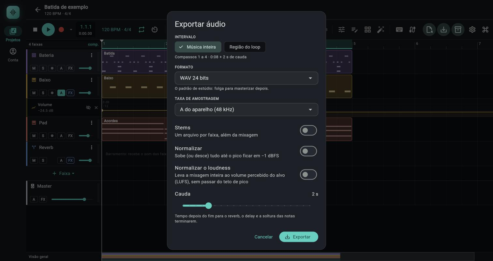
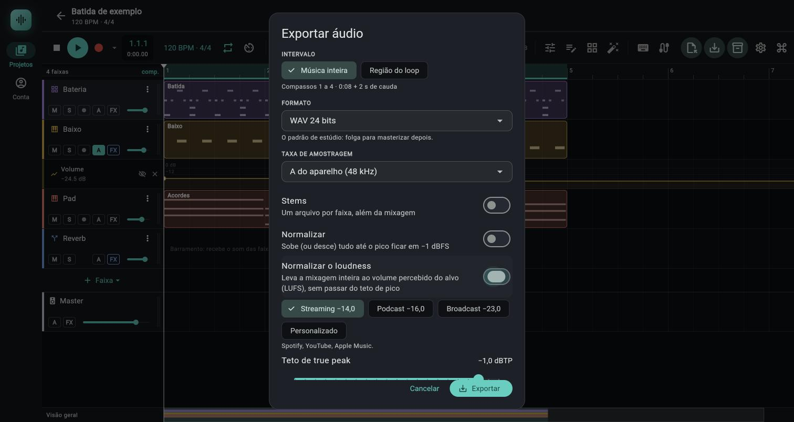

# Exportação e congelamento

> Como transformar o projeto em arquivos WAV, FLAC ou MP3 (a música inteira e, se quiser, uma faixa por arquivo; FLAC e MP3 são convertidos no servidor), como levar a mixagem a um volume-alvo em LUFS (streaming, podcast, rádio e TV) e como congelar uma faixa em áudio para aliviar o projeto ou fixar um som.

*Diálogo Exportar áudio: intervalo, formato, taxa, Stems, Normalizar, Normalizar o loudness e Cauda; no pé, os botões Projeto inteiro (.jopendaw)…, Notas em MIDI (.mid)…, Cancelar e Exportar.*

*Com Normalizar o loudness ligado aparecem os alvos (Streaming, Podcast, Broadcast, Personalizado) e o teto de true peak.*

## Onde fica

- **Exportar:** botão **Exportar** (ícone de disquete com seta) na barra do transporte, à direita dos painéis e das entradas de notas. Tooltip: `Exportar áudio (WAV, FLAC ou MP3)` (até a fase 16 era `Exportar a música (e as faixas separadas) em WAV`, que continuava dizendo WAV mesmo com FLAC e MP3 na janela). Em barra estreita ou no celular mostra só o ícone. Não tem atalho de teclado. A mesma janela leva ao arquivo do projeto (`.jopendaw`): botão `Projeto inteiro (.jopendaw)…` no rodapé, descrito na tabela abaixo, e às notas em MIDI padrão: botão `Notas em MIDI (.mid)…`, descrito na seção [Notas em MIDI (.mid)](#notas-em-midi-mid).
- **Congelar e renderizar:** menu de três pontos (**Opções da faixa**) no cabeçalho de cada faixa. Desde a fase 20 há três itens: **Congelar faixa…** (congela no lugar e dá para **Descongelar**), **Converter em áudio…** e **Renderizar em faixa nova** (o antigo **Congelar em áudio**, até a fase 19). O capítulo dos dois primeiros é [Congelar faixa e converter em áudio](02e-congelar-faixa.md); o terceiro está na seção abaixo.
- Os dois rodam **fora de tempo real**, em um motor separado e sem tocar: não é preciso reproduzir a música, e o render é mais rápido do que tocar (não há medida documentada de quanto, `(não confirmado)`).

## Controles

### Janela Exportar áudio

Abre ao tocar em **Exportar**. Enquanto o projeto está gravando ou ocupado (importando, congelando), o botão fica desligado (`Pare a gravação para exportar`).

| Controle (rótulo exato) | O que faz | Valores / padrão | Dica |
|---|---|---|---|
| **INTERVALO** > **Música inteira** | Exporta do compasso 1 (batida 0) até o fim do último clipe (de áudio ou de notas), mais a cauda. | Padrão. | Começa sempre em 0, mesmo que o primeiro clipe entre depois (o silêncio inicial vai junto). |
| **INTERVALO** > **Região do loop** | Exporta só a região marcada na régua. Funciona com o loop desligado, desde que a região exista (mais de 0,01 batida). Tooltip: os compassos da região, por exemplo `Compassos 5 a 8`; sem região, `Marque uma região arrastando na régua para exportar só ela` e a opção fica desligada. | | Se a região sumiu desde a última exportação, volta para **Música inteira**. |
| Linha de resumo (texto pequeno) | Mostra `Compassos 1 a 8 · 0:16` (ou `Compasso 3`), com ` + 2 s de cauda` quando a cauda é maior que zero. Sem nada para exportar mostra `O projeto ainda não tem clipes.` ou `A região do loop está vazia.` | | |
| **FORMATO** (lista) | Formato do arquivo: WAV de três profundidades, FLAC ou MP3. Veja a tabela abaixo. | Cinco itens: `WAV 16 bits`, `WAV 24 bits` (padrão), `WAV 32 bits float`, `FLAC (sem perda, menor)`, `MP3 (para compartilhar)`. | O texto embaixo da lista explica a escolha. FLAC e MP3 dependem de conta e de rede. |
| **Profundidade e compressão** (só com FLAC): dois chips `16 bits` e `24 bits` e uma lista | Profundidade do FLAC e quanto ele é comprimido. A lista não tem rótulo próprio: os itens são `Rápido`, `Padrão` e `Menor arquivo`. | `24 bits` e `Padrão` (padrão). `Rápido` = nível 2, `Padrão` = 5, `Menor arquivo` = 8 (de 0 a 8 no servidor). | Mais compressão dá arquivo menor e conversão mais lenta; o som é idêntico. |
| **Qualidade do MP3** (só com MP3): lista | Taxa de bits do MP3. | `192 kbps (CBR)` (padrão). Itens: `128 kbps (CBR)`, `192 kbps (CBR)`, `256 kbps (CBR)`, `320 kbps (CBR)`, `V0 (VBR, ~245 kbps, a melhor)`, `V1 (VBR, ~225 kbps)`, `V2 (VBR, ~190 kbps)`, `V3 (VBR, ~175 kbps)`, `V4 (VBR, ~165 kbps)`. | Para o master final, `320 kbps (CBR)` ou `V0`. Ver [FLAC e MP3 pelo servidor](#flac-e-mp3-pelo-servidor). |
| **Artista (opcional)** (campo de texto, só com FLAC ou MP3; dica `Vai nos metadados e no nome do arquivo`) | O nome do artista, gravado nos metadados de cada arquivo (`ARTIST` no FLAC, `TPE1` no MP3) e usado no começo do nome do arquivo: `Artista - <nome>.flac`. Vazio: sem artista, e o nome fica como era. | Até 200 caracteres. Vazio por padrão; fica guardado com as últimas opções da sessão. | Vale para a mixagem e para cada stem. O servidor limpa o texto (tira caracteres de controle e espaços repetidos). Ver [Nomes dos arquivos](#nomes-dos-arquivos). |
| **TAXA DE AMOSTRAGEM** (lista) | Taxa do arquivo. O render já é feito nessa taxa (não é reamostrado depois). | `A do aparelho (48 kHz)` (padrão; o número é a taxa real do aparelho), `44,1 kHz`, `48 kHz`, `88,2 kHz`, `96 kHz` (a que for igual à do aparelho não repete). Com **MP3**, a lista só oferece `44,1 kHz` e `48 kHz` (e `A do aparelho`, se o aparelho já estiver numa dessas). | Taxa maior deixa o arquivo e o render proporcionalmente maiores. Escolher MP3 com uma taxa que ele não aceita passa a taxa para `44,1 kHz` sozinho. |
| **Stems** (interruptor) | Além da mixagem, gera um arquivo por faixa. Legenda: `Um arquivo por faixa, além da mixagem` (ou `Um arquivo da faixa, além da mixagem` se só há uma faixa com clipes). | Desligado. | Ver a seção Stems. |
| **Normalizar** (interruptor) | Leva o pico de cada arquivo a −1 dBFS. Legenda: `Sobe (ou desce) tudo até o pico ficar em −1 dBFS`. | Desligado. | Vale para cada arquivo separadamente. Ligar este desliga o `Normalizar o loudness` (e o contrário): são pedidos contrários. |
| **Normalizar o loudness** (interruptor) | Leva a mixagem inteira ao volume percebido do alvo, em LUFS, sem passar do teto de true peak. Legenda: `Leva a mixagem inteira ao volume percebido do alvo (LUFS), sem passar do teto de pico`. Ao ligar, abrem as quatro linhas abaixo. | Desligado. | Ver a seção Normalizar o loudness. |
| Chips de alvo (com o loudness ligado): **Streaming −14,0**, **Podcast −16,0**, **Broadcast −23,0**, **Personalizado** | Escolhe o loudness integrado que a mixagem deve ter. O texto embaixo diz para quê: `Spotify, YouTube, Apple Music.`, `podcasts e vídeos.`, `EBU R128, rádio e TV.` | Padrão **Streaming** (−14 LUFS). | Um chip só fica marcado por vez. |
| **Alvo** (controle deslizante, só com **Personalizado**; valor à direita, ex.: `−14,0 LUFS`) | O alvo livre. Texto: `Alvo de −14,0 LUFS integrado.` | −40 a 0 LUFS, passo de 0,5, começa em −14,0. | Escolher um chip pré-definido depois não apaga o valor do **Alvo**: ele volta se você retornar a **Personalizado**. |
| **Teto de true peak** (controle deslizante, valor à direita, ex.: `−1,0 dBTP`) | O maior true peak que o arquivo pode ter depois do ganho. Se subir até o alvo passaria disso, o ganho para no teto e o volume fica abaixo do alvo. Texto: `Se subir até o alvo passaria do teto, o ganho para no teto e o volume fica abaixo do alvo: a janela do resultado avisa.` | −10 a 0 dBTP, passo de 0,5, padrão **−1,0 dBTP**. | −1 dBTP é o que serviços de streaming pedem para não estourar na recodificação. |
| **Stems com o mesmo ganho** (interruptor; só aparece com **Stems** ligado e o loudness ligado). Legenda: `Sem isto os stems saem como renderizados, sem normalização` | Aplica a cada stem o mesmo ganho, em dB, que a mixagem recebeu, mantendo o equilíbrio entre eles. | Desligado. | Ver Stems, abaixo. |
| **Cauda** (controle deslizante, com o valor à direita) | Segundos extras depois do fim, para o reverb, o delay e a soltura das notas terminarem. Texto: `Tempo depois do fim para o reverb, o delay e a soltura das notas terminarem.` | 0 a 10 s, passo de 0,5 s, padrão 2 s. | Vale também para os stems e para o intervalo `Região do loop`. |
| Aviso vermelho | `Não há o que exportar: grave, importe ou desenhe um clipe primeiro.` (música inteira) ou `Não há o que exportar: a região do loop não tem duração.` | | Aparece com o intervalo vazio. |
| **Projeto inteiro (.jopendaw)…** (botão de texto com ícone de caixa, no rodapé, à esquerda de **Cancelar**) | Troca o WAV pelo arquivo do projeto editável: fecha esta janela sem exportar áudio e abre a janela `Exportar projeto` (o documento como está na tela e os áudios, num zip). Ver [Projeto em arquivo](01-projetos-modelos-conta.md#projeto-em-arquivo-jopendaw). | | Não guarda as opções da tela como "últimas usadas": só o `Exportar` guarda. |
| **Notas em MIDI (.mid)…** (botão de texto com ícone de piano, no rodapé, ao lado de **Projeto inteiro (.jopendaw)…**) | Troca o WAV pelas notas em arquivo MIDI padrão: fecha esta janela sem exportar áudio e abre a janela `Exportar MIDI (.mid)`. Ver [Notas em MIDI (.mid)](#notas-em-midi-mid). | | Também não guarda as opções da tela como "últimas usadas". Não depende do intervalo, do formato, da taxa nem da cauda desta janela. |
| **Cancelar** | Fecha sem exportar. | | |
| Aviso `O servidor converte até 30 minutos por arquivo: escolha um trecho menor, diminua a cauda ou exporte em WAV.` | Aparece com FLAC ou MP3 quando o trecho mais a **Cauda** passam de 30 minutos (1800 s). | | Vale para cada arquivo; com stems, todos têm o mesmo tamanho. |
| Aviso `O WAV desta música passa de 512 MB (N MB), o limite do servidor para converter: exporte em WAV, ou reduza a taxa de amostragem, o trecho ou a cauda.` (fase 17) | Aparece com FLAC ou MP3 quando o WAV que subiria ao servidor passaria de 512 MB. O app calcula o tamanho antes de renderizar (`44 bytes + quadros × 2 canais × bytes por amostra`, com 16 bits para o MP3 e o chip escolhido para o FLAC). | Por exemplo, 30 minutos a 96 kHz e 24 bits dão cerca de 990 MB (conta feita à mão a partir da fórmula) `(não confirmado)`; a 48 kHz e 24 bits os 30 minutos dão cerca de 495 MB e cabem. | Vale para cada arquivo (a mixagem e cada stem têm o mesmo tamanho). Antes da fase 17 o app só descobria isso no envio, com `arquivo grande demais (máximo de 512 MB)`. |
| Aviso `Um efeito está em solo ou ouvindo a banda: a exportação sairá assim (Multibanda (nome da faixa), …). Desligue o solo ou o "Ouvir banda" antes, se não era a intenção.` (fase 17) | Aparece, em qualquer formato, quando algum efeito ligado de uma faixa ou do master está com `Solo` numa banda do `Multibanda` ou com `Ouvir banda` no `De-esser`. Lista cada efeito com o nome da faixa (ou `master`). | Só avisa: o botão `Exportar` continua ligado. | O mesmo estado aparece como selo no cartão do efeito ([06c](06c-painel-de-efeitos.md#cartão-de-efeito)). Efeito em bypass não entra. |
| **Exportar** (com ícone) | Começa o render. Desligado com o intervalo vazio e, com FLAC ou MP3, quando o trecho mais a cauda passam de 30 minutos ou o WAV a enviar passa de 512 MB. | | |

As últimas opções escolhidas (inclusive alvo, teto e stems com o mesmo ganho) ficam guardadas até você fechar ou recarregar o app: a próxima exportação da sessão já abre com elas.

#### Formatos

| Item da lista | Codificação | Texto de ajuda na janela | Tamanho aproximado (estéreo a 48 kHz) |
|---|---|---|---|
| **WAV 16 bits** | Inteiro de 16 bits, com dither TPDF (ruído triangular de ±1 LSB) | `Qualidade de CD, o menor arquivo. Para ouvir e publicar.` | 11,5 MB por minuto |
| **WAV 24 bits** | Inteiro de 24 bits, com dither TPDF | `O padrão de estúdio: folga para masterizar depois.` | 17,3 MB por minuto |
| **WAV 32 bits float** | Ponto flutuante de 32 bits (formato IEEE float, com o bloco `fact`), sem dither e sem teto | `Sem perda nenhuma, nem acima de 0 dB. Para levar a outro programa.` | 23,0 MB por minuto |
| **FLAC (sem perda, menor)** | Compactado sem perda pelo servidor, em 16 ou 24 bits (chips `16 bits` e `24 bits`), sem mudar o som do WAV que o originou | `Sem perda, com bem menos espaço que o WAV. Convertido no servidor: precisa de conta e de rede.` | cerca de 50% a 70% do WAV da mesma profundidade (estimativa geral, varia com a música; não medido aqui) `(não confirmado)` |
| **MP3 (para compartilhar)** | Com perda, pelo servidor, de 16 bits. Qualidade: `128`, `192`, `256` ou `320 kbps (CBR)` (taxa constante) ou `V0` a `V4` (taxa variável) | `Leve, para compartilhar e ouvir em qualquer lugar (com perda). Convertido no servidor: precisa de conta e de rede.` | 0,96 MB por minuto a 128 kbps, 1,44 a 192, 1,92 a 256, 2,40 a 320; VBR: de cerca de 1,2 MB (V4) a 1,8 MB (V0) por minuto (conta a partir da taxa média do rótulo) |

Os tamanhos do MP3 CBR são a taxa dividida por 8 (não dependem da taxa de amostragem nem da música); o teste ao vivo de 10 s a 192 kbps gerou 240 830 bytes (192 000 / 8 × 10,01 s = 240 240, mais a tag ID3). Nos VBR o rótulo diz "~": o servidor trata V0 a V4 como taxa média alvo, não como o VBR do LAME.

### FLAC e MP3 pelo servidor

FLAC e MP3 **não são gerados no aparelho**: o motor só escreve WAV. O app renderiza o WAV no aparelho como sempre e o servidor faz a conversão.

**O que precisa:**

| Requisito | Detalhe |
|---|---|
| Conta | Estar com a sessão aberta. Sem ela: `Entre na sua conta para exportar em MP3: a conversão é feita no servidor.` (ou `... em FLAC ...`). |
| Rede | Para subir o WAV, esperar a conversão e baixar o arquivo. Sem rede: `Não consegui falar com o servidor (sem conexão?).` |
| Espaço na cota | O WAV enviado e o arquivo convertido contam na cota de 4 GB da conta enquanto existem (ver [Nuvem e sincronização, Cotas e limites](01b-nuvem-e-sincronizacao.md#cotas-e-limites)). Cota cheia: `cota de armazenamento de 4 GB excedida; apague áudios sem uso na tela Conta`. |
| Duração | Até **30 minutos por arquivo** (o trecho mais a cauda). Acima disso o aviso aparece na janela e **Exportar** fica desligado. |
| Tamanho do WAV enviado | O servidor recusa arquivo acima de 512 MB no envio (`arquivo grande demais (máximo de 512 MB)`). Nas taxas altas isso limita antes dos 30 minutos: um WAV de 24 bits estéreo pesa cerca de 17,3 MB por minuto a 48 kHz (cabem os 30 minutos) e o dobro a 96 kHz (aí o limite fica perto de 15 minutos; conta feita a partir do tamanho do WAV) `(não confirmado)`. Desde a fase 17 a janela **avisa antes** (`O WAV desta música passa de 512 MB (N MB), o limite do servidor para converter: …`) e deixa **Exportar** desligado, em vez de renderizar e só descobrir no envio. Com o FLAC de 16 bits o WAV enviado é de 16 bits, mais leve. |
| Taxa do MP3 | Só 44,1 ou 48 kHz (a lista de taxas já se limita a elas). O FLAC aceita as quatro taxas da lista. |

**Passo a passo do que acontece** (para cada arquivo: a mixagem e, com **Stems**, um por faixa, um de cada vez):

1. O app renderiza o WAV no aparelho (com as mesmas opções de intervalo, taxa, cauda, normalização e stems). O WAV renderizado é de 16 bits para o MP3 e de 16 ou 24 bits, conforme o chip, para o FLAC (nos dois casos com o dither dos WAV 16 e 24 bits).
2. A janela mostra `Enviando ao servidor (N MB)…` (ou `N KB`, com vírgula decimal). O app sobe o WAV para a sua conta (se um WAV idêntico já estava lá, não sobe de novo e não o apaga no fim).
3. Cria a tarefa de conversão. A janela mostra `Na fila do servidor…` e, depois, `Compactando no servidor N%…`. A consulta ao servidor é a cada 0,8 s; três falhas de rede seguidas derrubam a espera, uma só não. O servidor faz **uma exportação por vez** (no servidor todo, somando as contas de todo mundo, não só a sua): se outra está sendo convertida, a sua fica em `Na fila do servidor…` até chegar a vez, sem ocupar a vaga de outras tarefas (como o áudio para MIDI). Até a fase 16 a segunda aparecia como `Compactando no servidor 0%…` parada.
4. Quando a tarefa termina, `Baixando o arquivo…` e `Salvando…`: o arquivo cai nos downloads do navegador ou abre a janela de salvar do Android, com o nome sugerido pelo servidor (o do WAV com a extensão trocada, `.flac` ou `.mp3`, e o artista na frente se você preencheu o campo; ver [Nomes dos arquivos](#nomes-dos-arquivos)). Se você fechar a janela `Salvar` do Android sem escolher onde, a exportação **para** ali (ver "Janela Salvar fechada" abaixo).
5. O app apaga da conta a tarefa, o arquivo convertido e o WAV temporário. Se alguma dessas limpezas falhar, ela é silenciosa: a que o servidor recusou por a tarefa ainda estar rodando (`409`, num servidor sem o cancelamento ou com a tarefa em outra instância) é tentada de novo depois de 3, 10 e 30 s, sem segurar a janela; o que sobrou fica como áudio sem uso na tela **Conta**, onde **Limpar áudios sem uso** o apaga (só depois de 1 hora de enviado).

A espera pelo servidor tem teto de 20 minutos por arquivo; passando disso, o motivo mostrado é `O servidor demorou demais para responder.` Um pedido só (subir o WAV, por exemplo) também tem teto, de 120 s: numa conexão lenta um WAV grande pode estourar e cair nessa mesma mensagem (ver [App Flutter, `ApiClient`](../dev/10-app-flutter.md#apiclient-applibapiclientdart)).

**Metadados no arquivo.** O app manda o nome do arquivo sem `.wav` como título, o nome do projeto como álbum e, se o campo **Artista (opcional)** foi preenchido (desde a fase 17), o artista. O servidor grava `TITLE`, `ALBUM` e `ARTIST` no FLAC (bloco de comentários Vorbis) e as etiquetas ID3v2.4 `TIT2`, `TALB` e `TPE1` no MP3 (sem artista, não há `ARTIST` nem `TPE1`); o teste ao vivo confirmou que o MP3 começa com a tag ID3v2.4.

**Sem conta, sem rede ou com erro do servidor:**

1. A janela ganha o título `Não deu para compactar` e o aviso `Não deu para exportar em MP3: <motivo>.` (ou `... em FLAC: ...`). Motivos vistos no código: os de conta e rede da tabela acima, `Sua sessão terminou; entre de novo para exportar em MP3.`, `O servidor demorou demais para responder.`, o `error` do servidor (por exemplo a cota cheia, `MP3 exige 44,1 ou 48 kHz e o áudio tem N Hz; exporte o WAV nessa taxa ou use FLAC`, `áudio longo demais: o máximo é 30 minutos`) e `O servidor não devolveu o arquivo convertido.`
2. Texto abaixo: `O arquivo já está renderizado em WAV: dá para salvar assim, sem renderizar de novo.` (com stems: `O áudio já está renderizado (N arquivos) em WAV: ...`; se parte dos arquivos já saiu compactada, `1 arquivo foi salvo compactado. O outro já está renderizado em WAV: ...` ou `N arquivos foram salvos compactados. Os outros N já estão renderizados em WAV: ...`; até a fase 18 a frase do singular saía `1 arquivo foi salvo compactados`, corrigido na fase 19).
3. Três botões: **Fechar** (descarta o WAV renderizado), **Voltar às opções** (reabre as opções e **refaz o render**) e **Exportar em WAV mesmo assim** (salva o WAV que já estava pronto, sem renderizar de novo). Ao terminar, o resultado diz `(WAV)`, sem a profundidade (ou, se parte já tinha saído compactada, `(N em FLAC, M em WAV)`).
4. Com **Stems**, depois da primeira falha os arquivos seguintes nem tentam o servidor: vão direto para essa lista de WAV.

**Cancelar** durante a conversão larga a espera, não salva nada e pede ao servidor que cancele a tarefa e apague o que subiu. Desde a fase 17 o servidor **interrompe** uma conversão que já estava rodando (o MP3 para em até um segundo de áudio; o FLAC só olha o cancelamento ao terminar, mas o resultado é jogado fora do mesmo jeito) e nenhum arquivo sobra na conta. Só num servidor sem essa versão, ou com a tarefa rodando em outra instância, o servidor responde que não dá para cancelar agora: o app tenta apagar de novo depois de 3, 10 e 30 s, e o que sobrar fica na conta como áudio sem uso (a limpeza da tela **Conta** o apaga depois de 1 hora). `(testado só por testes automáticos)`

**Janela Salvar fechada (Android).** Com FLAC ou MP3, se você fechar a janela `Salvar <nome>` (ou dispensar a folha de compartilhar) sem escolher onde, o arquivo **não conta como salvo**: a exportação para ali, sem abrir uma janela para cada stem que faltava, e a janela de progresso muda para o título **Exportação cancelada**, com o aviso `Exportação cancelada: você não escolheu onde salvar "<nome>".` (mais `Os N arquivos anteriores já tinham sido salvos.` se já tinha saído algum) e os botões **Fechar** e **Voltar às opções**. Se acontecer no **Exportar em WAV mesmo assim**, o aviso é `Exportação cancelada: N arquivo(s) ficou/ficaram sem salvar.`, o que sobrou continua na lista e os mesmos botões de sempre continuam ali. Antes da fase 17 o app dava o arquivo como salvo e apagava o resultado do servidor. Na web não há o que cancelar (é um download). **No WAV direto (sem servidor)** o app também confere, desde a fase 19: fechar a janela `Salvar` (só o Android sabe dizer; na web o download não cancela) faz a exportação parar nesse arquivo, sem abrir as janelas dos stems que faltavam, e a janela de progresso vira **Exportação cancelada** com o aviso `Exportação cancelada: você não escolheu onde salvar.` (sem o nome do arquivo e sem a linha dos arquivos anteriores, que só existem no caminho compactado) e os botões **Fechar** e **Voltar às opções**. Antes da fase 19 ela terminava em `Exportação concluída` mesmo sem nenhum arquivo salvo. `(testado só por testes automáticos)`

**Loudness, normalização e stems com FLAC e MP3.** A normalização (`Normalizar` de pico ou `Normalizar o loudness`) e a medição acontecem **no WAV renderizado, antes da conversão**, exatamente como no WAV. A frase do resultado (`A mixagem subiu ... e mediu −14,0 LUFS · −2,0 dBTP.`) descreve esse WAV, não o MP3 que sai da conversão. No FLAC o som decodificado é idêntico ao do WAV que foi enviado. No MP3, como em qualquer formato com perda, o arquivo decodificado não é idêntico: o pico e o loudness dele podem diferir um pouco do WAV, e o codificador do servidor não mede isso `(não confirmado com este codificador)`. Para um master de entrega que precise de um teto exato, deixe o **Teto de true peak** em −1,0 dBTP ou menos e exporte também o WAV. **Stems** funcionam com os dois formatos: um `.flac` ou `.mp3` por faixa, na mesma ordem e com as mesmas regras de pular a faixa muda (ver [Stems](#stems)), mas para levar stems a outro programa o WAV 32 bits float continua sendo o formato sem perda de nível.

**Avisos do servidor.** O resultado da conversão traz uma lista `warnings` (por exemplo, `o áudio de 24 bits foi gravado com 16 bits no FLAC (arredondado, sem dither)`); a janela mostra cada aviso em uma caixa destacada. Como o app sempre manda um WAV de 16 ou 24 bits já na profundidade do FLAC pedido, esses avisos não aparecem no uso normal `(testado só por testes automáticos)`.

**Nome do formato no resultado.** A mensagem de conclusão usa o nome curto do formato entre parênteses: `A mixagem foi salva (MP3) em 3 s. No navegador, o arquivo fica nos downloads.`, `(FLAC)`, `(WAV 16 bits)`, `(WAV 24 bits)` ou `(WAV 32 bits float)`. Até a fase 15 usava o rótulo inteiro da lista de formatos e, com FLAC e MP3, saía com parênteses duplos (`(MP3 (para compartilhar))`); o rótulo da lista de `FORMATO` não mudou. Desde a fase 17 o parêntese diz o que **de fato** saiu: quando parte dos arquivos foi compactada e o resto caiu para WAV, a mensagem fica `(2 em FLAC, 1 em WAV)`; só depois do `Exportar em WAV mesmo assim` sem nenhum compactado, `(WAV)`.

Nos formatos de 16 e 24 bits, o que passar de 0 dBFS é cortado (limitado a ±1). O tamanho dobra a 96 kHz. O WAV tem limite de 4 GB por arquivo: passando disso a exportação falha com `O arquivo passaria de 4 GB, o limite do WAV: exporte um trecho menor ou em 16 bits.`

### Janela de progresso (Exportando…)

Abre sozinha depois de **Exportar** e não fecha por fora (clicar fora ou o botão voltar do celular não a fecha enquanto trabalha).

| Elemento | O que mostra |
|---|---|
| Título **Exportando…** | Renderizando. |
| Barra de progresso e texto | `Preparando…` até o primeiro aviso; depois `Renderizando N%`; no fim `Salvando o arquivo…`. O render ocupa até 95% da barra; o resto é converter para WAV e entregar o arquivo. Com **Normalizar o loudness**, dos 95% aos 99% o texto é `Medindo o loudness…` (a mixagem é medida, ganha o ganho e é medida de novo). |
| Textos extras com FLAC ou MP3 | Enquanto o arquivo está no servidor, o texto do progresso troca por `Enviando ao servidor (N MB)…`, `Na fila do servidor…`, `Compactando no servidor N%…`, `Baixando o arquivo…` e `Salvando…`, e a barra soma as duas fases: de 0 a 50% o render e de 50 a 100% a conversão (a de todos os arquivos, com stems). Desde a fase 17 a barra **nunca recua** (o maior valor mostrado fica) e não chega a 100% antes do fim; com stems, quando o render do lote seguinte recomeça, ela fica parada até passar do que já mostrou `(testado só por testes automáticos)`. O texto `Renderizando N%` continua falando só do render. Ver [FLAC e MP3 pelo servidor](#flac-e-mp3-pelo-servidor). |
| Texto fixo | `O render roda mais rápido que tocar, no próprio aparelho. Deixe esta aba aberta até terminar.` |
| **Cancelar** | Interrompe o render (e, com FLAC ou MP3, a espera pelo servidor, que cancela a tarefa) e fecha. Vira `Cancelando…`; no WAV fica desligado depois de 100% do render (com FLAC ou MP3 continua ligado durante a conversão). Não salva o lote que estava rodando (lotes anteriores já entregues ficam). |
| Título **Exportação cancelada** (fase 17; também no WAV direto desde a fase 19) | No Android: a janela `Salvar` foi fechada sem escolher onde. Aviso `Exportação cancelada: você não escolheu onde salvar "<nome>".` (com FLAC ou MP3; no WAV direto sem o nome: `Exportação cancelada: você não escolheu onde salvar.`) e botões **Fechar** e **Voltar às opções**. Detalhes em [FLAC e MP3 pelo servidor](#flac-e-mp3-pelo-servidor). |
| Título **Não deu para compactar** | Só com FLAC ou MP3 quando a conversão falhou: aviso com o motivo e os botões **Fechar**, **Voltar às opções** e **Exportar em WAV mesmo assim**. Detalhes em [FLAC e MP3 pelo servidor](#flac-e-mp3-pelo-servidor). |
| Título **Exportação concluída** | `A mixagem foi salva (WAV 24 bits) em N s. No navegador, o arquivo fica nos downloads.` Com stems: `A mixagem e os stems foram salvos (...) em N s. ...`. Botão **Fechar**. Com FLAC e MP3 sai só o nome curto (`(FLAC)`, `(MP3)`); depois de **Exportar em WAV mesmo assim** sai só `(WAV)`. |
| Frase do loudness (só com **Normalizar o loudness**) | Logo abaixo da mensagem, diz o que a normalização fez e o que o arquivo mediu de verdade, por exemplo `A mixagem subiu 4,0 dB até o alvo e mediu −14,0 LUFS · −2,0 dBTP.` Se o ganho ficou abaixo de 0,05 dB (o arquivo já estava no alvo), a frase é `A mixagem já estava no alvo e mediu −14,0 LUFS · −1,6 dBTP.`, sem repetir a menção ao alvo. Quando o teto segurou o ganho, ou não deu para medir, a frase vem em aviso (caixa destacada). Detalhes na seção Normalizar o loudness. |
| Aviso no resultado | Se algum áudio do projeto não está neste aparelho: `Exportado sem um áudio que não está neste aparelho.` (ou `N áudios que não estão`). O arquivo sai sem esses clipes. Com FLAC ou MP3, também aparecem aqui os avisos de perda que o servidor devolver. |
| Título **A exportação falhou** | A mensagem do erro. Botões **Fechar** e **Voltar às opções** (reabre a janela de opções com as mesmas escolhas). |

Erros de exportação que você pode ver: `O projeto está vazio: não há nada para exportar.`, `A região do loop está vazia: marque o loop antes de exportar.`, `Pare a gravação antes de exportar.`, `Espere o render em andamento terminar antes de exportar.`, `A exportação não terminou: ...` (com o motivo, por exemplo falta de memória) e o do limite de 4 GB.

## O que entra no arquivo

O render aplica ao motor as mesmas chamadas do projeto e processa tudo até o fim, sem esperar o relógio:

- **Entra:** todas as faixas de áudio (com posição, corte, fades e as curvas deles, crossfades, ganho, warp, altura e inversão; ver [Fades e crossfade](03-audio-e-clipes.md#fades-e-crossfade)) e de instrumento (sintetizador, bateria, sampler, FM, wavetable), o volume, o pan, o mudo e o solo de cada faixa, os efeitos de cada faixa, os envios e os barramentos, o volume, o pan e os efeitos do master, **toda a automação** (de faixas, de efeitos e do master) e o limitador de segurança do master.
- **Não entra:** o metrônomo, o loop (o arquivo é linear, do começo ao fim), a entrada do microfone e o monitoramento, notas tocadas ao vivo.
- **Mudo, fase e loop do clipe (fase 20, `3a27233`):** o render roda as mesmas chamadas do que soa ao vivo, então o arquivo sai como se ouve. Um **clipe mudo** (`Silenciar o clipe`, selo `M`) **não entra** na mixagem, nem no stem da faixa dele, nem no [congelamento](#congelar-uma-faixa); é diferente do mudo da **faixa** (`M` no cabeçalho e no mixer), que já existia. Um clipe com a **fase invertida** (`Ø`) entra com o sinal trocado, que só muda o que se ouve onde ele soma com outro sinal (o ganho do clipe vai ao motor com sinal negativo). Um clipe em **loop** (`L`) entra com todas as repetições, cada uma como um clipe do render, com o fade de entrada só na primeira e o de saída só na última; a regra de **Fim do trecho** (abaixo) vale para cada repetição: a repetição que atravessa o fim é cortada ali, com o fade curto de saída, e as que começam depois dele saem. `(testado só por testes automáticos: os testes conferem a lista de chamadas ao motor e o espelho do ganho negativo; nenhum arquivo exportado foi ouvido)`. Uma faixa de áudio em que **todos** os clipes estão mudos ainda é congelável (ela não conta como vazia), mas o render sai em silêncio e o congelamento responde `A faixa "nome" não soou nada: nada para congelar.` `(lido do código)`
- **Warp pendente:** se algum clipe ainda está processando o warp, a barra mostra `Processando o warp…` e a exportação espera terminar.
- **Fim do trecho:** clipes que atravessam o fim terminam ali (com um fade de 10 ms, ou o que restar do fade de saída que já tinham, se passar de 10 ms; a curva desse fade é a de saída do próprio clipe `(lido do código; testado só por testes automáticos)`); notas que atravessam terminam com a soltura do instrumento; a cauda deixa soar o que já estava tocando (reverb, delay, releases) e a automação continua valendo nela. Nada novo começa depois do fim.
- **Limitador do master:** a mixagem passa pelo limitador de segurança do motor (teto de −0,3 dBFS, antecipação de 1,5 ms, liberação de 80 ms). Por isso, sem normalização, a mixagem não passa de −0,3 dBFS em nenhum formato, nem em 32 bits float.
- **Ganho final (opcional):** com **Normalizar** ou **Normalizar o loudness**, um ganho fixo é aplicado ao arquivo **depois** do render, portanto depois do limitador do master. O primeiro leva o pico de amostra a −1 dBFS; o segundo leva o loudness integrado ao alvo (seção abaixo). Nenhum dos dois é compressor nem limitador: só multiplicam todas as amostras pelo mesmo número.
- **Estéreo:** todos os arquivos saem estéreo (2 canais).

### Stems

Com **Stems** ligado, saem a mixagem e um arquivo por faixa, na ordem das faixas. Cada stem é a saída da faixa **depois do fader, do pan, do mudo e da porta do solo** (a mesma posição dos medidores), com os efeitos da faixa, mas **sem a cadeia do master e sem o limitador**. Consequências:

- A soma dos stems não é igual à mixagem: faltam os efeitos e o limitador do master. Um barramento gera o próprio stem (com o que recebeu).
- **Pastas:** uma pasta é um barramento e gera o próprio stem (`<projeto> - <nome da pasta>.wav`, na posição dela na lista, antes das faixas dela): é a soma das faixas da pasta depois do fader e dos efeitos **da pasta**. Cada faixa da pasta continua gerando o seu stem, **sem** o fader, o mudo e os efeitos da pasta (o stem é o da saída da faixa, antes de entrar nela). Recolher a pasta não muda nada nos stems. Por isso o stem da pasta e os das faixas dela **contêm o mesmo som**: para remontar a mixagem em outro programa, use o stem da pasta **ou** os das faixas, não os dois. Com `M` na pasta o stem dela é silêncio e por isso é pulado, mas os stems das faixas saem. `(lido do código; testado só por testes automáticos)`
- Faixa que não soa nada no trecho (vazia, muda, calada pelo solo de outra) é **pulada**: não gera arquivo de silêncio.
- Stems podem passar de 0 dB. Em 16 e 24 bits, o excesso é cortado; em 32 bits float, vai inteiro.
- Com **Normalizar**, cada stem é levado a −1 dBFS separadamente, então o equilíbrio entre eles muda. Para levar os stems a outro programa mantendo o balanço, deixe **Normalizar** desligado e use **WAV 32 bits float**.
- Com **Normalizar o loudness**, os stems só são mexidos se **Stems com o mesmo ganho** estiver ligado; então cada um recebe o mesmo ganho em dB que a mixagem recebeu, e o equilíbrio entre eles se mantém. Sem essa opção os stems saem como renderizados (também não recebem o `Normalizar` de pico). O teto de true peak vale para a mixagem, não para os stems: um stem que já era alto pode passar de 0 dBFS com o ganho e, em 16 e 24 bits, é cortado.

## Normalizar o loudness

Serve para entregar a música no volume que a plataforma espera, sem ouvir e ajustar de tentativa em tentativa. O medidor ao vivo do master (`M`, `S`, `I`, `TP`) está em [06b](06b-analisador-e-medidores.md); aqui o mesmo cálculo (BS.1770-4 / EBU R128) roda sobre o arquivo já renderizado.

**Como funciona.**

1. O render da mixagem termina (com toda a cadeia do master e o limitador de segurança).
2. O app mede o loudness integrado (`I`, com os gates de −70 LUFS e de 10 LU) e o true peak dessa mixagem.
3. O ganho é `alvo − I medido`, limitado a ±40 dB. Se `true peak medido + ganho` passaria do **Teto de true peak**, o ganho vira `teto − true peak medido`: o arquivo fica **abaixo do alvo**, mas dentro do teto.
4. Todas as amostras são multiplicadas por esse ganho (o mesmo do começo ao fim do arquivo: a dinâmica da música não muda).
5. O arquivo resultante é medido de novo, e o que ele mediu de verdade vai para a janela do resultado.

Exemplos com o teto padrão (−1,0 dBTP) e o alvo **Streaming** (−14 LUFS):

| A mixagem mediu (`I` · true peak) | Ganho pedido | Ganho aplicado | Arquivo final | Frase no resultado |
|---|---|---|---|---|
| −18,0 LUFS · −6,0 dBTP | +4,0 dB | +4,0 dB | −14,0 LUFS · −2,0 dBTP | `A mixagem subiu 4,0 dB até o alvo e mediu −14,0 LUFS · −2,0 dBTP.` |
| −18,0 LUFS · −3,0 dBTP | +4,0 dB | +2,0 dB (o teto segurou) | −16,0 LUFS · −1,0 dBTP | `A mixagem subiu 2,0 dB e ficou em −16,0 LUFS · −1,0 dBTP, abaixo dos −14,0 LUFS pedidos: o teto de −1,0 dBTP não deixou subir mais sem estourar.` (em aviso) |
| −9,0 LUFS · −0,4 dBTP | −5,0 dB | −5,0 dB | −14,0 LUFS · −5,4 dBTP | `A mixagem desceu 5,0 dB até o alvo e mediu −14,0 LUFS · −5,4 dBTP.` |
| −13,5 LUFS · −0,3 dBTP | −0,5 dB | −0,7 dB (o teto segurou) | −14,2 LUFS · −1,0 dBTP | aviso, como na segunda linha |
| −14,0 LUFS · −3,0 dBTP | 0,0 dB | 0,0 dB (menos de 0,05 dB) | −14,0 LUFS · −3,0 dBTP | `A mixagem já estava no alvo e mediu −14,0 LUFS · −3,0 dBTP.` |

Regra de bolso: chegar ao alvo com o teto de −1 dBTP exige que a diferença entre o true peak e o `I` da mixagem (a dinâmica de pico) seja de no máximo `−1 − alvo` dB, isto é, **13 dB para −14 LUFS**, **15 dB para −16 LUFS** e **22 dB para −23 LUFS**. Uma mixagem mais "espetada" que isso não chega ao alvo só com ganho; para subir o `I` sem passar do teto, ponha um `Limitador` no master antes (ver [guia loudness e master](../guias/loudness-e-master.md)).

**Quando não mede.** Se a mixagem tem menos de 400 ms, é silêncio, ou fica toda abaixo de −70 LUFS, não há `I` para comparar: nada é normalizado e o resultado avisa `Não deu para medir o loudness (o trecho é curto demais, mudo ou muito baixo): a mixagem foi exportada sem normalizar.` Os stems também saem sem ganho nesse caso. A região do loop curta demais cai aqui.

**O que cada opção decide.**

| Opção | Efeito | Limites |
|---|---|---|
| Alvo `Streaming` | −14 LUFS | Fixo |
| Alvo `Podcast` | −16 LUFS | Fixo |
| Alvo `Broadcast` | −23 LUFS (EBU R128) | Fixo |
| Alvo `Personalizado` | O valor do controle **Alvo** | −40 a 0 LUFS, passo 0,5 |
| **Teto de true peak** | O true peak máximo permitido depois do ganho | −10 a 0 dBTP, passo 0,5, padrão −1,0 |
| **Stems com o mesmo ganho** | Cada stem recebe o ganho da mixagem, em dB | Só com **Stems** ligado; só se a mixagem foi medida e o ganho não é 0 |

**Cancelar** durante `Medindo o loudness…` interrompe sem salvar a mixagem (os arquivos de lotes anteriores já entregues ficam).

## Nomes dos arquivos

| Arquivo | Nome |
|---|---|
| Mixagem | `<nome do projeto>.wav` |
| Stem | `<nome do projeto> - <nome da faixa>.wav` |
| Stem com nome repetido | `<nome do projeto> - <nome da faixa> (2).wav`, `(3)`, … (a comparação ignora maiúsculas) |
| Com FLAC ou MP3 | O nome sugerido pelo servidor (desde a fase 17): o do WAV com a extensão `.flac` ou `.mp3` no lugar de `.wav` e, se o campo **Artista (opcional)** foi preenchido, `<artista> - <nome>.flac` (por exemplo `Fulana - Meu projeto - Baixo.flac`). O servidor limpa o nome à sua maneira: `/ \ : * ? " < > \|` viram `-` (e não `_`), cada nome é cortado em 100 caracteres. Se o servidor não devolver um nome que termine na extensão, o app usa o do WAV com a extensão trocada. Tipo de arquivo: `audio/flac` e `audio/mpeg`. |

Os nomes são limpos para os sistemas de arquivos: `\ / : * ? " < > |` e caracteres de controle viram `_`, espaços seguidos viram um, pontos e espaços no fim saem, e cada parte é cortada em 80 caracteres. Projeto sem nome vira `jopendaw`; faixa sem nome vira `Faixa N` (N é a posição da faixa, contando de 1).

- **No navegador**, cada arquivo é um download (`<a download>`); fica na pasta de downloads. Com stems são vários downloads seguidos; o navegador pode pedir permissão para baixar vários arquivos (`(não confirmado)`).
- **No Android**, cada arquivo abre o seletor **Salvar como** do sistema, com o título `Salvar <nome>` (o mesmo seletor para cada stem: com 8 faixas soando são até 9 janelas). Se o aparelho não tem o app de arquivos, abre a folha de compartilhar. Cancelar uma janela não é erro: a exportação termina em `Exportação cancelada` (WAV direto, FLAC ou MP3) e não abre as janelas dos arquivos que faltavam.

## Memória, lotes e limites

- **Web:** o render roda num Web Worker (`engine/render-worker.js`) com o mesmo motor em WebAssembly do áudio; a tela não trava. **Android:** roda num isolado (thread) com o motor nativo, a mesma biblioteca do áudio. Sem Web Worker o navegador responde `Este navegador não consegue renderizar em segundo plano (sem Web Worker).`
- O render guarda as saídas em memória (2 canais de 32 bits por arquivo). O app divide as saídas em **lotes** de até 384 MB e faz um render completo por lote: um projeto longo com muitos stems demora mais porque repete o render a cada lote. Um exemplo: 4 minutos a 48 kHz ocupam cerca de 92 MB por arquivo, então cabem 4 arquivos por lote e 12 stems mais a mixagem (13 saídas) viram 4 renders.
- **Teto por render:** 4 GiB de saída no navegador (cerca de 186 minutos de estéreo a 48 kHz) e 1,5 GiB no Android (cerca de 68 minutos). Acima disso: `Não há memória para renderizar N min em N saídas. Exporte um trecho menor ou menos faixas separadas.`
- O motor captura no máximo 64 faixas por render, e o app divide os lotes só pela memória; num projeto curto com mais de 64 faixas e Stems ligado, o lote pode passar disso e falhar com `O motor não conseguiu separar a faixa N no render.` `(não confirmado)`
- Um render de cada vez: exportar e congelar não rodam juntos (`Espere o render em andamento terminar antes de exportar.`).

## Congelar uma faixa

Desde a fase 20 o menu da faixa tem **Congelar faixa…**, que congela **no lugar** (a faixa passa a tocar o áudio renderizado e **Descongelar** devolve o conteúdo), e **Converter em áudio…**, que troca o conteúdo por um clipe de áudio. Os dois usam o mesmo render da exportação, da faixa sozinha, sem o master, e estão no capítulo [Congelar faixa e converter em áudio](02e-congelar-faixa.md) (diálogo `Congelar "nome"`, cauda de 0 a 30 s, recusas, nuvem e `.jopendaw`).

Como a exportação trata uma faixa congelada: o render é o do projeto como ele toca, então a faixa congelada sai com o áudio congelado (mais o fader, o pan e os envios, que continuam vivos), e nos stems ela é um stem como as outras. O fim do arquivo continua sendo o fim do último clipe **do conteúdo** mais a **Cauda** desta janela; o áudio congelado não o estende, então a cauda de um congelamento (8 s por padrão) só sai inteira se a **Cauda** da exportação também a cobrir (o máximo dela é 10 s) `(lido do código)`. O `.mid` continua levando as notas de uma faixa de instrumento congelada, porque elas seguem no projeto.

## Renderizar em faixa nova (antigo `Congelar em áudio`)

**Renderizar em faixa nova** (até a fase 19, **Congelar em áudio**) renderiza uma faixa (instrumento, clipes, efeitos e a automação deles) para um clipe de áudio numa faixa nova, e deixa a original muda. Serve para fixar um som, poupar processamento ou levar o resultado para outro trabalho, sem mexer na faixa original. A diferença para o **Congelar faixa…** é que aqui nasce uma segunda faixa; lá a própria faixa passa a tocar o áudio. Em faixa congelada o item fica desligado (legenda `Descongele antes`) e não pergunta a cauda (usa 8 s fixos).

### Quando está disponível

O item fica desligado, com o motivo na legenda dele, em quatro casos: `Barramento não tem som próprio`, `A faixa está vazia` (faixa de áudio sem clipes, ou de instrumento sem nenhuma nota), `Pare a gravação antes` e `Descongele antes` (faixa congelada). Se outro render está rodando, aparece `Espere o render em andamento terminar antes de congelar.` Ele **não** confere o sidechain (quem confere é o `Congelar faixa…`).

### Janela de progresso

| Elemento | O que mostra |
|---|---|
| Título `Congelando "nome"` | Em andamento. |
| Texto | `A faixa vira áudio com o instrumento e os efeitos, numa faixa nova logo abaixo; esta fica muda.` |
| Barra e percentual | `Preparando…`, depois `N%`. |
| **Cancelar** | Interrompe e fecha (vira `Cancelando…`). Nada é alterado. |
| Título `Não deu para congelar` | Erro. Botão **Fechar**. Mensagens: `A faixa "nome" não soou nada: nada para congelar.`, `A faixa "nome" foi apagada enquanto congelava.`, `A faixa "nome" mudou durante o render: o áudio já nasceria velho. Tente de novo.` (desde a fase 20, você mexeu no som da faixa com o render rodando), `O congelamento não terminou: ...`. |

### O que acontece

1. O render vai do começo do primeiro clipe da faixa ao fim do último, mais uma cauda de até 8 s. A cauda é aparada onde o som cai abaixo de −100 dB (nunca menos que o trecho dos clipes).
2. O render pega a faixa **depois dos efeitos**, com o fader em 0 dB e o pan no centro, sem mudo e sem solo de nenhuma faixa, e sem a automação de volume e de pan (para não aplicá-las duas vezes).
3. O resultado é gravado em WAV 32 bits float na taxa do aparelho, e vira mono se os dois canais são idênticos.
4. Uma **faixa de áudio nova** entra logo abaixo, chamada `<nome> (áudio)`, com a mesma cor, e fica selecionada junto com o clipe. O clipe começa onde começava o primeiro clipe da original e o arquivo aparece como `<nome> (congelada).wav` na lista de áudios do projeto.
5. A faixa nova recebe o **volume, o pan, o mudo, o solo, a saída, os envios e a automação de volume, pan e envios** da original: ela soa na mixagem como a original soava, e o fader continua mexível. Se a original está numa [pasta](02c-pastas-de-faixa.md), a faixa nova herda a saída e o grupo (`groupId`) dela e entra **dentro da mesma pasta**, logo abaixo da original, com o bloco da pasta contíguo (correção da fase 16 A; antes este capítulo dizia que a faixa nova caía fora da pasta, o que o código não faz, ver [02c](02c-pastas-de-faixa.md#regras-e-limites)).
6. A **original fica muda**, com o instrumento, os efeitos e os clipes intactos (é só reativar o M para voltar). Os envios pré-fader dela saem (senão continuariam soando e dobrariam); os pós-fader ficam, e calam junto com o mudo. Um sidechain que a original alimentava continua funcionando.
7. Tudo é **um passo só do desfazer**: Ctrl+Z tira a faixa nova e devolve o som da original.

A faixa `(áudio)` nova não tem instrumento nem efeitos (eles já estão no áudio). Para mudar o som, desfaça o passo, ajuste a original e renderize de novo. Se você prefere poder voltar à original sem criar uma segunda faixa, use o **Congelar faixa…** ([02e](02e-congelar-faixa.md)).

## Notas em MIDI (.mid)

O WAV leva o som; o `.mid` leva só as **notas** (e três controles, mais o programa e o alcance do bend de cada faixa), para abrir a melodia em outro programa ou guardá-la como texto musical. Vem do botão `Notas em MIDI (.mid)…` da janela **Exportar áudio**. Para o caminho de volta (importar um `.mid`), veja [Áudio e clipes](03-audio-e-clipes.md#importar-um-arquivo-midi-mid).

*Diálogo Exportar MIDI (.mid): Clipe selecionado ou Todas as faixas de notas. O texto informa que o arquivo leva os andamentos e compassos do projeto (aqui, com o mapa de 120 para 88 BPM), as notas, o pitch bend, a modulação e o pedal, o programa de cada faixa e o alcance do bend.*

### Janela Exportar MIDI (.mid)

| Controle (rótulo exato) | O que faz | Valores / padrão | Dica |
|---|---|---|---|
| **Clipe selecionado** (opção) | Escreve só o clipe de notas selecionado na linha do tempo. O clipe **sai do começo do arquivo** (o início dele vira o instante zero), qualquer que seja a posição dele no projeto. Legenda: `<nome do clipe>, começa no início do arquivo.` (ou só `Começa no início do arquivo.` se o clipe não tem nome) | Padrão quando há um clipe de notas selecionado. Sem clipe de notas selecionado a opção fica desligada com a legenda `Selecione um clipe de notas na linha do tempo.` | Um clipe de áudio selecionado não conta: a opção continua desligada |
| **Todas as faixas de notas** (opção) | Escreve todas as faixas de instrumento que têm notas ou controles, cada uma na **posição em que está no projeto** (o compasso 1 do projeto é o começo do arquivo). Legenda: `N faixa(s), uma por canal (bateria no canal 10), nas posições do projeto.` | Padrão quando não há clipe de notas selecionado. Sem nenhuma faixa com notas: desligada, legenda `Não há faixas com notas.` Com faixas mudas (ou fora do solo) a legenda acrescenta ` N muda(s) (ou fora do solo) não entra(m).`; se **todas** as faixas com notas estão mudas, a opção fica desligada com `As faixas com notas estão mudas (ou há outra em solo).` | Faixas de áudio e barramentos não entram; faixas mudas também não (ver "O que não entra") |
| Texto pequeno | `Leva os andamentos e compassos do projeto, as notas, o pitch bend, a modulação e o pedal, o programa de cada faixa e o alcance do bend.` | Texto fixo (não muda com o projeto) | O arquivo leva o mapa de andamento e o de compassos, ver "O que fica no arquivo". Antes da fase 11 o texto trazia `Leva o andamento (X BPM) e o compasso (N/4)…` e só o inicial ia |
| **Exportar** (com ícone de salvar) | Monta o arquivo e o entrega. Na web, baixa o arquivo (download do navegador, na pasta de downloads); no Android, abre a janela `Salvar <nome>` (se ela não estiver disponível, o app oferece o arquivo pelo compartilhar do sistema). Depois de salvar, o botão vira **Exportar de novo** e a janela continua aberta | Desligado enquanto trabalha, ou se não há faixa com notas nem clipe selecionado | |
| **Cancelar** / **Fechar** | Fecha a janela (o texto vira **Fechar** depois de exportar) | | |
| Resultado (texto abaixo dos botões) | `<nome>.mid salvo: N faixa(s), M nota(s).` e, se houve descarte, `K nota(s) fora do clipe ou de 0–127 ficaram de fora.`, `K ponto(s) de controle (bend, modulação ou pedal) fora do clipe ficaram de fora.` e `Faixas mudas não entraram: A, B.` | Cada frase só aparece quando há o que dizer | Notas e pontos de controle têm contagens separadas |
| Erro (texto vermelho) | `Não há notas para exportar: desenhe ou grave um clipe de notas primeiro.`, `As faixas com notas estão mudas (ou há outra em solo): tire o mudo, ou exporte só o clipe selecionado.` ou `Não deu para salvar o arquivo MIDI.` | | |

**Nome do arquivo.** Em `Todas as faixas de notas`, o nome do projeto; em `Clipe selecionado`, o nome do clipe (o do projeto se o clipe não tem nome), mais `.mid`. Caracteres que os sistemas de arquivo recusam (`/ \ : * ? " < > |` e os de controle) viram `_`; pontos no começo saem; o nome tem no máximo 80 caracteres; nome vazio vira `notas.mid`.

### O que fica no arquivo

| Item | Como sai | Valores |
|---|---|---|
| Tipo e resolução | SMF (arquivo MIDI padrão) **tipo 1**, **480 pulsos por semínima** | Uma batida do app = 480 ticks; posições e durações são arredondadas ao tick mais próximo (uma nota tem no mínimo 1 tick de duração) |
| Trilha 1 (andamento e compasso) | Nome do projeto e **todo** o mapa de andamento (`Set Tempo`, um por ponto) e o de compassos (`Time Signature`, um por mudança de fórmula) | Sem mapa: um `Set Tempo` (o andamento do projeto) e um `Time Signature` (a fórmula do projeto, ex.: `N/4`, `6/8`), como antes. Com mapa: um evento por ponto ou mudança, no tick da batida dele (480 por batida). Ver "Andamento e compasso no arquivo" |
| Uma trilha por faixa | Nome da faixa, e as notas e os controles de **todos os clipes dela**, cada clipe na sua posição | Em `Clipe selecionado`, uma trilha só, com o nome do clipe (ou da faixa, se o clipe não tem nome) |
| Canal | `Bateria` sempre no canal 10; as outras faixas em ordem nos canais 1 a 9 e 11 a 16 (o 10 é pulado) | A 16ª faixa melódica em diante volta ao canal 1 e divide o canal com a primeira. Em `Clipe selecionado`: canal 10 se a faixa é `Bateria`, canal 1 nas outras |
| Faixas que entram | `Sintetizador`, `Bateria`, `Sampler`, `FM` e `Wavetable` com pelo menos um clipe com notas ou controles | Na ordem da mesa; faixa vazia fica de fora. Em `Todas as faixas de notas` valem mudo e solo como no render de áudio: com alguma faixa em **solo** só as em solo entram, senão entram todas menos as **mudas**; em `Clipe selecionado` a faixa sai mesmo se estiver muda |
| Notas | Altura como está no app (0–127), início, duração e velocidade | Velocidade do app (0–1) × 127, arredondada, entre 1 e 127. Um clipe de bateria já leva as alturas das peças do app (36, 37, 38, 39, 41, 42, 45, 46, 48, 49, 51, 56) |
| Programa (Program Change) | Um por trilha de faixa, no tick 0: o programa GM da categoria do preset de fábrica mais parecido com o timbre da faixa (ver "O que não entra" para a tabela) | Bateria: programa 0 no canal 10 |
| Alcance do bend (RPN 0) | No tick 0 de cada trilha melódica, antes do programa: `CC 101` 0, `CC 100` 0, `CC 6` com os semitons, `CC 38` com os centésimos, e o RPN nulo (`CC 101` e `CC 100` em 127) para os controles seguintes não mexerem nele | O `Alcance do bend` do instrumento (0 a 24 st, inteiro no app: os centésimos saem 0). A bateria não leva RPN |
| Pitch bend | Mensagem de pitch bend de 14 bits | −1 a 1 do app vira 0 a 16383 (centro 8192) |
| Modulação | Controle 1 | 0–1 vira 0–127 |
| Sustain (pedal) | Controle 64 | Vale 127 a partir de 0,5; senão 0 |

**Notas que ficam de fora** (e a janela conta): altura fora de 0–127, início negativo, início no fim do clipe ou depois dele, ou valores inválidos. Uma nota que começa dentro do clipe mas passa do fim dele sai com a duração inteira (o arquivo não corta no fim do clipe). Pontos de controle fora do trecho do clipe (antes do começo ou depois do fim) também não saem, e a janela os conta à parte (`K ponto(s) de controle ... fora do clipe ficaram de fora.`).

### O que não entra

- **Áudio.** Clipes de áudio, gravações, tomadas e faixas `(áudio)` de `Renderizar em faixa nova` (que são áudio) não vão para o `.mid`. Uma faixa de instrumento **congelada no lugar** continua levando as notas dela, porque o conteúdo segue no projeto `(lido do código)`; uma faixa **convertida em áudio** já não tem notas. Para levar o som, use o WAV desta mesma janela ou os stems.
- **Som do instrumento.** Cada trilha abre com o alcance do pitch bend (RPN 0, igual ao `Alcance do bend` do instrumento) e um `Program Change` GM escolhido pela categoria do preset de fábrica mais parecido com o timbre da faixa (`Baixos` → baixo sintético, `Leads` → lead, `Pads` → pad, `Teclas` → piano elétrico, `Vocais` → voz sintética…; a bateria vai no canal 10 com o programa 0; sem preset reconhecido, lead, e piano no sampler). Os parâmetros do sintetizador, da bateria, do sampler, do FM e da wavetable não vão no arquivo: o programa que abrir o arquivo escolhe o timbre dele.
- **Mudo e solo.** Ao exportar todas as faixas, as mudas não entram (com alguma faixa em solo, só as em solo entram), e a mensagem final lista quais ficaram de fora. O clipe selecionado sai mesmo se a faixa está muda.
- **Pontos de controle fora do clipe** (bend, modulação e pedal antes do começo ou depois do fim) não saem, e a mensagem final conta quantos ficaram de fora, como faz com as notas.
- **Cancelar o `Salvar como` no Android** não mostra `salvo`: a janela só confirma quando o arquivo foi gravado ou entregue a outro app.
- **Efeitos, mixer e envios.** Volume, pan, mudo, solo, envios, barramentos, efeitos e o master não saem.
- **Automação.** As curvas de automação do mixer e dos efeitos não saem. Só os três controles do clipe (pitch bend, modulação e sustain) saem.
- **Só o que o MIDI padrão tem para andamento.** O arquivo não guarda a rampa como rampa, só degraus (ver abaixo); a marca de rampa de cada ponto e a visibilidade da faixa de andamento não saem.
- **Escala do clipe, marcadores, loop, seções.** Não saem.

### Andamento e compasso no arquivo

Desde a fase 11 o `.mid` leva o [mapa de andamento](02-transporte.md) e o mapa de compassos do projeto inteiros (`(testado só por testes automáticos)`: os testes escrevem e leem de volta salto, rampa e compassos, e nenhum programa externo abriu o arquivo).

| Item | Como sai | Valores |
|---|---|---|
| Pontos de andamento | Um `Set Tempo` por ponto do mapa, no tick da batida do ponto, com o andamento em microssegundos por semínima | 24 bits (limitado a 1–16777215); o andamento do mapa vai de 20 a 999 BPM |
| Rampa | Um ponto marcado como rampa que vai a um BPM diferente vira **degraus de 1/16 de batida** entre ele e o próximo ponto (o SMF só tem degraus) | Máximo de 4096 degraus por rampa (uma rampa de mais de 256 batidas sai com degraus mais largos que 1/16). Valores de microssegundos repetidos em seguida não geram evento novo |
| Mudanças de compasso | Um `Time Signature` por mudança do mapa de compassos, no tick do começo do compasso em que ela vale | Numerador de 1 a 255 e denominador em potência de 2 (`1`, `2`, `4`, `8`, `16`, `32`); o app guarda numerador de 1 a 64. `6/8` sai como `6/8`, `7/8` como `7/8` (não é mais aproximado para `N/4`) |
| Mesmo instante | Dois eventos de andamento no mesmo tick ficam com o último; no mesmo tick o andamento vem antes do compasso | |
| `Clipe selecionado` | O clipe sai do começo do arquivo, e o mapa vai **deslocado** junto: o `Set Tempo` e o `Time Signature` do tick 0 são os que valiam no começo do clipe, e só os pontos e mudanças depois do começo do clipe entram | Um clipe que começa no meio de um compasso leva a fórmula desse compasso, e a mudança de compasso seguinte cai na batida exata dela, que pode ficar no meio de um compasso do arquivo (na importação de volta o app alinha e avisa, ver [Áudio e clipes](03-audio-e-clipes.md#importar-um-arquivo-midi-mid)) `(lido do código; não testado em uso)` |

As notas continuam nas mesmas batidas em qualquer programa que respeite o `Set Tempo` e o `Time Signature`. A ida e volta preserva o mapa (salto, rampa em degraus e compassos) mas não recupera a rampa como rampa: ao importar de volta, os degraus entram como pontos de andamento comuns (as diferenças a menos de 0,05 BPM se fundem e o mapa que entra tem até 1024 pontos desde a fase 14; eram 256; ver o capítulo de importação). Um projeto com um andamento só e fracionado, como `97,5`, volta com o mesmo `97,5` (o `Set Tempo` guarda microssegundos por semínima, `97,5` sai como 615385 e o app arredonda o que lê a uma casa decimal; até a fase 13 a importação o arredondava para `98`) `(testado só por testes automáticos)`.

Limites e pegadinhas do `.mid`:

- A abertura em programas externos (Ableton Live, FL Studio, MuseScore, Logic etc.) `(testado só por testes automáticos)`: os testes escrevem o arquivo e o leem de volta com o leitor do próprio app (notas, velocidades, controles, andamento, compasso e nomes voltam iguais); nenhum programa externo abriu um arquivo do jopendaw.
- Notas de mesma altura emendadas (o fim de uma no início da outra) não se fundem: o `Note Off` vem antes do `Note On` no mesmo instante.
- Nada é gravado no projeto ao exportar; é só um arquivo no seu aparelho.
- No Android, cancelar a janela `Salvar <nome>` (ou dispensar a folha de compartilhar) não mostra `salvo`: o app checa o retorno do seletor e deixa a janela como estava `(testado só por testes automáticos)`. Na web não há o que cancelar (é um download).

## Passo a passo

**Exportar a música em WAV**
1. Confira o fim da música: o intervalo vai até o último clipe. Pare a gravação se estiver gravando.
2. Toque em **Exportar**.
3. Deixe **Música inteira**, **WAV 24 bits**, **A do aparelho**, **Cauda** em 2 s.
4. **Exportar**, espere o `Renderizando N%` e abra o arquivo nos downloads (Android: escolha onde salvar).

**Exportar em MP3 para compartilhar (ou em FLAC para arquivar)**
1. Entre na sua conta (a conversão é feita no servidor) e confira que há rede.
2. Em **Exportar**, escolha **MP3 (para compartilhar)** e, em **Qualidade do MP3**, `192 kbps (CBR)` para uma prévia leve ou `320 kbps (CBR)` para o melhor; para arquivar sem perda, **FLAC (sem perda, menor)**, `24 bits` e `Padrão`.
3. **Exportar**. A janela passa por `Enviando ao servidor…`, `Compactando no servidor N%…` e `Baixando o arquivo…`; abra o arquivo nos downloads (Android: escolha onde salvar).
4. Se aparecer `Não deu para compactar`, leia o motivo; **Exportar em WAV mesmo assim** salva o WAV já pronto. Receita completa: [Exportar para compartilhar e arquivar](../guias/exportar-para-compartilhar.md).

**Exportar para streaming a −14 LUFS**
1. Confira antes o `I` e o `TP` no mixer ([06b](06b-analisador-e-medidores.md)): quanto mais perto do alvo o mix já está, menos o ganho mexe.
2. Em **Exportar**, ligue **Normalizar o loudness** (o **Normalizar** de pico desliga sozinho) e deixe o chip **Streaming −14,0** e o **Teto de true peak** em −1,0 dBTP.
3. **WAV 24 bits**, **Cauda** em 2 s, **Exportar**. A barra passa por `Medindo o loudness…` perto do fim.
4. Na janela **Exportação concluída**, leia a frase: `mediu −14,0 LUFS` quer dizer que chegou. Se vier em aviso (`abaixo dos −14,0 LUFS pedidos`), veja o guia [Loudness e master](../guias/loudness-e-master.md).

**Exportar só um trecho para testar**
1. Arraste na régua para marcar o trecho.
2. Em **Exportar**, escolha **Região do loop**; o resumo mostra `Compassos N a M`.
3. Confirme com **Exportar**.

**Exportar stems para outro programa**
1. **Stems** ligado, **Normalizar** desligado, formato **WAV 32 bits float**.
2. **Cauda** de 4 a 6 s se há reverb longo.
3. Exporte; guarde a mixagem e os stems juntos (o nome da faixa fica no arquivo).

**Levar uma melodia para outro programa (MIDI)**
1. Clique no clipe de notas na linha do tempo para selecioná-lo (para levar todas as faixas de notas de uma vez, não selecione nada, ou escolha a outra opção na janela).
2. **Exportar** > **Notas em MIDI (.mid)…**.
3. Confira a opção (`Clipe selecionado` ou `Todas as faixas de notas`) e toque em **Exportar**. A janela conta `<nome>.mid salvo: N faixas, M notas.`
4. No outro programa, arraste o `.mid` para uma faixa de instrumento e escolha o timbre lá. Guia completo: [MIDI de e para outros programas](../guias/midi-de-e-para-outros-programas.md).

**Congelar um sintetizador pesado**
1. No cabeçalho da faixa, abra os três pontos.
2. **Congelar faixa…**, deixe a **Cauda dos efeitos** em 8 s e toque em **Congelar**; espere o `N%`. A faixa ganha o floco azul e passa a tocar o áudio ([02e](02e-congelar-faixa.md)). Para voltar, **Descongelar** ou Ctrl+Z.

**Renderizar uma faixa para uma faixa nova, mantendo a original**
1. No cabeçalho da faixa, abra os três pontos.
2. **Renderizar em faixa nova**; espere o `N%`.
3. A faixa `<nome> (áudio)` aparece embaixo e a original fica muda. Se quiser voltar, use Ctrl+Z.

## Combina com

- [Transporte](02-transporte.md): o botão **Exportar** e a região do loop marcada na régua.
- [Projetos, modelos e conta](01-projetos-modelos-conta.md#projeto-em-arquivo-jopendaw): o botão `Projeto inteiro (.jopendaw)…` desta janela, que guarda o projeto editável em vez do som.
- [Timeline e clipes](02b-timeline-e-clipes.md): o menu da faixa (**Congelar faixa…**, **Converter em áudio…** e **Renderizar em faixa nova**) e o comprimento do projeto. O capítulo [Congelar faixa e converter em áudio](02e-congelar-faixa.md) descreve os dois primeiros.
- [Mixer](06-mixer.md) e [Painel de efeitos](06c-painel-de-efeitos.md): o que define o som do master e dos stems.
- [Analisador e medidores](06b-analisador-e-medidores.md): as leituras `M`, `S`, `I` e `TP` do master, para conferir o mix antes de normalizar.
- [Editar áudio](03e-editar-audio.md#normalizar-clipe): `Normalizar clipe…` leva um clipe a um alvo de pico, RMS ou LUFS no projeto, antes do mix.
- [Guia: loudness e master](../guias/loudness-e-master.md): do nível das faixas ao arquivo entregue no alvo certo.
- [Automação](07-automacao.md): vai inteira para o arquivo (WAV); no `.mid` a automação não vai.
- [Pastas de faixa](02c-pastas-de-faixa.md): a pasta gera o próprio stem, além dos das faixas dela (ver [Stems](#stems)).
- [Áudio e clipes](03-audio-e-clipes.md#importar-um-arquivo-midi-mid): o caminho de volta, importar um `.mid` (o mesmo botão **Importar** do áudio).
- [Editor de notas](05-piano-roll.md) e [Ferramentas MIDI](05b-ferramentas-midi.md): onde as notas exportadas são editadas.
- [Guia: MIDI de e para outros programas](../guias/midi-de-e-para-outros-programas.md): melodia para outro DAW, pacote de acordes e backup das notas.
- [Nuvem e sincronização](01b-nuvem-e-sincronizacao.md): o áudio congelado (ou renderizado em faixa nova) é um áudio novo do projeto: sobe como os outros e conta na cota de 4 GB (o servidor considera em uso qualquer hash citado no documento; ver [01b](01b-nuvem-e-sincronizacao.md#cotas-e-limites)); o WAV temporário do FLAC e do MP3 conta na cota enquanto está no servidor.
- [Guia: exportar para compartilhar e arquivar](../guias/exportar-para-compartilhar.md): prévia em MP3 por mensagem, arquivo em FLAC e o master final (WAV 24 bits e MP3 320).
- Receitas: pasta [`../guias/`](../guias/).

## Limites e pegadinhas

- **WAV, FLAC e MP3; não há AAC nem OGG.** FLAC e MP3 dependem da conta e do servidor (ver [FLAC e MP3 pelo servidor](#flac-e-mp3-pelo-servidor)); sem elas, só o WAV sai. O MP3 sai estéreo, a partir de um WAV de 16 bits, a 44,1 ou 48 kHz, e leva título, álbum e, se você preencheu, artista como etiquetas. Cada arquivo tem no máximo 30 minutos e o WAV enviado, 512 MB (a janela avisa antes). Cancelar interrompe também a conversão que já está rodando no servidor (desde a fase 17). No Android, fechar a janela `Salvar` também cancela o **WAV** (sem servidor) desde a fase 19: `Exportação cancelada` (antes terminava em `Exportação concluída`) `(testado só por testes automáticos)`. Os outros arquivos que saem desta janela não são áudio: o do projeto (`Projeto inteiro (.jopendaw)…`) e o de notas (`Notas em MIDI (.mid)…`).
- **A mixagem tem teto de −0,3 dBFS** pelo limitador do master, em qualquer formato, quando não há normalização. O texto de ajuda do WAV 32 bits float (`nem acima de 0 dB`) vale para os stems, não para a mixagem. Com **Normalizar o loudness** o teto passa a ser o **Teto de true peak** escolhido (até 0 dBTP).
- **Normalizar** mexe em cada arquivo à parte (mixagem e stems); uma mixagem que já bate no teto é abaixada em cerca de 0,7 dB.
- **Normalizar o loudness é só ganho.** Não comprime nem limita: se o alvo pede mais volume do que o teto permite, o arquivo sai abaixo do alvo (com aviso), e o remédio é limitar no master antes de exportar.
- **O `I` do arquivo pode diferir do que o mixer mostrou.** O mixer mede a saída ao vivo (com metrônomo e entrada monitorada, tudo desde o último `Zerar`); a exportação mede só a mixagem. Vale o número da janela do resultado.
- **Uma mixagem que já está perto do limitador de segurança desce.** Com true peak em torno de −0,3 dBTP e o teto padrão de −1,0, o ganho nunca é maior que −0,7 dB, mesmo que o alvo peça menos.
- **Loudness só na mixagem.** Os stems só recebem o ganho (opcional); nenhum é medido.
- **`Normalizar clipe…` × `Normalizar o loudness`.** O item `Editar áudio` › `Normalizar clipe…` (modo `LUFS`, [03e](03e-editar-audio.md#normalizar-clipe)) usa a mesma conta de loudness integrado, mas mede **um clipe** no arquivo original (sem fader, pan nem efeitos) e ajusta o `Ganho do clipe` no projeto; a exportação mede a **mixagem renderizada** e aplica um ganho só ao arquivo, depois do limitador do master. Duas vozes com o mesmo LUFS de clipe não chegam iguais à mixagem se passarem por efeitos ou faders diferentes. O do clipe é para igualar as fontes; o da exportação, para entregar no alvo.
- **O fim é o último clipe.** Automação, marcadores e loop depois dele não estendem o arquivo; use **Cauda** para o que precisa soar depois.
- **Áudios que faltam** (`áudio fora deste aparelho`) saem como silêncio, com o aviso ao final. Abra o projeto no aparelho que tem os arquivos ou sincronize antes.
- **Deixe a aba aberta** durante o render no navegador; feche o app e o render some sem salvar.
- **Um render por vez**, e não é possível exportar nem congelar gravando.
- **Congelar não aceita barramento.** O som de um barramento depende das outras faixas; para fixá-lo, exporte a faixa como stem.
- **A faixa `(áudio)` de `Renderizar em faixa nova` perde a edição de notas:** o clipe dela é áudio. A original (muda) continua com as notas. Já a faixa do `Congelar faixa…` mantém as notas no projeto: mudá-las só vale depois do `Descongelar` ([02e](02e-congelar-faixa.md)).
- **Web e Android:** mesmo motor e mesmas opções; muda só a entrega do arquivo (download versus janela de salvar) e o teto de memória (4 GiB versus 1,5 GiB).

## Atalhos

Nenhum atalho de teclado abre a exportação ou o congelamento. A janela de progresso não fecha por fora (nem com Esc) enquanto trabalha; só o botão **Cancelar** a interrompe.
